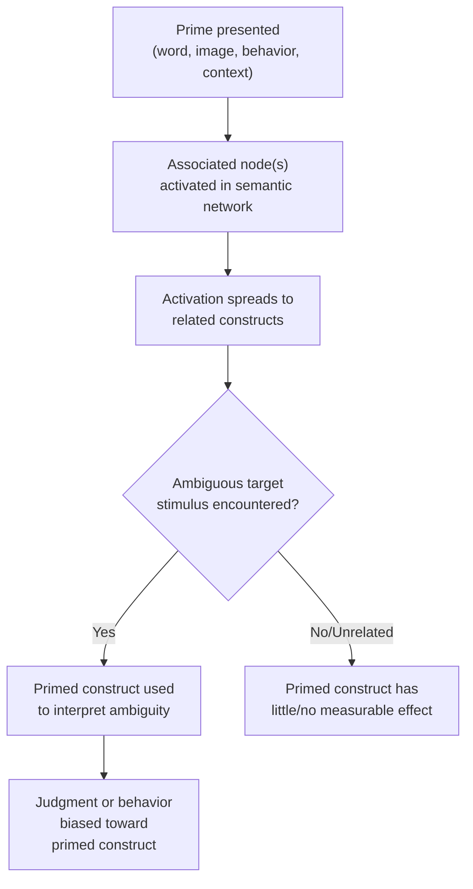

## Priming and Construct Accessibility

### Definition

Priming refers to the process by which exposure to a stimulus (the prime) influences a person's response to a subsequent stimulus (the target), typically by activating related mental representations. Construct accessibility refers to the ease with which a stored knowledge structure (a schema, trait concept, stereotype, or goal) can be activated and brought to bear on the interpretation of new information. Priming is the primary experimental mechanism used to manipulate and study accessibility.

### Theoretical Foundations

- **Associative network models of memory** (Collins & Loftus, 1975): Concepts are represented as nodes in a semantic network connected by associative links; activating one node causes activation to spread to related nodes, temporarily lowering their threshold for use.
- **Higgins' (1996) accessibility framework**: Distinguishes two sources of accessibility—**temporary accessibility** (recently activated via priming, decays over time) and **chronic accessibility** (frequently activated over a person's history, stored as a stable individual difference, e.g., a chronically accessible "honesty" construct in someone who highly values that trait).
- **Bargh's (1994) "four horsemen of automaticity"**: Awareness, intentionality, efficiency, and controllability — priming effects are typically characterized by low levels of one or more of these features, situating priming within automatic (System 1) processing in dual-process frameworks.

### Core Mechanism: Spreading Activation

$$Activation(target) = f(Activation(prime), Associative\ Strength(prime, target), Time\ Elapsed)$$

Activation spreads from a primed node through the associative network, temporarily increasing the accessibility of connected concepts. Accessibility decays over time unless reinforced, though chronically accessible constructs decay more slowly and return to a higher baseline than transiently primed constructs.

### Types of Priming

| Type | Description | Example Manipulation |
| --- | --- | --- |
| **Semantic/conceptual priming** | Activation of a related meaning or category | Exposure to "doctor" speeds recognition of "nurse" |
| **Trait/construct priming** | Activation of a personality trait concept used to interpret ambiguous behavior | Scrambled-sentence tasks with words like "reckless," "bold" |
| **Stereotype priming** | Activation of a social category and its associated trait content | Subliminal presentation of a face representing a social group |
| **Goal priming** | Activation of a motivational state that guides subsequent behavior | Priming achievement-related words increases task persistence (Bargh et al., 2001) |
| **Behavioral/mimicry priming (perception-behavior link)** | Activated concepts directly influence overt behavior | Elderly-stereotype priming slows walking speed |
| **Affective priming** | Activation of an evaluative/emotional tone that colors subsequent judgments | Brief exposure to a smiling vs. frowning face before judging a neutral stimulus |
| **Subliminal priming** | Prime presented below the threshold of conscious detection | Backward-masked word presentation |
| **Supraliminal priming** | Prime presented consciously but its influence on judgment goes unrecognized | Scrambled-sentence task where the trait-relevant purpose is not identified |

### Classic Demonstration: Trait Construct Accessibility and Impression Formation

**Example — Higgins, Rholes, and Jones (1977)**

Participants completed an ostensibly unrelated "perception task" in which they were primed with either positive trait words (e.g., "adventurous," "self-confident") or negative trait words (e.g., "reckless," "conceited") that were semantically related but evaluatively opposite. Participants then read an ambiguous description of a person named "Donald" engaging in behaviors that could be interpreted either way (e.g., piloting a boat without professional experience). Participants primed with "adventurous" rated Donald more positively; those primed with "reckless" rated him more negatively, despite reading identical target information. This demonstrated that accessible constructs are used to disambiguate and interpret subsequent information, independent of any awareness that the priming task influenced the judgment.

### Classic Demonstration: Subliminal Priming and Behavior Toward Others

**Example — Bargh, Chen, and Burrows (1996), "Elderly Priming" Study**

Participants completed a scrambled-sentence task containing words related to the elderly stereotype (e.g., "Florida," "bingo," "wrinkle," "gray") without any explicit mention of age or the elderly. Participants primed with elderly-related words subsequently walked significantly more slowly down a hallway when leaving the study compared to a control group primed with neutral words, despite reporting no awareness that the word task was related to elderly stereotypes or influenced their walking speed. This is a foundational (though later contested — see Replication Concerns below) demonstration of the "perception-behavior link": activated social concepts directly influencing overt motor behavior in a stereotype-consistent direction.

### Classic Demonstration: Goal Priming

**Example — Bargh et al. (2001)**

Priming achievement-related concepts (e.g., via a scrambled-sentence task with words like "win," "achieve," "strive") increased persistence and performance on a subsequent cognitively demanding task relative to a neutral prime condition, and this occurred without participants' conscious awareness of pursuing an experimentally activated goal. This line of work extended construct accessibility from purely interpretive/perceptual effects to motivational, goal-directed behavior.

### Media and Aggression Priming

**Example — Violent Media Priming (Anderson & Bushman, 2001, meta-analytic review)**

Exposure to violent media content has been associated with temporarily increased accessibility of aggressive thoughts, hostile attribution biases (interpreting ambiguous others' behavior as hostile), and aggressive affect, consistent with the General Aggression Model's use of priming/accessibility mechanisms to explain short-term situational effects of media violence exposure. [Inference] The magnitude and generalizability of these short-term priming effects to long-term real-world aggressive behavior remains a debated and methodologically contested area within media psychology, distinct from the more narrowly supported claim of short-term construct activation.

### Replication Concerns and the "Social Priming" Crisis

A substantial portion of classic social/behavioral priming research — particularly subtle behavioral priming effects such as the elderly-walking-speed study — has faced serious replication difficulties during the 2010s replication crisis in psychology.

- Doyen et al. (2012) failed to replicate the original elderly-priming walking-speed effect under improved methodological controls (including experimenter blindness to condition), and found evidence that experimenter expectancy may have contributed to the original effect.
- A large-scale multi-lab Registered Replication Report (Hagger et al., 2016, though this specific RRR concerned ego depletion rather than elderly priming) exemplifies the broader pattern of failed or attenuated replications for classic automaticity findings from this era across social psychology.
- Subsequent meta-analyses and registered replication efforts targeting subtle behavioral priming effects (as opposed to more basic semantic/cognitive priming, e.g., lexical decision speed effects) have generally found substantially smaller or null effects compared to original published reports.

[Unverified] The current consensus is contested and actively debated: many researchers now treat classic subtle behavioral priming effects (goal priming, stereotype-to-behavior priming) as unreliable or at minimum highly moderated by unidentified conditions, while more basic cognitive/semantic priming effects (e.g., lexical priming in reaction-time paradigms) remain comparatively robust and well-replicated. This distinction between "basic cognitive priming" (robust) and "complex social/behavioral priming" (contested) is important and should not be collapsed when evaluating any single study's evidentiary weight.

### Moderators of Priming Effects

1. **Associative strength**: Stronger, more direct associative links between prime and target produce larger and more reliable priming effects.
2. **Time between prime and target (SOA — stimulus onset asynchrony)**: Priming effects typically peak within a short window and decay over seconds to minutes for temporary accessibility.
3. **Awareness of the connection**: Priming effects are typically attenuated or eliminated if participants become aware of the prime and its potential influence on their judgment (correction processes; cf. Flexible Correction Model, Wegener & Petty, 1995).
4. **Chronic accessibility of the primed construct**: Individuals for whom a construct is already chronically accessible show priming effects more readily and with smaller experimental "doses" of priming (Bargh, Bond, Lombardi & Tota, 1986).
5. **Applicability of the prime to the target**: Primed constructs influence interpretation of the target only when the target stimulus is genuinely ambiguous enough to be construed in the primed direction (the "applicability" condition central to Higgins' accessibility model).
6. **Motivation and processing goals**: Under high motivation for accuracy or high need for cognition, deliberate/controlled reprocessing can override or correct construct-accessibility-driven interpretations, situating priming within the broader dual-process framework.

### Priming vs. Related Constructs

| Concept | Distinction |
| --- | --- |
| Priming | The experimental/situational manipulation of accessibility |
| Chronic accessibility | A stable, person-level trait reflecting habitual construct activation over time |
| Mere exposure effect | Repeated exposure increasing liking, a related but distinct phenomenon (Zajonc, 1968) not necessarily mediated by interpretive construct use |
| Framing effects | Related but distinct — framing concerns how information is presented/labeled, while priming concerns pre-activation of interpretive constructs prior to encountering the target information |

### Applied and Methodological Implications

- **Experimental design in social psychology**: Priming paradigms (scrambled-sentence tasks, lexical decision tasks, subliminal presentation, sequential priming with reaction-time measures) remain foundational methodological tools, though contemporary use requires larger sample sizes, pre-registration, and often within-subject or multi-lab designs given the replication concerns above.
- **Media effects research**: Construct accessibility underlies theoretical models of cultivation and priming effects of news and entertainment media on political attitudes, aggression-related cognition, and stereotype activation.
- **Implicit measurement**: Sequential priming procedures underlie some implicit attitude measures (e.g., the Affect Misattribution Procedure, Payne et al., 2005), distinguishing them from association-based tasks like the IAT.
- **Marketing and consumer behavior**: Retail environment cues (music, scent, visual displays) are studied as potential primes for construct accessibility relevant to purchasing behavior, though this applied literature shares the same replication concerns noted above and specific commercial claims should be treated cautiously. [Inference]
- **Clinical and health psychology**: Accessibility of health-related versus risk-related constructs has been studied as a mechanism in health behavior interventions, though effect robustness varies by specific paradigm.

### Relationship to Dual-Process Models

Priming and construct accessibility are core mechanisms underlying the "automatic" system in dual-process theories (see Dual-Process Models: Automatic versus Controlled Processing). Priming effects illustrate the four hallmark features of automaticity to varying degrees — they can occur without awareness, without intention, with minimal cognitive effort, and can be difficult (though not impossible) to control once triggered, particularly when the target information is ambiguous and the primed construct is chronically or situationally highly accessible.

### Related Topics

- Dual-process models: automatic versus controlled processing
- Availability heuristic
- Chronic accessibility and individual differences in construct use
- Stereotype activation and application
- Flexible Correction Model (bias correction)
- Implicit Association Test and sequential priming measures
- Mere exposure effect
- General Aggression Model
- Replication crisis in social psychology
- Perception-behavior link and automatic mimicry