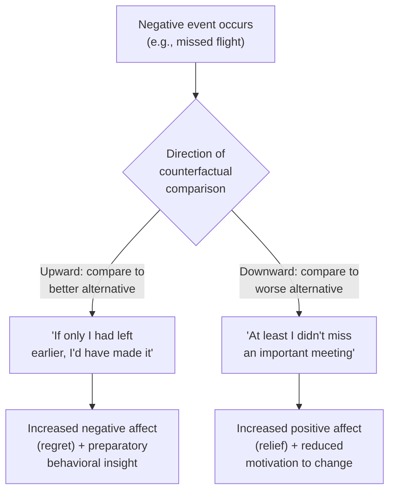

## Counterfactual Thinking

### Definition

Counterfactual thinking is the cognitive process of mentally simulating alternatives to past events — imagining "what might have been" by constructing hypothetical scenarios that contradict actual, factual outcomes (Kahneman & Miller, 1986; Roese, 1997). It typically takes the form of conditional propositions ("If only I had left earlier, I would not have missed the flight") and serves both evaluative (emotional) and functional (preparatory, behavioral) purposes.

### Theoretical Origins

- **Kahneman & Tversky (1982)**: Introduced the **simulation heuristic**, proposing that the ease with which an alternative outcome can be mentally simulated affects judgments of probability, causality, and emotional reactions to an event.
- **Kahneman & Miller (1986)**: **Norm theory** proposed that counterfactual thoughts arise from the comparison of an actual outcome to a mentally constructed "norm" — a representation of what would typically or normally happen — and that outcomes deviating from an easily constructed alternative norm are experienced as more surprising and emotionally intense.
- **Roese & Olson (1995)**; **Roese (1997)**: Developed a **functional theory of counterfactual thinking**, proposing that counterfactuals serve adaptive, preparative functions by highlighting causal relationships useful for future behavior regulation, beyond their purely affective consequences.

### Core Dimensions of Counterfactual Structure

| Dimension | Categories | Example |
| --- | --- | --- |
| **Direction** | Upward vs. downward | Upward: "I could have done better"; Downward: "It could have been worse" |
| **Structure** | Additive vs. subtractive | Additive: "If I had studied more..."; Subtractive: "If I hadn't gone out the night before..." |
| **Focus** | Self-focused vs. other-focused | "If I had left earlier..." vs. "If the driver hadn't been speeding..." |
| **Referent** | Action vs. inaction | Regret over things done vs. things not done |

### Upward vs. Downward Counterfactuals

**Upward counterfactuals**: Imagining a better alternative outcome than what actually occurred ("If only I had studied harder, I would have passed"). Associated with negative affect in the moment (regret, dissatisfaction) but serve a preparatory function by highlighting actionable causes for future improvement.

**Downward counterfactuals**: Imagining a worse alternative outcome than what actually occurred ("At least I didn't fail completely; it could have been much worse"). Associated with more positive affect (relief, contentment) via contrast with the imagined worse alternative, but typically serve less of a preparatory/corrective function.

### The Norm Theory Mechanism: Mutability

Kahneman and Miller's norm theory proposes that counterfactual thoughts are generated by "undoing" an event — mentally altering (mutating) one or more antecedents to construct an alternative outcome. Events and antecedents differ in their **mutability** — how easily they can be imagined as different:

- **Exceptional (abnormal) events are more mutable than routine events.** An accident occurring on a route the person rarely takes is more mutable ("if only I had taken my usual route...") than an accident on a habitual route.
- **The last event in a causal chain, or the most proximal cause, tends to be mutated first** (recency/proximity effects in counterfactual generation).
- **Actions are typically judged more mutable — and thus generate more counterfactual and regret-related affect — than inactions**, particularly in the short term (the action effect; Kahneman & Tversky, 1982; Gilovich & Medvec, 1995 — see below on the reversal in long-term regret).

### Classic Demonstration: The "Two Travelers" Problem

**Example — Kahneman & Tversky (1982)**

Two travelers, Mr. Crane and Mr. Tees, leave for the airport at the same time and are equally delayed in traffic, arriving 30 minutes after their scheduled departure times. Mr. Crane's flight departed on time (30 minutes ago); Mr. Tees's flight was delayed and departed only 5 minutes ago. Despite both missing their flights by the same "actual" margin of lateness relative to arrival, respondents consistently judged Mr. Tees (who missed his flight by only 5 minutes) as more upset than Mr. Crane, because the counterfactual alternative ("if only I had been 5 minutes earlier, I'd have made it") is far more mentally available and salient for Mr. Tees's close-call scenario.

### Classic Demonstration: Olympic Medalists' Emotional Reactions

**Example — Medvec, Madey, and Gilovich (1995)**

Analysis of Olympic athletes' facial expressions and self-reported satisfaction found that bronze medalists reported greater satisfaction than silver medalists, despite objectively finishing lower in the competition. This counterintuitive finding is explained by counterfactual comparison: silver medalists' natural comparison point is the gold medal ("I almost won") — an upward counterfactual producing disappointment — while bronze medalists' natural comparison point is finishing without a medal at all ("I almost didn't medal") — a downward counterfactual producing relief and satisfaction.

### Classic Demonstration: Regret and the Temporal Reversal (Action vs. Inaction)

**Example — Gilovich & Medvec (1994, 1995)**

In the short term, regrets over actions taken (things done) tend to be more intense than regrets over inactions (things not done), consistent with the greater mutability of actions. However, when people are asked about their biggest life regrets over longer time horizons, **inactions dominate** — people more often regret things they *didn't* do (unpursued education, relationships not attempted, opportunities not taken) than things they did do. Proposed explanations include: (a) psychological mechanisms exist to cope with and rationalize the consequences of actions taken (cognitive dissonance reduction, benefit-finding) more readily than for inactions, and (b) the Zeigarnik-effect-like persistence of "open," unresolved inaction regrets versus the psychological "closure" that completed actions (even bad ones) provide over time. [Inference] The precise relative contribution of these two proposed mechanisms remains a matter of theoretical interpretation rather than a fully settled empirical resolution.

### Counterfactuals and Causal Inference

Counterfactual thinking is closely tied to causal attribution: people are more likely to identify an antecedent as "the cause" of an outcome when that antecedent is highly mutable (easily counterfactually undone). This creates a systematic link between the availability of a counterfactual alternative and perceived causality/blame — an event that could easily "not have happened" (given a small change to an exceptional antecedent) is judged as more causally attributable to that antecedent than an event resulting from routine, unexceptional conditions, even when the objective causal contribution is identical.

### Functional Theory: Counterfactuals as Behavioral Regulation

Roese's functional theory frames counterfactual thinking as part of a broader self-regulatory loop:

1. **Negative affect trigger**: A negative outcome triggers spontaneous counterfactual generation, particularly upward counterfactuals.
2. **Causal insight**: The counterfactual highlights a specific, actionable antecedent ("if only I had studied more").
3. **Behavioral intention formation**: The identified antecedent translates into an intention to change future behavior.
4. **Performance improvement**: Under the right conditions, upward counterfactual thinking is associated with improved subsequent performance (Roese, 1994, experimentally demonstrated that inducing upward counterfactual thoughts after a failure improved performance on a subsequent similar task relative to downward-counterfactual or no-counterfactual conditions).

[Inference] This functional/adaptive framing is influential but not universally accepted as the complete picture; excessive or ruminative upward counterfactual thinking is also associated with maladaptive outcomes (see Clinical Relevance below), suggesting the adaptiveness of counterfactual thinking is dose- and context-dependent rather than uniformly beneficial.

### Clinical and Well-Being Relevance

- **Rumination and depression**: Excessive, repetitive upward counterfactual thinking (particularly self-focused, "if only I had been different" ruminative counterfactuals) is associated with depressive symptomatology and reduced well-being in correlational research.
- **Post-traumatic stress and grief**: Counterfactual thinking about traumatic or loss events (e.g., "if only I had done something differently to prevent the death") is a well-documented feature of grief and trauma processing, and can contribute to prolonged guilt or self-blame when the counterfactuals implicate the self as a mutable causal agent.
- **Anxiety and decision paralysis**: Anticipated future regret (a counterfactual-based emotion) is a documented influence on risk-averse decision-making, sometimes to a degree that impedes adaptive decision-making (regret theory in behavioral economics, Loomes & Sugden, 1982).

[Unverified] The clinical literature generally treats counterfactual thinking as a normal, largely adaptive cognitive process that becomes maladaptive primarily when it becomes excessively repetitive, self-blaming, and decoupled from actionable behavioral change — but precise thresholds distinguishing "adaptive" from "maladaptive" counterfactual thinking are not sharply defined and vary by individual and clinical context.

### Cross-Cultural and Individual Difference Considerations

[Inference] Most classic counterfactual thinking research (Kahneman, Miller, Roese, Gilovich, Medvec) was conducted with Western, largely North American samples; cross-cultural replication of specific effects such as the long-term action/inaction regret reversal is more limited, and cultural variation in self-construal (independent vs. interdependent) may plausibly moderate the relative salience of self-focused versus other-focused counterfactuals, though this is a less thoroughly established area than the core phenomena described above.

### Relationship to Other Heuristics and Biases

| Related Concept | Connection |
| --- | --- |
| Simulation heuristic | The proposed mechanism (ease of mental simulation) underlying both counterfactual generation and related probability/causality judgments |
| Availability heuristic | Ease of counterfactual construction functions similarly to ease of retrieval in shaping judgment |
| Hindsight bias | Related but distinct — hindsight bias concerns distorted memory of one's prior uncertainty after learning an outcome; counterfactual thinking concerns imagined alternatives to the outcome itself |
| Regret theory (behavioral economics) | Formalizes anticipated counterfactual comparison as a direct input into decision utility calculations |

### Applied Implications

- **Sports psychology**: Understanding of medal-position satisfaction effects informs coaching and athlete mental health support around near-miss performances.
- **Legal and insurance contexts**: Jury judgments of negligence and blame are influenced by the mutability of the antecedent conditions in an accident (e.g., a driver who took an unusual route is judged more responsible for resulting harm than one on a routine route, holding objective negligence constant) — relevant to research on legal decision-making biases.
- **Consumer behavior and marketing**: Anticipated regret is leveraged in marketing messaging (e.g., limited-time offers framed to trigger anticipated upward counterfactual regret for inaction).
- **Organizational and workplace feedback**: Framing performance feedback in terms of actionable counterfactuals ("if you had allocated more time to X, the outcome would likely have improved") is consistent with functional-theory-based recommendations for feedback that promotes future behavioral change rather than pure evaluative judgment.
- **Public health messaging**: Anticipated-regret framing is used in some health communication campaigns (e.g., smoking cessation, vaccination messaging) to leverage the motivational function of upward counterfactual thinking, though effectiveness varies by message design and audience. [Inference]

### Related Topics

- Simulation heuristic and availability heuristic
- Norm theory (Kahneman & Miller)
- Hindsight bias
- Regret theory in behavioral economics
- Attribution theory and perceived causality
- Self-regulation and behavioral intention formation
- Rumination and depressive cognition
- Cross-cultural social cognition
- Emotion and judgment (affect-as-information)
- Decision-making under risk and anticipated regret