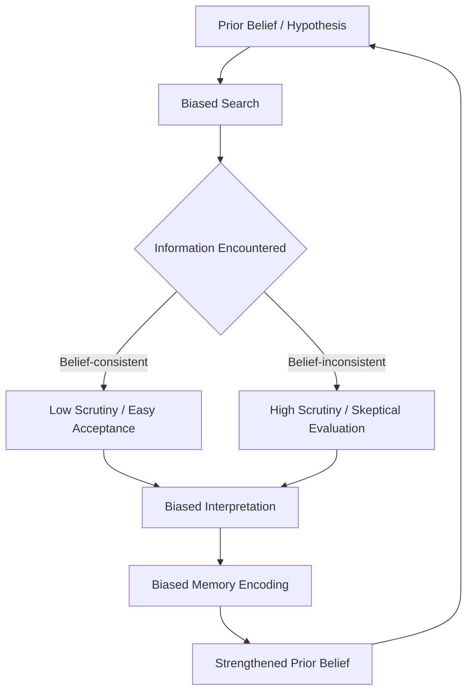

## Confirmation Bias and Motivated Reasoning

### Definitions

**Confirmation bias** is the tendency to search for, interpret, favor, and recall information in ways that confirm one's prior beliefs or hypotheses, while giving disproportionately less attention to information that contradicts them. It operates largely automatically and unintentionally, rather than as a deliberate strategy.

**Motivated reasoning** is a broader phenomenon in which cognitive processes for evaluating evidence and forming judgments are influenced by a directional goal — a desire to reach a particular conclusion — rather than solely by the goal of accuracy. Confirmation bias is often treated as one mechanism through which motivated reasoning operates, though the two concepts are not identical: confirmation bias describes an information-processing pattern, while motivated reasoning describes the underlying goal structure that can produce that pattern (along with related patterns like disconfirmation bias).

### Historical Background

- Peter Wason's (1960) 2-4-6 task and later selection task studies are the foundational demonstrations of confirmation bias in reasoning about abstract rules.
- The term gained wider theoretical grounding through Raymond Nickerson's (1998) review, which consolidated decades of scattered findings under a unified framework.
- Ziva Kunda's (1990) paper "The Case for Motivated Reasoning" formalized the distinction between accuracy-motivated and directionally-motivated reasoning, proposing that motivated reasoning works by biasing the *retrieval and construction* of beliefs and evidence, constrained by a person's need to feel epistemically justified.

### The Three Loci of Confirmation Bias

Confirmation bias is not a single mechanism but manifests at three distinct stages of information processing:

1. **Biased search** — Selectively seeking out information sources or asking questions likely to yield belief-consistent answers (e.g., only reading news outlets that align with one's political views).
2. **Biased interpretation** — Evaluating ambiguous or mixed evidence as more supportive of one's prior belief than a neutral observer would (also called "biased assimilation").
3. **Biased memory** — Recalling belief-consistent information more readily and with greater confidence than belief-inconsistent information.

### Key Studies

**Wason's 2-4-6 Task (1960)**

Participants were told the sequence "2-4-6" conformed to a rule and asked to discover it by proposing their own triples and receiving yes/no feedback. Most participants formed an early hypothesis (e.g., "even numbers increasing by 2") and tested only triples consistent with it, rather than proposing triples designed to falsify their hypothesis. The actual rule was simply "any ascending sequence."

**Lord, Ross, and Lepper (1979) — Biased Assimilation**

Participants who held pro- or anti-capital-punishment views were given the same two studies, one supporting and one opposing deterrence. Both groups rated the study supporting their pre-existing view as more methodologically sound, and both groups became *more* polarized after reading identical mixed evidence — a phenomenon termed **attitude polarization**.

**Kunda's Motivated Reasoning Studies (1990)**

Kunda demonstrated that when people are motivated to reach a particular conclusion, they engage in a biased memory search for supporting theories and evidence, but are still constrained by a need for a plausible rational case — they cannot believe just anything they want.

### Key Points

- Confirmation bias is distinguishable from mere selective exposure by including biased interpretation and memory, not just information-seeking behavior.
- Motivated reasoning is typically divided into two ideal types: **accuracy-driven reasoning** (goal: reach the correct conclusion) and **directional/defense-driven reasoning** (goal: reach a preferred conclusion).
- Motivated reasoning is generally understood not as unconstrained wishful thinking, but as a biased process operating within the bounds of what feels like legitimate inference — people construct justifications they could defend to a neutral audience. [Inference: the precise cognitive constraints on this process remain an active area of theoretical debate.]
- The **backfire effect** (belief strengthening after exposure to correcting evidence) was once considered a robust companion phenomenon to motivated reasoning, but subsequent large-scale replication attempts have found it to be far less common and reliable than originally reported. [Unverified/contested: replication evidence is mixed, and the effect appears to depend heavily on topic and framing.]

### Proposed Underlying Mechanisms

- **Hypothesis-confirming search strategy**: People test hypotheses by seeking instances that would be true if the hypothesis were correct rather than instances that could disconfirm it (positive test strategy).
- **Selective accessibility**: Prior beliefs increase the cognitive accessibility of belief-consistent memories and associations, making them easier to retrieve and feel more "available" as evidence.
- **Differential scrutiny**: Belief-inconsistent evidence is subjected to more skeptical, effortful scrutiny (looking for flaws) while belief-consistent evidence is accepted with minimal critical evaluation — sometimes called the "prosecutor vs. defense attorney" asymmetry.
- **Affective tagging**: Directionally motivated reasoning may be driven by the emotional/identity threat that disconfirming evidence poses, recruiting reasoning as a defensive rather than exploratory tool.

### Distinguishing Related Concepts

| Concept | Definition | Relationship to Confirmation Bias |
| --- | --- | --- |
| Confirmation bias | Preferential search/interpretation/recall of belief-consistent info | The core information-processing pattern |
| Motivated reasoning | Goal-directed reasoning toward a preferred conclusion | Broader framework; confirmation bias is one expression of it |
| Disconfirmation bias | Applying excessive scrutiny specifically to belief-*inconsistent* evidence | The complementary, "mirror-image" process often co-occurring with confirmation bias |
| Belief perseverance | Maintaining a belief even after its original evidential basis is discredited | A downstream consequence, not identical to confirmation bias itself |
| Selective exposure | Choosing information sources aligned with existing views | Narrower; concerns only the search stage |

### Real-World Examples

- **Political polarization**: Partisans exposed to the same factual news report often draw opposite conclusions about its credibility and implications, each finding it more persuasive of their own side.
- **Scientific and medical belief resistance**: Individuals with strong prior convictions (e.g., about vaccine safety) may scrutinize disconfirming studies for methodological flaws while readily accepting confirming studies at face value.
- **Diagnostic reasoning in medicine**: A clinician who forms an early diagnostic hypothesis may unconsciously weight subsequent symptoms as supporting that diagnosis rather than considering competing diagnoses equally — a documented contributor to diagnostic error, related to "anchoring" and "premature closure" in clinical reasoning literature.
- **Investment and financial decisions**: Investors who have taken a position on a stock tend to seek out news that validates the investment and discount warning signs, a pattern studied under behavioral finance.
- **Jury and legal decision-making**: Jurors may construct an early narrative of guilt or innocence and subsequently interpret ambiguous testimony as fitting that narrative.

### Conditions That Modulate the Bias

- **Motivation and stakes**: Directional motivation strengthens when a conclusion is tied to self-esteem, group identity, or a costly prior commitment.
- **Accountability**: Requiring people to justify their reasoning to others *before* forming a conclusion can reduce bias, but accountability *after* a conclusion is reached can increase defensive rationalization instead.
- **Cognitive load and time pressure**: Higher load tends to increase reliance on the biased default (belief-consistent) processing route since it requires less effortful counter-evidence generation.
- **Need for cognitive closure**: Individuals high in this trait show stronger confirmation bias, preferring quick, stable answers over sustained ambiguity.
- **Domain expertise**: Some research suggests that greater topic knowledge can *increase* the sophistication of motivated reasoning (more tools to rationalize) rather than reduce the bias — sometimes called the "smart idiot" effect. [Inference: the size and consistency of this effect vary considerably across studies and domains.]

### Mitigation Strategies

- **Consider-the-opposite technique**: Explicitly instructing people to argue for the alternative conclusion has one of the more consistently documented debiasing effects in the literature.
- **Falsification-focused hypothesis testing**: Deliberately seeking evidence that *would* disconfirm a hypothesis rather than only confirmatory tests (a direct countermeasure to Wason-type reasoning failures).
- **Pre-registration and blind analysis** (in research settings): Committing to hypotheses and analysis plans before seeing data reduces the opportunity for biased interpretation to shape conclusions.
- **Structured decision protocols**: Checklists and devil's-advocate roles in group decision-making (e.g., in medical or intelligence-analysis contexts) institutionalize disconfirmation-seeking.
- **Accuracy incentives**: Experimentally, offering rewards for *correct* rather than *preferred* conclusions can shift reasoning toward the accuracy-motivated mode, though the effect size is inconsistent across contexts. [Inference: effectiveness likely depends on the strength of the competing directional motivation.]

### Diagram: Confirmation Bias Processing Loop

### Diagram: Accuracy-Motivated vs. Directionally-Motivated Reasoning (svg_diagram)

<svg xmlns="http://www.w3.org/2000/svg" viewBox="0 0 720 380" font-family="sans-serif">
<text x="360" y="28" text-anchor="middle" font-size="18" font-weight="bold" fill="#1a1a2e">Motivated Reasoning: Two Goal Structures (svg_diagram)</text>
<rect x="30" y="60" width="300" height="280" rx="10" fill="#e8f0fe" stroke="#4285f4" stroke-width="2" />
<text x="180" y="90" text-anchor="middle" font-size="15" font-weight="bold" fill="#1a3d7c">Accuracy-Motivated</text>
<text x="180" y="120" text-anchor="middle" font-size="12" fill="#333">Goal: reach the correct</text>
<text x="180" y="138" text-anchor="middle" font-size="12" fill="#333">conclusion</text>

<text x="180" y="170" text-anchor="middle" font-size="12" fill="#333">→ Balanced evidence search</text>

<text x="180" y="192" text-anchor="middle" font-size="12" fill="#333">→ Symmetric scrutiny of</text>

<text x="180" y="210" text-anchor="middle" font-size="12" fill="#333"> confirming/disconfirming data</text>

<text x="180" y="238" text-anchor="middle" font-size="12" fill="#333">→ Greater effort invested</text>

<text x="180" y="256" text-anchor="middle" font-size="12" fill="#333"> in complex situations</text>

<text x="180" y="284" text-anchor="middle" font-size="12" fill="#333">→ Higher accountability</text>

<text x="180" y="302" text-anchor="middle" font-size="12" fill="#333"> before conclusion helps</text>

<rect x="390" y="60" width="300" height="280" rx="10" fill="#fdeaea" stroke="#ea4335" stroke-width="2" />
<text x="540" y="90" text-anchor="middle" font-size="15" font-weight="bold" fill="#7c1a1a">Directionally-Motivated</text>
<text x="540" y="120" text-anchor="middle" font-size="12" fill="#333">Goal: reach a preferred</text>
<text x="540" y="138" text-anchor="middle" font-size="12" fill="#333">conclusion</text>

<text x="540" y="170" text-anchor="middle" font-size="12" fill="#333">→ Selective evidence search</text>

<text x="540" y="192" text-anchor="middle" font-size="12" fill="#333">→ Asymmetric scrutiny</text>

<text x="540" y="210" text-anchor="middle" font-size="12" fill="#333"> ("prosecutor vs. defense")</text>

<text x="540" y="238" text-anchor="middle" font-size="12" fill="#333">→ Constrained by need for</text>

<text x="540" y="256" text-anchor="middle" font-size="12" fill="#333"> perceived rational justification</text>

<text x="540" y="284" text-anchor="middle" font-size="12" fill="#333">→ Accountability after</text>

<text x="540" y="302" text-anchor="middle" font-size="12" fill="#333"> conclusion can worsen it</text>

<line x1="330" y1="200" x2="390" y2="200" stroke="#888" stroke-width="2" stroke-dasharray="5,3" />
<text x="360" y="195" text-anchor="middle" font-size="11" fill="#555">shared</text>
<text x="360" y="215" text-anchor="middle" font-size="11" fill="#555">substrate</text>
</svg>

### Common Misconceptions

- Confirmation bias is **not** the same as simple ignorance or lack of exposure to opposing views — it persists and can worsen even when disconfirming evidence is directly presented (as in biased assimilation studies).
- It is **not** necessarily conscious or deceptive; most demonstrations show it operating without awareness or deliberate intent.
- Higher intelligence or education does **not** reliably eliminate the bias and may, in some documented cases, provide more sophisticated means of rationalization.
- The once-popular "backfire effect" should not be treated as an established, universal companion finding — later large-N studies suggest belief updating in response to correction is more common than early reports implied. [Unverified/contested]

### Related Topics

- Cognitive dissonance theory
- Belief perseverance and the "continued influence effect" of misinformation
- Attitude polarization and group polarization
- Anchoring and adjustment heuristic
- Availability heuristic
- Dual-process theories of reasoning (System 1 / System 2)
- Naive realism and false consensus effect
- Bayesian models of belief updating vs. biased updating
- Echo chambers and selective exposure in digital media environments
- Debiasing techniques in clinical and forensic decision-making