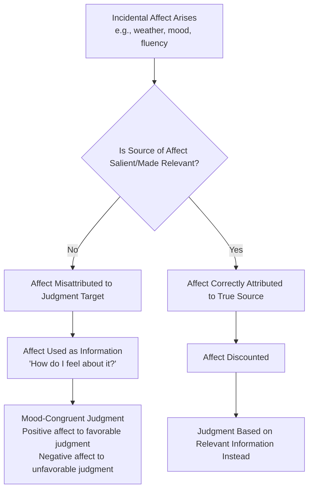

## Affect-as-Information

### Overview

Affect-as-information theory, developed primarily by Norbert Schwarz and Gerald Clore, proposes that people use their current feelings as a source of information when making judgments, rather than relying solely on relevant facts or systematic recall of information. Instead of asking "What do I know about this?", people often implicitly ask "How do I feel about this?" and use that affective state as data, misattributing feelings that arise from incidental or unrelated sources (e.g., weather, room temperature, background mood) to the object of judgment.

### Core Theoretical Claims

**Key Points**

- Feelings serve a heuristic function, substituting for more effortful, detailed analysis
- People generally fail to distinguish between affect that is genuinely informative about the judgment target and affect that is incidental (irrelevant) to it
- The informational value of a feeling is used unless its irrelevance is made salient (e.g., through attribution to another source)
- The theory extends beyond mood to bodily feelings, metacognitive experiences (like processing fluency), and even physical sensations

### Historical Foundation: The Schwarz and Clore (1983) Weather Study

This is the foundational demonstration of the theory.

**Example**

Researchers telephoned participants on sunny or rainy days and asked them to rate their overall life satisfaction and happiness.

- Participants called on **sunny days** reported significantly higher life satisfaction than those called on **rainy days**
- When the interviewer first asked, "By the way, how's the weather down there?"—making the true source of their mood salient—the weather effect on life-satisfaction ratings disappeared
- This demonstrated that people had been using their current mood ("How do I feel right now?") as information about their life in general, but once they attributed that mood correctly to the weather, they discounted it as irrelevant to the judgment

### The Underlying Mechanism: Attribution and Misattribution

Affect-as-information operates through an implicit attributional process:

1. A judgment target is encountered (e.g., "How satisfied am I with my life?")
2. An affective reaction is present at that moment
3. The person implicitly attributes that feeling to the judgment target, treating it as evidence
4. If the true, irrelevant source of the feeling becomes salient, the feeling is discounted (the informational value is stripped away), and judgments revert to being based on other, more relevant information

$$J(target) = f(\text{relevant information}) + f(\text{affect}) \times \text{Attribution Weight}$$

Where the Attribution Weight approaches 0 when the affect's true (irrelevant) source is made salient, and approaches 1 when affect is attributed to the target itself.

### Key Distinctions

**Key Points**

- **Integral affect**: Feelings that genuinely arise from and are relevant to the object being judged (e.g., fear elicited by an actual snake in front of you informing you it is dangerous)
- **Incidental affect**: Feelings that arise from a source unrelated to the judgment target (e.g., a sad movie watched earlier influencing an unrelated evaluation of a stranger)
- Affect-as-information theory is primarily concerned with the misuse of **incidental** affect as if it were integral

### Mood Congruency in Judgment

Consistent with the theory, extensive research shows:

- People in **positive moods** tend to make more favorable judgments (of people, products, risks, life satisfaction)
- People in **negative moods** tend to make more critical, pessimistic, or risk-averse judgments
- This mood-congruent judgment pattern is strongest for evaluative, global, and ambiguous judgments where no clear, salient alternative information is readily available

### Boundary Conditions and Moderators

**Key Points**

- **Salience of the mood's source**: If people are made aware their feeling stems from an irrelevant source, the effect is eliminated or reversed (correction/overcorrection)
- **Processing motivation and capacity**: Affect-as-information effects are stronger under low elaboration/heuristic processing; under high accountability, high need for accuracy, or high cognitive resources, people are more likely to engage systematic processing and discount irrelevant affect
- **Judgment type**: Evaluative/holistic judgments (e.g., "How happy am I?") are more susceptible than judgments with clear, objective criteria (e.g., "How many rooms does my apartment have?")
- **Directness of the question**: When feelings are clearly irrelevant *a priori* to the task (e.g., judging a math problem's difficulty using mood about an unrelated event), the misattribution is less likely unless the connection is subtly primed

### Extension: Processing Fluency as a Form of Affective Information

Schwarz's broader program extended affect-as-information to metacognitive experiences—the subjective ease or difficulty of a mental process is itself experienced as informative, often carrying an affective tone (fluency feels "good"; disfluency feels effortful or negative).

**Example**

- Participants asked to list **six** examples of assertive behavior (easy) rated themselves as more assertive than those asked to list **twelve** examples (difficult), even though the twelve-example group generated objectively more content
- The difficulty of retrieval was used as information ("If it's hard to think of examples, I must not be very assertive") rather than the actual quantity retrieved

This is sometimes discussed under the related but distinct heading of the "ease-of-retrieval" paradigm, closely tied to affect-as-information logic.

### Relationship to Other Theories

**Key Points**

- **Mood-as-input model** (Martin et al.): A related but distinct framework suggesting the interpretation of mood depends on the task's stop rule (e.g., "enjoy" vs. "have I done enough?"); mood's effect on behavior/judgment is contingent on the question being asked of it, not just automatic misattribution
- **Feelings-as-information theory**: A later, broadened relabeling by Schwarz encompassing not just moods, but bodily sensations, emotions, and metacognitive experiences (fluency) all functioning as informational inputs
- **Heuristic-systematic model / Dual-process theories**: Affect-as-information is generally framed as a heuristic-processing phenomenon, contrasted with systematic processing that relies on judgment-relevant content

### Real-World and Applied Examples

**Example**

- **Consumer judgment**: Shoppers in a pleasant-smelling or sunlit store may rate products more favorably, misattributing store-induced positive affect to the product itself
- **Risk perception**: People asked about risks (e.g., nuclear power, climate change) on emotionally charged news days may report inflated risk estimates due to incidental anxiety
- **Interview and hiring judgments**: An interviewer in a good mood (e.g., after a pleasant lunch) may rate a candidate more favorably than one interviewed just before a stressful meeting
- **Well-being surveys**: Survey methodology must account for order effects and incidental mood induction (e.g., preceding survey questions) that can bias self-reported happiness or satisfaction

[Inference] The magnitude of these applied effects varies by context and has not been uniformly replicated at the same effect sizes reported in original lab studies; some real-world consumer and survey applications should be treated as illustrative extensions rather than directly validated findings.

### Diagram: The Affect-as-Information Process (svg_diagram)

### Criticisms and Replication Considerations

**Key Points**

- Some incidental mood-judgment findings, including affect-as-information-adjacent studies, have faced replication scrutiny during the broader psychological replication crisis; effect sizes in some later, larger-sample replications have been smaller than originally reported [Unverified — specific to individual studies and varies by paradigm]
- Critics note that real-world incidental affect is often weaker and more fleeting than lab-induced mood manipulations, raising questions about ecological generalizability
- The theory does not specify precisely *when* affect will be treated as informative versus when it will be ignored outright, beyond the salience/attribution moderators, leading some to view it as underspecified for strong a priori prediction in novel contexts

### Distinguishing from Related Constructs

| Construct | Core Idea | Relation to Affect-as-Information |
| --- | --- | --- |
| Mere exposure effect | Repeated exposure increases liking | Can operate partly via fluency, which affect-as-information also explains |
| Halo effect | One positive trait biases judgment of unrelated traits | Different mechanism (trait generalization vs. affective misattribution) |
| Excitation transfer | Residual physiological arousal intensifies a subsequent emotional response | Similar misattribution logic, but focuses on arousal rather than valenced affect as informational content |
| Mood-as-input | Mood's effect depends on task stop-rules | Complementary refinement of when/how mood is used |

**Next Steps**

- Ease-of-retrieval and the availability heuristic
- Excitation transfer theory
- Mood-as-input model (Martin, Ward, Achee, & Wyer)
- Heuristic-systematic model of persuasion
- Processing fluency and the mere exposure effect
- Attribution theory (Heider; Kelley's covariation model)
- Dual-process models of social judgment (System 1 / System 2)
- Embodied cognition and affective grounding of judgment