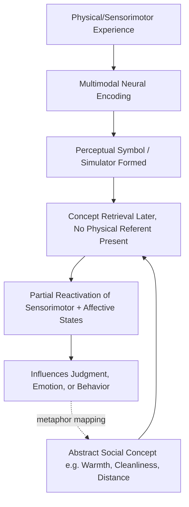

## Embodied and Grounded Cognition

### Definition and Core Premise

Embodied cognition is the theoretical position that cognitive processes are deeply rooted in the body's interactions with the physical environment, rather than being abstract, amodal computations occurring independently of sensorimotor experience. Grounded cognition is a closely related and often overlapping framework proposing that mental representations — including abstract concepts, social judgments, and attitudes — are grounded in modality-specific systems: perception, action, and introspective states such as emotion.

The two terms are frequently used interchangeably in social psychology literature, though a useful distinction is:

- **Embodied cognition**: emphasizes the body (motor movements, posture, physical states) as a direct contributor to cognitive and affective processing.
- **Grounded cognition**: the broader claim that even abstract, purely symbolic thought re-activates sensorimotor and affective traces from prior experience, rather than relying on disembodied amodal symbols.

This stands in contrast to classical **amodal symbolic** theories of cognition (e.g., traditional information-processing models), which treat concepts as abstract symbols manipulated independently of the sensory and motor systems that originally produced them.

### Theoretical Foundations

**Amodal vs. modal representation**

Classical cognitive science (e.g., Fodor, Pylyshyn) proposed that knowledge is stored as abstract, language-like symbols disconnected from sensory modalities. Grounded cognition, drawing on work by Lawrence Barsalou, argues instead that concepts are represented via **perceptual symbol systems** — partial reinstatements of the neural states active during the original perceptual, motor, and introspective experience of that concept.

**Barsalou's Perceptual Symbol Systems (PSS) Theory**

Barsalou's PSS theory proposes that when a person perceives an object or event, sensorimotor areas of the brain encode multimodal representations. Later, when that concept is retrieved or reasoned about (even in the total absence of the physical referent), the brain partially re-enacts those same sensorimotor states — a process termed **simulation**. Under this view, thinking about "grasping" partially reactivates motor cortex regions involved in actual grasping; thinking about "warmth" partially reactivates somatosensory regions involved in thermal perception.

**Conceptual Metaphor Theory (Lakoff & Johnson)**

A parallel and complementary foundation comes from linguistics: Lakoff and Johnson's *Metaphors We Live By* argued that abstract concepts are systematically understood via metaphorical mappings from concrete bodily experience. For example:

- Affection is mapped onto **physical warmth** ("a warm welcome," "a cold shoulder")
- Morality is mapped onto **physical cleanliness** ("a dirty deed," "clean hands")
- Importance/power is mapped onto **physical size or verticality** ("a big decision," "high status")
- Similarity/closeness is mapped onto **physical distance** ("close friends," "distant relationship")

Social psychologists operationalized these metaphors as testable hypotheses: if abstract social judgments are literally grounded in physical experience, then manipulating physical states should causally shift social/psychological judgments along the corresponding abstract dimension.

### Key Empirical Paradigms in Social Psychology

**Physical warmth and interpersonal warmth**

Williams and Bargh (2008) had participants briefly hold a hot or iced coffee cup before rating an ambiguous target person's personality. Participants who held the hot cup rated the target as having a "warmer" personality (more generous, more caring) than those who held the iced cup, despite the warmth manipulation being incidental to the judgment task.

**Cleanliness and moral judgment**

The "Macbeth effect" (Zhong & Liljenquist, 2006) found that participants who recalled an unethical act were more likely to subsequently choose a cleansing product (e.g., soap, wipes) over a non-cleansing consumer good, and that physical hand-washing after recalling unethical behavior reduced guilt and lessened the need for compensatory prosocial behavior.

**Physical distance and social/psychological distance**

Studies have shown that spatial distance manipulations affect perceived emotional or relational closeness, and conversely, that describing a betrayal by a close friend leads people to judge the physical distance between two chairs as smaller when imagining a stranger versus larger when imagining an estranged friend.

**Weight and importance**

Objects held on a clipboard perceived as heavier led participants to judge topics (currency values, importance of opinions) as more "weighty" or important, consistent with the metaphor "importance is weight" ([Inference: effect replication has been mixed across labs]).

**Bodily posture and power/confidence**

Expansive vs. constrictive posture manipulations have been studied in relation to felt power and confidence (popularized as "power posing" by Carney, Cuddy, & Yap, 2010). [Unverified/Contested] The original hormonal findings (testosterone/cortisol shifts) failed to replicate in large preregistered replications, and one original author (Carney) later publicly disavowed the effect; however, some **self-reported feelings of power** from posture manipulations have shown more consistent, if smaller, effects in subsequent meta-analyses. This case is frequently cited in social psychology as a caution about the broader embodiment literature's replicability.

**Facial feedback and emotion**

The facial feedback hypothesis proposes that facial muscle configurations causally contribute to (not just express) emotional experience. The classic pen-in-mouth study (Strack, Martin, & Stepper, 1988) — holding a pen with the teeth (inducing a smile-like configuration) versus the lips (inhibiting a smile) — found effects on humor ratings. [Unverified/Contested] A large-scale multi-lab Registered Replication Report (2016) found a near-zero effect overall, though it has been argued that video-recording procedures in that replication may have suppressed the effect; this remains an active debate.

### Mechanisms Proposed to Explain Embodiment Effects

1. **Simulation/re-enactment**: retrieving a concept partially reactivates the sensorimotor and affective states experienced during its original encoding (per PSS theory).
2. **Metaphor-based conceptual scaffolding**: abstract domains borrow the inferential structure of concrete bodily domains because they lack independent sensorimotor grounding of their own.
3. **Affect-as-information**: bodily states are misattributed as informational input to unrelated judgments (related to, but distinct from, classical affect-as-information accounts like Schwarz & Clore's mood-as-information).
4. **Embodied simulation via mirror neuron systems**: understanding others' actions and emotional states partly relies on simulating those states in one's own motor and affective systems (relevant to empathy and Theory of Mind).

### Relation to Other Social Cognition Constructs

- **Dual-process models**: embodiment effects are typically framed as influencing intuitive, low-effort (System 1) judgments, and are more likely to be attenuated when perceivers are motivated and have cognitive resources to deliberate.
- **Priming**: embodiment findings sit within the broader "social priming" literature and inherited much of that literature's replication scrutiny during the 2010s replication crisis.
- **Emotion and appraisal theories**: grounded cognition provides a mechanistic account for why bodily emotional cues (facial expression, posture, autonomic arousal) feed back into cognitive appraisal, rather than being a mere downstream readout of judgment.

### The Replication Crisis and Current Status

Embodied cognition research in social psychology has been a central case study in the post-2011 replication crisis:

- **Failed/mixed replications**: power posing hormonal effects, facial feedback (in the multi-lab RRR), and some warmth-priming effects have shown weak, null, or inconsistent replication across large samples.
- **Contributing factors identified**: small original sample sizes, publication bias favoring positive findings, researcher degrees of freedom in operationalizing "embodiment" manipulations, and heterogeneity in manipulation strength across labs.
- **Current consensus** [Inference, based on meta-scientific commentary]: the field has moved toward a more cautious position — embodiment effects are plausible and theoretically well-motivated, and some effects (e.g., self-reported feelings from posture, some metaphor-consistent judgments) show more robust support than others, but effect sizes are generally smaller and more context-dependent than initially reported, and strong claims require preregistered, well-powered, multi-lab confirmation before being treated as established.

This does not invalidate the grounded cognition framework as a whole — the theoretical architecture (simulation, metaphor grounding) remains influential in cognitive science more broadly (e.g., in neuroscience research on action understanding and conceptual processing) — but it does mean individual, high-profile social-psychological demonstrations should be evaluated on their specific replication record rather than assumed from the framework's plausibility alone.

### Conceptual Diagram: Grounded Cognition Simulation Loop

### Illustration: Metaphor Mapping from Concrete to Abstract

<svg xmlns="http://www.w3.org/2000/svg" viewBox="0 0 640 320">
<text x="320" y="24" text-anchor="middle" font-size="15" font-weight="bold" fill="#1a1a1a">Conceptual Metaphor Mapping (svg_diagram)</text>
<rect x="30" y="60" width="220" height="200" rx="10" fill="#eef4fb" stroke="#3a6ea5" stroke-width="1.5" />
<text x="140" y="85" text-anchor="middle" font-size="13" font-weight="bold" fill="#1a1a1a">Concrete/Physical Domain</text>
<text x="50" y="115" font-size="12" fill="#1a1a1a">• Physical warmth</text>
<text x="50" y="140" font-size="12" fill="#1a1a1a">• Physical cleanliness</text>
<text x="50" y="165" font-size="12" fill="#1a1a1a">• Physical distance</text>
<text x="50" y="190" font-size="12" fill="#1a1a1a">• Physical weight</text>
<text x="50" y="215" font-size="12" fill="#1a1a1a">• Physical verticality</text>
<line x1="250" y1="90" x2="390" y2="90" stroke="#888" stroke-width="1.5" marker-end="url(#arrow)" />
<line x1="250" y1="130" x2="390" y2="130" stroke="#888" stroke-width="1.5" marker-end="url(#arrow)" />
<line x1="250" y1="170" x2="390" y2="170" stroke="#888" stroke-width="1.5" marker-end="url(#arrow)" />
<line x1="250" y1="210" x2="390" y2="210" stroke="#888" stroke-width="1.5" marker-end="url(#arrow)" />
<line x1="250" y1="240" x2="390" y2="240" stroke="#888" stroke-width="1.5" marker-end="url(#arrow)" />
<rect x="390" y="60" width="220" height="200" rx="10" fill="#fbeeee" stroke="#a53a3a" stroke-width="1.5" />
<text x="500" y="85" text-anchor="middle" font-size="13" font-weight="bold" fill="#1a1a1a">Abstract/Social Domain</text>
<text x="410" y="115" font-size="12" fill="#1a1a1a">→ Interpersonal warmth</text>
<text x="410" y="150" font-size="12" fill="#1a1a1a">→ Moral purity</text>
<text x="410" y="185" font-size="12" fill="#1a1a1a">→ Relational closeness</text>
<text x="410" y="220" font-size="12" fill="#1a1a1a">→ Judgment importance</text>
<text x="410" y="245" font-size="12" fill="#1a1a1a">→ Social status/power</text>

<text x="320" y="295" text-anchor="middle" font-size="11" font-style="italic" fill="#555">Abstract concepts inherit inferential structure from bodily-grounded concrete domains</text>

</svg>

### Common Critiques

- **Overreach in applied claims**: popular science accounts (e.g., "power posing changes your hormones and your life") have often outpaced the actual strength and consistency of the underlying evidence.
- **Vague operationalization of "embodiment"**: critics note that many effects labeled "embodied" could alternatively be explained by semantic priming or associative spreading activation without requiring literal sensorimotor simulation.
- **Publication bias**: early embodiment studies were disproportionately novel, surprising, small-N findings — a profile strongly associated with inflated and non-replicating effect sizes.
- **Moderator sensitivity**: many embodiment effects appear to depend heavily on context, cultural background, and individual differences (e.g., private body consciousness), making generalization difficult.

### Related Topics

- Dual-process theories of social cognition (System 1 / System 2)
- Priming and automaticity in social judgment
- The replication crisis in social psychology
- Affect-as-information and mood-as-information theories
- Conceptual Metaphor Theory (Lakoff & Johnson)
- Mirror neuron systems and empathy
- Facial feedback hypothesis
- Implicit social cognition and the IAT