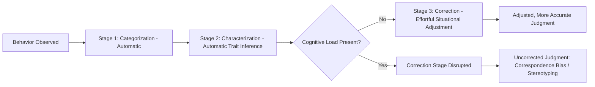

## Cognitive Load and Social Judgment

### Definition and Core Premise

Cognitive load refers to the degree to which working memory and attentional resources are consumed by a concurrent mental task, leaving fewer resources available for other simultaneous cognitive operations. In social cognition, cognitive load is used both as a **theoretical construct** (explaining why social judgments shift under resource constraints) and as an **experimental manipulation** (a tool researchers use to test whether a given judgment process is automatic/effortless or controlled/effortful).

The central premise linking cognitive load to social judgment is that many social-cognitive processes — stereotyping, correspondence bias, self-presentation, emotion regulation, persuasion resistance — rely on a **two-stage sequence**: an initial, fast, relatively automatic response, followed by an effortful, resource-dependent correction. When cognitive load consumes the resources needed for that second corrective stage, the initial, less accurate or less socially desirable response is more likely to be expressed unchecked.

### Theoretical Foundations

**Dual-process theory**

Cognitive load research in social judgment is grounded in dual-process models (e.g., the Elaboration Likelihood Model, Heuristic-Systematic Model, and more generally System 1/System 2 frameworks). Under these models:

- **System 1 / heuristic processing**: fast, automatic, associative, low-effort, runs largely independent of available cognitive resources.
- **System 2 / systematic processing**: slow, effortful, rule-based, resource-dependent, and therefore *selectively disrupted* by cognitive load.

Cognitive load manipulations act as a **resource-depletion tool** that selectively impairs System 2 processing while leaving System 1 processing largely intact, allowing researchers to isolate which stage of a social judgment is resource-dependent.

**Gilbert's Three-Stage Model of Correspondent Inference**

Daniel Gilbert's model (building on earlier work by Edward Jones) proposes that dispositional attribution unfolds in three sequential stages:

1. **Categorization**: perceiving the behavior itself (e.g., "she is arguing").
2. **Characterization**: automatically inferring a corresponding trait (e.g., "she is hostile") — this stage is proposed to occur relatively automatically.
3. **Correction**: adjusting the initial trait inference to account for situational constraints (e.g., "but she was provoked") — this stage is proposed to be effortful and resource-dependent.

Under cognitive load, Stage 3 (correction) is disrupted while Stages 1 and 2 proceed largely intact, resulting in **increased correspondence bias** (the fundamental attribution error) — perceivers over-attribute behavior to disposition and under-adjust for situational constraints.

### Key Empirical Findings

**Correspondence bias under load**

Gilbert, Pelham, and Krull (1988) had participants watch a video of an anxious-looking woman told to discuss either anxiety-provoking or neutral topics, while some participants simultaneously rehearsed a word list (cognitive load) for a later memory test. Participants under load were more likely to attribute the woman's anxious behavior to a dispositional trait (anxiousness), even when they had been told the topic was anxiety-provoking (a situational explanation) — the situational information was available but insufficiently used because the correction stage was disrupted.

**Stereotyping under load**

Cognitive load has been shown to increase reliance on stereotypes in impression formation. Gilbert and Hixon (1991) and related studies found that when perceivers are cognitively busy, they are both more likely to *apply* an accessible stereotype (because inhibiting non-diagnostic category information takes effort) and less likely to *individuate* — that is, load impairs the effortful process of overriding a stereotype-consistent judgment with individuating, case-specific information.

**Deception detection and lie production under load**

Cognitive load has a dual role in deception research:

- **Detecting lies**: some interviewing techniques deliberately impose cognitive load on a *suspect* (e.g., asking them to recall events in reverse chronological order) on the theory that lying is inherently more cognitively demanding than truth-telling, so genuine liars show more cognitive strain under added load (e.g., increased latency, reduced detail, more speech errors) than truth-tellers.
- **Judging targets**: perceivers under their own cognitive load are generally *worse* at detecting deception, since load disrupts the effortful, deliberative component of lie-detection judgments.

**Self-presentation and impression management**

Presenting oneself in a socially desirable but inauthentic way (e.g., false modesty, strategic flattery) has been shown to require more cognitive resources than presenting oneself honestly. Under cognitive load, people are more likely to default to honest or habitual self-descriptions because the effortful construction of a strategic self-presentation is disrupted.

**Persuasion and message processing (ELM)**

Under the Elaboration Likelihood Model, cognitive load reduces a message recipient's capacity for **central-route processing** (careful evaluation of argument quality), pushing persuasion toward **peripheral-route cues** (source attractiveness, message length, speaker confidence) — meaning that under load, persuasion becomes less sensitive to argument quality and more sensitive to superficial heuristic cues.

**Emotion regulation and impulse control**

Cognitive load impairs effortful self-regulation more broadly, consistent with ego-depletion-style/self-regulatory resource accounts [Note: the broader ego-depletion literature itself has faced significant replication challenges — see Related Topics]. Socially, this manifests as increased expression of prejudiced attitudes, reduced suppression of stereotypic thoughts, and increased reliance on gut-level moral judgments (relevant to dual-process models of moral judgment, e.g., Greene's model of utilitarian vs. deontological reasoning under time pressure/load).

### Standard Experimental Manipulations of Cognitive Load

| Manipulation | Mechanism | Typical Use |
| --- | --- | --- |
| Digit-span/number rehearsal | Holds a string of digits (e.g., 7-9 digits) in working memory while performing the primary task | Classic Gilbert-style paradigm |
| Dual-task paradigms | Concurrent unrelated task (e.g., tone-monitoring) performed alongside judgment task | Isolating automatic vs. controlled processing |
| Time pressure | Restricting response deadline to prevent deliberation | Approximates load by limiting processing time rather than resources directly |
| Divided attention | Simultaneous attention to two information streams (e.g., video + audio task) | Ecologically-oriented load manipulations |
| Working memory span tasks | Individual-differences approach: comparing high- vs. low-WM-capacity individuals rather than manipulating load experimentally | Correlational alternative to experimental manipulation |

### Process Diagram: Load's Selective Disruption of the Correction Stage

### Illustration: Resource Allocation Under Load

<svg xmlns="http://www.w3.org/2000/svg" viewBox="0 0 640 300">
<text x="320" y="24" text-anchor="middle" font-size="15" font-weight="bold" fill="#1a1a1a">Cognitive Resource Allocation (svg_diagram)</text>

<text x="160" y="55" text-anchor="middle" font-size="13" font-weight="bold" fill="`#1a1a1a`">No Load</text>

<rect x="60" y="70" width="200" height="40" fill="`#a5c9a5`" stroke="`#3a6e3a`" />

<text x="160" y="95" text-anchor="middle" font-size="11" fill="`#1a1a1a`">System 1 (Automatic)</text>

<rect x="60" y="115" width="200" height="60" fill="`#f2d38a`" stroke="`#a5843a`" />

<text x="160" y="150" text-anchor="middle" font-size="11" fill="`#1a1a1a`">System 2 (Correction) — Fully Available</text>

<text x="480" y="55" text-anchor="middle" font-size="13" font-weight="bold" fill="`#1a1a1a`">Under Cognitive Load</text>

<rect x="380" y="70" width="200" height="40" fill="`#a5c9a5`" stroke="`#3a6e3a`" />

<text x="480" y="95" text-anchor="middle" font-size="11" fill="`#1a1a1a`">System 1 (Automatic — Intact)</text>

<rect x="380" y="115" width="200" height="60" fill="`#e8b0b0`" stroke="`#a53a3a`" />

<text x="480" y="140" text-anchor="middle" font-size="10" fill="`#1a1a1a`">System 2 (Correction)</text>

<text x="480" y="155" text-anchor="middle" font-size="10" fill="`#1a1a1a`">Resources Diverted to Load Task</text>

<rect x="380" y="185" width="200" height="35" fill="#d9d9d9" stroke="#888" />
<text x="480" y="207" text-anchor="middle" font-size="10" fill="#1a1a1a">Concurrent Load Task (e.g., digit rehearsal)</text>

<text x="160" y="205" text-anchor="middle" font-size="11" fill="`#1a1a1a`">Result: Adjusted judgment</text>

<text x="480" y="240" text-anchor="middle" font-size="11" fill="`#1a1a1a`">Result: Uncorrected, biased judgment</text>

</svg>

### Moderators and Boundary Conditions

- **Motivation**: high accountability or accuracy motivation can partially offset load effects if sufficient resources remain, but cannot fully compensate once resources are exhausted below a functional threshold.
- **Load timing**: load imposed *during* judgment formation has different effects than load imposed *during encoding* only or *during retrieval* only — load at encoding can impair the quality of information available for later correction even if resources are free at judgment time.
- **Expertise/automatization**: highly practiced judgments (e.g., expert-level social inferences in a familiar domain) may be less disrupted by load because they require fewer controlled resources to begin with.
- **Individual differences in working memory capacity**: individuals with higher baseline WM capacity show greater resistance to a given fixed load manipulation.

### Methodological and Replication Considerations

- Cognitive load paradigms are generally considered **methodologically robust** relative to some other social-priming paradigms, because the manipulation (e.g., digit rehearsal) is objective, easily standardized, and directly verifiable (via load-task performance/manipulation checks), unlike more indirect priming manipulations.
- However, effect sizes for downstream social judgment outcomes (e.g., magnitude of increased stereotyping) vary considerably across studies and populations, and **manipulation check failures** (i.e., the load task not actually taxing resources as intended) are a common source of null or inconsistent results.
- [Inference] The overall dual-process/resource-dependent-correction framework remains broadly supported and is less contested than some other embodiment/priming literatures, though specific effect sizes and generalizability across cultures and populations warrant caution before treating any single study's magnitude as definitive.

### Applied Implications

- **Jury decision-making**: jurors under time pressure or high cognitive demand (e.g., complex trials, multiple simultaneous case details) may be more prone to correspondence bias against defendants.
- **Medical and clinical judgment**: clinicians under high caseload/cognitive burden may rely more heavily on diagnostic heuristics and stereotypes about patients.
- **Hiring and interview contexts**: interviewers who are cognitively taxed (e.g., conducting back-to-back interviews, multitasking) may show increased reliance on stereotypes and reduced individuation of candidates.
- **Interrogation and investigative interviewing**: cognitive-load-based lie-detection techniques (e.g., reverse-order recall) are used in some applied forensic interviewing protocols based on this literature.

### Related Topics

- Fundamental attribution error / correspondence bias
- Dual-process theories (System 1 / System 2)
- Elaboration Likelihood Model and persuasion
- Stereotyping and automatic categorization
- Ego depletion and self-regulatory resource models (including its replication controversies)
- Working memory capacity and individual differences
- Deception detection and interviewing techniques
- Dual-process models of moral judgment (Greene's model)