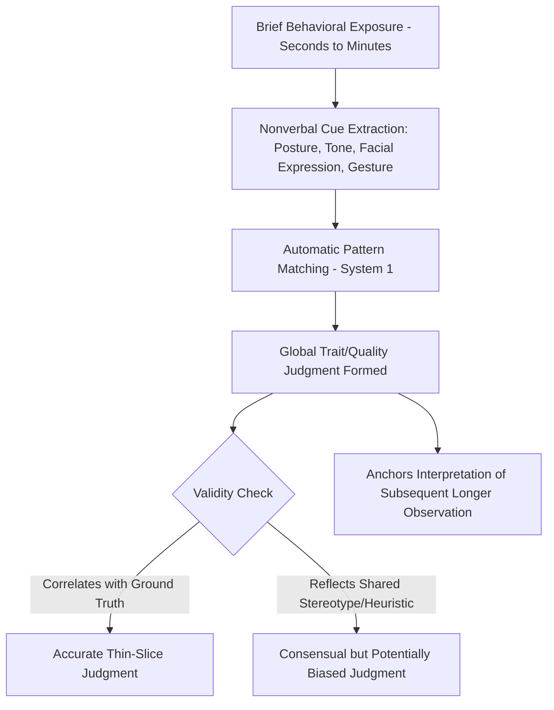

## Thin-Slicing and Rapid Judgments

### Definition and Core Premise

Thin-slicing refers to the capacity to draw accurate inferences about a person's traits, states, or the quality of an interaction/relationship based on very brief samples of behavior — typically ranging from a few seconds to a few minutes of observation — without full contextual information. The term was coined by Nalini Ambady and Robert Rosenthal, building on their meta-analytic and experimental work on the predictive validity of brief behavioral observations ("thin slices") relative to full-length ("thick slice") observations of the same behavior.

The core empirical claim is counterintuitive relative to lay assumptions about judgment accuracy: **judgments based on very short exposures frequently correlate as strongly with external validity criteria (e.g., outcomes, expert ratings) as judgments based on much longer exposures**, and in some cases longer exposure adds little or no incremental predictive validity beyond the first several seconds.

### Theoretical and Empirical Origins

**The Ambady and Rosenthal (1992) meta-analysis**

Ambady and Rosenthal's foundational meta-analysis examined studies in which judges rated target individuals based on thin slices of expressive behavior (facial expression, body language, vocal tone — largely nonverbal channels) and correlated those ratings with independent outcome criteria. They found that thin-slice judgments (as short as under 30 seconds) predicted a range of outcomes — including teacher effectiveness ratings, therapist-client rapport, and interpersonal judgments — at levels of accuracy comparable to judgments based on much longer observation periods.

**"Silent video" and channel-restricted paradigms**

A common methodology strips away verbal content (using silent video clips, or audio filtered to remove word content while preserving tone) to isolate the contribution of nonverbal cues specifically, since thin-slicing effects are strongest and most reliably demonstrated via nonverbal channels rather than verbal content.

### Key Empirical Domains

**Teaching effectiveness**

Ambady and Rosenthal (1993) had judges rate silent video clips of college instructors, each only 6 seconds long (three 2-second clips), and found that these ratings correlated substantially with end-of-semester student evaluations of the same instructors collected independently — a widely cited demonstration that global evaluative judgments about a target's competence can be extracted from extremely minimal behavioral exposure.

**Clinical and therapeutic contexts**

Thin slices of therapist-client interactions (a few minutes of session video) have been used to predict later therapeutic alliance quality and, in some studies, treatment outcomes, suggesting that early relational/nonverbal dynamics captured in a brief window carry meaningful diagnostic signal about the trajectory of the relationship.

**Hiring and job interviews**

Judgments formed within the first several seconds to minutes of a job interview (e.g., handshake quality, initial impression) have been found in some studies to correlate with the interviewer's eventual overall evaluation and hiring decision, raising concerns that structured interview content collected later may function more as post-hoc justification for an early impression than as independent new evidence (relevant to interview validity research).

**Political and leadership judgments**

Rapid judgments of political candidates' faces (exposure durations as short as 100 milliseconds) have been shown in some studies (e.g., Todorov and colleagues) to predict actual election outcomes above chance levels, based on trait inferences like perceived competence — a related but distinct literature from thin-slicing proper, since it isolates a single static cue (facial appearance) rather than dynamic behavioral slices.

**Deception and honesty judgments**

Thin slices have been tested for deception detection, though — consistent with the broader deception-detection literature — accuracy for lie/truth discrimination specifically tends to be substantially lower and less reliable than thin-slice accuracy for trait judgments (e.g., extraversion, warmth) or relationship-quality judgments.

**Sexual orientation and social category judgments**

Some studies have examined thin-slice accuracy for categorical judgments (e.g., perceived sexual orientation from brief exposure), which raises separate ethical and methodological considerations regarding stereotype-based cue reliance versus genuine diagnostic validity, and results in this specific domain should be interpreted cautiously given the potential for base-rate and stereotype-consistency confounds.

### Proposed Mechanisms

1. **Redundancy and consistency of nonverbal cues**: many trait-relevant nonverbal behaviors (posture, gesture rate, vocal pitch variability) are relatively stable across brief time windows, meaning a short sample often contains proportionally similar diagnostic information to a longer one — additional observation time yields diminishing returns.
2. **Automatic, heuristic-based processing**: thin-slice judgments are thought to rely on fast, low-effort pattern recognition (System 1 processing) rather than deliberate, feature-by-feature analysis, consistent with dual-process accounts of person perception.
3. **Ecological validity of nonverbal cues**: certain nonverbal signals (e.g., vocal warmth, postural openness) may have evolved or culturally stable associations with the underlying traits they are used to judge, giving them genuine (not merely perceived) diagnostic value.
4. **Confirmation and anchoring in later judgment**: an early thin-slice impression can bias the interpretation of subsequently observed behavior (assimilation), which may partly explain why longer observation fails to substantially outperform brief observation — later information is filtered through the lens of the initial slice rather than treated as independent evidence.

### Accuracy vs. Bias: A Critical Distinction

Thin-slicing research addresses two related but distinct questions that should not be conflated:

| Question | What it measures | Example finding |
| --- | --- | --- |
| **Accuracy** | Does the thin-slice judgment correlate with an external validity criterion? | 6-second teacher ratings correlate with semester-end evaluations |
| **Consensus** | Do independent judges agree with each other on the thin slice? | High inter-rater agreement on trait judgments from brief clips |
| **Bias/stereotype reliance** | Is the judgment influenced by category-based cues unrelated to true validity? | Facial-competence judgments predicting elections may partly reflect stereotype associations rather than true competence signal |

High consensus (judges agreeing with each other) does **not** by itself establish accuracy (correlation with ground truth) — a slice-based judgment can be highly consistent across judges while still being systematically biased if judges are relying on the same invalid or stereotype-based cues. Well-designed thin-slicing studies therefore require an independent, objective validity criterion (e.g., actual teaching outcomes, actual election results, actual therapy outcomes) rather than relying on inter-judge agreement alone.

### Process Diagram: Thin-Slice Judgment Formation

### Illustration: Predictive Validity Across Exposure Duration

<svg xmlns="http://www.w3.org/2000/svg" viewBox="0 0 640 320">
<text x="320" y="24" text-anchor="middle" font-size="15" font-weight="bold" fill="#1a1a1a">Predictive Validity vs. Exposure Duration (svg_diagram)</text>
<line x1="70" y1="270" x2="580" y2="270" stroke="#333" stroke-width="1.5" />
<line x1="70" y1="270" x2="70" y2="50" stroke="#333" stroke-width="1.5" />
<text x="325" y="300" text-anchor="middle" font-size="12" fill="#1a1a1a">Exposure Duration (seconds → minutes → full session)</text>
<text x="30" y="160" text-anchor="middle" font-size="12" fill="#1a1a1a" transform="rotate(-90 30 160)">Predictive Validity (r)</text>
<path d="M 90 240 Q 150 90 250 80 T 560 70" fill="none" stroke="#3a6ea5" stroke-width="2.5" />
<circle cx="90" cy="240" r="4" fill="#a53a3a" />
<text x="90" y="255" text-anchor="middle" font-size="10" fill="#1a1a1a">6 sec</text>
<circle cx="250" cy="80" r="4" fill="#3a8a3a" />
<text x="250" y="65" text-anchor="middle" font-size="10" fill="#1a1a1a">30 sec</text>
<circle cx="560" cy="70" r="4" fill="#3a8a3a" />
<text x="560" y="55" text-anchor="middle" font-size="10" fill="#1a1a1a">Full session</text>

<text x="325" y="330" text-anchor="middle" font-size="10" font-style="italic" fill="#555">Illustrative pattern: validity rises steeply from very brief exposure, then plateaus with diminishing returns</text>

</svg>

### Boundary Conditions and Limitations

- **Domain dependence**: thin-slicing works best for judgments with a strong, consistent nonverbal behavioral signature (warmth, competence, rapport quality); it performs worse for judgments requiring propositional/factual content (e.g., detecting specific lies, assessing technical expertise) that cannot be conveyed through nonverbal channels alone.
- **Cue availability**: accuracy depends on which channels are available in the slice (video-only vs. audio-only vs. audio+video); different judgment types rely differentially on visual vs. vocal cues.
- **Population and cultural generalizability**: most foundational studies were conducted in Western, English-speaking samples; the specific nonverbal cues that carry diagnostic validity for a given trait judgment are not assumed to generalize uniformly across all cultural contexts. [Inference]
- **Self-fulfilling and confound risks in applied use**: in high-stakes settings (hiring, admissions, jury judgments), reliance on thin-slice impressions raises fairness concerns, since certain group-linked nonverbal styles (e.g., differences in eye contact norms, vocal affect) can be misread as trait-diagnostic when they instead reflect cultural or individual variation unrelated to the underlying quality being judged.
- **Replication and effect-size caveats**: as with much of the broader social-judgment-accuracy literature, effect sizes for the correlation between thin-slice ratings and outcome criteria vary considerably by study and outcome type; the classic teacher-evaluation finding is robust and frequently replicated, but the magnitude of thin-slicing validity should not be assumed uniform across all applied domains.

### Relation to Other Social Cognition Constructs

- **Zero-acquaintance judgment research**: a closely related literature examining how accurately strangers judge personality traits (e.g., Big Five) from minimal interaction or even static photos, sharing much of its methodology and theoretical framing with thin-slicing.
- **Dual-process theories**: thin-slicing is generally framed as a demonstration of System 1/heuristic judgment competence, complementing (rather than contradicting) cognitive-load research showing System 2 correction can improve or bias initial impressions depending on context.
- **Nonverbal communication research**: thin-slicing provides much of the empirical evidentiary base for claims about which specific nonverbal behaviors (vocal pitch variability, postural openness, gesture rate) carry socially meaningful signal.
- **Implicit impression formation**: connects to broader work on spontaneous trait inference and automatic person perception.

### Related Topics

- Zero-acquaintance personality judgment
- Spontaneous trait inference
- Nonverbal communication and behavioral cue validity
- Dual-process theories of person perception
- Facial appearance and trait/competence inference (Todorov's work)
- Interview validity and hiring bias
- Cognitive load and social judgment
- Stereotyping and automatic categorization