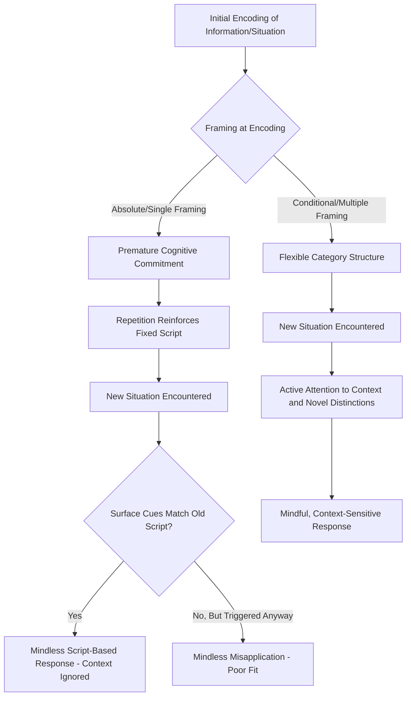

## Mindlessness Versus Mindful Processing

### Definition and Core Premise

Mindlessness refers to a state of reduced cognitive engagement characterized by reliance on rigid, overlearned, script-based, or automatic responding, with minimal active attention to the distinguishing features of the present situation. Mindfulness, in this specific social-cognitive sense (distinct from the contemplative/meditative usage popularized in clinical psychology), refers to a state of active engagement in which the individual is actively drawing novel distinctions, remaining sensitive to context, and treating the current situation as one instance among many possible variations rather than as an instance of a fixed, single category.

This mindlessness/mindfulness distinction was developed primarily by **Ellen Langer**, whose research program is distinct from — though related to — both dual-process theories (System 1/System 2) and clinical/contemplative mindfulness traditions (e.g., Kabat-Zinn's MBSR). Langer's framework specifically concerns **categorical rigidity versus flexibility**: mindlessness is the tendency to process information through a single, fixed set of categories established at the time of initial learning, applying that category automatically regardless of contextual cues suggesting the category may not fit.

### Theoretical Foundations

**Langer's Mindlessness Theory**

Langer proposed that much of everyday behavior is governed by scripts — well-rehearsed behavioral sequences triggered by superficial situational cues rather than by active evaluation of the situation's actual requirements. Mindless behavior is not necessarily irrational or maladaptive; it is often adaptive and efficient, since actively evaluating every routine situation from scratch would be cognitively prohibitive. The theoretical concern is that mindlessness becomes problematic when:

- The situation actually differs meaningfully from the one the script was learned for, but the surface cues are similar enough to trigger the script anyway.
- The mindless response forecloses consideration of better alternatives that would be apparent under active processing.

**Three sources of mindlessness (Langer's account)**

1. **Repetition**: information or behaviors learned through repetitive exposure become processed via fixed category structures, reducing active engagement on subsequent encounters.
2. **Premature cognitive commitment**: information accepted unconditionally at first exposure (without considering alternative framings) becomes mindlessly fixed, even when later evidence suggests reconsideration is warranted. Contextual cues at the moment of initial encoding become oversimplified into single fixed meanings.
3. **Single outcome-oriented mindset**: focusing on producing one "correct" outcome to a single fixed goal, rather than continuously generating new distinctions and process-focused awareness.

### Key Empirical Demonstrations

**The "placebic information" copy-machine study**

Langer, Blank, and Chanowitz (1978) tested whether people would comply with a request more when it included a request-plus-reason structure, even when the "reason" given was entirely vacuous (a **placebic reason** — providing no genuine new information). Participants asked to cut in line to use a copy machine with the request "Excuse me, I have 5 pages. May I use the Xerox machine, because I have to make copies?" complied at rates comparable to a request with a genuine reason ("because I'm in a rush"), and substantially higher than a request with no reason given at all — but critically, this compliance boost from the placebic "because" clause only occurred for a **small request** (5 pages); for a larger, more effortful request (20 pages), the placebic reason failed to boost compliance, and only a genuine reason worked. This pattern was interpreted as evidence that people process small, routine requests mindlessly (responding to the presence of the word "because" as a script-triggering cue rather than actively evaluating the reason's content), while larger requests trigger more mindful, content-sensitive evaluation.

**Premature cognitive commitment and disability framing**

Studies examining how initial framing of a disability or limitation (e.g., describing a person as "wheelchair-bound" and passive versus offering multiple possible framings) shapes subsequent mindless application of that category have been used to argue that early, single-framed category commitments persist and limit later behavior toward the individual, even when circumstances change.

**Mindful learning and conditional instruction**

Langer's studies on **conditional versus absolute instruction** found that teaching new information with conditional language ("this could be...", "this might be used as...") rather than absolute language ("this is...") led to more flexible, creative later use of that information — for example, participants taught that an object "could be" a dog's chew toy were more likely to later spontaneously use it as an eraser when a genuine eraser was unavailable, compared to participants told the object simply "is" a chew toy, demonstrating that conditional framing at encoding reduces later mindless category fixation.

**Aging and mindful attention ("counterclockwise" study)**

Langer's well-known 1979 study had elderly participants spend a week in an environment staged to replicate conditions from 20 years earlier, engaging actively (mindfully) with the recreated environment rather than passively reminiscing; participants showed improvements on measures including physical strength, posture, cognitive performance, and even independently-rated perceived age from photographs, which Langer interpreted as evidence that mindful engagement (rather than mere nostalgic recall) had measurable physiological and psychological benefits [Unverified/Contested: sample sizes in the original study were very small, and the study has not been well replicated with matching rigor; it is frequently cited as a compelling but methodologically limited demonstration].

### Relation to Dual-Process Theory (Important Distinction)

Mindlessness/mindfulness in Langer's sense is **related but not identical** to the System 1/System 2 dual-process distinction used elsewhere in social cognition (e.g., in cognitive load and stereotyping research):

| Dimension | Dual-Process (System 1/2) | Langer's Mindlessness/Mindfulness |
| --- | --- | --- |
| Primary focus | Effort/resource allocation (automatic vs. controlled) | Category flexibility (fixed vs. actively differentiated) |
| What changes under the "effortful" mode | More deliberative rule-based computation | Active generation of novel distinctions and context sensitivity |
| Typical manipulation | Cognitive load, time pressure | Conditional language framing, novelty-focused instructions |
| Relationship to expertise | Automatization is often a marker of skill/efficiency | Mindlessness can occur even in effortful-seeming tasks if categories are rigid; expertise itself can *increase* premature cognitive commitment risk |

Mindful processing under Langer's framework is not simply "System 2 engaged" — a person can be effortfully applying a rigid, mindlessly-committed category (e.g., working hard to force-fit a situation into a familiar but ill-suited script), and conversely, highly practiced experts can show flexible, actively-differentiated (mindful) responding without heavy deliberative effort. The distinguishing feature is **active novelty-seeking and context-sensitivity**, not effort level per se.

### Process Diagram: Mindless vs. Mindful Category Application

### Illustration: The Copy-Machine Compliance Pattern

<svg xmlns="http://www.w3.org/2000/svg" viewBox="0 0 640 320">
<text x="320" y="24" text-anchor="middle" font-size="15" font-weight="bold" fill="#1a1a1a">Placebic Reason Compliance by Request Size (svg_diagram)</text>
<line x1="80" y1="270" x2="580" y2="270" stroke="#333" stroke-width="1.5" />
<line x1="80" y1="270" x2="80" y2="50" stroke="#333" stroke-width="1.5" />
<text x="330" y="300" text-anchor="middle" font-size="12" fill="#1a1a1a">Request Type</text>
<text x="30" y="160" text-anchor="middle" font-size="12" fill="#1a1a1a" transform="rotate(-90 30 160)">Compliance Rate</text>
<rect x="120" y="100" width="50" height="170" fill="#a5c9a5" stroke="#3a6e3a" />
<text x="145" y="290" text-anchor="middle" font-size="10" fill="#1a1a1a">No Reason</text>
<text x="145" y="90" text-anchor="middle" font-size="10" fill="#1a1a1a">~60%</text>
<rect x="200" y="60" width="50" height="210" fill="#f2d38a" stroke="#a5843a" />
<text x="225" y="290" text-anchor="middle" font-size="10" fill="#1a1a1a">Placebic (5 pg)</text>
<text x="225" y="50" text-anchor="middle" font-size="10" fill="#1a1a1a">~93%</text>
<rect x="280" y="55" width="50" height="215" fill="#8ab0d6" stroke="#3a6ea5" />
<text x="305" y="290" text-anchor="middle" font-size="10" fill="#1a1a1a">Genuine (5 pg)</text>
<text x="305" y="45" text-anchor="middle" font-size="10" fill="#1a1a1a">~94%</text>
<rect x="400" y="180" width="50" height="90" fill="#f2d38a" stroke="#a5843a" />
<text x="425" y="290" text-anchor="middle" font-size="10" fill="#1a1a1a">Placebic (20 pg)</text>
<text x="425" y="170" text-anchor="middle" font-size="10" fill="#1a1a1a">~24%</text>
<rect x="480" y="110" width="50" height="160" fill="#8ab0d6" stroke="#3a6ea5" />
<text x="505" y="290" text-anchor="middle" font-size="10" fill="#1a1a1a">Genuine (20 pg)</text>
<text x="505" y="100" text-anchor="middle" font-size="10" fill="#1a1a1a">~42%</text>

<text x="330" y="320" text-anchor="middle" font-size="10" font-style="italic" fill="#555">Placebic reasons work for small (mindlessly processed) requests but not larger (mindfully evaluated) ones</text>

</svg>

### Applied and Organizational Implications

- **Education**: conditional-language instruction ("this could be used as...") is proposed to foster creative, flexible knowledge application, contrasted with rote absolute instruction that produces mindless, narrowly-bound knowledge.
- **Organizational decision-making**: mindlessness within organizations (via rigid adherence to precedent, "the way it's always been done") is linked to failures to notice changed conditions; mindful organizing (related to but distinct from Weick and Sutcliffe's High Reliability Organization literature) is proposed as a countermeasure in safety-critical industries.
- **Stereotyping and prejudice**: premature cognitive commitment to social category labels (formed via singular early exposure or media framing) is proposed as a mechanism contributing to stereotype rigidity, complementing but distinct from automatic-associative accounts of stereotype activation.
- **Aging and health**: Langer's broader research program (the counterclockwise study and related work) has been influential in framing aging-related decline as partly a function of mindless, socially-scripted expectations about aging rather than purely biological inevitability, though this remains a debated and only partially replicated claim.

### Critiques and Limitations

- **Construct overlap and definitional looseness**: critics note that "mindlessness" as operationalized across Langer's studies spans a fairly broad range of phenomena (scripted compliance, premature categorical commitment, rote learning), which can make the construct harder to falsify or precisely measure compared to more narrowly operationalized dual-process constructs.
- **Replication concerns for flagship studies**: the counterclockwise aging study in particular is frequently cited as theoretically compelling but methodologically underpowered (very small N, limited controls in the original 1979 study), and later attempted extensions/replications have shown more mixed and modest results.
- **Confound with request size/cost in the copy-machine paradigm**: some critiques note that the interaction between placebic-reason effectiveness and request size could be explained by alternative mechanisms (e.g., differing thresholds for careful processing based on personal cost) without necessarily requiring the specific "mindlessness" construct as the exclusive explanation.

### Related Topics

- Cognitive load and social judgment
- Dual-process theories of social cognition (System 1/System 2)
- Heuristic-Systematic Model and Elaboration Likelihood Model
- Stereotyping and premature category commitment
- Script theory and social schemas
- Automaticity and habitual behavior
- Mindful organizing and High Reliability Organizations (Weick & Sutcliffe)
- Clinical/contemplative mindfulness (Kabat-Zinn) — related but theoretically distinct construct