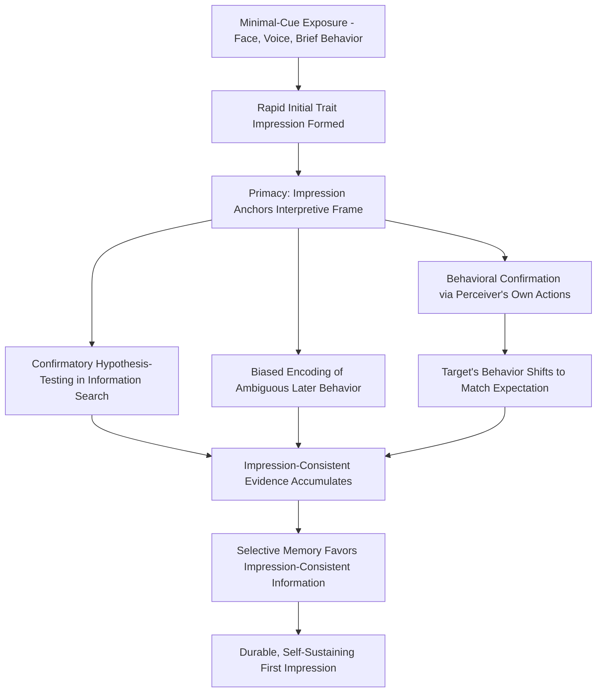

## First Impressions and Their Durability

### Definition and Core Premise

First impressions refer to the initial evaluative and trait-based judgments formed about a person upon first encounter, often within milliseconds to seconds of exposure to minimal cues (facial appearance, voice, posture, brief behavior). Durability refers to the empirically well-supported tendency for these initial impressions to persist, resist revision, and disproportionately shape subsequent judgment and memory of the target, even when later information is inconsistent with the initial impression.

The durability of first impressions is explained by a convergence of several distinct cognitive mechanisms rather than a single process: primacy effects in information integration, confirmation bias in subsequent information search and interpretation, biased encoding and interpretation of ambiguous later behavior, and selective memory processes — together these mechanisms cause an initial impression to function less like a provisional starting hypothesis and more like a self-sustaining interpretive lens.

### Speed and Minimal-Cue Sufficiency of First Impressions

**Extremely rapid formation**

Empirical work (notably by Alexander Todorov and colleagues) has demonstrated that trait judgments — particularly **competence** and **trustworthiness** — can be formed from facial exposure durations as brief as 100 milliseconds, with additional exposure time (up to several seconds) increasing confidence in the judgment but not substantially altering its content, suggesting the underlying trait inference is settled almost immediately upon exposure.

**Relation to thin-slicing**

This rapid-formation literature overlaps substantially with thin-slicing research (see related topic), but is distinguished by its focus on **static, single-cue exposure** (e.g., a photograph) rather than dynamic behavioral samples; the facial-trait-inference literature demonstrates that dynamic behavior is not even required for impression formation to begin — appearance alone is sufficient to trigger confident trait attributions.

**Core trait dimensions in face-based impressions**

Todorov's dimensional model proposes that facial trait impressions are organized primarily along two dimensions:

- **Trustworthiness/valence**: derived substantially from cues resembling emotional expression (e.g., features associated with happiness vs. anger).
- **Dominance/competence**: derived substantially from cues related to physical strength/maturity markers.

### Mechanisms of Durability

**1. Primacy effects in impression formation (Asch's configural model)**

Solomon Asch's classic studies demonstrated that when perceivers are given a list of traits describing a target, traits presented **earlier** in the list disproportionately shape the overall impression, and later traits tend to be reinterpreted to fit the meaning established by the earlier ones (a **change-of-meaning** effect) — e.g., "intelligent" presented before "stubborn" leads perceivers to interpret "stubborn" more charitably (as "principled") than when "stubborn" appears without that prior context. Asch's configural (Gestalt) model contrasts with additive/summative models (e.g., Anderson's information integration theory), which propose that impressions form via a weighted average of individual trait cues rather than being reorganized around early information; the empirical durability of primacy effects has generally been taken as support for the configural, meaning-reorganization account over a purely additive one, though later work (Anderson) showed that primacy can also be explained within a weighted-averaging framework if early information receives greater attentional weight.

**2. Confirmation bias in hypothesis-testing**

Once an initial impression is formed, subsequent information-seeking tends to be biased toward confirming rather than disconfirming that impression. Classic work by Snyder and Swann (1978) demonstrated that perceivers given a trait hypothesis about a target (e.g., "introverted") disproportionately selected interview questions that would elicit hypothesis-confirming behavior (e.g., questions that would make an introvert *appear* introverted), producing a self-fulfilling pattern of evidence gathering.

**3. Behavioral confirmation / self-fulfilling prophecy**

Beyond biased information-seeking, first impressions can shape the perceiver's own behavior toward the target in ways that elicit impression-confirming responses from the target themselves (Word, Zanna, & Cooper's classic interviewer-behavior study demonstrated that interviewers behaving more warmly toward White versus Black interviewees, based on prior impressions/expectations, elicited correspondingly warmer or cooler responses from interviewees) — the initial impression becomes durable partly because it actively reshapes the subsequent interaction, not merely because it biases interpretation of a fixed reality.

**4. Selective and biased encoding of ambiguous information**

Ambiguous subsequent behavior is disproportionately interpreted in a manner consistent with the initial impression (assimilation). A behavior that could plausibly be read as either "confident" or "arrogant" will more likely be encoded as the trait-consistent interpretation given a prior impression already establishing the target as confident (or arrogant).

**5. Memory-based mechanisms**

Trait-consistent information about a target tends to be better recalled and more available at retrieval than trait-inconsistent information, particularly under conditions of divided attention or low motivation to individuate — this recall asymmetry contributes to durability because the perceiver's later retrospective evaluation draws disproportionately on impression-consistent memory traces.

**6. Reduced processing of disconfirming information under correspondence bias**

Related to attributional processes (see correspondence bias), perceivers tend to under-weight situational explanations for impression-inconsistent behavior, instead often discounting a single disconfirming behavior as an isolated exception ("she's usually not like that") rather than updating the underlying trait impression.

### The Negativity Bias Exception

While first impressions are generally durable, there is a well-documented **asymmetry**: negative first impressions tend to be even more durable and resistant to revision than positive ones. This is consistent with the broader negativity bias in social cognition (negative information is generally weighted more heavily than positive information of equal informational value), meaning that early negative information about a target requires disproportionately more positive counter-evidence to revise than the reverse.

### Empirical Domains and Applied Findings

**Job interviews and hiring**

As referenced in thin-slicing research, interviewer impressions formed in the first several minutes (sometimes seconds) of an interview correlate strongly with final hiring evaluations, raising the concern that structured interview content collected afterward functions partly as confirmatory rationalization rather than independent evidence — a finding with direct implications for interview validity and bias-mitigation practices (e.g., structured/blind interviewing protocols).

**Teacher expectations and student outcomes (Pygmalion effect)**

Rosenthal and Jacobson's classic "Pygmalion in the Classroom" study found that teachers given (false) information that certain randomly-selected students were expected to show intellectual "blooming" subsequently rated and treated those students differently, and those students showed greater actual academic gains — demonstrating that durable first impressions (here, experimentally implanted expectations) can produce genuine behavioral confirmation in the target via altered teacher behavior, not merely altered teacher perception.

**Jury and legal judgment**

Initial impressions of defendant credibility or likability, formed early in trial proceedings, have been studied as predictors of final verdict judgments, with concern that such impressions may exert disproportionate influence relative to the formal evidentiary weight they warrant.

**Online dating and first-encounter contexts**

Profile-photo-based and brief-exposure judgments in online dating contexts have been studied as a domain where extremely thin information (a photo, a short bio) generates durable attraction/compatibility judgments that shape whether users pursue further interaction at all — functioning as a gatekeeping filter on subsequent relationship development.

### Process Diagram: Mechanisms Sustaining First-Impression Durability

### Illustration: Asch's Change-of-Meaning Effect

<svg xmlns="http://www.w3.org/2000/svg" viewBox="0 0 640 300">
<text x="320" y="24" text-anchor="middle" font-size="15" font-weight="bold" fill="#1a1a1a">Change-of-Meaning from Trait Order (svg_diagram)</text>
<rect x="40" y="55" width="260" height="200" rx="10" fill="#eef4fb" stroke="#3a6ea5" stroke-width="1.5" />
<text x="170" y="80" text-anchor="middle" font-size="12" font-weight="bold" fill="#1a1a1a">Order A</text>
<text x="60" y="110" font-size="12" fill="#1a1a1a">1. Intelligent</text>
<text x="60" y="135" font-size="12" fill="#1a1a1a">2. Industrious</text>
<text x="60" y="160" font-size="12" fill="#1a1a1a">3. Impulsive</text>
<text x="60" y="185" font-size="12" fill="#1a1a1a">4. Critical</text>
<text x="60" y="210" font-size="12" fill="#1a1a1a">5. Stubborn</text>
<text x="60" y="235" font-size="12" fill="#1a1a1a">6. Envious</text>
<text x="170" y="253" text-anchor="middle" font-size="11" font-style="italic" fill="#2a5a2a">→ "Stubborn" read as principled</text>
<rect x="340" y="55" width="260" height="200" rx="10" fill="#fbeeee" stroke="#a53a3a" stroke-width="1.5" />
<text x="470" y="80" text-anchor="middle" font-size="12" font-weight="bold" fill="#1a1a1a">Order B (Reversed)</text>
<text x="360" y="110" font-size="12" fill="#1a1a1a">1. Envious</text>
<text x="360" y="135" font-size="12" fill="#1a1a1a">2. Stubborn</text>
<text x="360" y="160" font-size="12" fill="#1a1a1a">3. Critical</text>
<text x="360" y="185" font-size="12" fill="#1a1a1a">4. Impulsive</text>
<text x="360" y="210" font-size="12" fill="#1a1a1a">5. Industrious</text>
<text x="360" y="235" font-size="12" fill="#1a1a1a">6. Intelligent</text>
<text x="470" y="253" text-anchor="middle" font-size="11" font-style="italic" fill="#7a2a2a">→ "Stubborn" read as difficult</text>
</svg>

### Boundary Conditions and Moderators

- **Motivation to individuate**: accountability, outcome dependency (e.g., needing to work closely with the target), and explicit accuracy goals can reduce (though rarely eliminate) primacy and confirmation-bias effects, prompting more effortful, mindful reconsideration.
- **Amount and clarity of disconfirming evidence**: durability is probabilistic, not absolute — sufficiently strong, repeated, and unambiguous disconfirming evidence can revise even negative first impressions, though the evidentiary threshold required is asymmetrically higher than for revising positive impressions.
- **Perceiver cognitive load**: consistent with cognitive-load research, reduced processing resources increase reliance on the initial impression and reduce effortful updating.
- **Cultural and individual differences**: need-for-closure and need-for-cognition individual differences moderate the degree of confirmatory versus open-minded subsequent processing.

### Applied Debiasing Strategies

- **Structured/blind interviewing**: standardizing interview content and, where feasible, blinding early impression-forming cues (e.g., delaying access to appearance-based information, using structured scoring rubrics) to reduce primacy-driven bias in evaluative contexts.
- **Deliberate consideration of alternatives**: explicitly instructing perceivers to generate reasons the initial impression might be wrong has been shown in decision-making research more broadly to reduce anchoring-related biases, plausibly transferable to first-impression contexts.
- **Delayed judgment protocols**: postponing final evaluative judgment until after a full observation period, rather than forming and then merely "confirming" an early judgment, is a commonly recommended (though imperfectly effective) mitigation strategy in hiring and evaluative contexts.

### Related Topics

- Thin-slicing and rapid judgments
- Correspondence bias and the fundamental attribution error
- Confirmation bias and hypothesis-testing
- Behavioral confirmation and self-fulfilling prophecy
- Facial trait inference (Todorov's competence/trustworthiness model)
- Negativity bias in social judgment
- Cognitive load and social judgment
- Interview validity and structured hiring practices