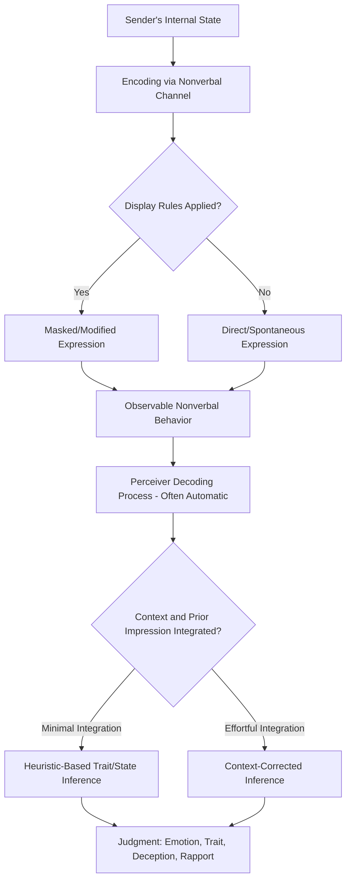

## Nonverbal Behavior and Its Interpretation

### Definition and Core Premise

Nonverbal behavior encompasses the communicative channels through which social information is transmitted independently of, or alongside, spoken language: facial expression, gaze, body posture and movement (kinesics), interpersonal spacing (proxemics), touch (haptics), and vocal qualities independent of word content (paralanguage/vocalics). In person perception, nonverbal behavior functions as a primary data source from which perceivers infer internal states (emotion, attitude, deception), stable traits (dominance, warmth, competence), and relational dynamics (rapport, attraction, status).

A central theoretical tension in this literature is between **universalist accounts** (proposing that certain nonverbal signals, especially facial expressions of basic emotion, are biologically evolved, cross-culturally recognized, and largely involuntary) and **social constructionist/contextualist accounts** (proposing that the meaning and even the physical expression of nonverbal cues is substantially shaped by cultural display rules, learned associations, and situational context, limiting the universality and even the reliability of nonverbal cues as objective indicators of internal state).

### Core Nonverbal Channels

**Facial expression**

The most extensively studied channel. Paul Ekman and Wallace Friesen's cross-cultural research proposed a set of **basic emotions** (commonly: anger, disgust, fear, happiness, sadness, and surprise, with contempt debated as a possible seventh) argued to be associated with universally recognized facial expressions across culturally isolated populations, supporting an evolutionary, biologically-based account of facial emotion expression. The **Facial Action Coding System (FACS)**, developed by Ekman and Friesen, provides a standardized anatomical taxonomy of facial muscle movements (Action Units) used to objectively code facial expressions independent of subjective emotion-labeling, and remains a widely used methodological tool in emotion research and affective computing.

**Gaze and eye contact**

Gaze functions in person perception as a cue to attention, interest, dominance, and honesty (though its validity as a deception cue specifically is weaker than popular belief suggests — see Deception Cues below). Mutual gaze duration and patterns are also studied as markers of intimacy and rapport (per Argyle and Dean's **equilibrium theory**, proposing that individuals regulate overall intimacy via compensatory adjustments across gaze, physical distance, and other nonverbal channels to maintain a comfortable equilibrium level).

**Posture and body orientation (kinesics)**

Open versus closed body posture, forward lean, and body orientation toward versus away from an interaction partner are studied as cues to engagement, interest, and — in the power-posing literature — felt or perceived power (see embodied cognition topic for replication caveats on power-posing specifically).

**Proxemics (interpersonal spacing)**

Edward Hall's foundational proxemics framework proposed culturally-variable zones of interpersonal distance (intimate, personal, social, public), with violations of expected distance norms (too close or too far for the relationship/context) generating discomfort and inferences about the violator's intent or social competence — this framework underlies later work such as **Expectancy Violations Theory** (Judee Burgoon), which proposes that nonverbal norm violations are evaluated based on the perceived valence of the violator (a positively-regarded violator's unexpected closeness may be read favorably, while a negatively-regarded violator's identical behavior may be read unfavorably).

**Paralanguage / vocalics**

Vocal cues independent of word content — pitch, pitch variability, speech rate, volume, and pauses — carry substantial signal for trait judgments (e.g., vocal warmth, confidence) and are the primary channel isolated in "content-filtered" or audio-only thin-slicing paradigms.

**Touch (haptics)**

Physical touch in social interaction is studied for its role in communicating support, dominance, and intimacy, with substantial cultural and contextual variability in appropriate touch norms and interpretation.

### Theoretical Frameworks for Interpretation

**Universality vs. cultural display rules**

Ekman's cross-cultural work is frequently qualified by his own concept of **display rules**: culturally learned norms governing when, how, and to whom emotional expressions may be appropriately shown, which can mask, exaggerate, minimize, or substitute the "universal" underlying expression. This means that even if the underlying facial musculature pattern for an emotion is universal, the observed expression in naturalistic social contexts is filtered through culturally variable display rules, complicating straightforward cross-cultural interpretation of observed (rather than posed/spontaneous-in-controlled-conditions) facial behavior. [Note: the strength and universality of Ekman's original basic-emotion findings has become an active area of scientific debate — see Critiques below.]

**Nonverbal cues as heuristic-diagnostic information**

Consistent with dual-process and thin-slicing frameworks, nonverbal cues are generally processed rapidly and automatically (System 1), providing perceivers with fast heuristic input for trait and state judgments that can be — but often is not — subsequently corrected through more effortful, context-integrating processing.

**Channel reliance and ecological validity**

Different nonverbal channels vary in their controllability (facial expression and word choice are relatively easy to consciously regulate, whereas certain "leakier" channels such as body posture, foot/leg movement, and vocal pitch are theorized to be harder to consciously control and may therefore carry more diagnostic signal about concealed internal states) — this **leakage hypothesis** (Ekman & Friesen) underlies much of the applied deception-detection literature, though its empirical support for reliably distinguishing genuine deception is considerably weaker than the theory's popular reputation suggests.

### Nonverbal Behavior and Deception Detection

Popular belief substantially overestimates the reliability of nonverbal cues (e.g., gaze aversion, fidgeting) as valid deception indicators. Meta-analytic work (notably by Bella DePaulo and colleagues) has found that:

- The correlation between most individual nonverbal behavioral cues and actual deception is generally weak and inconsistent across studies.
- Human deception-detection accuracy from nonverbal (or combined) cues, across many studies, hovers only modestly above chance level (approximately 54% in DePaulo's meta-analytic estimate, against a chance baseline of 50%).
- Popularly believed cues (e.g., "liars avoid eye contact") frequently show weak, null, or even reversed relationships with actual lying behavior in controlled studies, and professional lie-detection training programs have not reliably demonstrated superior accuracy over untrained perceivers in rigorous testing. [Inference: this remains an active and somewhat contested applied research area, particularly regarding specialized interviewing techniques]

### Nonverbal Accuracy and Individual Differences

**Interpersonal sensitivity and the PONS test**

Individual differences in the ability to accurately decode nonverbal cues have been studied via standardized instruments such as the Profile of Nonverbal Sensitivity (PONS) test, developed by Rosenthal and colleagues (drawing on the same thin-slicing research tradition), which presents brief audio/video/combined clips for accuracy-scored emotion and content identification.

**Encoding versus decoding skill**

A useful distinction separates **encoding accuracy** (how clearly and recognizably an individual expresses their internal states nonverbally) from **decoding accuracy** (how accurately a perceiver reads others' nonverbal cues) — these are separable skills, and individuals can be strong encoders but weak decoders or vice versa.

### Process Diagram: Nonverbal Cue Interpretation Pathway

### Illustration: Argyle and Dean's Equilibrium Theory

<svg xmlns="http://www.w3.org/2000/svg" viewBox="0 0 640 300">
<text x="320" y="24" text-anchor="middle" font-size="15" font-weight="bold" fill="#1a1a1a">Intimacy Equilibrium Across Channels (svg_diagram)</text>
<circle cx="200" cy="150" r="30" fill="#8ab0d6" stroke="#3a6ea5" />
<text x="200" y="155" text-anchor="middle" font-size="11" fill="#1a1a1a">Person A</text>
<circle cx="440" cy="150" r="30" fill="#e8b0b0" stroke="#a53a3a" />
<text x="440" y="155" text-anchor="middle" font-size="11" fill="#1a1a1a">Person B</text>
<line x1="230" y1="150" x2="410" y2="150" stroke="#888" stroke-width="1.5" stroke-dasharray="4,3" />
<text x="320" y="140" text-anchor="middle" font-size="10" fill="#1a1a1a">Physical Distance ↑</text>
<path d="M 210 190 Q 320 240 430 190" fill="none" stroke="#3a8a3a" stroke-width="1.5" />
<text x="320" y="255" text-anchor="middle" font-size="10" fill="#1a1a1a">Compensating: Gaze ↓, Smaller Lean</text>

<text x="320" y="85" text-anchor="middle" font-size="11" font-style="italic" fill="#555">If distance increases, other intimacy cues (gaze, lean) adjust to maintain equilibrium</text>

</svg>

### Applied Domains

- **Clinical and therapeutic assessment**: therapists' attention to client nonverbal cues (posture shifts, micro-expressions, vocal tone changes) is used as supplementary diagnostic information alongside verbal content, particularly relevant given thin-slicing findings on therapist-client rapport prediction.
- **Negotiation and business contexts**: nonverbal cues of confidence, dominance, and trustworthiness are studied for their influence on negotiation outcomes and perceived credibility independent of argument content.
- **Cross-cultural communication training**: given cultural variability in display rules, proxemic norms, and gesture meaning, applied intercultural competence training frequently incorporates explicit instruction on nonverbal norm differences to reduce cross-cultural miscommunication.
- **Affective computing and automated emotion recognition**: FACS-based coding and machine learning models trained on facial expression datasets are used in applied technology contexts (though such systems inherit the same universality debates and cultural-generalizability limitations present in the underlying psychological research). [Inference: accuracy and fairness of automated emotion-recognition systems across demographic groups remains an active and contested area of both technical and ethical scrutiny]

### Critiques and Current Debates

- **Basic emotion universality challenged**: more recent theoretical and empirical work (e.g., Lisa Feldman Barrett's constructionist theory of emotion) has challenged the strength of the original Ekman-style universality claims, arguing that facial expression–emotion correspondence is considerably more variable, context-dependent, and culturally shaped than the classic basic-emotions framework suggests, and that recognition-task methodologies in the original cross-cultural studies (e.g., forced-choice response formats) may have inflated apparent cross-cultural agreement.
- **Overreliance on nonverbal cues in applied deception detection**: as noted above, the gap between popular belief in nonverbal "tells" and the actual weak empirical support for most individual cues is a significant applied concern, particularly in high-stakes contexts like law enforcement interviewing and airport security screening programs, some of which have faced scientific criticism for relying on cue-based protocols with limited validated accuracy.
- **WEIRD sample bias**: much of the foundational nonverbal behavior literature, like much of psychology broadly, has been criticized for over-reliance on Western, educated, industrialized, rich, and democratic samples, raising generalizability concerns for claims about proxemic norms, display rules, and gesture interpretation across the full range of human cultural variation.

### Related Topics

- Thin-slicing and rapid judgments
- Embodied and grounded cognition
- First impressions and their durability
- Deception detection and interviewing techniques
- Facial Action Coding System (FACS) and affective computing
- Basic emotion theory vs. constructionist theory of emotion (Barrett)
- Expectancy Violations Theory (Burgoon)
- Cross-cultural psychology and display rules