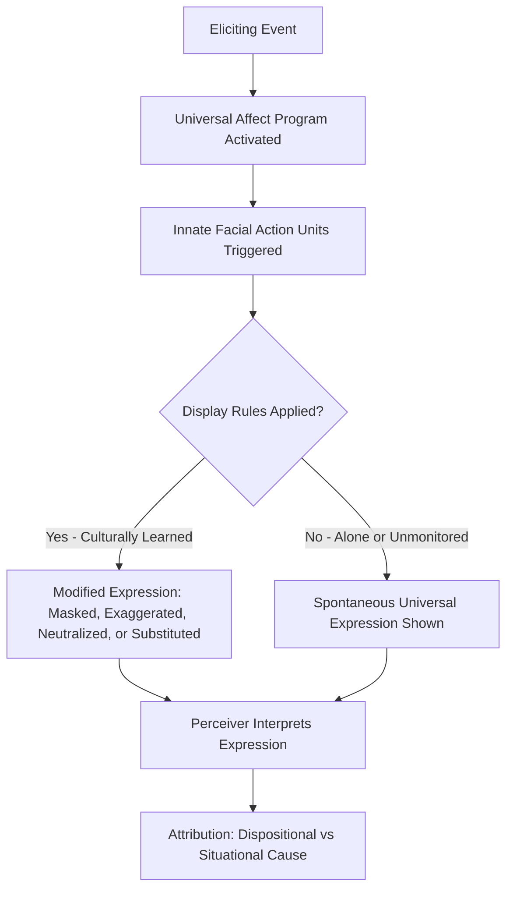

## Facial Expression and Universality Research

### Overview

Facial expression and universality research examines whether certain facial expressions of emotion are biologically innate and recognized consistently across all human cultures, or whether they are primarily learned and culturally variable. This body of work sits at the intersection of social psychology, evolutionary theory, anthropology, and affective science, and has significant implications for person perception—how people rapidly infer others' internal states, intentions, and traits from facial cues.

### Historical Foundations

**Darwin's Contribution**

Charles Darwin's 1872 book *The Expression of the Emotions in Man and Animals* proposed that facial expressions are evolved, adaptive behaviors shared across species and cultures, rather than arbitrary or purely learned signals. Darwin argued that expressions like fear, anger, and disgust serve functional purposes (e.g., widened eyes in fear may enhance visual field and light intake) and that similar expressions would be observable in geographically and culturally isolated populations if they were biologically rooted rather than culturally transmitted.

**The Nature-Nurture Debate**

Mid-20th-century anthropologists, notably Margaret Mead and Ray Birdwhistell, argued for cultural relativism—the position that facial expressions, like language, are culture-specific codes learned through socialization. This view dominated until systematic cross-cultural testing began in the 1960s.

### Ekman and Friesen's Cross-Cultural Studies

**Key Points**

- Paul Ekman and Wallace Friesen conducted foundational studies in the late 1960s testing whether facial expressions of emotion are universally recognized.
- They tested literate cultures (US, Japan, Brazil, Chile, Argentina) and, critically, a preliterate, visually isolated culture: the Fore people of Papua New Guinea, who had minimal prior contact with Western media or outsiders.
- Participants were shown photographs of posed facial expressions and asked to match them to emotion labels or to stories describing emotional situations.
- Results showed high cross-cultural agreement in identifying six basic emotions: happiness, sadness, anger, fear, surprise, and disgust (later contempt was proposed as a possible seventh).
- The Fore, despite no exposure to Western facial expression norms, matched expressions to emotional scenarios at rates significantly above chance, supporting universality.

**Methodological Design**

Ekman and Friesen's studies typically used a forced-choice recognition paradigm: participants viewed a photograph and selected the correct emotion label from a small set of options. This design became both the primary evidence for universality and, later, the primary target of methodological critique (see below).

### The Neurocultural Theory and Display Rules

Ekman proposed the **neurocultural theory** of emotion, which reconciles universality with observed cultural variation:

- **Affect programs**: Universal, biologically hardwired neural programs link specific emotions to specific facial muscle movements. These are the same across cultures.
- **Display rules**: Culturally learned norms govern *when*, *how*, and *to whom* emotions can be openly expressed. Display rules can mask, exaggerate, neutralize, or substitute the underlying universal expression.

**Example**

In a classic Ekman and Friesen (1971) study, American and Japanese participants watched stress-inducing films. When alone, both groups showed nearly identical facial expressions of disgust. When a researcher (an authority figure) was present, Japanese participants masked negative expressions with polite smiles more than American participants did—illustrating a display rule difference layered on top of a universal underlying response.

### The Facial Action Coding System (FACS)

**Key Points**

- Developed by Ekman and Friesen (1978), FACS is an anatomically based system for objectively measuring facial movement.
- FACS decomposes facial expressions into **Action Units (AUs)**, each corresponding to the contraction of a specific facial muscle or muscle group (e.g., AU 12 = Lip Corner Puller, associated with smiling; AU 4 = Brow Lowerer, associated with anger/concentration).
- FACS is descriptive and theory-neutral at the coding level—it records which muscles moved without presupposing an emotional label—making it a widely used tool in emotion research, human-computer interaction, and affective computing.
- Trained human coders (or, increasingly, automated computer vision systems) score video/image data frame-by-frame for AU presence, intensity, and timing.

**Common Action Units for Basic Emotions (illustrative, not exhaustive)**

| Emotion | Key Action Units (examples) |
| --- | --- |
| Happiness | AU6 (Cheek Raiser) + AU12 (Lip Corner Puller) |
| Sadness | AU1 (Inner Brow Raiser) + AU4 (Brow Lowerer) + AU15 (Lip Corner Depressor) |
| Surprise | AU1 + AU2 (Outer Brow Raiser) + AU5 (Upper Lid Raiser) + AU26 (Jaw Drop) |
| Fear | AU1 + AU2 + AU4 + AU5 + AU20 (Lip Stretcher) + AU26 |
| Anger | AU4 + AU5 + AU7 (Lid Tightener) + AU23 (Lip Tightener) |
| Disgust | AU9 (Nose Wrinkler) + AU15 + AU16 (Lower Lip Depressor) |

[Unverified] Exact AU combinations for each emotion vary somewhat across published EMFACS/coding manuals and researcher operationalizations; the table above reflects commonly cited prototypes rather than a single fixed standard.

**The Duchenne Marker**

A genuine ("Duchenne") smile involves both AU12 (lip corner pulling) and AU6 (cheek raising, which causes crow's-feet wrinkling around the eyes), the latter driven by the orbicularis oculi muscle, which is difficult to contract voluntarily. Social/polite smiles often show AU12 without AU6, providing a behavioral marker researchers use to distinguish felt from posed positive affect.

### Criticisms and Methodological Challenges

**Key Points**

- **Forced-choice bias**: Critics (notably James Russell and Lisa Feldman Barrett) argue that forced-choice recognition tasks artificially inflate agreement rates because participants are constrained to a small, researcher-provided label set, which can cue the "correct" answer.
- **Posed vs. spontaneous expressions**: Most classic studies used posed, prototypical photographs (often actors deliberately producing exaggerated expressions) rather than spontaneous expressions occurring in naturalistic emotional contexts. Real-world spontaneous expressions are more variable and often show blended or partial AU configurations.
- **Ecological validity**: Some researchers argue that real-life emotional expressions are more context-dependent, ambiguous, and influenced by situational factors than the "basic six" model implies.
- **Theory of Constructed Emotion**: Lisa Feldman Barrett's theoretical framework proposes that emotion categories are not universal, discrete, biologically fixed programs but are constructed by the brain using interoception, prior experience, and conceptual/linguistic knowledge, meaning facial configurations do not map onto emotions in a fixed, universal one-to-one way.
- A widely cited 2019 review (Barrett, Adolphs, Marsella, Martinez, & Pollak) in *Psychological Science in the Public Interest* concluded that the scientific evidence for reliable, specific, universal facial "fingerprints" for each emotion is weaker than commonly assumed in applied contexts (e.g., emotion-recognition AI, security screening).

[Inference] The gap between strong popular/applied claims of universal emotion-reading technology and the more mixed academic consensus reflects an active, unresolved scientific debate rather than settled fact in either direction.

**Response from Universality Proponents**

Ekman and colleagues have countered that meta-analyses (e.g., Elfenbein & Ambady, 2002) find cross-cultural emotion recognition accuracy consistently above chance across dozens of cultures and methodologies, and that an "in-group advantage" (better recognition of expressions from one's own cultural group) coexists with substantial universal recognizability—supporting a hybrid model rather than pure universality or pure relativism.

### In-Group Advantage and Dialect Theory

**Key Points**

- Elfenbein and Ambady's meta-analytic work found that people are generally more accurate at recognizing emotional expressions produced by members of their own cultural, national, or ethnic group than by outgroup members, even though cross-cultural accuracy remains above chance overall.
- This gave rise to the **dialect theory** of emotional expression: like spoken language, emotional expression may have a universal "grammar" (the basic AU configurations) but culture-specific "accents" or subtle stylistic variations in intensity, timing, and co-occurring cues that make in-group expressions easier to read.

### Blended, Compound, and Micro-Expressions

**Compound Emotions**

Du, Tao, and Martinez (2014) proposed that beyond the basic categories, humans produce recognizable **compound expressions** (e.g., "happily surprised," "angrily disgusted") that combine AUs from two basic emotions, suggesting a richer and only partially universal taxonomy.

**Micro-Expressions**

Ekman also studied **micro-expressions**—very brief (typically 1/25 to 1/5 of a second), involuntary facial expressions that leak underlying felt emotion despite conscious attempts at suppression or masking. These are of particular interest in deception research, though [Unverified] claims about reliably training people to detect deception from micro-expressions in applied/forensic settings (e.g., airport security screening programs) have been criticized for lacking strong empirical validation, and this remains a contested area.

### Relevance to Person Perception and Attribution

Facial expression research connects to broader person perception processes in several ways:

- **Rapid trait inference**: People form judgments about others' emotional states, trustworthiness, and even personality traits within milliseconds of viewing a face, often before conscious deliberation.
- **Attribution of internal states**: Facial expressions serve as key data for both correspondent inference (inferring dispositions from behavior) and causal attribution (why is this person expressing this emotion—situational vs. dispositional cause).
- **Confirmation and bias**: Because facial expression perception is rapid and often automatic, it is susceptible to stereotype-driven top-down processing, where perceivers' expectations about a target's group membership can bias which emotion they perceive (e.g., ambiguous expressions on certain faces being more readily categorized as anger).
- **Cross-cultural interaction**: Understanding display rules is critical for accurate attribution in intercultural contexts, since misreading a masked or culturally modulated expression as "genuine" (or vice versa) can lead to attribution errors.

### Diagram: Universality vs. Cultural Modulation Pathway

### Illustrative SVG: Basic Emotion Facial Action Units (simplified schematic)

<svg xmlns="http://www.w3.org/2000/svg" viewBox="0 0 720 260">
<text x="360" y="24" text-anchor="middle" font-size="16" font-weight="bold" fill="#222">Simplified Basic Emotion Facial Cues (svg_diagram)</text>

<g>
<circle cx="90" cy="110" r="55" fill="#FFF3B0" stroke="#333" stroke-width="2" />
<circle cx="72" cy="95" r="5" fill="#333" />
<circle cx="108" cy="95" r="5" fill="#333" />
<path d="M 65 125 Q 90 150 115 125" stroke="#333" stroke-width="3" fill="none" />
<text x="90" y="185" text-anchor="middle" font-size="13">Happiness</text>
<text x="90" y="200" text-anchor="middle" font-size="10">AU6+AU12</text>
</g>

<g>
<circle cx="230" cy="110" r="55" fill="#D6E4F0" stroke="#333" stroke-width="2" />
<path d="M 210 88 Q 218 80 226 90" stroke="#333" stroke-width="2" fill="none" />
<path d="M 234 90 Q 242 80 250 88" stroke="#333" stroke-width="2" fill="none" />
<circle cx="212" cy="98" r="4" fill="#333" />
<circle cx="248" cy="98" r="4" fill="#333" />
<path d="M 205 140 Q 230 125 255 140" stroke="#333" stroke-width="3" fill="none" />
<text x="230" y="185" text-anchor="middle" font-size="13">Sadness</text>
<text x="230" y="200" text-anchor="middle" font-size="10">AU1+AU4+AU15</text>
</g>

<g>
<circle cx="370" cy="110" r="55" fill="#F5C6C6" stroke="#333" stroke-width="2" />
<path d="M 350 92 L 366 100" stroke="#333" stroke-width="3" fill="none" />
<path d="M 390 92 L 374 100" stroke="#333" stroke-width="3" fill="none" />
<circle cx="354" cy="100" r="4" fill="#333" />
<circle cx="386" cy="100" r="4" fill="#333" />
<path d="M 350 140 L 390 140" stroke="#333" stroke-width="3" fill="none" />
<text x="370" y="185" text-anchor="middle" font-size="13">Anger</text>
<text x="370" y="200" text-anchor="middle" font-size="10">AU4+AU5+AU7+AU23</text>
</g>

<g>
<circle cx="510" cy="110" r="55" fill="#E3D6F0" stroke="#333" stroke-width="2" />
<path d="M 495 85 Q 502 78 510 85" stroke="#333" stroke-width="2" fill="none" />
<path d="M 510 85 Q 518 78 525 85" stroke="#333" stroke-width="2" fill="none" />
<circle cx="492" cy="98" r="6" fill="#333" />
<circle cx="528" cy="98" r="6" fill="#333" />
<ellipse cx="510" cy="140" rx="16" ry="10" fill="#333" />
<text x="510" y="185" text-anchor="middle" font-size="13">Fear</text>
<text x="510" y="200" text-anchor="middle" font-size="10">AU1+AU2+AU4+AU5+AU20</text>
</g>

<g>
<circle cx="640" cy="110" r="55" fill="#D9E8D3" stroke="#333" stroke-width="2" />
<circle cx="622" cy="98" r="4" fill="#333" />
<circle cx="658" cy="98" r="4" fill="#333" />
<path d="M 632 108 Q 640 98 648 108" stroke="#333" stroke-width="2" fill="none" />
<path d="M 618 140 Q 640 128 662 140" stroke="#333" stroke-width="3" fill="none" />
<text x="640" y="185" text-anchor="middle" font-size="13">Disgust</text>
<text x="640" y="200" text-anchor="middle" font-size="10">AU9+AU15+AU16</text>
</g>
</svg>

### Applied and Contemporary Extensions

- **Automated facial coding / affective computing**: Computer vision systems (e.g., commercial "emotion AI" products) attempt to automate FACS-style AU detection for market research, human-computer interaction, and driver-monitoring systems. [Unverified] The accuracy and cross-cultural/cross-demographic reliability of many commercial systems have not been uniformly validated in peer-reviewed literature and are subject to ongoing scrutiny, particularly regarding performance disparities across skin tones, ages, and cultural groups.
- **Infant and cross-species research**: Studies of congenitally blind individuals (who could not have learned expressions by visual imitation) producing normative facial expressions in emotionally evocative contexts (e.g., Olympic/Paralympic athletes' reactions to winning or losing) are frequently cited as converging evidence for a biological/innate component.
- **Clinical applications**: FACS-based assessment is used in research on autism spectrum conditions, depression (e.g., reduced positive AU activity), and pain assessment in non-verbal patients.

### Conclusion

Facial expression and universality research demonstrates that a core set of facial expressions—particularly those linked to happiness, sadness, anger, fear, surprise, and disgust—show substantial cross-cultural consistency in production and recognition, supporting an evolutionary, biologically prepared component to emotional expression. However, this universal core is consistently modulated by culturally specific display rules, in-group perceptual advantages, and contextual factors, and contemporary theoretical frameworks (e.g., constructed emotion theory) continue to challenge the strength and specificity of one-to-one mappings between discrete facial configurations and discrete emotion categories. For person perception, this means facial expressions are a powerful but imperfect and culturally inflected cue, subject to both automatic universal decoding processes and top-down attributional biases.

**Related Topics**

- Basic emotion theory vs. dimensional (circumplex) models of affect
- Display rules and emotional regulation across cultures
- Thin-slice judgments and rapid social perception
- The Theory of Constructed Emotion (Lisa Feldman Barrett)
- Deception detection and micro-expressions
- Stereotype-driven face perception and racial bias in emotion attribution
- Correspondent inference theory and causal attribution
- Affective computing and automated facial action coding