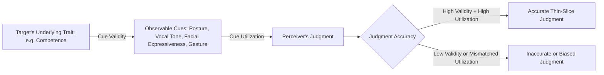

## Thin-Slicing Judgments of Competence and Personality

### Overview

Thin-slicing refers to the ability to draw accurate inferences about a person's traits, states, or outcomes based on very brief observations of behavior—often only a few seconds of exposure to expressive behavior such as facial expression, body language, vocal tone, or gesture, with no verbal content required. Thin-slice research demonstrates that person perception often does not require prolonged interaction to generate socially meaningful, and sometimes surprisingly accurate, judgments about others.

### Origin of the Concept

**Key Points**

- The term "thin slice" was coined by Nalini Ambady and Robert Rosenthal in their influential 1992 meta-analysis published in *Psychological Bulletin*.
- They defined thin slices as brief excerpts of expressive behavior, typically under 5 minutes and sometimes as short as 2–10 seconds, sampled from a longer stream of behavior.
- Their meta-analysis of prior studies found that judgments made from these brief excerpts often correlated significantly with outcomes or ratings based on much longer observation periods or objective criteria (e.g., end-of-semester teaching evaluations, therapy outcomes).

### The Foundational Study: Teacher Effectiveness

**Example**

In Ambady and Rosenthal's (1993) widely cited study, undergraduate raters watched three 10-second silent video clips of college instructors teaching (with audio removed to eliminate the influence of verbal content). Raters' judgments of instructor effectiveness based on these 30 total seconds of silent footage correlated strongly with end-of-semester student evaluations completed by students who had taken a full semester of courses with those instructors. Even shorter clips (as brief as 6 seconds) still produced meaningful predictive correlations, though [Unverified] the exact correlation coefficients varied somewhat depending on clip length and specific study replication.

### Domains of Thin-Slice Research

**Key Points**

- **Teaching effectiveness**: As above; nonverbal cues (confidence, warmth, enthusiasm) in brief silent clips predict long-term evaluations.
- **Clinical and therapeutic outcomes**: Brief observations of therapist-client interactions have been used to predict aspects of therapeutic rapport and, in some studies, treatment outcomes.
- **Personality judgments**: Strangers viewing brief video or even photographs can generate personality trait ratings (e.g., Big Five traits) that show non-trivial agreement with the target's self-reports or with peer/informant reports, particularly for extraversion and conscientiousness, which tend to have more visible behavioral and contextual cues than traits like neuroticism.
- **Deception detection**: Thin slices have been used to study lie detection accuracy, generally showing that people perform only slightly above chance, though certain cues (e.g., micro-expressions, speech hesitations) may carry some diagnostic value.
- **Sexual orientation and social category judgments**: Some studies (e.g., Ambady et al.) have examined whether brief exposure to gait, voice, or facial cues allows above-chance categorization judgments; these findings are more contested and carry higher risk of stereotype-driven bias rather than accurate signal detection. [Inference] Findings in this specific subdomain should be interpreted cautiously given replication concerns and the sensitive nature of the judgments involved.
- **Leadership and dominance**: Brief exposure to facial photographs or short interaction clips predicts perceived leadership potential and, in some studies, correlates with actual electoral outcomes or organizational rank.
- **Speed dating and romantic attraction**: Thin slices of a few minutes in speed-dating contexts have been shown to predict romantic interest ratings collected at the end of longer interactions.

### The "Zero-Acquaintance" Paradigm

Thin-slicing is closely related to, but distinct from, **zero-acquaintance research** (pioneered by David Kenny and colleagues), which examines whether strangers meeting for the very first time can agree with each other, and with the target's self-reports, on personality trait judgments. Zero-acquaintance studies typically use slightly longer interactions (a single meeting) whereas thin-slicing specifically emphasizes very brief (seconds-long) excerpts, but both paradigms converge on the finding that meaningful accuracy in trait judgment does not require extended acquaintance.

### Mechanisms: Why Thin Slices Work

**Key Points**

- **Ecological validity of nonverbal cues**: Certain nonverbal behaviors (posture, facial expressiveness, vocal pitch variability, gesture rate) are reliably associated with underlying traits or states across contexts, making them valid, if imperfect, diagnostic cues (per Brunswik's lens model).
- **Consistency of expressive style**: Individuals tend to display relatively stable expressive behavioral signatures across situations, meaning a brief sample can be representative of a broader behavioral pattern.
- **Automatic, heuristic processing**: Person perception often relies on fast, automatic (System 1-type) processing of surface cues rather than deliberate, effortful reasoning, allowing rapid judgments to form efficiently even with minimal data.
- **Redundancy of cues**: Multiple nonverbal channels (face, voice, posture, gesture) often convey convergent information simultaneously, so even a short slice contains multi-channel redundant signal.

### The Brunswik Lens Model Applied to Thin-Slicing

The lens model, originally developed by Egon Brunswik, provides a widely used framework for understanding thin-slice accuracy: an underlying trait (distal variable) produces observable cues (proximal cues), which perceivers use to form judgments. Accuracy depends on two links: **cue validity** (how well cues actually reflect the trait) and **cue utilization** (how well perceivers use those cues in forming judgments). Thin-slice accuracy is highest when both validity and utilization are strong for the same set of cues.

### Diagram: Lens Model Applied to Thin-Slice Judgment

### Limits and Boundary Conditions

**Key Points**

- **Domain dependence**: Accuracy varies substantially by judgment target; traits with clear, consistent behavioral markers (e.g., extraversion) are judged more accurately than traits with subtler or more context-dependent markers (e.g., emotional stability).
- **Stereotype and bias contamination**: Because thin-slice judgments rely heavily on surface cues, they are vulnerable to the same biases that affect other rapid social judgments, including halo effects, attractiveness bias, and stereotype-based inference, meaning some "accurate" correlations in past studies may partly reflect shared stereotypes between judges and criterion measures rather than pure behavioral validity.
- **Context stripping**: Removing audio or context (as in many classic paradigms) isolates nonverbal channels for study purposes but may reduce ecological validity relative to real-world impression formation, where verbal content, prior information, and situational context also matter.
- **Publication and effect size concerns**: [Unverified] As with much of social psychology research from this era, some thin-slicing effect sizes from older studies may not fully replicate with modern, more stringent methodological standards; the field has moved toward larger samples and more rigorous designs since Ambady and Rosenthal's original work.

### Relevance to Person Perception and Attribution

- **Speed of impression formation**: Thin-slicing research empirically demonstrates a core premise of person perception theory—that trait attributions and competence judgments form nearly instantaneously and can be resistant to revision, consistent with dual-process models of social cognition.
- **Spontaneous trait inference**: Thin-slice judgments exemplify spontaneous trait inference, wherein perceivers automatically attribute dispositional traits to a target based on minimal behavioral evidence, often without deliberate reasoning.
- **The "kernel of truth" debate**: Thin-slicing findings feed into a broader theoretical debate about whether social stereotypes and rapid judgments contain a valid "kernel of truth" (reflecting genuine, if imperfect, predictive cues) versus being largely projections of the perceiver's own biases and expectations onto ambiguous cues.
- **Real-world consequences**: Because thin-slice judgments influence hiring decisions, teaching evaluations, jury perceptions, and electoral outcomes, this research has direct implications for understanding (and potentially mitigating) the impact of superficial, rapidly formed impressions on high-stakes social and institutional outcomes.

### Conclusion

Thin-slicing research shows that human observers can extract meaningful, non-random information about others' competence, personality, and effectiveness from remarkably brief behavioral samples, challenging the intuitive assumption that accurate person perception requires extended acquaintance. This predictive validity arises from the consistency and diagnostic value of nonverbal cues, processed through fast, largely automatic cognitive mechanisms. At the same time, thin-slice accuracy is domain-specific, susceptible to stereotype contamination, and should be interpreted within the broader framework of person perception as a probabilistic, cue-based inferential process rather than a source of infallible social judgment.

**Related Topics**

- Spontaneous trait inference and automatic attribution
- The Brunswik lens model of social judgment
- Zero-acquaintance personality judgment research
- Facial expression and universality research
- Halo effect and attractiveness bias in impression formation
- Nonverbal communication channels (kinesics, paralanguage, proxemics)
- Accuracy in person perception and the "kernel of truth" hypothesis
- Implicit bias in rapid social categorization