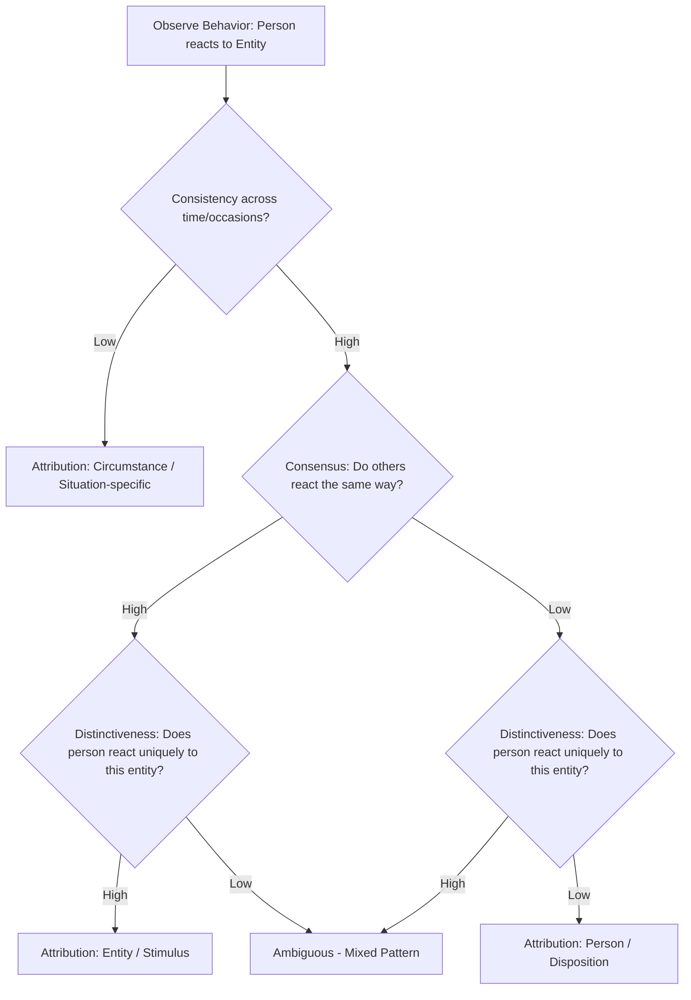

## Kelley's Covariation Model

### Overview

Kelley's covariation model, introduced by Harold Kelley in his 1967 paper "Attribution Theory in Social Psychology," is a formal framework describing how people determine the cause of another person's behavior by systematically analyzing patterns of covariation across multiple observations. The model extends Heider's naive psychology into a rigorous, quasi-scientific decision procedure, proposing that perceivers behave like intuitive statisticians who assess how a behavior varies (or co-varies) with potential causal factors across time, situations, and people before arriving at a causal attribution.

### The Core Principle: The Covariation Principle

**Key Points**

- Kelley's central premise, the **covariation principle**, states that an effect is attributed to the cause with which it co-varies over time—that is, the cause that is present when the effect is present and absent when the effect is absent.
- To apply this principle to social behavior, perceivers are assumed to gather and mentally analyze information along three independent dimensions: consensus, distinctiveness, and consistency.
- Based on the pattern formed by these three dimensions, perceivers arrive at one of three broad causal attributions: to the **person** (the actor), the **entity/stimulus** (the target of the behavior), or the **circumstances** (the situation or occasion).

### The Three Dimensions of Covariation Information

**Consensus**

Consensus refers to whether other people behave the same way toward the same stimulus/entity.

- **High consensus**: Most people react the same way to the entity (e.g., everyone laughs at the comedian).
- **Low consensus**: Few other people react this way (e.g., only this one person laughs at the comedian).

**Distinctiveness**

Distinctiveness refers to whether the actor behaves this way only toward this particular entity, or toward many different entities.

- **High distinctiveness**: The actor responds this way only to this specific entity (e.g., this person laughs only at this particular comedian, not at other comedians).
- **Low distinctiveness**: The actor responds this way to many different entities (e.g., this person laughs at every comedian).

**Consistency**

Consistency refers to whether the actor behaves this way toward the entity across time and circumstances.

- **High consistency**: The actor reacts this way to the entity every time, across different occasions (e.g., this person always laughs at this comedian, on every occasion they see them perform).
- **Low consistency**: The actor's reaction to the entity varies across occasions (e.g., this person laughed once but doesn't usually).

### The Classic Attribution Patterns

**Example**

Using the scenario "Person X laughs at Comedian Y's performance," Kelley's model predicts the following attributional outcomes based on different information patterns:

| Consensus | Distinctiveness | Consistency | Resulting Attribution |
| --- | --- | --- | --- |
| High | High | High | **Entity** attribution (something about the comedian is genuinely funny) |
| Low | Low | High | **Person** attribution (something about this particular person makes them prone to laughing) |
| High/Low (varies) | High | Low | **Circumstance** attribution (something specific about this particular occasion) |

**Entity attribution** (external, to the stimulus): High consensus + High distinctiveness + High consistency — everyone laughs at this comedian (high consensus), this person doesn't laugh at other comedians (high distinctiveness), and this person always laughs at this comedian (high consistency). This pattern suggests the comedian is genuinely, objectively funny.

**Person attribution** (internal, to the actor): Low consensus + Low distinctiveness + High consistency — nobody else laughs at this comedian (low consensus), this person laughs at everything (low distinctiveness), and they always laugh at this comedian (high consistency). This pattern suggests the person simply has an unusually easy-going or amused disposition.

**Circumstance attribution** (to the specific occasion): Low consistency, regardless of other dimensions — the person doesn't usually laugh at this comedian but did on this one occasion, suggesting something unique about this particular moment (e.g., they were in an especially good mood, or someone told a joke beforehand) rather than a stable fact about either the person or the comedian.

### Diagram: Covariation Model Decision Logic

### Causal Schemata: Handling Single-Observation Judgments

**Key Points**

- Kelley recognized that the full covariation model requires multiple observations across time, people, and situations—information perceivers do not always have, particularly when judging a stranger after a single encounter.
- To address this, Kelley proposed that when covariation information is scarce or unavailable, perceivers rely on **causal schemata**—pre-existing, simplified beliefs about how multiple causes typically combine to produce an effect.
- Two key schemata are central to this extension:
  - **Multiple Sufficient Causes Schema**: Applied when either of two or more causes is independently sufficient to produce an outcome, this schema underlies the **discounting principle**: the role of a given cause is discounted (seen as less important) if other plausible causes are also present. (Example: a salesperson's friendliness is discounted as a genuine disposition if the perceiver knows the salesperson's job requires friendliness.)
  - **Multiple Necessary Causes Schema**: Applied when an outcome is difficult or extreme, requiring the joint presence of two or more causes, this schema underlies the **augmentation principle**: a cause's role is augmented (seen as more important) if the behavior occurs despite the presence of a strong inhibitory or costly factor. (Example: a student who persists in a difficult, resource-poor academic environment is judged as unusually motivated/intelligent because they succeeded despite an inhibitory circumstance.)

### Discounting and Augmentation: Elaboration

**Example**

*Discounting*: If an employee praises their boss's proposal in a public meeting, the perceiver might normally attribute this to genuine belief in the proposal's merit. However, if the perceiver also knows the employee is seeking a promotion (an alternative sufficient cause), the perceiver **discounts** the "genuine belief" explanation because ingratiation is an equally plausible cause, and confidence in either single cause is reduced.

*Augmentation*: If a student turns in an outstanding project despite working through a power outage, family emergency, and broken laptop (inhibitory circumstances), perceivers **augment** their attribution of the student's ability and diligence, because succeeding despite significant obstacles implies an especially strong underlying disposition.

### Strengths and Empirical Support

**Key Points**

- The model provides a clear, testable, and influential formalization of how situational and dispositional attributions are derived from patterned information, and has been supported in numerous experimental studies (notably by McArthur, 1972) confirming that participants' attributions shift systematically in the directions the model predicts when consensus, distinctiveness, and consistency information are experimentally manipulated.
- The discounting and augmentation principles have been widely applied beyond attribution research, informing areas such as persuasion (e.g., understanding when a communicator's stated position is discounted due to perceived ulterior motives) and impression management research.

### Criticisms and Limitations

**Key Points**

- **Overestimation of consensus use**: McArthur's (1972) and subsequent studies found that perceivers systematically underweight or underutilize consensus information relative to what the normative model prescribes, while overweighting distinctiveness and consistency information—a finding sometimes linked to base-rate neglect in judgment and decision-making research more broadly.
- **Unrealistic informational demands**: The full covariation model assumes perceivers have, and actively process, extensive comparative information (across people, entities, and occasions), which is often unavailable, especially in single-encounter or novel social situations—a limitation Kelley himself partially addressed via causal schemata.
- **Normative vs. descriptive gap**: The model describes how attributions *should* be made if perceivers reasoned like ideal statisticians, but extensive subsequent research (e.g., on the fundamental attribution error, correspondence bias, and heuristic-based judgment) shows that real-world attribution frequently deviates from this normative standard, particularly by over-relying on dispositional explanations even when strong situational information is available.
- **Cognitive load and effort**: The full covariation analysis is a comparatively effortful process; in daily life, perceivers frequently rely instead on faster heuristic shortcuts (e.g., correspondent inference or availability-based reasoning) except when accuracy motivation or need for careful judgment is heightened. [Inference] This suggests the covariation model may better describe attribution in careful/analytical contexts than in fast, low-stakes everyday judgments.

### Relevance to Person Perception and Attribution

Kelley's covariation model occupies a central position within the person perception and attribution literature because it:

- Provides a formal decision-rule extension of Heider's more intuitive personal/impersonal causality distinction.
- Directly informs understanding of the **fundamental attribution error**, since the model specifies the conditions under which situational (entity/circumstance) attributions are normatively warranted—conditions perceivers often fail to fully utilize, contributing to dispositional over-attribution.
- Establishes the discounting and augmentation principles as general-purpose tools used throughout social cognition research, including in the study of stereotyping (e.g., discounting a stereotype-inconsistent behavior due to situational pressure) and persuasion/credibility judgments.
- Serves as a direct precursor and complement to Jones and Davis's Correspondent Inference Theory, together forming the two dominant classical models of attribution taught alongside Heider's foundational work.

### Conclusion

Kelley's covariation model formalizes the process by which people determine whether another person's behavior should be attributed to something about the person, the entity/stimulus they are responding to, or the specific circumstances of the occasion, using the systematic comparison of consensus, distinctiveness, and consistency information. Complemented by the discounting and augmentation principles for single-observation judgments, the model remains one of the most influential and empirically tested frameworks in attribution theory, even as subsequent research has identified systematic deviations between its normative logic and how people actually reason about others' behavior in practice.

**Related Topics**

- Heider's naive psychology and personal/impersonal causality
- Correspondent Inference Theory (Jones and Davis)
- Fundamental attribution error and correspondence bias
- Discounting and augmentation principles in persuasion research
- Base-rate neglect and heuristic judgment
- Actor-observer asymmetry in attribution
- Weiner's attributional theory of achievement motivation
- Self-serving bias and defensive attribution