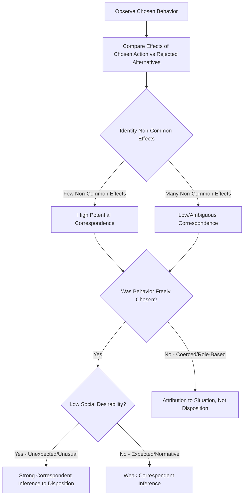

## Correspondent Inference Theory

### Overview

Correspondent Inference Theory (CIT), developed by Edward E. Jones and Keith Davis in their 1965 paper "From Acts to Dispositions," is a foundational attribution framework that specifies the conditions under which observers infer that a person's behavior corresponds to (i.e., accurately reflects) a stable, underlying personal disposition or trait. Unlike Kelley's later covariation model, which relies on comparative information across multiple observations, CIT focuses on how a perceiver draws dispositional conclusions from a **single observed action**, making it especially relevant to snap judgments and first-impression formation.

### Core Concept: Correspondence

**Key Points**

- A "correspondent inference" occurs when an observer concludes that a behavior directly reflects a corresponding underlying trait or disposition (e.g., inferring that someone who acts aggressively is a genuinely hostile person).
- The theory's central question is: under what conditions do observers make confident, high-correspondence dispositional attributions, versus attributing behavior to external/situational factors?
- CIT proposes that correspondence is strongest when a behavior is freely chosen, produces distinctive (non-common) effects, and is low in social desirability—that is, when the behavior seems to genuinely reveal something unique and voluntary about the actor rather than being a predictable response to situational pressures.

### The Analysis of Non-Common Effects

**Key Points**

- Jones and Davis proposed that observers mentally compare the chosen course of action to the alternatives that were not chosen, examining the *effects* (consequences) that would have resulted from each option.
- **Common effects** are outcomes shared by the chosen action and its foregone alternatives (they provide no diagnostic information about why the actor chose this particular option).
- **Non-common effects** are outcomes unique to the chosen action, not shared by the alternatives, and these are the effects that carry attributional weight, because they reveal what specifically motivated the choice.
- **The fewer the non-common effects, the higher the correspondence**: when a chosen action has very few unique consequences distinguishing it from its alternatives, the perceiver can more confidently identify which specific effect(s) motivated the actor's choice, producing a more confident and specific dispositional inference.

**Example**

Suppose someone is choosing between two job offers: Job A (high salary, boring work, long commute) and Job B (lower salary, boring work, long commute). If they choose Job B, the only non-common effect is the lower salary itself being tolerated—since boring work and long commute are shared by both options. This narrow set of non-common effects makes it easier to infer a specific disposition (e.g., "this person doesn't prioritize money," or there's some other single unique factor drawing them to Job B). If instead Job B differed from Job A in salary, work interest, location, benefits, and company culture simultaneously, the many non-common effects would make it much harder to pinpoint which factor drove the choice, yielding a lower-correspondence, more ambiguous inference.

### Key Determinants of Correspondent Inference

**Freedom of Choice**

Behavior performed under free choice (rather than coercion, role obligation, or situational constraint) is more strongly attributed to disposition. If a person is forced or strongly incentivized to act a certain way, the behavior is attributed to the situational pressure rather than to the person's underlying character.

**Social Desirability**

Behavior that is low in social desirability (i.e., unusual, unexpected, or counter-normative) yields higher correspondence than socially desirable, expected behavior. Socially desirable behavior is common to almost everyone regardless of disposition (nearly everyone is polite at a job interview), so it reveals little about the specific individual; unexpected or socially undesirable behavior (someone being rude at a job interview) is more diagnostic because it defies situational pressure and normative expectation, suggesting it stems from genuine disposition.

**Number of Non-Common Effects**

As detailed above, fewer non-common effects between chosen and rejected alternatives increase the confidence and specificity of the dispositional inference.

**Hedonic Relevance**

Jones and Davis (and later elaborations) proposed that behavior which directly affects the perceiver's own outcomes (positively or negatively) is judged as more dispositionally caused than behavior with no personal relevance to the observer—perceivers tend to see personally consequential actions as more intentional and characterological.

**Personalism**

Related to hedonic relevance, personalism refers to the perceiver's belief that the actor intended the behavior specifically toward them (rather than it being incidental). Higher personalism increases the strength of the dispositional attribution.

### Diagram: Correspondent Inference Process

### The Correspondence Bias Connection

**Key Points**

- CIT's framework directly anticipated what later researchers (notably Lee Ross, 1977) termed the **correspondence bias** or **fundamental attribution error**: the tendency for observers to draw correspondent (dispositional) inferences even when the behavior is clearly attributable to situational constraints, effectively over-applying the correspondent inference process beyond its theoretically justified conditions.
- The classic empirical demonstration of this comes from **Jones and Harris (1967)**, in which participants read essays either supporting or opposing Fidel Castro, under conditions where the essay writer either freely chose their position or was assigned it (e.g., told to write a pro-Castro essay for a debate assignment). Even when told the position was assigned (removing free choice), participants still inferred that the essay reflected the writer's true attitude to some degree—demonstrating that dispositional inference persists even when the theoretical preconditions (free choice) for correspondence are explicitly violated.
- This finding revealed a key limitation/extension of CIT: while the theory correctly specifies the *normative* conditions under which correspondence should occur, actual human attribution frequently over-extends correspondent inferences into situations where they are not logically warranted.

### Comparison with Kelley's Covariation Model

| Feature | Correspondent Inference Theory | Kelley's Covariation Model |
| --- | --- | --- |
| Information basis | Single observation/act | Multiple observations across time, people, entities |
| Core mechanism | Analysis of non-common effects between chosen/rejected options | Analysis of consensus, distinctiveness, consistency |
| Primary output | Degree of correspondence between act and disposition | Attribution to person, entity, or circumstance |
| Best suited for | First impressions, single-encounter judgments | Attributions built over repeated/comparative observation |

[Inference] The two theories are often taught as complementary rather than competing: CIT addresses the "on the spot" inference problem for novel single acts, while the covariation model addresses attribution when richer comparative data is available.

### Empirical Support and Refinements

**Key Points**

- Numerous studies following Jones and Davis's original formulation confirmed that manipulating choice (free vs. constrained) and behavior desirability (expected vs. unexpected) systematically shifts the strength of dispositional attributions in the predicted directions.
- Later theoretical work (e.g., by Jones and McGillis, 1976) refined the "non-common effects" analysis by incorporating **prior expectations**: correspondence is influenced not just by non-common effects but by whether the observed behavior violates category-based expectations (expectations based on the actor's social role or group) or target-based expectations (expectations based on the specific individual's known past behavior), with expectation-violating behavior producing stronger correspondent inferences.

### Relevance to Person Perception and Attribution

Correspondent Inference Theory holds a central place in the person perception and attribution literature because it:

- Provides the classical account of how a single behavioral observation is translated into a trait inference, directly relevant to first-impression formation and snap judgments in person perception.
- Establishes the theoretical mechanism (non-common effects, choice, desirability) that explains why some behaviors are highly diagnostic of character while others are not, informing both everyday social judgment and applied contexts such as personnel selection interviews and jury attributions of intent.
- Directly generated the empirical paradigm (the Jones and Harris essay studies) that first demonstrated the correspondence bias/fundamental attribution error, making CIT historically and theoretically inseparable from one of social psychology's most robust and widely cited biases.
- Complements Kelley's covariation model as one of the two dominant classical frameworks explaining the cognitive process of moving "from acts to dispositions."

### Conclusion

Correspondent Inference Theory explains how observers infer stable personal dispositions from a single observed behavior by analyzing the freedom of the actor's choice, the social desirability of the behavior, and—most distinctively—the number of non-common effects distinguishing the chosen action from its foregone alternatives. While the theory specifies clear normative conditions under which dispositional attributions are justified, subsequent research, most notably the Jones and Harris essay-attribution studies, revealed that real-world attribution frequently overextends correspondent inferences even when situational constraints clearly negate free choice, directly foreshadowing the discovery of the fundamental attribution error and correspondence bias that remain central concepts in the study of person perception.

**Related Topics**

- Kelley's covariation model
- Fundamental attribution error and correspondence bias
- Jones and Harris (1967) attitude attribution studies
- Heider's naive psychology and personal causality
- Actor-observer asymmetry in attribution
- First impression formation and spontaneous trait inference
- Discounting and augmentation principles
- Category-based vs. target-based expectancies in social judgment