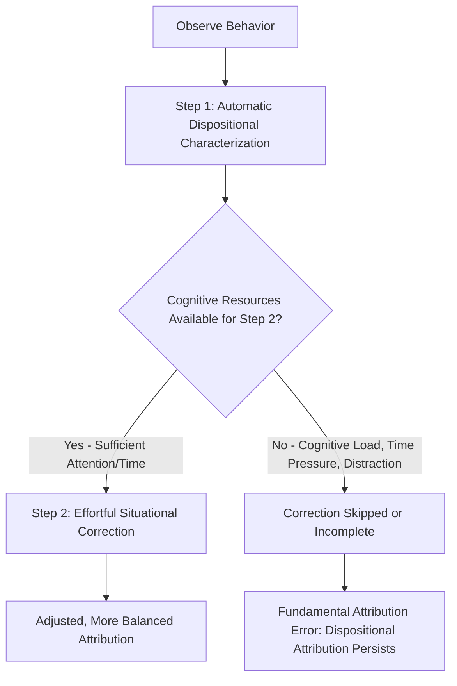

## Fundamental Attribution Error

### Overview

The fundamental attribution error (FAE), a term coined by Lee Ross in 1977, refers to the pervasive tendency for observers to overemphasize dispositional (personality-based) explanations for other people's behavior while underestimating the influence of situational factors. Also referred to as **correspondence bias**, this phenomenon is one of the most robust and widely cited findings in social psychology, directly extending the theoretical groundwork laid by Heider, Jones and Davis, and Kelley.

### Defining the Phenomenon

**Key Points**

- The FAE describes an asymmetry in how perceivers weigh dispositional versus situational causes when explaining another person's behavior: dispositional causes are systematically overweighted relative to what objective analysis of the situation would warrant.
- Importantly, the error is not that dispositional attributions are always wrong, but that they are applied too readily and too strongly, even when compelling situational explanations are present and logically should reduce confidence in the dispositional account.
- Ross specifically labeled it "fundamental" because he viewed this bias as a pervasive, foundational feature of everyday social inference, occurring across a wide range of judgment domains, though later researchers have debated whether "fundamental" overstates its universality (see Criticisms below).

### The Classic Demonstration: Jones and Harris (1967)

**Example**

In the foundational study preceding Ross's naming of the bias, Jones and Harris had participants read essays about Fidel Castro that were either pro-Castro or anti-Castro in content. Participants were told either that the essay writer freely chose which position to argue, or that the writer was assigned the position (e.g., as part of a debate class exercise, with no choice in the matter). Logically, when the position was assigned, the essay content should provide no information about the writer's true attitude. However, participants in the assigned-position condition still inferred that the writer's true attitude was closer to the position expressed in the essay than would be expected by chance—demonstrating that people attribute the behavior (writing a pro/anti-Castro essay) to the writer's disposition (their genuine attitude) even when a clear, salient situational cause (the assignment) fully accounts for the behavior.

### The Actor-Observer Asymmetry

**Key Points**

- Closely related to the FAE is the **actor-observer asymmetry** (originally proposed by Jones and Nisbett, 1972), which describes the tendency for people to attribute *their own* behavior to situational factors while attributing *others'* identical behavior to disposition.
- Classic explanation: actors have greater perceptual and informational access to the range of situational forces acting upon them (they know their own history, constraints, and internal states), whereas observers primarily see the actor's behavior against a relatively invisible or unknown situational backdrop, making the person the most visually and cognitively salient explanatory candidate.
- [Unverified] Later meta-analytic work (e.g., Malle, 2006) has suggested the actor-observer asymmetry is considerably weaker and more inconsistent across studies than originally believed, and that it may depend heavily on factors such as whether the behavior is positive or negative (interacting with self-serving bias) rather than being a uniform, general effect.

### Why the Fundamental Attribution Error Occurs: Theoretical Mechanisms

**Perceptual Salience**

The actor is typically the visually and attentionally salient "figure" in a behavioral scene, while the situational context forms a comparatively unnoticed "ground" (drawing on figure-ground perceptual principles). Because attention naturally gravitates to the person performing the action, situational causes are correspondingly underweighted in causal analysis.

**Two-Step Attribution Process (Gilbert's Model)**

Daniel Gilbert and colleagues proposed an influential two-stage model of attribution:

1. **Automatic characterization**: Upon observing a behavior, perceivers automatically and effortlessly categorize the act in dispositional terms (e.g., seeing someone act nervously automatically activates the trait concept "anxious").
2. **Effortful correction**: Perceivers must then engage in a more effortful, deliberate second step to adjust or correct this initial dispositional characterization by incorporating situational information.

- Because the first step is automatic and the second is effortful and resource-dependent, situational correction is often incomplete, especially under conditions of cognitive load, time pressure, or distraction—all of which have been shown experimentally to increase the magnitude of the FAE, since they impair the effortful correction stage while leaving the automatic dispositional inference intact.

**Just-World Beliefs and Motivational Factors**

Some theorists connect the FAE to broader motivational processes, such as belief in a just world, wherein attributing outcomes to stable personal characteristics (rather than uncontrollable situational luck) helps maintain a sense of predictability and control over one's social environment. [Inference] This motivational account is generally considered a contributing factor rather than the primary or sole explanation, with cognitive/perceptual accounts (salience, two-step processing) receiving stronger and more direct experimental support.

### Diagram: Gilbert's Two-Step Attribution Process and the FAE

### Cross-Cultural Variation

**Key Points**

- A substantial body of cross-cultural research, notably by Joan Miller (1984) and later Richard Nisbett and colleagues, has found that the magnitude of the FAE varies systematically across cultures, with individuals from **individualist cultures** (e.g., the United States, Western Europe) showing stronger dispositional bias than individuals from **collectivist cultures** (e.g., many East Asian and South Asian cultural contexts), who tend to give relatively greater weight to situational and contextual factors when explaining behavior.
- This cross-cultural variation is generally interpreted as evidence that the FAE, while widespread, is not a fixed, universal cognitive hardwiring but is shaped and amplified by culturally transmitted beliefs about the self as an autonomous, trait-consistent entity (more emphasized in individualist cultures) versus the self as embedded within relational and situational contexts (more emphasized in collectivist cultures).
- [Unverified] The precise size and consistency of this cross-cultural difference have been debated, with some replications finding smaller or more context-dependent cultural gaps than the earliest studies suggested.

### Criticisms and Boundary Conditions

**Key Points**

- **Terminology debate**: Some researchers have argued the label "fundamental" overstates the universality and inevitability of the bias, preferring the more neutral term "correspondence bias," since the effect's size varies considerably based on situational salience, cultural background, cognitive load, and the specific judgment domain.
- **Not all situational information is discounted equally**: The bias is strongest when situational causes are non-obvious, subtle, or require inference; when situational constraints are extremely salient and unambiguous, correction is more complete, and the bias is correspondingly reduced.
- **Motivational moderators**: Accountability (needing to justify one's judgment to others) and high accuracy motivation have been shown to reduce (though not eliminate) the magnitude of the effect, suggesting the bias is at least partially correctable with sufficient motivation and cognitive resources.
- **Self-serving bias interaction**: When judging one's own behavior in the actor role, self-serving motivations (taking credit for successes, externalizing failures) can complicate the simpler actor-observer story, since actors do not uniformly favor situational attributions—they favor situational attributions primarily for their own negative/undesirable outcomes.

### Relevance to Person Perception and Attribution

The fundamental attribution error is a cornerstone concept of the person perception and attribution chapter because it:

- Represents the most direct empirical demonstration of systematic failure in the normative attribution processes described by Heider, Jones and Davis, and Kelley—showing that real-world attribution deviates predictably from idealized rational models.
- Has wide-ranging applied implications, including in legal judgments (juror attributions of defendant intent and character), workplace performance evaluations (attributing poor performance to employee traits rather than organizational/situational constraints), intergroup relations (dispositional attributions for outgroup members' negative behaviors, feeding into stereotyping), and clinical judgment (attributing client behavior to character rather than circumstance).
- Provides a direct bridge to related biases and phenomena covered throughout attribution research, including the actor-observer asymmetry, self-serving bias, and the ultimate attribution error (the tendency to make dispositional attributions specifically for outgroup members' negative behaviors while attributing positive behaviors situationally).

### Conclusion

The fundamental attribution error describes the pervasive tendency of observers to overweight dispositional explanations and underweight situational explanations when interpreting others' behavior, a bias robustly demonstrated since Jones and Harris's classic essay-attribution studies and explained through mechanisms including perceptual salience, Gilbert's two-step automatic-then-effortful attribution model, and, to a lesser extent, motivational factors like just-world beliefs. While its magnitude varies meaningfully across cultural contexts and can be reduced under conditions of high accountability or salient situational cues, the FAE remains one of the most consistently replicated and practically consequential findings in the study of person perception, illustrating the systematic gap between how people should attribute causality and how they actually do.

**Related Topics**

- Correspondent Inference Theory and the Jones and Harris studies
- Actor-observer asymmetry
- Gilbert's two-step model of attribution
- Kelley's covariation model and discounting principle
- Cross-cultural psychology: individualism vs. collectivism
- Self-serving bias and defensive attribution
- Ultimate attribution error and intergroup bias
- Just-world hypothesis