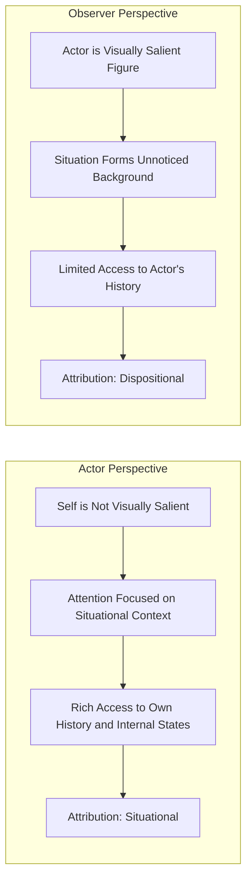

## Actor-Observer Asymmetry

### Overview

The actor-observer asymmetry, originally proposed by Edward Jones and Richard Nisbett in their 1972 chapter "The Actor and the Observer: Divergent Perceptions of the Causes of Behavior," describes the tendency for individuals to attribute their **own** behavior primarily to situational factors while attributing **other people's** identical or similar behavior primarily to dispositional factors. Though historically presented as a companion phenomenon to the fundamental attribution error, subsequent research has substantially revised and narrowed the scope of this asymmetry.

### The Original Formulation

**Key Points**

- Jones and Nisbett's original claim was broad and general: across a wide range of behaviors and contexts, actors tend to explain their own actions with reference to the situation ("I was late because traffic was terrible"), while observers explain the same actor's behavior with reference to disposition ("They're late because they're irresponsible").
- This was proposed as a pervasive, largely automatic perceptual and cognitive asymmetry rooted in differences in information and perspective between the person acting and the person watching.
- The asymmetry was initially framed as distinct from, but complementary to, the fundamental attribution error: while the FAE concerns observers' general over-attribution to disposition, the actor-observer asymmetry specifically concerns the *comparison* between how the same behavior is explained depending on whether one is the actor or the observer of it.

### Proposed Mechanisms

**Perceptual Salience / Figure-Ground**

From the observer's visual and attentional perspective, the actor is the salient "figure" against the relatively unnoticed "ground" of situational context. From the actor's own perspective, however, the self is not visually salient (people do not typically watch themselves act), while the surrounding situation—the obstacles, pressures, and circumstances—occupies the actor's attentional focus. This differing perceptual vantage point is proposed to directly produce differing attributional emphases.

**Informational Differences**

Actors have access to a much richer store of information about their own behavioral history, internal states, intentions, and situational constraints across many past occasions, allowing them to recognize how their current behavior is context-dependent and variable. Observers, typically encountering the actor in only one or a few situations, lack this longitudinal information and are more likely to infer that the observed behavior reflects a stable, cross-situational trait.

**Linguistic Encoding Differences**

Some research (e.g., by Semin and colleagues on linguistic category models) suggests that actors and observers use systematically different verb categories and grammatical structures when describing the same event, which may both reflect and reinforce differing causal attributions—for instance, using more descriptive action verbs (situationally anchored) versus more trait-adjectives (dispositionally anchored).

### Diagram: Divergent Perspectives in Actor-Observer Attribution

### Empirical Reassessment: A Weaker and More Conditional Effect

**Key Points**

- Bertram Malle's influential 2006 meta-analysis, synthesizing over three decades of subsequent research, found that the actor-observer asymmetry as originally and broadly formulated by Jones and Nisbett is considerably weaker, less consistent, and more conditional than the classic textbook presentation suggests.
- Malle's review identified that the asymmetry depends heavily on several moderating factors rather than operating as a uniform, general bias:
  - **Valence of the outcome**: The asymmetry is substantially stronger for negative behaviors/outcomes than for positive ones, implicating a strong overlap with **self-serving bias** (the tendency to attribute one's successes to disposition and failures to situation) rather than a pure actor-observer perceptual effect.
  - **Type of explanation examined**: Studies measuring open-ended, free-response explanations tend to find different patterns than studies using forced-choice trait-vs-situation rating scales, suggesting some of the classic effect may be partly a methodological artifact of how attributions are measured.
  - **Closeness/familiarity with the actor**: Asymmetry effects are generally weaker when observers are closely familiar with the actor (e.g., close friends, family members, romantic partners), since familiarity provides observers with some of the longitudinal, cross-situational information that is normally exclusive to the actor's own perspective.
- [Unverified] Because of this substantial reassessment, some contemporary social psychology texts present the actor-observer asymmetry as a historically important but empirically overstated phenomenon, rather than as a robust, independent bias on par with the fundamental attribution error.

### Relationship to Self-Serving Bias

**Key Points**

- Malle's finding that the asymmetry is much stronger for negative than positive behaviors closely aligns the actor-observer asymmetry with **self-serving bias**: when the outcome is a failure or socially undesirable behavior, actors are motivated to protect self-esteem by attributing it externally, while observers (having no such ego-protective motivation regarding the actor) more readily attribute it to disposition.
- For positive/desirable behaviors, both actors and observers show more similar attributional patterns (often both crediting disposition to some degree, or actors even taking dispositional credit), which undercuts the idea of a purely perceptual, motivation-free actor-observer split and instead points to self-protective motivation as a major driver of the asymmetry specifically in negative-outcome contexts.

### Example Illustrating the Asymmetry and Its Boundary Conditions

**Example**

A student fails an exam.

- **As actor** (explaining their own failure): "The professor's questions were unclear, I was sick that week, and the material wasn't covered well in lecture" (situational attribution, likely amplified by self-serving/self-protective motivation).
- **As observer** (a classmate explaining the same student's failure): "They probably didn't study enough; they're just not that disciplined" (dispositional attribution).

If the same student instead earns the highest grade in the class:

- **As actor**: More likely to attribute success at least partly to their own ability or effort (dispositional), rather than purely to situational luck.
- **As observer**: A classmate may attribute the success to either ability (dispositional) or to easy test questions (situational), with less consistent asymmetry than in the failure scenario—illustrating Malle's valence-dependent moderation.

### Boundary Conditions and Moderators Summary

| Moderator | Effect on Asymmetry |
| --- | --- |
| Negative outcome/behavior | Asymmetry strengthened (overlaps with self-serving bias) |
| Positive outcome/behavior | Asymmetry weakened or reversed |
| High actor-observer familiarity | Asymmetry weakened |
| Forced-choice trait/situation ratings | Asymmetry more reliably detected |
| Open-ended free explanations | Asymmetry less reliably detected |

### Relevance to Person Perception and Attribution

The actor-observer asymmetry remains pedagogically important within the person perception and attribution chapter because it:

- Illustrates how differing informational access and perceptual vantage points (rather than purely irrational bias) can produce systematic divergence in causal explanation between the person performing an action and the person watching it.
- Provides a direct empirical and conceptual link to self-serving bias, demonstrating how motivational and perceptual accounts of attribution can interact and partially overlap rather than operating as fully independent mechanisms.
- Serves as a valuable case study in the self-correcting nature of social psychological science: the substantial revision of this "classic" finding via Malle's meta-analysis exemplifies how foundational, textbook-standard phenomena can require significant empirical refinement and qualification as more rigorous cumulative evidence accumulates.
- Has practical relevance in contexts such as conflict resolution, couples therapy, and organizational feedback, where recognizing that the same behavior may be genuinely perceived differently by actor and observer can inform strategies for improving mutual understanding and reducing interpersonal attribution conflicts.

### Conclusion

The actor-observer asymmetry describes the classic finding that people tend to attribute their own behavior to situational causes while attributing others' identical behavior to dispositional causes, originally explained through differences in perceptual salience and informational access between actors and observers. However, extensive subsequent meta-analytic research, most notably by Malle (2006), has shown this asymmetry to be considerably weaker, more conditional, and more closely tied to outcome valence (and therefore to self-serving motivational processes) than the original broad formulation suggested, making it an important example of both a foundational attribution concept and a case study in scientific refinement over time.

**Related Topics**

- Fundamental attribution error and correspondence bias
- Self-serving bias and defensive attribution
- Malle's (2006) meta-analytic reassessment of attribution asymmetries
- Perceptual salience and figure-ground effects in social cognition
- Linguistic category models in attribution research
- Kelley's covariation model
- Attribution in close relationships and conflict resolution
- Ultimate attribution error and intergroup bias