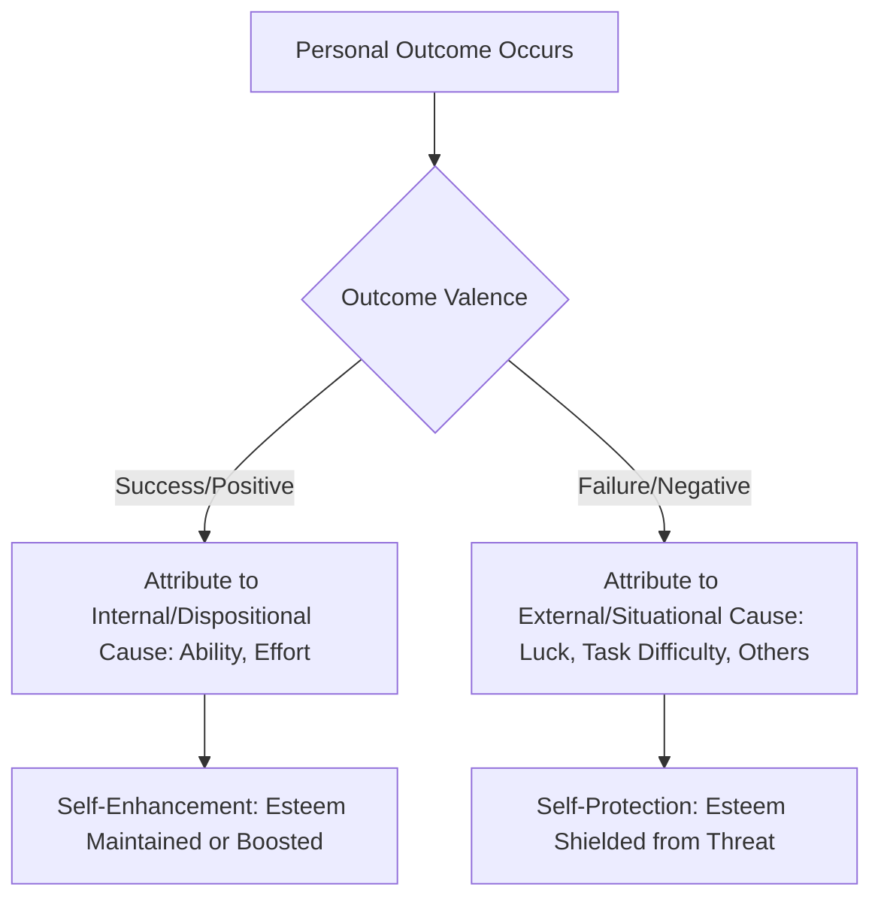

## Self-Serving Attributional Bias

### Overview

Self-serving attributional bias (commonly called self-serving bias) refers to the tendency for individuals to attribute their successes to internal, dispositional factors (e.g., ability, effort) while attributing their failures to external, situational factors (e.g., bad luck, task difficulty, others' interference). This asymmetric pattern of self-relevant causal explanation serves to protect and enhance self-esteem, and it stands as one of the most extensively documented motivational biases in the attribution literature.

### Defining the Two Components

**Key Points**

- **Self-enhancing bias**: The tendency to take personal, dispositional credit for positive outcomes and successes ("I got the promotion because I'm talented and hardworking").
- **Self-protecting bias**: The tendency to externalize responsibility for negative outcomes and failures ("I didn't get the promotion because the process was unfair" or "the competition was unusually strong").
- Together, these two components create a systematic asymmetry in the locus of causality assigned to one's own outcomes, differing markedly from the more balanced or even self-critical attributional patterns that a purely rational, unbiased observer of one's own behavior might be expected to produce.

### Classic Empirical Demonstrations

**Example**

In a frequently cited category of studies, students who perform well on an exam tend to attribute their success to their own intelligence and study effort, while students who perform poorly on the same exam are more likely to attribute their failure to an unfair test, poor teaching, or bad luck—even when both groups took the identical exam under identical conditions.

**Example**

Research on romantic relationships and married couples (e.g., early work by Fincham and Bradbury) has shown that satisfied partners often attribute their partner's positive behaviors to disposition ("they brought me flowers because they're a thoughtful person") and negative behaviors to situational or external factors ("they forgot our anniversary because work has been stressful")—a pattern termed the **relationship-enhancing attribution style**. Notably, this pattern can reverse in distressed relationships, becoming a **distress-maintaining attribution style**, in which partners attribute negative behaviors to disposition and positive behaviors to situational factors, illustrating how self-serving-type biases can extend to close others when the perceiver's own outcomes (relationship satisfaction) are implicated.

### Theoretical Explanations

**Motivational (Ego-Protective) Account**

**Key Points**

- The dominant traditional explanation holds that self-serving bias arises primarily from a motivational need to protect and enhance self-esteem, maintain a positive self-concept, and present a favorable image to others (impression management).
- This account predicts that self-serving bias should be more pronounced when self-esteem is threatened, when the outcome is public rather than private, and among individuals higher in narcissism or with contingent (outcome-dependent) self-esteem.

**Cognitive (Information-Processing) Account**

**Key Points**

- An alternative, non-motivational explanation proposes that self-serving bias can emerge from purely cognitive processes without requiring an ego-protective motive.
- **Expectancy-based explanation**: People generally expect to succeed (especially on tasks within their perceived competence), so success confirms prior expectations and is attributed to stable, expected internal factors, while failure violates expectations and is attributed to unusual, unstable external factors—this is a straightforward application of covariation-type reasoning rather than motivated distortion.
- **Self-relevant information access**: Actors have more information about their own effort and intentions (paralleling the actor-observer asymmetry) which may lead to more differentiated causal analysis of their own successes and failures compared to an outside observer's simpler trait-based judgment.
- [Inference] Most contemporary reviews treat motivational and cognitive accounts as complementary rather than mutually exclusive, with the relative contribution of each likely varying by situation, individual, and outcome domain.

### Diagram: Self-Serving Bias Attribution Pattern

### Moderators of Self-Serving Bias

**Key Points**

- **Public vs. private attribution**: Self-serving bias tends to be more pronounced when attributions will be communicated publicly (serving an impression-management function) than when made purely privately, though private self-serving effects are also reliably documented, suggesting the bias is not purely a self-presentational strategy.
- **Task importance and ego-involvement**: Bias is typically stronger for outcomes that are more personally important or self-relevant, consistent with the motivational account's emphasis on esteem protection.
- **Depression and clinical status**: Individuals experiencing depression frequently show a reversed or attenuated pattern (sometimes termed a "depressive attributional style"), attributing negative outcomes to internal, stable, and global causes and failing to show the typical self-serving asymmetry for positive outcomes—a pattern studied extensively within Abramson, Seligman, and Teasdale's reformulated learned helplessness/hopelessness theory of depression.
- **Cultural variation**: Some cross-cultural research suggests self-serving bias is more pronounced in individualist cultures that emphasize personal achievement and self-enhancement, while research in more collectivist cultural contexts has sometimes found weaker self-serving patterns or even self-effacing tendencies (attributing success modestly to situational or group factors), though [Unverified] the size and consistency of these cross-cultural differences vary across studies and have been subject to ongoing methodological debate.
- **Individual differences**: Trait narcissism and high but unstable/contingent self-esteem have been associated with stronger self-serving attributional tendencies.

### The Group-Serving (Ultimate Attribution Error) Extension

**Key Points**

- Self-serving bias has an important intergroup parallel: the **group-serving bias**, in which individuals attribute positive behaviors by their own ingroup members to disposition and negative behaviors to situational factors, while showing the reverse pattern for outgroup members (attributing outgroup negative behavior to disposition, outgroup positive behavior to situational or exceptional factors).
- This intergroup extension is formally termed the **ultimate attribution error** (Pettigrew, 1979), directly linking self-serving attributional processes to the broader study of stereotyping, prejudice, and intergroup relations.

### Defensive Attribution: A Related Phenomenon

**Key Points**

- **Defensive attribution** refers to a related but distinct bias in which observers (not just actors) attribute blame for an accident or negative event in a way that minimizes their own perceived vulnerability to a similar fate.
- A key factor is **perceived similarity** to the victim: the more an observer perceives themselves as similar to a victim of misfortune, the less likely they are to blame the victim (since blaming a similar victim would imply personal vulnerability), and the more likely they are to attribute the negative outcome to chance or situational factors.
- Conversely, greater **perceived dissimilarity** from a victim, combined with greater severity of the negative outcome, tends to increase victim-blaming (a dispositional attribution to the victim), which paradoxically helps the observer maintain a belief that "it couldn't happen to me" by attributing the misfortune to the victim's own characteristics or poor choices rather than to uncontrollable chance.
- Defensive attribution is often discussed alongside self-serving bias because both illustrate motivated, ego-protective distortions of otherwise "rational" causal analysis, though defensive attribution protects the *observer's* sense of invulnerability rather than the *actor's* self-esteem regarding their own outcome.

### Criticisms and Boundary Conditions

**Key Points**

- **Not universal or uniform**: Self-serving bias does not appear equally across all individuals, cultures, or outcome domains; clinical populations (e.g., depression), certain cultural contexts, and specific task framings can attenuate, eliminate, or even reverse the typical pattern.
- **Confound with genuinely accurate attributions**: Critics note that in some real-world cases, external attributions for failure may be at least partially accurate (task difficulty and bad luck genuinely do influence outcomes), making it methodologically challenging to cleanly separate motivated bias from legitimate causal analysis in naturalistic (non-experimental) settings.
- **Overlap with actor-observer asymmetry**: As discussed in Malle's (2006) meta-analysis, much of the classic "actor-observer asymmetry" data is now understood to be substantially driven by self-serving motivational processes specifically for negative outcomes, rather than being a fully separate, purely perceptual phenomenon—indicating meaningful conceptual overlap between these two attribution biases.

### Relevance to Person Perception and Attribution

Self-serving attributional bias holds a central place in the person perception and attribution chapter because it:

- Demonstrates that attribution processes are not purely cognitive/rational but are also shaped by motivational needs, particularly the need to maintain self-esteem and a positive self-concept, complementing the more purely cognitive frameworks of Heider, Jones and Davis, and Kelley.
- Provides a direct bridge to clinical psychology through its connection to depressive attributional styles and the learned helplessness/hopelessness model.
- Extends naturally into intergroup relations research via the ultimate attribution error, linking individual-level motivated attribution to broader patterns of prejudice and stereotyping.
- Has significant applied relevance in organizational behavior (performance review biases), education (student attributions for grades affecting motivation and future effort), and legal/forensic contexts (defensive attribution and victim-blaming in judgments of accidents and crimes).

### Conclusion

Self-serving attributional bias captures the well-documented tendency to attribute one's successes to internal, dispositional causes while attributing failures to external, situational causes, a pattern best explained through a combination of ego-protective motivational processes and non-motivated cognitive mechanisms such as expectancy confirmation. Its moderators—including public versus private context, task importance, clinical status, and cultural background—reveal it to be a robust but conditional phenomenon rather than a fixed universal law, and its conceptual extensions into group-serving bias, the ultimate attribution error, and defensive attribution demonstrate its broad explanatory reach across individual, clinical, and intergroup domains of social psychology.

**Related Topics**

- Actor-observer asymmetry
- Defensive attribution and victim-blaming
- Ultimate attribution error and intergroup bias
- Depressive attributional style and learned helplessness theory
- Kelley's covariation model
- Relationship-enhancing vs. distress-maintaining attribution styles
- Narcissism and contingent self-esteem
- Cross-cultural variation in self-enhancement motives