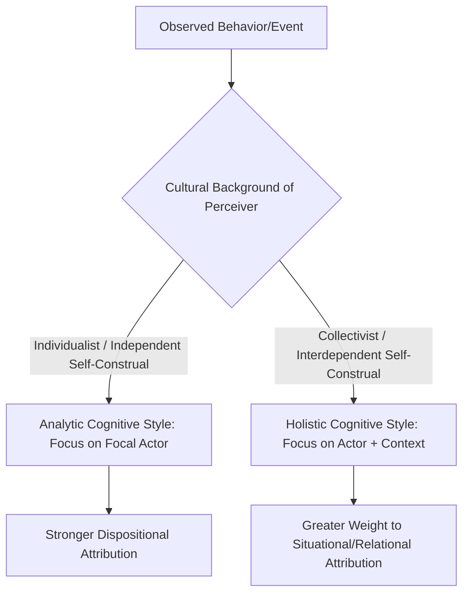

## Cultural Variation in Attribution Style

### Overview

Cultural variation in attribution style refers to systematic differences across cultural groups in how people explain the causes of behavior and events, particularly the relative weight given to dispositional (internal, person-based) versus situational (external, context-based) causes. This research area challenges the assumption—implicit in much early attribution theory—that causal reasoning processes such as the fundamental attribution error operate identically across all human populations, instead demonstrating that cultural beliefs about the self, agency, and causality meaningfully shape attributional cognition.

### The Individualism-Collectivism Framework

**Key Points**

- The dominant theoretical lens for understanding cultural attribution differences draws on Geert Hofstede's and later Harry Triandis's work on **individualism versus collectivism** as a core dimension of cultural variation.
- **Individualist cultures** (commonly associated with North America, Western Europe, Australia) tend to emphasize the self as an independent, bounded entity with stable internal traits that persist and drive behavior across situations.
- **Collectivist cultures** (commonly associated with many East Asian, South Asian, African, and Latin American cultural contexts) tend to emphasize the self as fundamentally interdependent, embedded within relationships, roles, and social contexts, with behavior seen as more fluid and context-dependent.
- [Inference] This framework, while widely used and empirically productive, represents a simplification of much more complex and heterogeneous cultural variation; treating "individualism" and "collectivism" as binary categories rather than continuous, multidimensional constructs has been a recurring methodological critique.

### Markus and Kitayama's Independent vs. Interdependent Self-Construal

**Key Points**

- Hazel Markus and Shinobu Kitayama's influential 1991 framework proposed that individualist and collectivist cultures foster different **self-construals**:
  - **Independent self-construal**: The self is experienced as separate from others, defined by internal, stable attributes (traits, abilities, preferences) that are seen as the primary drivers of behavior.
  - **Interdependent self-construal**: The self is experienced as fundamentally connected to others, defined relationally, with behavior understood as flexibly responsive to social roles, relationships, and context.
- This distinction provides the theoretical mechanism explaining why collectivist-culture individuals would be expected to attend more to situational and relational information when explaining behavior, since their very conception of "the self" already incorporates contextual embeddedness.

### Key Empirical Findings

**Joan Miller's Cross-Cultural Study (1984)**

**Example**

In a landmark study, Joan Miller compared American and Hindu Indian participants' explanations for both prosocial (helping) and deviant (harmful) behaviors, using both hypothetical vignettes and real-life events recalled by participants. American participants (from a more individualist cultural context) generated significantly more dispositional explanations (e.g., "he helped because he is a kind person") across age groups by adulthood, while Indian participants (from a more collectivist/contextualist cultural context) generated significantly more situational and contextual explanations (e.g., "he helped because of the social obligations of his role" or specific circumstantial factors). Notably, this cultural difference was not present in the youngest children studied and emerged progressively with age, suggesting the divergence reflects **cultural learning and socialization** rather than an innate or early-developing cognitive difference.

**Choi, Nisbett, and Norenzayan's Work on Situational Reasoning**

Incheol Choi, Richard Nisbett, and Ara Norenzayan's research found that East Asian participants were not simply "worse" at dispositional reasoning but showed a general pattern of attending to a wider range of contextual and situational information across judgment tasks, consistent with broader findings on East Asian **holistic cognitive style** (attending to relationships and context) versus Western **analytic cognitive style** (attending to focal objects/persons in isolation from context), a distinction extensively documented in Nisbett's broader program of cross-cultural cognition research.

**Morris and Peng's Newspaper Analysis Study**

Michael Morris and Kaiping Peng's (1994) creative study analyzed newspaper coverage of mass murders in both English-language American newspapers and Chinese-language newspapers, finding that American journalists were more likely to attribute the perpetrator's actions to personal disposition (mental instability, bad character), while Chinese journalists were more likely to attribute the same events to situational and contextual factors (social pressures, relationship problems, societal conditions)—demonstrating that this cultural attributional pattern extends beyond laboratory settings into real-world professional discourse and media framing.

### Diagram: Cultural Divergence in Attributional Weighting

### The Fundamental Attribution Error Is Not Eliminated, But Attenuated

**Key Points**

- It is important to note that cross-cultural research does not suggest collectivist-culture individuals are entirely immune to dispositional bias or that the fundamental attribution error is absent outside individualist cultures—rather, the consistent finding is that the *magnitude* of the dispositional bias is generally attenuated (reduced), not eliminated, in more collectivist/contextualist cultural samples.
- Some studies have found that under conditions of high cognitive load or time pressure (which reduce the resources available for effortful situational correction, per Gilbert's two-step model), cultural differences in attribution can shrink, since dispositional inference may function as a faster, more automatic default across cultures, with cultural background primarily influencing the likelihood and thoroughness of subsequent situational correction rather than eliminating the initial automatic dispositional read altogether. [Inference] This suggests culture may moderate the *correction* stage of attribution more than the *initial automatic categorization* stage, though this remains an area of active theoretical refinement rather than settled consensus.

### Attributional Style and Well-Being Across Cultures

**Key Points**

- Cultural attribution research also intersects with clinical and health psychology through work on **attributional style and psychological well-being**, where research on optimistic versus pessimistic explanatory styles (originating from Seligman's learned helplessness/attributional reformulation) has been extended cross-culturally.
- Findings in this area are more mixed and complex than the basic dispositional/situational divide, with some studies suggesting that the relationship between attributional style and depression/well-being outcomes may operate differently depending on cultural norms regarding self-enhancement versus self-criticism, modesty, and face-saving. [Unverified] This subfield has fewer large-scale, well-replicated cross-cultural findings compared to the basic dispositional-situational attribution research described above, and conclusions here should be treated as more tentative.

### Methodological Considerations and Critiques

**Key Points**

- **Within-culture heterogeneity**: Broad cultural categories (e.g., "East Asian," "Western") mask substantial within-region and within-country variation in individualism/collectivism, socioeconomic status, urbanicity, and generational cohort, and treating large, diverse populations as monolithic cultural units is a recognized methodological simplification.
- **Acculturation and bicultural individuals**: Research on bicultural individuals (e.g., immigrants, individuals raised across multiple cultural frameworks) has shown that attributional style can shift depending on which cultural frame is situationally activated or primed, supporting a **dynamic constructivist** view of culture's influence on cognition (culture provides a toolkit of accessible frames rather than a fixed, monolithic cognitive style).
- **Measurement equivalence**: Comparing open-ended attribution explanations across languages and cultures raises translation and coding challenges, and some critics have questioned whether coding schemes developed in Western psychological research fully capture the categories of explanation meaningful within other cultural and linguistic frameworks.
- **Globalization effects**: [Unverified] Some researchers have speculated that increasing global cultural exchange and media exposure may be gradually narrowing some cross-cultural attributional differences, though this remains a speculative and difficult-to-test claim given the challenges of longitudinal cross-cultural comparison.

### Relevance to Person Perception and Attribution

Cultural variation in attribution style holds significant importance within the broader person perception and attribution chapter because it:

- Directly qualifies and contextualizes the "fundamental" attribution error, demonstrating that this seemingly universal cognitive bias is substantially shaped by culturally transmitted beliefs about selfhood and causality, rather than being a fixed, hardwired feature of human cognition.
- Connects individual-level attribution processes to broader frameworks in cultural and cross-cultural psychology, including self-construal theory and analytic versus holistic cognitive style research.
- Has significant applied implications for cross-cultural communication, international business, diplomacy, multicultural clinical practice, and global media literacy, since misunderstanding culturally-shaped attributional differences can itself become a source of intercultural misattribution and conflict.
- Illustrates a broader meta-lesson for social psychology: that classic findings established primarily using Western (and often specifically American undergraduate) samples require cross-cultural replication before being generalized as universal features of human social cognition—a concern later formalized in critiques of psychology's reliance on **WEIRD** (Western, Educated, Industrialized, Rich, Democratic) samples.

### Conclusion

Cultural variation in attribution style demonstrates that the tendency to favor dispositional over situational explanations for behavior—long treated as a "fundamental" feature of human social cognition—is significantly shaped by cultural context, particularly the individualism-collectivism dimension and its associated independent versus interdependent self-construals. Empirical work by Miller, Choi and Nisbett, and Morris and Peng consistently shows that individuals from more collectivist, contextualist cultural backgrounds attend more to situational and relational factors in causal explanation, attenuating (though not eliminating) the dispositional bias observed more strongly in individualist cultural contexts, underscoring the necessity of cross-cultural validation for attribution theories originally developed within Western psychological traditions.

**Related Topics**

- Fundamental attribution error and correspondence bias
- Markus and Kitayama's independent vs. interdependent self-construal
- Analytic vs. holistic cognitive style (Nisbett's cross-cultural cognition research)
- WEIRD samples and generalizability concerns in psychology
- Self-serving bias and cross-cultural self-enhancement motives
- Acculturation and cultural frame-switching
- Individualism-collectivism as a cultural dimension
- Cross-cultural clinical psychology and attributional style