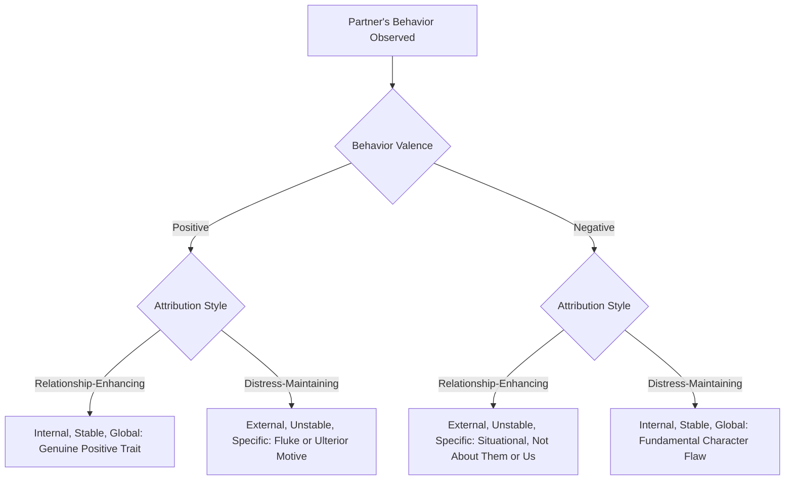

## Attribution Processes in Close Relationships

### Overview

Attribution processes in close relationships examine how romantic partners, family members, and other intimates explain the causes of each other's behavior, and how these explanatory patterns systematically influence relationship satisfaction, conflict, and stability. This applied extension of general attribution theory demonstrates that the causal inferences people draw about their partners are not neutral cognitive exercises but are deeply intertwined with relationship quality, functioning both as a consequence of relational satisfaction and as a causal driver of future relational outcomes.

### The Core Distinction: Relationship-Enhancing vs. Distress-Maintaining Attributions

**Key Points**

- The foundational framework in this area, developed extensively by Frank Fincham, Thomas Bradbury, and colleagues, distinguishes between two contrasting attributional styles applied to a partner's behavior:
  - **Relationship-enhancing attribution style**: Partner's positive behaviors are attributed to internal, stable, global causes ("they surprised me with dinner because they're a genuinely thoughtful and loving person"), while partner's negative behaviors are attributed to external, unstable, specific causes ("they snapped at me because they had an awful day at work, not because of anything about them or us").
  - **Distress-maintaining attribution style**: The reverse pattern—partner's negative behaviors are attributed to internal, stable, global causes ("they snapped at me because they're inconsiderate and selfish"), while partner's positive behaviors are attributed to external, unstable, or even ulterior causes ("they only did something nice because they want something from me" or "that was a one-time fluke").
- This framework directly parallels the internal/external, stable/unstable, and global/specific causal dimensions from Weiner's broader attributional model, applied specifically to the interpersonal, relational domain.

### Diagram: Relationship-Enhancing vs. Distress-Maintaining Attribution Patterns

### Bidirectional Causality: Attribution as Both Cause and Consequence

**Key Points**

- A defining feature of this research area is the recognition that the relationship between attributional style and relationship satisfaction is **bidirectional** rather than simply one-directional.
- Longitudinal research, notably by Bradbury and Fincham, has demonstrated that distress-maintaining attributions not only reflect existing relationship dissatisfaction but also **predict future declines** in relationship satisfaction and increased risk of conflict escalation and dissolution, establishing attributional style as a genuine causal risk factor rather than merely a symptom of an already-troubled relationship.
- This bidirectionality has made attributional style a key target of clinically-oriented relationship interventions (see below), since it represents a potentially modifiable cognitive pattern rather than a fixed trait of the relationship.

### Attribution and Conflict Escalation

**Example**

Consider a couple in which one partner arrives home late without calling. In a relationship-enhancing attributional context, the other partner might think, "Traffic must have been bad, or something came up at work"—leading to a calm, low-conflict response (perhaps simple concern or a request for a heads-up next time). In a distress-maintaining attributional context, the partner might think, "They don't respect my time; they never think about how their actions affect me"—a global, stable, internal attribution that is far more likely to trigger anger, blame-focused communication, and conflict escalation, since the behavior is interpreted as revealing a fundamental, unchanging characterological flaw rather than a one-off situational event.

### Responsibility Attributions and Perceived Intent

**Key Points**

- Beyond the basic causal locus (internal/external), relationship researchers have extended attribution analysis to include judgments of **responsibility** and **intent**, drawing on elements similar to Heider's responsibility attribution framework.
- Distressed couples tend to attribute more negative intent, more selfish motivation, and greater blameworthiness to a partner's negative behaviors than satisfied couples do, even when observing objectively identical or ambiguous behaviors—demonstrating that attributional bias in close relationships extends beyond simple cause location to encompass richer inferences about the partner's motives and character.
- This tendency toward inferring negative intent has been linked to broader hostile attribution bias research (more commonly studied in aggression contexts), suggesting overlapping cognitive mechanisms between relationship distress and general interpersonal hostility processing.

### Attachment Style as a Moderator

**Key Points**

- Adult attachment theory (Hazan and Shaver, building on Bowlby's original attachment framework) provides an important individual-differences moderator of relational attribution patterns.
- Individuals with **secure attachment** styles tend to show more relationship-enhancing attributional patterns, giving partners the benefit of the doubt and maintaining more benign interpretations of ambiguous or negative partner behavior.
- Individuals with **anxious** or **avoidant attachment** styles have been associated with attributional patterns closer to the distress-maintaining style, including heightened sensitivity to perceived rejection or negative intent and reduced willingness to attribute a partner's negative behavior to benign situational causes. [Inference] This overlap suggests attachment-related working models of relationships may function partly through their influence on habitual attributional tendencies, though attachment and attribution are studied as related but conceptually distinct constructs within the literature.

### Attribution and Relationship Interventions

**Key Points**

- Because distress-maintaining attributions are both a symptom and a driver of relationship dysfunction, several evidence-informed couples interventions explicitly target attributional processes as a mechanism of change.
- **Cognitive-behavioral couples therapy (CBCT)** approaches often include components explicitly designed to help partners identify and challenge distress-maintaining attributions, encouraging more balanced or relationship-enhancing causal explanations for each other's behavior.
- Techniques may include perspective-taking exercises, explicitly generating alternative (situational) explanations for a partner's negative behavior, and communication training aimed at reducing blame-focused, globalized language during conflict discussions.
- [Unverified] While attributional retraining components show promise within broader couples therapy outcome research, isolating the specific causal contribution of attribution-focused techniques (as opposed to the broader therapeutic package) is methodologically challenging, and effect sizes specific to attribution-focused components alone are not always separately reported in outcome studies.

### Gender and Cultural Considerations

**Key Points**

- Some research has examined whether relational attribution patterns differ systematically by gender, though findings in this area are mixed and appear to depend heavily on specific relationship context, culture, and the particular behavior being explained, making broad generalizations about gender differences in relational attribution premature. [Unverified]
- Cross-cultural extensions of this research (paralleling the broader cultural variation in attribution literature) suggest that collectivist cultural norms emphasizing relational harmony and role obligations may shape which behaviors are seen as attributable to the individual partner versus to broader family or social role expectations, though this specific intersection (culture × relational attribution) is a less extensively developed subfield compared to general cross-cultural attribution research.

### Relevance to Person Perception and Attribution

Attribution processes in close relationships serve as a crucial applied case study within the broader person perception and attribution chapter because they:

- Demonstrate the real-world, high-stakes consequences of the abstract attributional dimensions (locus, stability, globality) established by Heider, Kelley, and Weiner, showing how these cognitive processes directly shape emotional experience and relational behavior in daily life.
- Illustrate the bidirectional, self-reinforcing nature of attribution processes—showing that attributions are not merely a downstream product of relationship quality but function as an active causal mechanism shaping future relational trajectories.
- Provide a natural bridge between attribution theory and clinical/counseling psychology, showing how foundational social-cognitive research translates directly into therapeutic intervention strategies.
- Connect attribution theory to attachment theory, another major relationship framework in social and developmental psychology, illustrating how individual difference variables moderate the operation of general attributional principles.

### Conclusion

Attribution processes in close relationships reveal how the causal explanations partners generate for each other's behavior—whether relationship-enhancing (crediting positive behavior to disposition, excusing negative behavior situationally) or distress-maintaining (the reverse pattern)—function as both indicators and active drivers of relationship satisfaction, conflict escalation, and long-term relational stability. Shaped by factors including attachment style and targeted by cognitive-behavioral couples interventions, this research area exemplifies how foundational attribution theory constructs extend meaningfully into applied, clinically significant domains of everyday interpersonal life.

**Related Topics**

- Weiner's attributional model of causal dimensions (locus, stability, controllability)
- Adult attachment theory and working models of relationships
- Self-serving bias and defensive attribution
- Hostile attribution bias in aggression research
- Cognitive-behavioral couples therapy
- Actor-observer asymmetry in interpersonal contexts
- Cultural variation in attribution style
- Heider's analysis of responsibility and intent