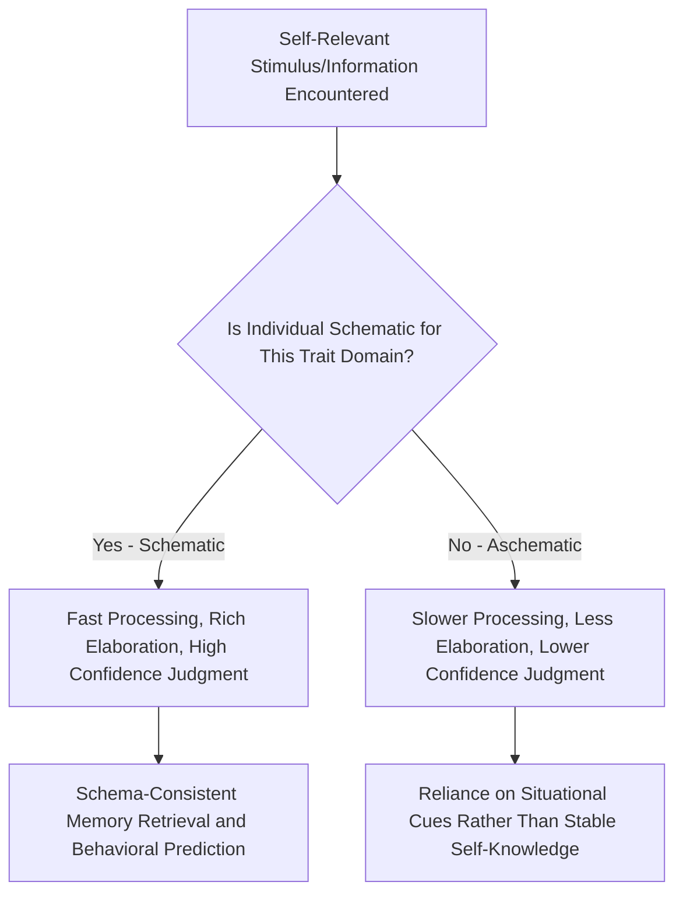

## Self-Concept and Self-Schemas

### Overview

Self-concept refers to the total sum of beliefs, knowledge, and mental representations an individual holds about themselves, encompassing traits, roles, values, physical characteristics, abilities, and social identities. Self-schemas are the specific cognitive structures—organized knowledge representations derived from past experience—that make up and organize this broader self-concept, functioning as the fundamental building blocks through which people process self-relevant information. Together, these constructs form the foundation for understanding how the self operates as a cognitive and social structure, a central concern of the social self chapter.

### Defining Self-Concept

**Key Points**

- Self-concept is typically understood as a multidimensional, hierarchically organized cognitive structure encompassing multiple domains: physical self (appearance, physical abilities), social self (roles, relationships, group memberships), and psychological self (traits, values, emotional characteristics).
- Unlike self-esteem (the evaluative, affective component of how one feels about oneself), self-concept is primarily the *descriptive/cognitive* component—the content of "who I am" as opposed to "how good I feel about who I am," although the two are closely related and often studied together.
- Self-concept is not a single unified representation but is understood in contemporary social cognition research as a dynamic, multifaceted system, with different aspects of the self-concept becoming more or less salient and accessible depending on situational context, a principle central to the **working self-concept** (see below).

### Hazel Markus's Self-Schema Theory

**Key Points**

- Hazel Markus's foundational 1977 work introduced the concept of **self-schemas** as cognitive generalizations about the self, derived from past experience, that organize and guide the processing of self-related information contained in an individual's social experiences.
- A person is considered "schematic" for a given trait domain if they have a clear, well-elaborated, confidently held self-concept in that domain (e.g., someone who strongly identifies as independent and has many specific behavioral examples supporting this self-view is schematic for independence).
- A person is considered "aschematic" for a domain if the trait is not particularly self-relevant, salient, or important to their self-concept, or if they hold no strong, confident view of themselves on that dimension.
- Markus's original experimental work demonstrated that schematic individuals process schema-relevant information (judgments, memories, behavioral predictions) faster, retrieve more supporting behavioral evidence, and resist counter-schematic information more strongly than aschematic individuals, establishing self-schemas as genuine information-processing structures with measurable cognitive consequences, not merely descriptive self-reports.

### Diagram: Self-Schema Structure and Information Processing

### The Self-Concept as a Cognitive Structure: Key Properties

**Multidimensionality**

Self-concept is organized across numerous distinct content domains (academic self-concept, athletic self-concept, social self-concept, moral self-concept, etc.), and research (e.g., by Herbert Marsh) has demonstrated that these domain-specific self-concepts are empirically separable rather than reducible to a single global self-concept score.

**Hierarchical Structure**

Many models (e.g., Shavelson, Hubner, and Stanton's hierarchical self-concept model) propose that general/global self-concept sits atop more specific domain self-concepts (academic, social, physical), which in turn are composed of even more specific sub-facets (e.g., academic self-concept subdividing into math self-concept and verbal self-concept).

**The Working Self-Concept**

Markus and Kunda's concept of the **working self-concept** describes the subset of self-knowledge that is currently active and accessible in working memory at any given moment, which varies depending on social context, recent experiences, and situational primes—meaning the "self" a person consciously experiences and draws upon at any moment is a dynamically shifting, context-sensitive subset of their broader, more stable total self-concept repertoire.

### Self-Discrepancy Theory

**Key Points**

- E. Tory Higgins's **self-discrepancy theory** proposes that self-concept includes multiple distinct self-guides beyond the simple "actual self": the **actual self** (attributes one believes one currently possesses), the **ideal self** (attributes one would ideally like to possess), and the **ought self** (attributes one believes one should possess, based on duty or obligation).
- Discrepancies between the actual self and these self-guides are theorized to produce distinct emotional consequences: **actual-ideal discrepancies** are associated with dejection-related emotions (disappointment, sadness), while **actual-ought discrepancies** are associated with agitation-related emotions (guilt, anxiety, fear).
- This theory demonstrates that self-concept is not merely descriptive but is intrinsically tied to motivational and emotional self-regulation processes.

### Self-Complexity

**Key Points**

- Patricia Linville's **self-complexity theory** proposes that individuals differ in the number of distinct self-aspects (roles, relationships, identities) they maintain and in the degree of overlap between these self-aspects.
- Higher self-complexity (more numerous, more distinct self-aspects) is theorized to provide a psychological buffering effect against stress: negative events affecting one self-aspect (e.g., a career setback) have less spillover impact on overall self-evaluation and mood when the individual has many other well-differentiated self-aspects (e.g., strong identities as a parent, athlete, friend) to draw upon, compared to individuals with low self-complexity whose self-concept is more narrowly concentrated in fewer domains.
- [Unverified] While theoretically influential, the empirical support for the stress-buffering hypothesis of self-complexity has been mixed across subsequent replication attempts, with some studies finding the predicted buffering effect and others failing to find consistent support, making this a moderately, rather than strongly, empirically supported extension of self-schema theory.

### Possible Selves

**Key Points**

- Markus and Nurius (1986) extended self-schema theory with the concept of **possible selves**—cognitive representations of what a person could become, would like to become (hoped-for selves), or is afraid of becoming (feared selves).
- Possible selves are theorized to provide motivational direction and a cognitive framework for future-oriented self-regulation, linking self-concept research directly to goal-setting and motivation literature.
- This concept has been applied practically in areas such as educational interventions (helping students construct plausible, connected possible selves related to academic success) and identity development research.

### Cultural Variation in Self-Concept

**Key Points**

- As discussed in Markus and Kitayama's independent/interdependent self-construal framework, self-concept content and structure show systematic cultural variation: individuals from individualist cultural backgrounds tend to describe themselves using more trait-based, context-independent statements ("I am outgoing"), while individuals from collectivist cultural backgrounds tend to describe themselves with more relational, role-based, and context-dependent statements ("I am a good son" or "I am quiet at work but talkative with close friends").
- This cultural variation directly parallels the cultural attribution research discussed in the person perception literature, reinforcing that self-concept structure itself is shaped by broader cultural models of selfhood rather than being a culturally universal cognitive architecture.

### Self-Concept Clarity

**Key Points**

- Jennifer Campbell's construct of **self-concept clarity** refers to the extent to which self-beliefs are clearly and confidently defined, internally consistent, and temporally stable, as distinct from the specific content of the self-concept.
- Low self-concept clarity has been associated with lower self-esteem, higher neuroticism, and greater vulnerability to social comparison influence, since individuals with unclear self-concepts have less stable internal reference points and may rely more heavily on external, situational cues (including others' opinions) to define themselves.

### Relevance to the Social Self

Self-concept and self-schemas form a foundational pillar of the social self chapter because they:

- Establish the basic cognitive architecture (schemas, hierarchical organization, working self-concept) through which all subsequent self-related processes—self-esteem, self-presentation, social comparison, identity—operate and are organized.
- Directly connect to social cognition more broadly, since self-schemas function according to the same basic principles (organizing information, guiding attention, enabling efficient processing, resisting inconsistent information) as other schemas studied in social cognition research (e.g., stereotypes, scripts).
- Provide the conceptual basis for understanding self-regulation and motivation via self-discrepancy theory and possible selves, linking cognitive self-structure to emotional and motivational outcomes.
- Establish the cultural relativity of self-structure itself, directly connecting the social self chapter to broader cross-cultural psychology themes that also appear in attribution research.

### Conclusion

Self-concept and self-schema research establishes that the self is best understood not as a single, unified, static entity but as a multidimensional, hierarchically organized, and dynamically activated cognitive structure built from schema-like representations derived from past experience. Extensions of this foundational framework—including self-discrepancy theory, self-complexity, possible selves, and self-concept clarity—demonstrate the deep interconnection between how the self is cognitively structured and how people experience motivation, emotion, and psychological resilience, while cross-cultural research underscores that even the basic architecture of self-concept is shaped by broader cultural models of personhood.

**Related Topics**

- Markus and Kitayama's independent vs. interdependent self-construal
- Self-discrepancy theory (actual, ideal, ought selves)
- Possible selves and future-oriented self-regulation
- Self-complexity theory and stress buffering
- Self-esteem and self-evaluation processes
- Social comparison theory
- Self-concept clarity and psychological adjustment
- Working self-concept and situational self-activation