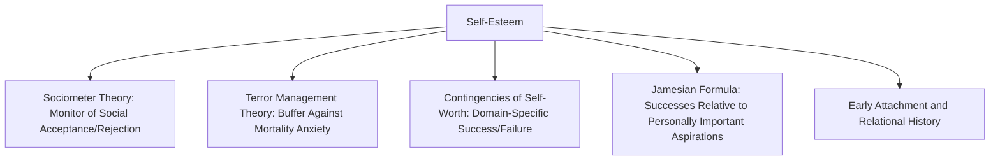

## Sources and Structure of Self-Esteem

### Overview

Self-esteem refers to an individual's overall subjective evaluation of their own worth—the affective, evaluative counterpart to the more descriptive, cognitive self-concept. Research on the sources and structure of self-esteem examines both where self-esteem comes from (its developmental, social, and psychological origins) and how it is internally organized (whether it functions as a single global trait, a hierarchical structure of domain-specific evaluations, or a more dynamic, context-sensitive state).

### Defining Self-Esteem: Trait vs. State

**Key Points**

- **Trait (global) self-esteem** refers to a relatively stable, enduring evaluation of one's overall worth that persists across time and situations, most commonly measured using instruments such as the **Rosenberg Self-Esteem Scale** (1965), a widely used 10-item measure assessing global positive/negative self-regard.
- **State self-esteem** refers to more transient, momentary fluctuations in self-evaluation that shift in response to specific situational events, feedback, or social experiences (e.g., a temporary dip in self-esteem following a public failure).
- Both levels are studied extensively, with contemporary research recognizing that a person's momentary state self-esteem fluctuates around a relatively stable trait baseline, and that individual differences exist in the *magnitude* of these state fluctuations (see self-esteem stability below).

### The Hierarchical Structure of Self-Esteem

**Key Points**

- Paralleling the hierarchical self-concept models discussed in self-concept research, self-esteem is understood by many researchers (e.g., Susan Harter, Herbert Marsh) to have a similarly hierarchical structure, with **global self-esteem** sitting atop more specific **domain-specific self-evaluations** (e.g., academic self-esteem, physical appearance self-esteem, social self-esteem, athletic self-esteem).
- Susan Harter's research, particularly her work on children and adolescents using the Self-Perception Profile, demonstrated that domain-specific self-evaluations do not contribute equally to global self-worth; rather, domains that are **subjectively important** to the individual contribute disproportionately to global self-esteem, a principle formalized in William James's classic (1890) formula:

$$\text{Self-esteem} = \frac{\text{Successes}}{\text{Pretensions (Aspirations)}}$$

- This Jamesian formula captures the idea that self-esteem depends not simply on objective successes but on the ratio between actual achievement and the domains/standards a person considers personally important; succeeding in a domain one doesn't care about contributes little to self-esteem, while failing in a domain central to one's identity can be highly damaging.

### Major Theoretical Sources of Self-Esteem

**Sociometer Theory**

**Key Points**

- Mark Leary's **sociometer theory** proposes that self-esteem functions as an internal psychological gauge (a "sociometer") that monitors the degree to which an individual is being socially accepted versus rejected by others, given the evolutionary importance of group belonging for survival and reproduction.
- Under this view, self-esteem is not fundamentally about self-evaluation for its own sake, but is a proxy mechanism whose primary function is to alert the individual to relational devaluation, motivating behavior change to repair or maintain social bonds; fluctuations in self-esteem are thus theorized to closely track perceived social inclusion/exclusion.
- Empirical support includes findings that manipulated social rejection or exclusion reliably produces drops in state self-esteem, consistent with the sociometer's proposed monitoring function.

**Terror Management Theory**

**Key Points**

- **Terror management theory** (Greenberg, Pyszczynski, and Solomon, building on Ernest Becker's work) proposes that self-esteem functions as a psychological buffer against the existential anxiety produced by awareness of one's own mortality.
- Under this framework, self-esteem derives from living up to internalized cultural worldviews and standards of value, and maintaining self-esteem provides a sense of symbolic (or literal, in some religious frameworks) immortality that buffers death-related anxiety.
- Supporting research has shown that experimentally boosting self-esteem reduces defensive reactions to mortality salience manipulations (reminders of death), while threats to self-esteem increase such defensive responses, supporting the anxiety-buffering function.

**Contingencies of Self-Worth**

**Key Points**

- Jennifer Crocker and colleagues' **contingencies of self-worth theory** proposes that individuals differ in which specific domains (e.g., academic competence, appearance, approval from others, virtue, God's love, family support) their self-esteem is contingent upon—meaning self-esteem rises and falls specifically based on success or failure within a person's particular self-relevant contingency domains.
- This framework helps explain why objectively similar events (e.g., receiving critical feedback) can have dramatically different self-esteem consequences for different individuals, depending on whether the feedback pertains to a domain on which that person's self-worth is contingent.

**Attachment and Early Relational Sources**

Developmental research grounded in attachment theory suggests that early caregiver relationships and responsiveness contribute significantly to the foundational sense of self-worth, with secure early attachment relationships generally associated with more stable, higher baseline self-esteem later in development, though [Inference] this developmental pathway operates alongside, rather than in isolation from, later social and achievement-related experiences that continue to shape self-esteem throughout the lifespan.

### Diagram: Major Theoretical Sources of Self-Esteem

### Self-Esteem Stability

**Key Points**

- Beyond the level of self-esteem (how high or low it is), researchers such as Michael Kernis have emphasized the importance of **self-esteem stability**—the degree to which a person's state self-esteem fluctuates in response to daily events, as distinct from their baseline trait level.
- Kernis's research found that individuals with **unstable high self-esteem** (high average self-esteem that fluctuates substantially with daily events) show patterns of hostility, defensiveness, and fragile self-regard that in some ways resemble those with low self-esteem, distinguishing them from individuals with **stable high self-esteem**, who show more secure, resilient, and less defensive self-regard.
- This distinction has been particularly influential in reframing self-esteem research beyond a simple "high is good, low is bad" model, emphasizing that the *stability* and *contingent basis* of self-esteem may matter as much as, or more than, its average level for predicting psychological and interpersonal outcomes.

### Narcissism and Fragile High Self-Esteem

**Key Points**

- Related research has distinguished **secure high self-esteem** from **narcissistic/fragile high self-esteem**, the latter characterized by grandiosity, high sensitivity to ego threats, and defensive, sometimes aggressive responses to criticism.
- This distinction is relevant to understanding why some interventions naively aimed at simply "boosting self-esteem" (a popular movement particularly in educational contexts during the late 20th century) produced disappointing or even counterproductive results, since indiscriminately elevating self-evaluation without addressing its underlying stability, contingency, or authenticity can inadvertently foster fragile, narcissistic-leaning self-regard rather than genuinely resilient self-worth.

### Cultural Variation in Self-Esteem

**Key Points**

- Paralleling broader cultural self-concept research, cross-cultural studies (e.g., by Heine and colleagues) have found that average self-esteem scores and the felt importance of maintaining high positive self-regard vary across cultures, with some research suggesting East Asian cultural contexts show less emphasis on self-enhancement and comparatively lower average self-esteem scores on Western-developed self-esteem measures than North American samples.
- [Unverified] This finding has been debated methodologically, with some researchers questioning whether cross-culturally standard self-esteem measures adequately capture equivalent underlying constructs across cultural contexts with differing norms about self-presentation, modesty, and self-enhancement, making direct cross-cultural score comparisons potentially confounded by measurement and response-style differences rather than reflecting purely "true" underlying differences in self-worth.

### Relevance to the Social Self

Sources and structure of self-esteem hold central importance within the social self chapter because they:

- Provide the evaluative counterpart to the descriptive self-concept material, together forming the two core cognitive-affective pillars of self-knowledge covered in this chapter.
- Demonstrate the deeply *social* nature of self-esteem itself, since major theoretical accounts (sociometer theory, terror management theory, contingencies of self-worth) all ground self-esteem's function and fluctuation in social, interpersonal, and cultural processes rather than treating it as a purely internal, isolated psychological trait.
- Connect directly to social comparison processes, self-presentation strategies, and self-serving attributional biases, since maintaining and protecting self-esteem is a recurring motivational thread linking these related topics throughout the social self and person perception literatures.
- Provide an important applied and public-policy-relevant case study (the self-esteem movement in education) illustrating the risks of translating psychological research into intervention without adequately attending to theoretical nuance (level vs. stability vs. contingency of self-esteem).

### Conclusion

Self-esteem, as the evaluative counterpart to self-concept, is best understood as a hierarchically structured construct combining global and domain-specific self-evaluations, with domain importance (per James's classic formula) determining each domain's contribution to overall self-worth. Major theoretical accounts—sociometer theory, terror management theory, and contingencies of self-worth—converge on the insight that self-esteem is fundamentally social and functional in nature, serving to monitor social belonging, buffer existential anxiety, and track success within personally significant domains, while research on self-esteem stability and narcissistic fragility has substantially refined the field's understanding beyond a simplistic "higher is always better" view of self-worth.

**Related Topics**

- Sociometer theory and social monitoring functions of self-esteem
- Terror management theory and mortality salience
- Contingencies of self-worth (Crocker)
- Self-esteem stability and fragile vs. secure high self-esteem
- Narcissism and defensive self-regard
- Self-concept and self-schemas
- Social comparison theory
- Cross-cultural variation in self-enhancement motives