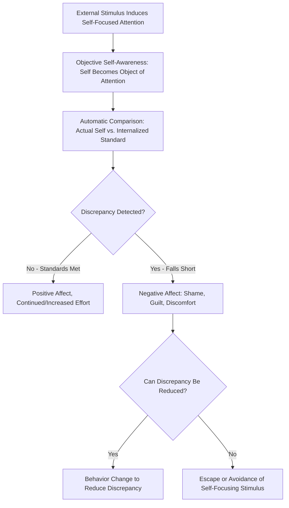

## Self-Awareness Theory

### Overview

Self-awareness theory, originally developed by Robert Wicklund and Shelley Duval in their 1972 book *A Theory of Objective Self-Awareness*, proposes that attention can be directed either outward toward the environment or inward toward the self, and that this shift into a state of self-focused attention has systematic and predictable psychological consequences, particularly triggering self-evaluation against internalized standards. This theory provides a foundational framework for understanding how momentary attentional states shape self-regulation, behavior, and emotional experience.

### Objective vs. Subjective Self-Awareness

**Key Points**

- Wicklund and Duval's original formulation distinguished between two attentional states:
  - **Subjective self-awareness**: The default state in which attention is directed outward toward the environment; the self functions as the subject perceiving the world, but is not itself an object of attention.
  - **Objective self-awareness**: A state in which attention is directed inward, making the self an object of one's own conscious awareness and evaluation—akin to seeing oneself as if from an external, evaluative vantage point.
- The central proposition of the theory is that when people enter a state of objective self-awareness, they automatically and almost inevitably compare their current self (behavior, appearance, traits) against relevant internalized standards, ideals, and values.

### The Self-Focus → Comparison → Discrepancy Process

**Key Points**

- The theory's core causal sequence proceeds as follows: (1) an external stimulus induces self-focused attention, (2) self-focused attention triggers automatic comparison between the current self and salient standards, (3) if a discrepancy is detected between actual self and standard, negative affect results, and (4) this negative affect motivates either behavior change (to reduce the discrepancy) or escape/avoidance of the self-focusing stimulus (if reducing the discrepancy is not feasible).
- This means self-focused attention is not inherently pleasant or unpleasant in itself; its emotional and behavioral consequences depend entirely on whether the resulting self-standard comparison reveals a match or a discrepancy.
- When self-focus reveals that the person is meeting or exceeding their standards, positive affect and increased motivation can result; when self-focus reveals falling short of standards, negative affect (embarrassment, shame, guilt, depression-linked rumination) and either corrective effort or avoidance can result.

### Diagram: The Self-Awareness Process Sequence

### Classic Experimental Manipulations

**Example**

The classic experimental method for inducing objective self-awareness involves exposing participants to their own reflection in a mirror, or recording them on video/audio while they perform a task, both of which reliably induce self-focused attention by making the self a perceptible object. In an early and frequently cited demonstration, Diener and Wallbom (1976) found that participants seated in front of a mirror were significantly less likely to cheat on a test (continuing to work past an announced time limit) than participants without a mirror present, illustrating that self-focused attention increases behavioral conformity to internalized standards (in this case, honesty norms) by making a potential violation more psychologically salient and self-relevant.

**Example**

Beaman and colleagues (1979) extended this logic into a field experiment on Halloween, finding that children trick-or-treating alone were significantly less likely to take more candy than the permitted amount when a mirror was positioned near the candy bowl compared to when no mirror was present, demonstrating the effect's generalizability beyond laboratory settings and across age groups.

### Self-Awareness and Deindividuation: A Contrasting Application

**Key Points**

- Self-awareness theory has been influentially applied in the reverse direction to help explain **deindividuation**—the reduced self-awareness, reduced self-regulation, and increased conformity to group norms (including antisocial norms) that can occur in large crowds, under anonymity, or in other conditions that suppress self-focused attention.
- Under this application, conditions that decrease self-awareness (anonymity, darkness, being submerged in a large crowd, alcohol intoxication) are theorized to reduce the self-standard comparison process that normally regulates behavior, potentially freeing individuals to act in ways inconsistent with their normal internalized standards, since the self-monitoring mechanism that would ordinarily detect and inhibit such discrepancies is attentionally suppressed.
- This connects self-awareness theory directly to classic deindividuation research (e.g., Zimbardo's early theorizing, and later refined by Diener) and provides a cognitive mechanism underlying crowd behavior phenomena studied elsewhere in social psychology.

### Extension: Duval and Wicklund's Later Refinements and Carver and Scheier's Control Theory

**Key Points**

- Charles Carver and Michael Scheier substantially extended self-awareness theory into a more comprehensive **cybernetic control theory of self-regulation**, explicitly modeling the self-focus/comparison/discrepancy-reduction process as analogous to a thermostat-like feedback loop (a "test-operate-test-exit," or TOTE, unit) that continuously monitors behavior against a reference standard and adjusts behavior to minimize any detected discrepancy.
- This control-theory extension formalized self-awareness theory's basic mechanism into a more general and influential model of goal-directed self-regulation, extending well beyond momentary self-awareness manipulations into broader theories of motivation, personality, and behavioral self-control that remain influential in contemporary social and personality psychology.

### Self-Awareness and Negative Affect: Depression and Rumination

**Key Points**

- Extending the basic theory, some researchers (notably drawing connections to Charles Carver's later work and to depression research more broadly) have proposed that chronic, dispositional self-focused attention—particularly when combined with high internalized standards and reduced belief in one's capacity to close the gap—can contribute to a self-perpetuating cycle of negative affect, rumination, and withdrawal, relevant to understanding depressive symptomatology.
- [Inference] This connects self-awareness theory to broader models of rumination and depression (such as Nolen-Hoeksema's response styles theory), though self-awareness theory itself is a more general attentional/motivational framework rather than a clinical theory of depression per se, and the depression-relevant extensions represent an applied elaboration rather than a core original component of Wicklund and Duval's model.

### Public vs. Private Self-Consciousness: The Trait Extension

**Key Points**

- Building on the state-based (situationally induced) self-awareness construct, Arnold Buss and colleagues, along with Allan Fenigstein, Michael Scheier, and Arnold Buss's development of the **Self-Consciousness Scale** (1975), proposed that individuals also differ in chronic, trait-like dispositional tendencies toward self-focused attention:
  - **Private self-consciousness**: A dispositional tendency to attend to one's own internal thoughts, feelings, and private standards.
  - **Public self-consciousness**: A dispositional tendency to attend to oneself as a social object, focusing on how one appears and is evaluated by others.
- This trait extension allows self-awareness theory to be studied not only as a manipulable situational state but also as a stable individual-difference variable, with public self-consciousness in particular showing strong theoretical and empirical links to social anxiety and impression-management concerns.

### Relevance to the Social Self

Self-awareness theory occupies a foundational position within the social self chapter because it:

- Provides the core mechanistic account of *how* the self-concept and self-esteem constructs (covered elsewhere in this chapter) become behaviorally and emotionally consequential in the moment—self-focused attention is the attentional "trigger" that activates the standard-comparison process underlying self-regulation.
- Directly connects individual self-processes to broader social behavior phenomena, particularly deindividuation and crowd behavior, illustrating how the presence or suppression of self-awareness bridges individual cognition and collective social behavior.
- Provided the direct theoretical foundation for Carver and Scheier's highly influential cybernetic control theory of self-regulation, which remains a dominant framework in contemporary motivation and personality research well beyond its origins in self-awareness manipulation studies.
- Establishes the trait/state distinction (via the Self-Consciousness Scale) that parallels similarly important trait/state distinctions found elsewhere in self-esteem and self-concept research within this chapter.

### Conclusion

Self-awareness theory demonstrates that shifting attention inward toward the self—whether through momentary situational triggers like mirrors and cameras, or through chronic dispositional tendencies toward self-focus—reliably activates a comparison process between one's actual self and internalized standards, producing predictable affective and behavioral consequences depending on whether that comparison reveals congruence or discrepancy. Its extensions into deindividuation research, Carver and Scheier's cybernetic self-regulation theory, and the public/private self-consciousness trait framework demonstrate the theory's remarkable generative influence across multiple major subfields of social and personality psychology, cementing self-focused attention as a central mechanistic concept in understanding the social self.

**Related Topics**

- Carver and Scheier's cybernetic control theory of self-regulation
- Deindividuation and crowd behavior
- Public vs. private self-consciousness (Fenigstein, Scheier, and Buss)
- Self-discrepancy theory (Higgins)
- Rumination and depressive self-focus (Nolen-Hoeksema)
- Self-concept and self-schemas
- Impression management and self-presentation
- Objective vs. subjective self-awareness in social cognition