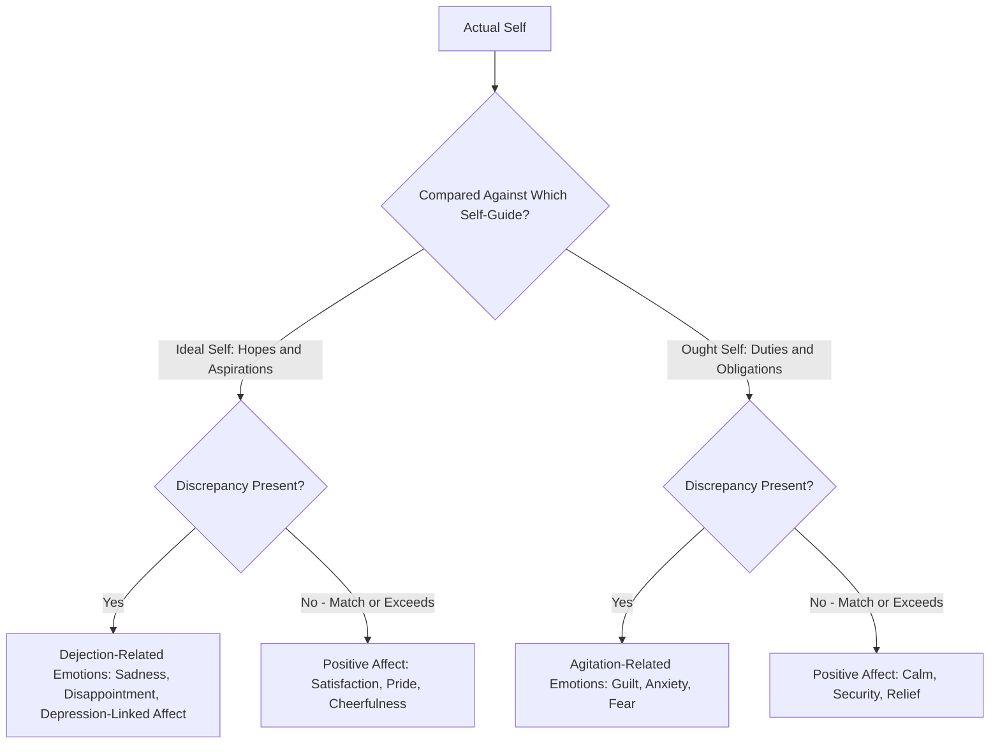

## Self-Discrepancy Theory

### Overview

Self-discrepancy theory, developed by E. Tory Higgins in 1987, proposes that individuals hold multiple distinct mental representations of the self beyond a single "actual self," and that discrepancies between these self-representations produce specific, predictable patterns of emotional discomfort. The theory provides an influential framework connecting self-concept structure directly to emotional experience and motivation, distinguishing it from purely descriptive models of self-knowledge.

### The Three (or More) Domains of the Self

**Key Points**

- Higgins proposed that the self-concept is composed of multiple distinct self-state representations, most centrally:
  - **Actual self**: The attributes an individual believes they actually possess.
  - **Ideal self**: The attributes an individual (or a significant other) would ideally like the individual to possess—representing hopes, wishes, and aspirations.
  - **Ought self**: The attributes an individual (or a significant other) believes the individual should or ought to possess—representing duties, obligations, and responsibilities.
- Higgins further distinguished these self-guides by **standpoint**—whether the self-guide is held from the person's **own** perspective or from the perspective of a **significant other** (e.g., a parent, partner, or authority figure)—yielding a matrix of self-state representations (e.g., own/ideal, other/ideal, own/ought, other/ought) that can each be compared against the actual self.

### The Core Theoretical Mechanism: Discrepancy Produces Specific Emotions

**Key Points**

- The theory's central and most distinctive claim is that different *types* of self-discrepancy are systematically associated with **qualitatively different emotional experiences**, not merely differing in intensity but differing in kind.
- **Actual-ideal discrepancy** (falling short of one's hopes, wishes, and aspirations) is theorized to produce **dejection-related emotions**: disappointment, dissatisfaction, sadness, and in more chronic or severe cases, symptoms resembling depression.
- **Actual-ought discrepancy** (falling short of one's perceived duties and obligations) is theorized to produce **agitation-related emotions**: guilt, fear, anxiety, and a heightened sense of threat, since failing to meet obligations implies the potential for punishment or negative consequences.
- This differentiation was a significant theoretical advance over earlier, less differentiated models of self-evaluation (including basic self-esteem research), because it specifies *which particular negative emotion* should result from *which particular type* of self-standard mismatch, rather than treating all negative self-relevant discrepancies as producing a generic, undifferentiated form of negative affect.

### Diagram: Self-Discrepancy Theory's Emotional Predictions

### Empirical Support: The Discrepancy Priming Paradigm

**Example**

In experimental tests of the theory, Higgins and colleagues used a priming methodology in which participants first completed the **Selves Questionnaire**, listing attributes describing their actual, ideal, and ought selves from both their own and a significant other's standpoint. Participants were then experimentally primed with either their actual-ideal discrepant attributes or their actual-ought discrepant attributes (often through a task requiring them to think about or discuss the relevant self-attributes). Consistent with theoretical predictions, participants primed with actual-ideal discrepancies subsequently reported significantly more dejection-related emotions, while those primed with actual-ought discrepancies reported significantly more agitation-related emotions, providing experimental (rather than purely correlational) support for the theory's differentiated emotional predictions.

### Magnitude and Accessibility of Discrepancies

**Key Points**

- The theory proposes that the *magnitude* of emotional distress is proportional to the *size* of the discrepancy between actual self and the relevant self-guide, and also depends on the **accessibility** (chronic activation and availability) of that particular self-guide in the person's cognitive system.
- Highly accessible, chronically activated self-discrepancies (ones the person frequently thinks about or that are strongly tied to their identity) are theorized to produce more consistent and intense emotional consequences than less accessible, rarely activated discrepancies, even if the objective "size" of the discrepancy is similar.
- This accessibility principle links self-discrepancy theory to broader social-cognitive research on chronic construct accessibility and priming effects.

### Clinical and Applied Extensions

**Key Points**

- Self-discrepancy theory has been extensively applied to understanding **depression** and **anxiety disorders**, with research finding that individuals with elevated depressive symptoms show larger and more chronically accessible actual-ideal discrepancies, while individuals with elevated anxiety symptoms show larger and more chronically accessible actual-ought discrepancies, broadly supporting the theory's differentiated emotional-disorder predictions.
- This differentiation has been influential in clinical psychology for understanding why depression and anxiety, despite frequently co-occurring, may nonetheless be theoretically and experientially distinguishable based on the specific type of self-standard failure a person perceives, offering a cognitive framework potentially useful for tailoring therapeutic interventions (e.g., focusing on unmet aspirations versus unmet obligations).
- [Unverified] While the basic actual-ideal/depression and actual-ought/anxiety associations have received considerable empirical support, the precise clinical utility of self-discrepancy theory as a stand-alone diagnostic or treatment-planning framework (as opposed to a valuable research and conceptual tool) remains an area with more mixed and less definitive translational evidence.

### Regulatory Focus Theory: Higgins's Later Extension

**Key Points**

- Higgins later extended self-discrepancy theory into the broader and highly influential **regulatory focus theory**, proposing that the ideal self and ought self are associated with two distinct, chronic or situationally activated self-regulatory orientations:
  - **Promotion focus**: Associated with the ideal self, oriented toward pursuing gains, advancement, and aspirations, and characterized by eagerness-based strategies and sensitivity to the presence or absence of positive outcomes.
  - **Prevention focus**: Associated with the ought self, oriented toward avoiding losses, meeting obligations, and maintaining safety, and characterized by vigilance-based strategies and sensitivity to the presence or absence of negative outcomes.
- This extension significantly broadened the theoretical reach of the original self-discrepancy framework, moving from a primarily emotion-focused model into a comprehensive framework for understanding motivation, decision-making, and strategic behavior across numerous domains including consumer psychology, organizational behavior, and health behavior.

### Relationship to Self-Awareness Theory

**Key Points**

- Self-discrepancy theory shares conceptual lineage with Wicklund and Duval's self-awareness theory, since both frameworks propose that self-standard comparison processes produce affective consequences based on the presence or absence of a detected discrepancy.
- The key theoretical advance of self-discrepancy theory relative to the more general self-awareness framework is its *differentiation* of standards into multiple distinct types (ideal vs. ought, own vs. other standpoint) that predict *qualitatively different* emotions, whereas the original self-awareness theory treated standard-discrepancy more generically as producing generalized negative affect.

### Relevance to the Social Self

Self-discrepancy theory holds significant importance within the social self chapter because it:

- Provides one of the most theoretically precise and empirically well-supported accounts of how self-concept structure translates directly into specific emotional experience, advancing beyond simpler models that treat self-evaluation as producing only generic positive or negative affect.
- Directly connects self-concept and self-awareness research (covered elsewhere in this chapter) to clinical psychology, offering a cognitive framework relevant to understanding depression and anxiety through a social-cognitive rather than purely clinical lens.
- Generated regulatory focus theory, one of the most widely applied motivational frameworks in contemporary social, organizational, and consumer psychology, demonstrating the substantial generative influence of foundational self-concept theorizing.
- Reinforces the broader chapter theme that the self is not a single unified representation but a multifaceted structure (echoing self-schema and possible-selves research) whose internal relationships and comparisons carry significant psychological consequences.

### Conclusion

Self-discrepancy theory demonstrates that the self-concept is composed of multiple distinct self-guides—actual, ideal, and ought selves, each potentially held from one's own or a significant other's standpoint—and that specific patterns of discrepancy between these self-representations produce qualitatively distinct emotional consequences: dejection-related affect from actual-ideal discrepancies and agitation-related affect from actual-ought discrepancies. Supported by experimental priming research and extended clinically into the study of depression and anxiety, the theory's influence extends further still through Higgins's later regulatory focus theory, cementing self-discrepancy theory as one of the most theoretically generative and empirically productive frameworks in the study of the social self.

**Related Topics**

- Regulatory focus theory (promotion vs. prevention orientation)
- Self-awareness theory and the standard-comparison process
- Self-concept and self-schemas
- Depression and anxiety: cognitive-emotional models
- Possible selves and future-oriented self-regulation
- Carver and Scheier's cybernetic control theory
- Self-esteem: sources and structure
- Chronic accessibility and social-cognitive priming effects