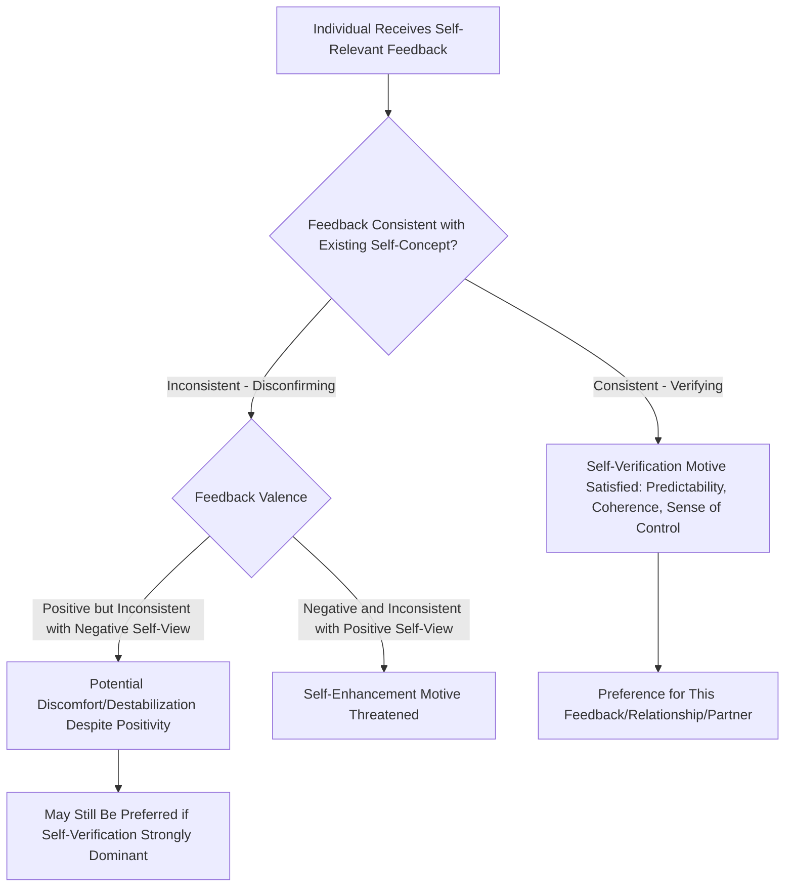

## Self-Verification Theory

### Overview

Self-verification theory, developed by William Swann beginning in the early 1980s, proposes that individuals are motivated to seek out and confirm information, feedback, and social relationships that verify their existing self-concept—even when that self-concept is negative. This theory presents a striking contrast to more intuitive self-enhancement accounts of motivation, positing that the human drive for cognitive consistency and predictability about the self can, in certain conditions, override the drive to feel good about oneself.

### The Core Proposition: Consistency Over Positivity

**Key Points**

- Self-verification theory's central and most theoretically distinctive claim is that people are motivated to maintain a stable, consistent, and predictable self-concept, and will actively seek out self-confirming feedback, relationships, and environments even when their self-concept is unfavorable.
- This means that individuals with negative self-views (e.g., low self-esteem, or specific negative self-beliefs such as "I am incompetent" or "I am unlikeable") may, under certain conditions, prefer and actively seek negative feedback that confirms these self-views over positive feedback that contradicts them—a finding that runs directly counter to the more commonly assumed universal motivation toward self-enhancement.
- The theoretical rationale is that a stable, verified self-concept provides psychological benefits related to predictability, coherence, and a sense of control over one's social world; unpredictable or inconsistent feedback, even if positive, can be experienced as unsettling or destabilizing because it disrupts the perceiver's ability to anticipate how others will treat them and how they should navigate social interactions.

### Self-Verification vs. Self-Enhancement: The Central Tension

**Key Points**

- Self-verification theory is most often discussed in direct contrast to **self-enhancement theory**, which proposes that people are universally motivated to seek positive feedback, maintain positive self-regard, and avoid or discount negative feedback about themselves (a motivation well documented in self-serving bias research).
- Swann's research program was specifically designed to demonstrate that self-verification strivings can, in specific circumstances, compete with and even override self-enhancement strivings—particularly for individuals with chronically negative self-views in domains central to their identity.
- Importantly, the theory does not claim that self-verification always wins out over self-enhancement; rather, extensive subsequent research has focused on identifying the specific **boundary conditions** under which one motive dominates the other (see below).

### Classic Empirical Demonstrations

**Example**

In one of the foundational lines of research, Swann and colleagues found that participants with negative self-views of their social competence, when given a choice, were more likely to choose to interact with an evaluator who they believed held an unfavorable impression of them, rather than one who held a favorable impression—even though the favorable evaluator's feedback would presumably feel better in the moment. This preference for self-confirming (even if negative) social partners demonstrated that self-verification motivation can direct actual behavioral choices about relationship partners, not merely passive information processing.

**Example**

In marital and relationship research, Swann and colleagues found that individuals with negative self-views were more likely to feel genuinely committed to and intimate with romantic partners who saw them accurately (i.e., who also held somewhat negative or critical views consistent with the person's self-concept), compared to partners who viewed them in an unrealistically positive light—suggesting that even in close, emotionally significant relationships, being truly "known" (verified) can be experienced as more relationally satisfying than being merely flattered, particularly for individuals whose self-concept is not highly positive.

### Diagram: Self-Verification vs. Self-Enhancement Motivational Pathways

### Boundary Conditions: When Does Self-Verification Dominate?

**Key Points**

- **Certainty and centrality of the self-view**: Self-verification effects are strongest for self-beliefs that are held with high confidence and that are central/important to a person's identity; for more peripheral, uncertain, or ambiguous self-beliefs, self-enhancement motives are more likely to dominate.
- **Cognitive vs. affective responses**: A key resolution to the apparent verification/enhancement conflict is the finding that people often respond **cognitively** in ways consistent with self-verification (believing, trusting, and seeking out consistent feedback as more accurate and diagnostic) while responding **affectively** in ways consistent with self-enhancement (still feeling better, at least momentarily, in response to positive feedback, even if they ultimately trust it less or discount it more)—suggesting the two motives can operate somewhat independently across different response systems rather than being in complete, all-or-nothing competition.
- **Relationship stage and depth**: Self-verification strivings tend to become more pronounced as relationships develop and deepen, since verification is theorized to serve an important function in established, ongoing relationships (facilitating predictability and mutual understanding), whereas early-stage or superficial relationships may show more self-enhancement-oriented preferences.
- **Domain specificity**: Because self-concept itself is domain-specific and hierarchically organized (as established in self-concept and self-schema research), self-verification and self-enhancement motives can operate differently across different self-domains within the same individual, depending on the certainty and importance of the person's self-view in that particular domain.

### Theoretical Mechanisms Underlying Self-Verification

**Key Points**

- **Cognitive mechanism**: Verified feedback is more easily processed, integrated, and trusted because it fits with existing self-schemas (directly connecting self-verification theory to Markus's self-schema framework), while disconfirming feedback requires more effortful cognitive reconciliation and may be discounted, reinterpreted, or actively resisted.
- **Behavioral/interactional mechanism**: People may unconsciously behave in ways that elicit self-confirming responses from others (a form of behavioral confirmation or self-fulfilling prophecy), actively shaping their social environment to produce feedback consistent with their existing self-views.
- **Motivational/existential mechanism**: Drawing on broader theorizing about the human need for a coherent, predictable sense of self and world (with some conceptual overlap to terror management theory's emphasis on meaning and structure), self-verification is theorized to serve a fundamental epistemic and existential function beyond simple affect regulation.

### Applications and Extensions

**Key Points**

- **Clinical implications**: Self-verification theory has been applied to understanding why individuals with depression or chronically low self-esteem may resist or undermine positive therapeutic feedback, seek out relationships or environments that reinforce their negative self-views, and sometimes show reduced adherence to interventions that conflict with their established self-concept—offering a cognitive-motivational explanation for certain forms of therapeutic resistance beyond purely clinical/symptom-based accounts.
- **Workplace and organizational behavior**: Research has applied self-verification theory to understand employee responses to performance feedback, finding that employees with negative or uncertain self-views regarding job performance may respond more positively (in terms of trust and acceptance of the feedback) to critical feedback that matches their self-view than to inflated positive feedback, with implications for performance management and feedback delivery practices.
- **Marriage and close relationships**: As noted above, self-verification processes have significant implications for relationship satisfaction and partner selection, suggesting that accurate (even if not entirely flattering) partner perception may in some circumstances support greater relational depth and stability than idealized or inflated partner views, complicating a purely "positive illusions" model of successful relationships (which some other relationship research, e.g., by Sandra Murray, has emphasized as beneficial).

### Criticisms and Complexities

**Key Points**

- **Apparent conflict with positive illusions research**: Self-verification theory's implications for close relationships appear to sit in some tension with other relationship research (e.g., Sandra Murray's work on "positive illusions") suggesting that mildly idealized, rather than strictly accurate, partner perceptions are associated with greater relationship satisfaction and longevity; reconciling these literatures generally involves recognizing that verification and idealization may operate on different aspects of the partner's self-concept simultaneously (e.g., verification of core, certain self-views alongside idealization of more peripheral or growth-oriented traits).
- **Measurement and generalizability**: Much of the classic self-verification research relies on self-report and laboratory choice paradigms, and the real-world generalizability and robustness of some specific findings (e.g., preference for negative evaluators) has been the subject of ongoing methodological scrutiny and refinement, as with much attitude and motivation research from this era. [Unverified]
- **Ethical and applied caution**: The theory's implication that people may resist beneficial positive feedback carries important, sometimes counterintuitive practical implications, and applying self-verification insights (e.g., in therapeutic or organizational settings) requires careful, individualized judgment rather than blanket application, since inappropriately withholding positive/accurate feedback based on a general theoretical principle could itself be counterproductive in specific cases.

### Relevance to the Social Self

Self-verification theory holds an important and somewhat provocative place within the social self chapter because it:

- Directly challenges and complicates the seemingly intuitive assumption (reinforced by self-serving bias and self-enhancement research) that people are universally and simply motivated to feel good about themselves, introducing genuine theoretical tension and nuance into the study of self-motivation.
- Connects self-concept structure (self-schemas, domain centrality, certainty) directly to social behavior, relationship choice, and feedback-seeking, demonstrating how cognitive self-representations actively shape, rather than merely passively reflect, social experience.
- Provides an important complementary and sometimes competing framework alongside self-enhancement, self-esteem maintenance, and positive illusions research, illustrating that the self-motivation literature contains genuine, actively debated theoretical tensions rather than a single settled consensus.
- Has significant applied relevance across clinical, organizational, and relationship psychology, demonstrating the real-world stakes of understanding when and for whom self-verification versus self-enhancement motives will predominate.

### Conclusion

Self-verification theory demonstrates that people are motivated not only to feel good about themselves but also to maintain a stable, consistent, and confirmed self-concept, sometimes actively seeking out feedback, relationships, and environments that verify even negative self-views, particularly when those self-views are certain and central to identity. By directly contrasting with self-enhancement motivation and identifying key boundary conditions (certainty, centrality, cognitive versus affective response, relationship depth), self-verification theory has generated a productive and ongoing theoretical tension within self-motivation research, with significant applied implications spanning clinical psychology, organizational feedback practices, and the study of close relationships.

**Related Topics**

- Self-enhancement and self-serving bias
- Self-concept and self-schemas
- Positive illusions in close relationships (Sandra Murray)
- Behavioral confirmation and self-fulfilling prophecy
- Cognitive consistency theories (balance theory, cognitive dissonance)
- Self-esteem: sources and structure
- Terror management theory
- Therapeutic resistance and feedback acceptance in clinical psychology