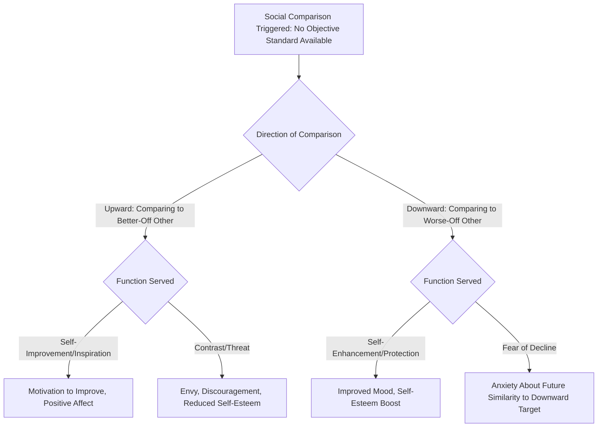

## Social Comparison Theory

### Overview

Social comparison theory, originally developed by Leon Festinger in 1954, proposes that individuals possess an innate drive to evaluate their own opinions and abilities, and that in the absence of objective, non-social standards for evaluation, people accomplish this by comparing themselves to other people. This theory has become one of the most extensively researched and applied frameworks in social psychology, providing critical insight into self-evaluation, emotion, motivation, and social behavior across a vast range of contexts.

### Festinger's Original Formulation

**Key Points**

- Festinger's foundational hypothesis proposed that people have a basic drive to evaluate their own opinions and abilities accurately, and that when objective, non-social means of evaluation are unavailable (e.g., there is no physical ruler for measuring one's own intelligence or the correctness of a political opinion), individuals turn to comparison with other people as a substitute evaluative standard.
- Festinger further proposed the **similarity hypothesis**: people prefer to compare themselves with others who are similar to themselves on relevant attributes, since comparisons with highly dissimilar others (e.g., comparing one's athletic ability to an Olympic champion) provide less diagnostic, less useful self-evaluative information than comparisons with similar others.
- Festinger also proposed a **unidirectional drive upward** specifically for ability comparisons, suggesting a general human tendency to want to improve abilities (though not necessarily opinions), which creates a motivational pull toward comparing with slightly better-performing others as a means of gauging potential for improvement.

### Upward and Downward Social Comparison

**Key Points**

- Subsequent research substantially expanded Festinger's original framework by distinguishing between the **direction** of comparison:
  - **Upward social comparison**: Comparing oneself to someone perceived as better off, more skilled, or more successful in the relevant domain.
  - **Downward social comparison**: Comparing oneself to someone perceived as worse off, less skilled, or less successful in the relevant domain.
- **Upward comparisons** can serve a self-improvement or inspirational function (providing information about how to improve or a model to emulate), but can also produce negative affect, particularly envy, decreased self-esteem, or discouragement, especially when the upward target is perceived as similar enough to invite direct comparison but the gap feels unbridgeable.
- **Downward comparisons**, as extensively studied by Thomas Wills in his influential **downward comparison theory** (1981), often serve a self-enhancement or self-protective function, particularly under conditions of threat, low self-esteem, or stress, since comparing oneself favorably against a worse-off other can boost subjective well-being and self-regard.

### Diagram: Direction and Function of Social Comparison

### Assimilation vs. Contrast Effects

**Key Points**

- A significant refinement to the basic upward/downward framework addresses **assimilation** versus **contrast** effects in comparison outcomes, examining why comparisons in the same direction sometimes produce opposite emotional results.
- **Contrast effects** occur when a comparison target is perceived as distinctly separate from the self, highlighting the *difference* between self and target (e.g., an upward comparison producing contrast typically makes the self look comparatively worse, producing negative affect).
- **Assimilation effects** occur when a comparison target is perceived as similar to or representative of the self (or of a possible future self), leading the comparer to incorporate the target's standing into their own self-evaluation (e.g., an upward comparison producing assimilation, such as viewing a successful friend's achievement as evidence of what one could also accomplish, can boost self-evaluation and motivation rather than producing envy).
- Research by Ladd Wheeler, Ab Dijksterhuis, and colleagues on the **Selective Accessibility Model** and related frameworks has examined the specific conditions (perceived similarity, psychological closeness, controllability of the compared attribute, self-relevance) that determine whether a given comparison produces assimilation or contrast.

### Social Comparison and Emotion

**Key Points**

- Social comparison processes are deeply implicated in a range of specific social emotions:
  - **Envy** is closely tied to upward contrastive comparisons, particularly when the advantaged other's position is perceived as somewhat attainable yet currently out of reach.
  - **Schadenfreude** (pleasure at another's misfortune) has been linked to downward comparison processes, particularly when the other's misfortune restores a threatened sense of relative standing.
  - **Guilt and discomfort** can arise from perceiving oneself as advantaged relative to a downward comparison target, particularly when the disparity is perceived as unearned or unfair.
- These emotional linkages connect social comparison theory to broader affective science and to research on status, fairness, and social hierarchy.

### Social Comparison in the Digital Age: Social Media Research

**Key Points**

- A substantial and rapidly growing body of contemporary research has applied social comparison theory to understand psychological effects of social media use, given that platforms like Instagram, Facebook, and TikTok provide an unprecedented volume and frequency of opportunities for social comparison, often skewed toward idealized, curated self-presentations by others.
- Numerous studies have found associations between frequent social media use (particularly passive browsing/scrolling behavior as opposed to active posting/interacting) and increased upward social comparison, which in turn has been associated with lower self-esteem, increased body dissatisfaction, and greater symptoms of depression and anxiety in various samples, particularly among adolescents and young adults.
- [Unverified] While this general association pattern has been documented across numerous studies, the field continues to actively debate the size, causal direction, and generalizability of these effects, since most available research is correlational, and the specific effects likely depend heavily on individual difference factors (e.g., baseline self-esteem, social comparison orientation) and platform-specific usage patterns rather than reflecting a simple, uniform, universally harmful effect of social media exposure.

### Individual Differences: Social Comparison Orientation

**Key Points**

- Building on the recognition that not everyone engages in social comparison to the same degree, Frederick Gibbons and Bram Buunk developed the construct of **social comparison orientation (SCO)**, measured via the Iowa-Netherlands Comparison Orientation Scale, capturing stable individual differences in the general tendency and inclination to compare oneself with others.
- Individuals high in social comparison orientation show stronger emotional and behavioral responses (in either direction, positive or negative depending on context) to comparison information than those low in this trait, and high SCO has been associated with greater vulnerability to the negative effects of upward comparison, including in social media contexts.

### Social Comparison and Group Processes

**Key Points**

- Social comparison theory has also been extended beyond individual-level comparisons to **group-level social comparison**, forming a key theoretical component of **Social Identity Theory** (Tajfel and Turner), in which individuals are theorized to engage in intergroup social comparison as a means of establishing and maintaining a positive social identity through favorable ingroup-outgroup distinctions.
- This extension links social comparison theory directly to intergroup relations, prejudice, and stereotyping research, illustrating the theory's reach beyond purely individual self-evaluation into collective and intergroup psychological processes.

### Relevance to the Social Self

Social comparison theory holds a central and foundational position within the social self chapter because it:

- Provides the core mechanism explaining how self-concept and self-esteem (covered elsewhere in this chapter) are shaped not by objective, isolated self-assessment but through an inherently social, comparative process, reinforcing the chapter's overarching theme that the self is fundamentally socially constructed and maintained.
- Directly connects to self-esteem research (particularly sociometer theory and contingencies of self-worth) by providing the comparative mechanism through which people gauge their relative standing in personally important domains.
- Offers a direct bridge to contemporary, highly relevant applied research on social media and digital well-being, demonstrating the theory's continued vitality and evolving application over seven decades since its original formulation.
- Extends naturally into intergroup and social identity research, illustrating how individual-level self-evaluative processes scale up into collective, group-based social psychological phenomena.

### Conclusion

Social comparison theory, from Festinger's original proposition that people evaluate themselves through comparison with similar others in the absence of objective standards, has expanded into an extensive and continually evolving research program encompassing the direction of comparison (upward versus downward), the assimilation-contrast distinction, specific emotional consequences, stable individual differences in comparison orientation, and, most recently, the psychological effects of social media-driven comparison. As one of social psychology's most durable and generative theoretical frameworks, social comparison theory remains essential for understanding how the social self is continuously constructed, evaluated, and regulated through an inherently interpersonal and comparative process.

**Related Topics**

- Downward comparison theory (Wills) and self-enhancement
- Assimilation and contrast effects in social judgment
- Social comparison orientation (Gibbons and Buunk)
- Social media use and psychological well-being
- Social Identity Theory (Tajfel and Turner)
- Sociometer theory and self-esteem
- Contingencies of self-worth
- Envy, schadenfreude, and comparison-based emotion