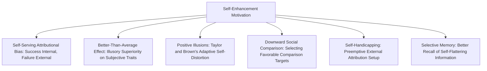

## Self-Enhancement and Self-Serving Biases

### Overview

Self-enhancement and self-serving biases refer to a broad family of interconnected motivational and cognitive tendencies through which individuals maintain, protect, and boost positive self-regard. This topic synthesizes several related phenomena covered in adjacent contexts within the person perception and social self literatures, examining self-enhancement as a general motivational drive and cataloguing its specific manifestations across attribution, memory, judgment, and social behavior.

### Self-Enhancement as a Fundamental Motive

**Key Points**

- **Self-enhancement motivation** refers to the broad, pervasive human tendency to seek, interpret, and construct information in ways that maintain or increase positive self-regard, considered by many researchers (e.g., in the tripartite self-motives framework alongside self-verification and self-assessment) to be one of the most robust and consistently observed motivational forces in social psychology.
- Shelley Taylor and Jonathon Brown's influential concept of **positive illusions** proposed that mild, systematic self-enhancing distortions of reality (rather than perfectly accurate self-perception) are not only common but may actually be associated with better psychological adjustment, well-being, and even physical health outcomes—a provocative claim suggesting that some degree of self-favoring bias may be psychologically adaptive rather than purely a distortion to be corrected. [Unverified] This "positive illusions as adaptive" claim has been contested in subsequent literature, with some researchers arguing that the well-being benefits attributed to positive illusions may be confounded with other factors, or that excessive/unrealistic self-enhancement can carry hidden social and interpersonal costs not fully captured in the original research.

### The Self-Serving Attributional Bias

**Key Points**

- The most extensively documented manifestation of self-enhancement in the attribution domain is **self-serving attributional bias**: the tendency to attribute one's successes to internal, dispositional factors (ability, effort) while attributing one's failures to external, situational factors (bad luck, task difficulty, others' interference).
- This pattern has been demonstrated across academic, athletic, occupational, and relational domains, and is explained through both motivational accounts (ego-protection) and non-motivational cognitive accounts (expectancy confirmation, differential access to self-relevant information), as detailed extensively in dedicated attribution research.
- The self-serving bias extends to group contexts as the **group-serving bias** and its intergroup form, the **ultimate attribution error**, wherein positive ingroup behavior and negative outgroup behavior are attributed dispositionally, while negative ingroup behavior and positive outgroup behavior are attributed situationally.

### Better-Than-Average Effect

**Key Points**

- The **better-than-average effect** (also called illusory superiority or the Lake Wobegon effect) describes the well-documented statistical impossibility whereby a clear majority of people rate themselves as above average on numerous desirable traits and abilities (driving skill, leadership, ethics, intelligence, sense of humor), a pattern that cannot be true for the population as a whole by definition.
- This effect tends to be strongest for subjective, ambiguously defined traits (e.g., "kindness," "leadership ability") where clear objective comparison standards are unavailable, and weaker or even reversed for traits with objective, easily verifiable performance metrics (e.g., specific, well-practiced skills where individuals have received clear, unambiguous negative feedback).
- The Dunning-Kruger effect, while conceptually distinct (concerning the specific relationship between low competence and inflated self-assessment of that competence), is often discussed alongside the better-than-average effect within the broader self-enhancement literature, though it specifically emphasizes a metacognitive deficit (the incompetent lacking the skill to accurately assess their own incompetence) rather than a purely motivational self-enhancement process.

### Diagram: Manifestations of Self-Enhancement Motivation

### Self-Handicapping

**Key Points**

- **Self-handicapping**, a concept developed by Edward Jones and Steven Berglas (1978), describes the strategic (often unconscious) creation or claiming of obstacles to one's own performance in advance of an evaluative task, serving to provide a ready-made external attribution for potential failure while preserving the possibility of an enhanced internal attribution in the event of success.
- **Behavioral self-handicapping** involves actively creating real obstacles (e.g., reducing practice/preparation time, using alcohol before an important task), while **self-reported/claimed self-handicapping** involves verbally claiming obstacles or impediments (e.g., claiming illness, stress, or lack of sleep) without necessarily engaging in behavior that actually impairs performance.
- This behavior directly illustrates self-enhancement's motivational power: individuals are willing to genuinely sabotage their own performance odds in order to protect against a purely dispositional (internal) attribution for potential failure, prioritizing the self-protective attributional benefit over their actual objective chances of success.

### Selective Memory and Self-Enhancing Recall

**Key Points**

- Self-enhancement motivation has been shown to bias autobiographical memory processes, with research demonstrating that people tend to recall self-relevant positive information more readily, more vividly, and in a more self-flattering light than negative self-relevant information, a pattern sometimes termed the **fading affect bias**, wherein the emotional intensity of negative memories fades more rapidly over time than that of positive memories.
- This selective memory bias operates alongside, and likely interacts with, the self-serving attributional bias, since favorably-biased memory for one's own past successes and reduced/distorted memory for past failures can further reinforce and perpetuate an inflated overall self-evaluation over time.

### Boundary Conditions and Individual/Cultural Variation

**Key Points**

- **Public vs. private contexts**: As with self-serving bias specifically, broader self-enhancement effects tend to be amplified in public or socially visible contexts (serving impression-management functions), though private self-enhancement effects are also well documented, indicating the motivation operates both intrapsychically and interpersonally.
- **Narcissism**: Trait narcissism is strongly and consistently associated with exaggerated self-enhancement tendencies across nearly all the manifestations described above, and narcissism research has become an important individual-differences lens through which self-enhancement's more extreme or maladaptive expressions are studied.
- **Depression**: As noted in self-serving bias research, individuals experiencing depression frequently show an attenuated or even reversed self-enhancement pattern (sometimes termed depressive realism or a depressive attributional style), raising the provocative and extensively debated question of whether mild self-enhancement bias reflects healthy psychological functioning while its absence reflects a clinically relevant deficit, or whether depressed individuals' more balanced/self-critical judgments are in some contexts more objectively accurate—a debate not fully resolved in the literature. [Inference] This ambiguity underscores that the relationship between self-enhancement and psychological health, while generally positive in non-clinical populations, is not a simple, universally linear one.
- **Cross-cultural variation**: Substantial cross-cultural research (e.g., by Steven Heine and colleagues) has found that self-enhancement motivation, while apparently widespread, shows meaningfully reduced magnitude—and in some studies, different patterns of expression—in more collectivist cultural contexts (particularly East Asian samples) compared to individualist Western samples, connecting this topic to the broader cultural variation in self-processes literature. [Unverified] The precise interpretation of these cross-cultural differences remains debated, including questions about whether self-enhancement operates through different specific domains (e.g., collective/relational self-enhancement rather than purely individual self-enhancement) in collectivist cultures rather than being simply absent.

### Costs and Interpersonal Consequences

**Key Points**

- While self-enhancement can serve adaptive, mood-protective functions for the individual, excessive or poorly calibrated self-enhancement carries documented interpersonal costs, including reduced likability, perceptions of arrogance, and, in cases of significant self-handicapping, genuinely impaired objective performance and goal attainment.
- This creates a recognized tension in the literature between self-enhancement's intrapsychic benefits (mood, self-esteem protection) and its potential interpersonal and practical costs, an important nuance that qualifies the broader "positive illusions are adaptive" claim.

### Relevance to the Social Self

Self-enhancement and self-serving biases hold a central position within the social self chapter because they:

- Synthesize and organize numerous specific phenomena (self-serving attribution, better-than-average effect, self-handicapping, selective memory) under a unifying motivational framework, demonstrating how a single underlying drive manifests across multiple distinct cognitive and behavioral domains.
- Connect directly to self-esteem research (sociometer theory, contingencies of self-worth) by illustrating the active behavioral and cognitive strategies people employ to maintain and protect the positive self-regard that these theories describe as functionally important.
- Provide an important counterpoint and point of theoretical tension with self-verification theory, illustrating the genuine, actively studied competition between self-enhancement and self-consistency motives within the broader self-motivation literature.
- Extend into applied domains including clinical psychology (depressive realism debate), organizational behavior (self-handicapping in workplace performance), and cross-cultural psychology, demonstrating the broad practical relevance of self-enhancement research.

### Conclusion

Self-enhancement and self-serving biases encompass a wide and interconnected family of cognitive and behavioral tendencies—including self-serving attribution, the better-than-average effect, self-handicapping, and self-enhancing memory bias—that collectively serve the broader motivational goal of maintaining and protecting positive self-regard. While generally considered a pervasive and, in moderation, potentially psychologically adaptive feature of human self-processing (per Taylor and Brown's positive illusions research), self-enhancement's magnitude and expression vary meaningfully across individual differences (narcissism, depression) and cultural context, and its benefits must be weighed against documented interpersonal and practical costs, making it a richly nuanced rather than simply "good or bad" feature of the social self.

**Related Topics**

- Self-serving attributional bias
- Better-than-average effect and illusory superiority
- Self-handicapping (Jones and Berglas)
- Positive illusions and psychological well-being (Taylor and Brown)
- Self-verification theory
- Narcissism and self-regard
- Depressive realism
- Cross-cultural variation in self-enhancement motives