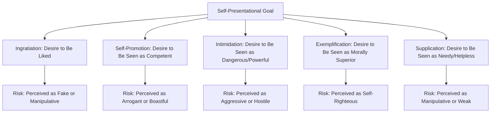

## Self-Presentation and Impression Management

### Overview

Self-presentation and impression management refer to the processes by which individuals strategically control, regulate, and construct the impressions others form of them. This body of research addresses the fundamentally social and performative dimension of the self, examining both the deliberate, conscious strategies people use to shape how they are perceived and the more automatic, habitual self-presentational tendencies that operate in everyday social interaction.

### Goffman's Dramaturgical Perspective

**Key Points**

- The foundational theoretical framework for this topic derives from sociologist Erving Goffman's 1959 work *The Presentation of Self in Everyday Life*, which proposed a **dramaturgical model** of social interaction, conceptualizing social life as analogous to theatrical performance.
- Goffman distinguished between the **front stage**, where individuals actively perform a managed, socially appropriate presentation of self for an audience, and the **back stage**, where individuals can drop the performance and behave more privately and authentically, away from the scrutiny of the social audience they perform for elsewhere.
- Goffman's framework treats impression management not as occasional deceptive behavior but as a pervasive, largely normal and necessary feature of all social interaction, since successful social functioning requires participants to continuously interpret and respond to situational role expectations.

### Jones and Pittman's Taxonomy of Self-Presentational Strategies

**Key Points**

- Edward Jones and Thane Pittman's (1982) influential taxonomy identified five distinct strategic self-presentation styles, each associated with a particular desired impression and characteristic behavioral tactics:
  - **Ingratiation**: Seeking to be liked, typically through flattery, favor-doing, opinion conformity, or displaying likable qualities.
  - **Self-promotion**: Seeking to be seen as competent, typically through highlighting one's accomplishments, skills, and abilities.
  - **Intimidation**: Seeking to be seen as dangerous or powerful, typically through displays of anger, threat, or the communication of a willingness to cause harm to achieve compliance.
  - **Exemplification**: Seeking to be seen as morally superior or dedicated, typically through displaying self-sacrifice, integrity, or exceptional dedication to a cause or duty.
  - **Supplication**: Seeking to be seen as needy or weak in order to elicit help or sympathy, typically through displaying helplessness or dependency.
- Each strategy carries characteristic risks if overused or poorly executed (e.g., excessive ingratiation risking being perceived as an obvious flatterer or "apple-polisher"; excessive self-promotion risking being perceived as arrogant or boastful), meaning effective self-presentation requires skillful, context-sensitive calibration rather than indiscriminate application.

### Diagram: Jones and Pittman's Self-Presentation Taxonomy

### Self-Monitoring: Individual Differences in Self-Presentational Tendency

**Key Points**

- Mark Snyder's (1974) construct of **self-monitoring** captures a stable individual-difference dimension in the degree to which people attend to and regulate their self-presentation based on situational and social cues.
- **High self-monitors** are theorized to be highly attentive to social cues and situational appropriateness, readily adjusting their behavior, attitudes, and self-presentation to fit different social contexts, functioning somewhat like the skilled actor implied by Goffman's dramaturgical metaphor—flexible, socially adaptive, but potentially less internally consistent across situations.
- **Low self-monitors** are theorized to be less attentive to situational social cues and more guided by their own internal attitudes, values, and dispositions, behaving more consistently across different social situations, but potentially less socially adaptive or attuned to situational demands.
- The Self-Monitoring Scale developed by Snyder has been used extensively in research linking this trait to numerous outcomes, including relationship patterns (high self-monitors showing less commitment to specific partners and more attention to partner suitability for specific activities), career and leadership emergence (high self-monitoring associated with greater likelihood of leadership roles, plausibly due to enhanced social adaptability), and consumer behavior.

### Self-Presentation Motives: Strategic vs. Automatic

**Key Points**

- Mark Leary and Robin Kowalski's influential two-component model distinguishes between:
  - **Impression motivation**: The degree to which a person is motivated to control how others perceive them, influenced by factors such as the perceived relevance of the impression to one's goals, the value of desired outcomes, and the discrepancy between one's desired and current image.
  - **Impression construction**: The actual process of deciding which specific impression to create and which strategies/behaviors to use to construct it, influenced by factors such as self-concept, desired identity, role constraints, target values, and current social image.
- This model helps explain why self-presentational effort and strategy selection vary considerably across situations: high-stakes, public, evaluative situations (e.g., a job interview) typically elicit high impression motivation and careful, deliberate impression construction, while low-stakes, private, or familiar situations elicit comparatively automatic, less effortful self-presentation.

### Authenticity and the Interplay of Real and Presented Selves

**Key Points**

- A recurring theoretical question in this literature concerns the relationship between self-presentation and authenticity: whether strategic self-presentation represents a form of inauthentic deception, or whether it is better understood as a normal, adaptive feature of social functioning that coexists with, rather than necessarily contradicting, an authentic underlying self.
- Some research suggests that self-presentational behaviors, particularly when sustained over time, can influence the presenter's own self-concept through processes related to self-perception theory (Daryl Bem)—individuals may come to internalize the traits or identities they habitually present to others, a phenomenon sometimes discussed under the heading of the **"looking-glass self"** (drawing on earlier sociological work by Charles Cooley) or self-presentation's identity-shaping consequences.
- [Inference] This suggests self-presentation is not merely a surface-level performance disconnected from genuine self-processes but can function as a bidirectional influence, both reflecting and actively shaping the underlying self-concept over time, connecting this topic to self-concept and self-schema research elsewhere in the chapter.

### Self-Presentation in Digital and Online Contexts

**Key Points**

- Contemporary research has extended self-presentation theory to online and social media contexts, examining how curated profiles, selective photo posting, and strategic online personas represent digitally mediated extensions of classic self-presentational processes.
- Online self-presentation research has explored questions including the relationship between online self-presentation strategies and the Jones and Pittman taxonomy (e.g., self-promotion being particularly prominent on professional networking platforms), the tension between idealized and authentic online self-presentation, and how the asynchronous, editable nature of online communication may afford greater deliberate impression construction than most face-to-face interaction.
- [Unverified] While this is an active and rapidly growing research area, specific findings regarding online self-presentation are still accumulating and, given the fast pace of platform and technology change, may have more limited longevity/generalizability compared to more foundational, decades-replicated findings on face-to-face self-presentation.

### Self-Presentation and Emotion: Impression Management Under Social Anxiety

**Key Points**

- Self-presentation theory has been productively applied to understanding **social anxiety**, with theoretical models (e.g., by Mark Leary) proposing that social anxiety arises specifically when individuals are motivated to make a desired impression on others but doubt their ability to successfully do so—a self-presentational theory of social anxiety that reframes this emotional experience as fundamentally tied to impression-management concerns rather than being solely explained by more general fear or avoidance mechanisms.
- This connects self-presentation research directly to the trait of public self-consciousness (from self-awareness theory), since chronic attention to how one appears to others is theoretically expected to interact with self-presentational confidence in predicting social anxiety symptoms.

### Relevance to the Social Self

Self-presentation and impression management hold a central position within the social self chapter because they:

- Directly address the inherently *social* and interpersonal dimension of the self, complementing the more internally-focused self-concept, self-esteem, and self-awareness material covered elsewhere in the chapter by examining how the self is actively constructed and negotiated in interaction with others.
- Connect to self-monitoring as an important individual-difference variable, illustrating how stable personality traits shape the degree and style of self-presentational behavior across social contexts.
- Provide a theoretical bridge to social anxiety and clinical psychology, demonstrating the practical, emotionally consequential stakes of self-presentational processes.
- Extend naturally into contemporary digital contexts, illustrating the ongoing relevance and adaptability of foundational self-presentation theory to rapidly evolving social and technological environments.

### Conclusion

Self-presentation and impression management describe the pervasive processes through which individuals strategically construct and regulate the impressions they convey to others, grounded theoretically in Goffman's dramaturgical model and elaborated through Jones and Pittman's taxonomy of specific self-presentational strategies. Individual differences in self-monitoring, the distinction between impression motivation and construction, and the complex, bidirectional relationship between presented and authentic selves collectively demonstrate that self-presentation is a sophisticated, socially essential feature of human behavior rather than a superficial or purely deceptive practice, with significant implications spanning social anxiety, digital communication, and the ongoing construction of the social self across the lifespan.

**Related Topics**

- Goffman's dramaturgical model of social interaction
- Jones and Pittman's taxonomy of self-presentational strategies
- Self-monitoring (Snyder) as an individual difference
- Self-perception theory (Bem) and identity internalization
- Social anxiety and self-presentational confidence
- Self-concept and self-schemas
- Online/digital self-presentation and social media
- Self-handicapping as a self-protective presentational strategy