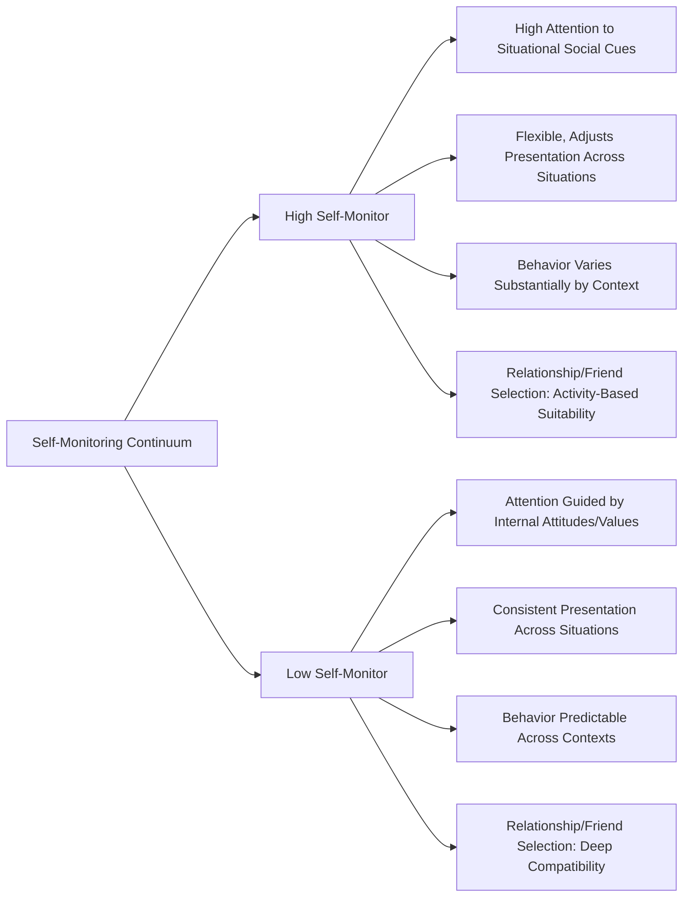

## Self-Monitoring as an Individual Difference

### Overview

Self-monitoring, developed by Mark Snyder in 1974, is an individual-difference construct describing the extent to which people observe, regulate, and control their self-presentation and expressive behavior in response to social and situational cues. As a personality dimension, self-monitoring provides a framework for understanding stable differences in how people navigate the tension between situational adaptability and dispositional consistency in their social behavior.

### Defining the Construct

**Key Points**

- Self-monitoring refers to the degree to which individuals attend to social and interpersonal cues regarding situationally appropriate self-presentation and adjust their behavior, expressed attitudes, and self-presentation accordingly.
- Snyder conceptualized self-monitoring as existing on a continuum, with **high self-monitors** at one end and **low self-monitors** at the other, rather than as a categorical typology, though research commonly discusses the two ends of the spectrum as contrasting profiles for descriptive clarity.
- The construct is measured using the **Self-Monitoring Scale (SMS)**, a self-report instrument originally developed by Snyder (1974) and later refined (Snyder & Gangestad, 1986), consisting of true/false items assessing sensitivity to social cues, concern with social appropriateness, and ability/willingness to modify self-presentation across situations.

### High Self-Monitors: Characteristics and Behavior

**Key Points**

- High self-monitors are characterized by strong attentiveness to situational and social cues regarding appropriate behavior, and a corresponding willingness and ability to adjust their self-presentation, expressed attitudes, and even emotional displays to fit the specific social context they are in.
- High self-monitors have been described using the metaphor of a skilled social "actor," analogous to Goffman's dramaturgical model, capable of flexibly performing different social roles depending on situational demands, and generally showing greater skill at both encoding (producing convincing) and decoding (accurately reading others') nonverbal social cues.
- Behaviorally, high self-monitors tend to show greater cross-situational variability in their expressed attitudes and behaviors, select friends and romantic partners more based on situational/activity suitability (e.g., choosing a particular friend because they're a good tennis partner or a good study companion, rather than exclusively based on deep personal compatibility), and are more responsive to image-based advertising and persuasion appeals that emphasize social image over product quality.

### Low Self-Monitors: Characteristics and Behavior

**Key Points**

- Low self-monitors are characterized by lower attentiveness to situational social cues and a stronger tendency to guide their behavior based on internal attitudes, values, feelings, and dispositions, regardless of situational social pressures.
- Low self-monitors show greater cross-situational behavioral consistency, meaning their behavior in one context is a comparatively strong predictor of their behavior in different contexts, since their self-presentation is less contingent on situational adjustment.
- Low self-monitors tend to select relationship partners and friends based more on perceived deep compatibility across multiple domains, rather than situational/activity-specific suitability, and are generally more responsive to persuasion appeals emphasizing genuine product quality or value-consistency over social image.

### Diagram: High vs. Low Self-Monitoring Profiles

### Empirical Correlates and Applications

**Attitude-Behavior Consistency**

A substantial body of research demonstrates that low self-monitors show notably stronger correspondence between their privately held attitudes and their actual behavior than high self-monitors, since high self-monitors' behavior is more strongly driven by situational appropriateness cues than by internal attitudes—a finding with significant implications for the broader attitude-behavior consistency literature in social psychology.

**Leadership and Organizational Behavior**

**Key Points**

- Research has found that high self-monitoring is associated with a greater likelihood of emerging as a leader in group settings and with certain forms of career advancement, plausibly because the enhanced social adaptability and attunement to situational demands characteristic of high self-monitors facilitates effective navigation of varied organizational and interpersonal contexts.
- [Unverified] While this leadership emergence association has been documented across multiple studies, the relationship between self-monitoring and actual leadership *effectiveness* (as opposed to mere emergence or perception as a leader) is more mixed and context-dependent in the literature, since the same situational flexibility that aids leadership emergence could, in some organizational contexts, be perceived as inconsistency or lack of genuine conviction.

**Romantic Relationships**

Research by Snyder and Simpson found that high self-monitors report less commitment to current romantic partners, show greater interest in alternative partners, and are more likely to engage in uncommitted sexual relationships compared to low self-monitors, consistent with the broader pattern of high self-monitors selecting relationships based on situational suitability rather than deep, exclusive compatibility.

**Consumer Behavior and Marketing**

Self-monitoring has been influential in advertising and marketing research, with studies showing that high self-monitors respond more favorably to image-oriented advertising appeals (emphasizing how a product will make them appear to others), while low self-monitors respond more favorably to quality-oriented advertising appeals (emphasizing the product's intrinsic functional value)—a well-replicated finding with direct applied relevance to targeted marketing strategy.

### Theoretical Debates: Unidimensional vs. Multidimensional Structure

**Key Points**

- While Snyder's original conceptualization treated self-monitoring as a single unidimensional construct, subsequent factor-analytic research (notably by John Lennox and Larry Wolfe, and later debates involving Snyder and Gangestad themselves) has questioned this structure, suggesting the Self-Monitoring Scale may actually assess multiple partially distinct sub-components, such as:
  - **Extraversion/public performing**: Comfort and skill in public self-presentation and performance.
  - **Other-directedness**: Sensitivity and responsiveness to others' expectations and social cues.
  - **Acting ability**: Specific skill at modifying and controlling nonverbal expressive behavior.
- [Unverified] This structural debate remains not fully resolved in the literature, and some researchers have proposed revised or shortened versions of the scale attempting to more cleanly isolate the construct's core theoretical components, meaning the exact factor structure of self-monitoring should be treated as a matter of ongoing psychometric refinement rather than firmly settled consensus.

### Relationship to Other Self-Constructs

**Key Points**

- Self-monitoring is conceptually and empirically related to, but distinct from, several other constructs covered elsewhere in the social self literature:
  - **Public self-consciousness** (from the trait self-awareness literature) overlaps conceptually with self-monitoring in its emphasis on attention to how one appears to others, though public self-consciousness specifically captures dispositional *attention* to one's public image, while self-monitoring additionally captures the behavioral *flexibility and responsiveness* in adjusting that image.
  - **Self-verification and self-enhancement motives** may interact with self-monitoring, since high self-monitors' greater situational flexibility could theoretically make them more responsive to situational self-enhancement or self-verification opportunities depending on context, though this specific intersection is less extensively developed as a direct empirical research program compared to the other correlates described above.

### Criticisms and Limitations

**Key Points**

- **Social desirability confound**: Some critics have questioned whether certain Self-Monitoring Scale items may partially confound the construct with general social skill or social desirability responding, rather than purely capturing the theorized situational-adaptability dimension.
- **Cultural generalizability**: [Unverified] Most foundational self-monitoring research was conducted with North American samples, and the cross-cultural applicability and interpretation of the construct—particularly given that collectivist cultural norms may generally emphasize greater situational behavioral adaptability as a normative expectation for all individuals, not just "high self-monitors"—has received comparatively less extensive empirical investigation than the core U.S.-based research program.
- **Value-neutral framing debate**: While Snyder's original framing was relatively neutral or even favorable toward high self-monitoring (emphasizing social skill and adaptability), some subsequent discussion has raised the question of whether very high self-monitoring might carry costs to authenticity, identity stability, or psychological well-being, an area connecting to broader debates about authenticity in the self-presentation literature.

### Relevance to the Social Self

Self-monitoring as an individual difference holds significant importance within the social self chapter because it:

- Provides a direct individual-differences complement to the more general, universal self-presentation processes described by Goffman's dramaturgical model and Jones and Pittman's taxonomy, demonstrating that people vary systematically and measurably in their characteristic self-presentational style.
- Illustrates a genuine and well-documented case in which personality (dispositional consistency) and social psychology (situational influence) perspectives intersect, since self-monitoring essentially captures individual differences in the degree to which behavior is driven by internal disposition versus external situational cues—directly relevant to the broader person-situation debate in psychology.
- Has extensive applied relevance across organizational behavior, relationship research, and marketing, demonstrating the practical utility of this personality construct across diverse real-world domains.
- Connects to the self-awareness and self-consciousness literature elsewhere in the chapter, illustrating the network of related but distinct constructs addressing attention to and management of the socially presented self.

### Conclusion

Self-monitoring, as conceptualized by Snyder, captures a stable individual difference in the degree to which people attend to situational social cues and flexibly adjust their self-presentation accordingly, with high self-monitors displaying socially adaptive, situationally responsive behavior and low self-monitors displaying greater cross-situational consistency guided by internal attitudes and values. Despite ongoing psychometric debate regarding the construct's precise dimensional structure, self-monitoring has proven a robust and widely applied framework across relationship research, organizational behavior, and consumer psychology, cementing its place as a key individual-differences lens for understanding variation in self-presentational behavior within the broader study of the social self.

**Related Topics**

- Self-presentation and impression management
- Goffman's dramaturgical model of social interaction
- Public vs. private self-consciousness
- Attitude-behavior consistency
- Person-situation debate in personality psychology
- Self-verification and self-enhancement motives
- Leadership emergence and organizational behavior
- Consumer psychology and image-based advertising