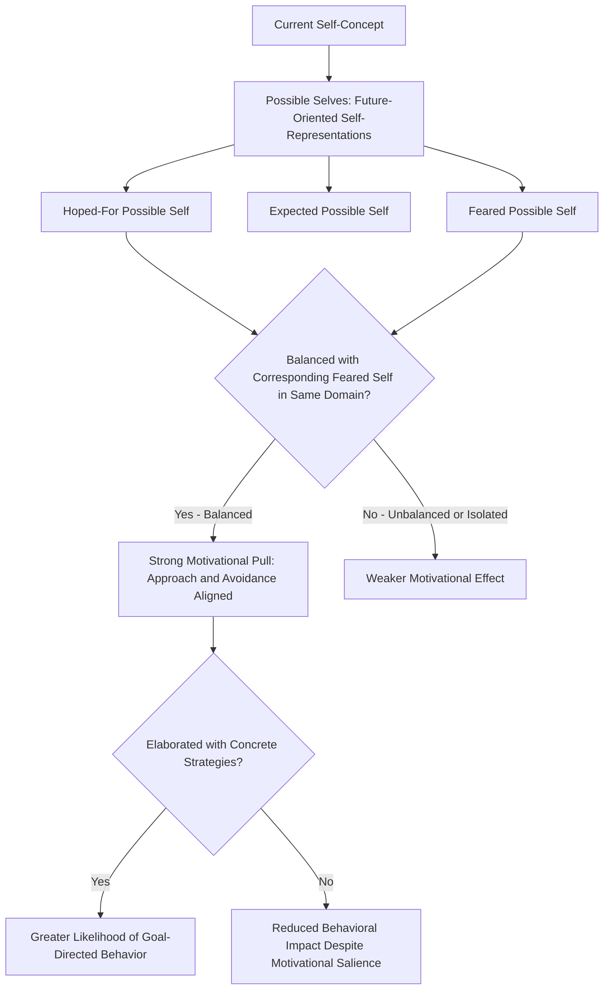

## Possible Selves and Future Self-Continuity

### Overview

Possible selves and future self-continuity are related constructs examining how individuals mentally represent and psychologically relate to their potential future identities. Possible selves theory, developed by Hazel Markus and Paula Nurius, addresses the cognitive representations of who a person could become, while future self-continuity research examines the degree of felt psychological connectedness between one's present self and these imagined future selves, with significant implications for motivation, self-regulation, and long-term decision-making.

### Markus and Nurius's Possible Selves Theory

**Key Points**

- Markus and Nurius (1986) proposed that the self-concept includes not only representations of the current, actual self but also **possible selves**: cognitive representations of what an individual could become, would like to become, or fears becoming in the future.
- Possible selves were conceptualized as extending self-schema theory (Markus's earlier framework) into the temporal, future-oriented domain, providing the cognitive link between self-concept and motivation by giving concrete, personalized form to abstract hopes, goals, and fears.
- Three primary categories of possible selves are typically distinguished:
  - **Hoped-for/desired possible selves**: Representations of positive, aspired-to future identities (e.g., "the successful entrepreneur I could become," "the loving parent I hope to be").
  - **Expected possible selves**: Representations of future selves the individual realistically anticipates becoming, which may or may not align closely with hoped-for selves.
  - **Feared possible selves**: Representations of negative, undesired future identities the individual wishes to avoid (e.g., "the unemployed person I'm afraid of becoming," "the person who ends up alone").

### The Motivational Function of Possible Selves

**Key Points**

- Possible selves are theorized to serve an important motivational function by providing a concrete, personalized, imaginable incentive or standard for future behavior, translating abstract goals into vivid, self-relevant mental representations that can guide current decision-making and effort.
- Markus and Nurius proposed that possible selves function most effectively as motivators when a **balance exists between a hoped-for possible self and a corresponding feared possible self** in the same domain (e.g., hoping to become "a successful student" while simultaneously fearing becoming "an academic failure"), since this balanced structure provides both an approach-oriented incentive and an avoidance-oriented incentive pointing in the same behavioral direction, creating a form of motivational reinforcement.
- Possible selves that are not accompanied by a plausible, elaborated strategy for achieving them (sometimes described as "unelaborated" possible selves) are theorized to be less motivationally effective than possible selves that are cognitively linked to specific action plans and strategies.

### Diagram: The Structure and Function of Possible Selves

### Applied Research: Possible Selves Interventions

**Example**

Daphna Oyserman and colleagues have conducted extensive applied research using possible selves interventions in educational contexts, particularly with at-risk adolescent populations. In these interventions, students engage in structured exercises to articulate specific, plausible, school-related possible selves (e.g., imagining themselves graduating, attending college, or working in a specific desired career) that are explicitly linked to concrete near-term strategies and behaviors (e.g., specific study habits, course-taking plans). Oyserman's research has found that such interventions are associated with improved academic engagement, reduced problem behavior, and better academic outcomes for participating students, providing applied, real-world evidence for possible selves theory's motivational claims beyond laboratory demonstrations. [Unverified] As with most applied psychological interventions, effect sizes and the durability of these academic benefits vary across specific implementation contexts and study samples, and possible selves interventions are best understood as one component of effective educational motivation strategies rather than a standalone solution.

### Future Self-Continuity: A Related but Distinct Construct

**Key Points**

- **Future self-continuity**, most extensively developed by Hal Hershfield and colleagues, refers to the degree of perceived psychological connectedness, similarity, and vividness between one's current self and one's imagined future self, conceptually distinct from (though related to) the specific content-based possible selves framework.
- Rather than focusing on *what* future selves a person imagines (as in possible selves theory), future self-continuity research focuses on *how connected* a person feels to their future self as a matter of degree—essentially treating the relationship between present and future self as functioning similarly to the relationship between the self and a separate other person, ranging from feeling like a stranger to one's future self to feeling strongly continuous and connected with it.
- Hershfield's research has used tools including the **Inclusion of Other in the Self (IOS) Scale**, adapted to measure self-future self overlap, and even virtual reality-based age-progression technology, in which participants interact with a digitally aged, realistic rendering of their own future appearance, to experimentally manipulate and study future self-continuity.

### Future Self-Continuity and Long-Term Decision-Making

**Key Points**

- A substantial body of research has linked greater future self-continuity to improved long-term, delayed-gratification-oriented decision-making, most notably in the domain of **financial saving behavior**: individuals who report or are experimentally induced to feel greater psychological connection to their future self show increased willingness to save for retirement and reduced preference for immediate financial gratification.
- Hershfield's virtual reality age-progression studies found that participants who interacted with realistic digital renderings of their own aged future selves subsequently allocated significantly more hypothetical money to long-term retirement savings compared to control participants who did not undergo this future-self visualization manipulation, providing striking experimental evidence for a causal link between future self-vividness/connectedness and long-term financial planning behavior.
- This research area has also been extended to other domains involving present-future tradeoffs, including academic procrastination, health behavior (e.g., exercise and dietary choices), and ethical/prosocial decision-making, generally finding that weaker future self-continuity is associated with greater discounting of future consequences in favor of immediate outcomes across these varied domains.

### Theoretical Integration: Possible Selves and Future Self-Continuity Combined

**Key Points**

- While possible selves theory and future self-continuity research developed somewhat independently and emphasize different aspects of future self-representation (content/type versus degree of connectedness), the two frameworks are increasingly discussed as complementary components of a broader understanding of future-oriented self-processes.
- [Inference] A plausible integrated view suggests that the motivational power of a given possible self (per Markus and Nurius's framework) may depend partly on the degree of future self-continuity a person feels toward that particular imagined future identity—a vividly and strongly connected hoped-for possible self would be expected to exert stronger motivational pull than an equally desirable but more psychologically distant, "stranger-like" possible self, though this specific integrative hypothesis represents a reasonable theoretical synthesis rather than a fully established, directly tested unified model in the existing literature.

### Individual Differences and Developmental Considerations

**Key Points**

- Future self-continuity has been found to vary systematically with age, with some research suggesting it may increase across adulthood as individuals develop clearer, more elaborated, and more temporally stable self-concepts, though [Unverified] the precise developmental trajectory and its underlying mechanisms remain an active area of ongoing research rather than a fully settled empirical picture.
- Trait-level individual differences in future orientation, time perspective (drawing on Zimbardo's time perspective theory), and general self-concept clarity have all been examined as potential correlates or determinants of future self-continuity, suggesting this construct sits within a broader network of temporally-oriented self and personality constructs.

### Relevance to the Social Self

Possible selves and future self-continuity hold significant importance within the social self chapter because they:

- Extend the temporal scope of self-concept research (covered earlier in the chapter) beyond the present, actual self into the motivationally crucial domain of imagined future identity, directly linking self-representation to goal pursuit and behavioral self-regulation.
- Provide a compelling real-world applied bridge connecting foundational social-cognitive theory (self-schemas, possible selves) to practical interventions in education (Oyserman's work) and personal finance/health behavior (Hershfield's work), demonstrating the direct societal relevance of self-concept research.
- Connect to self-discrepancy theory (ideal and ought selves) and self-regulation research more broadly, since possible selves and future self-continuity both address how imagined future states of the self guide present motivation and behavior.
- Illustrate an important methodological innovation in psychological science (virtual reality age-progression) demonstrating how the study of self-processes continues to evolve alongside new experimental technologies.

### Conclusion

Possible selves and future self-continuity together illuminate how individuals' mental representations of their future identities shape present-day motivation, self-regulation, and decision-making. Markus and Nurius's possible selves framework identifies the specific hoped-for, expected, and feared future identities people construct and their motivational function when balanced and elaborated with concrete strategies, while Hershfield's future self-continuity research demonstrates that the degree of felt psychological connection to one's future self—independent of its specific content—critically influences long-term decision-making in domains ranging from financial saving to health behavior, together providing a rich and increasingly integrated picture of how the temporally extended self operates as a powerful psychological and motivational force.

**Related Topics**

- Self-discrepancy theory (ideal and ought selves)
- Self-schemas and self-concept structure
- Oyserman's school-related possible selves interventions
- Hershfield's virtual reality future self-continuity research
- Time perspective theory (Zimbardo)
- Delay of gratification and intertemporal choice
- Self-regulation and goal pursuit
- Financial decision-making and retirement savings behavior