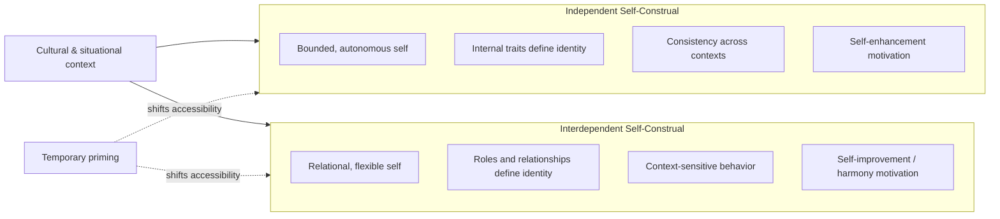

## Independent and Interdependent Self-Construals

### Definition and Theoretical Origins

Self-construal refers to the cognitive representation of the self in relation to others — how individuals define, experience, and understand who they are. The independent-interdependent framework was formalized by Markus and Kitayama (1991) to explain systematic cultural variation in how the self is bounded and organized.

**Independent self-construal** conceives of the self as a bounded, unitary, autonomous entity comprising internal attributes (traits, abilities, values, preferences) that remain relatively stable across contexts and relationships. The self is separate from the social context; behavior is organized around expressing these internal attributes.

**Interdependent self-construal** conceives of the self as flexible and variable, fundamentally connected to others within significant relationships. The self is defined largely by roles, relationships, and group memberships; behavior is organized around fitting in, maintaining harmony, and fulfilling relational obligations.

### Cultural Distribution

Markus and Kitayama proposed that independent self-construal predominates in Western, individualist cultures (e.g., United States, Western Europe, Australia), while interdependent self-construal predominates in many Asian, African, Latin American, and Southern European cultures often characterized as collectivist.

**[Inference]** This mapping is a generalization about modal cultural tendencies rather than a claim that all members of a culture share one construal exclusively; substantial within-culture variability exists.

### Core Contrasts

| Dimension | Independent Self | Interdependent Self |
| --- | --- | --- |
| Self-boundary | Separate from social context | Connected to social context |
| Primary structure | Internal traits, abilities | Relationships, roles, group memberships |
| Source of self-esteem | Expressing uniqueness, personal achievement | Fitting in, fulfilling relational duties |
| Emotional expression | Direct expression of internal states | Other-focused emotions; regulation for harmony |
| Cognitive style | Context-independent, decontextualized reasoning | Context-dependent, holistic reasoning |
| Motivation | Self-actualization, standing out | Belonging, adjusting to fit relational norms |
| Communication style | Direct, explicit | Indirect, high-context |

### Cognitive and Perceptual Consequences

**Attribution style.** Independent self-construal is associated with greater use of dispositional attributions (explaining behavior via internal traits), contributing to a stronger fundamental attribution error. Interdependent self-construal is associated with greater attention to situational and relational factors.

**Field dependence vs. independence.** Research using tasks such as the Framed Line Test (Kitayama et al., 2003) found that individuals with more interdependent self-construals performed relatively better on context-dependent judgments (adjusting a line relative to a surrounding frame), while those with more independent self-construals performed relatively better on context-independent judgments (absolute line length regardless of frame).

**Self-descriptions.** On the Twenty Statements Test ("Who am I?"), independents tend to generate more trait-based, abstract descriptors ("I am ambitious"), while interdependents tend to generate more role- and relationship-based descriptors ("I am a daughter," "I am a member of my team").

### Motivational Consequences

**Consistency vs. flexibility.** Independent selves strive for cross-situational consistency in behavior and self-presentation as a marker of authenticity. Interdependent selves more readily adjust behavior across relational contexts without this being experienced as inauthentic — a parent may act one way with elders, another with peers, another with children.

**Self-enhancement vs. self-criticism.** Independent self-construal correlates with self-enhancement biases (viewing oneself more favorably than average, better-than-average effects). Interdependent self-construal correlates more with self-criticism and self-improvement motivation, since flaws threaten relational harmony and signal need for correction.

**Choice and control.** Iyengar and Lepper's (1999) classic studies found that Anglo-American children showed greater intrinsic motivation when they personally chose their task, while Asian-American children showed comparable or greater motivation when a trusted in-group member (mother) made the choice for them — illustrating that "choice" itself is differently motivating depending on construal.

### Measurement

The most widely used instrument is the **Self-Construal Scale (SCS)** by Singelis (1994), which contains separate independent and interdependent subscales (not a single bipolar dimension), allowing individuals to score high or low on both simultaneously.

**Example items:**

- Independent: "I am comfortable with being singled out for praise or rewards."
- Interdependent: "I will sacrifice my self-interest for the benefit of the group I am in."

**[Unverified]** Exact psychometric properties (reliability coefficients, factor loadings) vary across translations and samples reported in different studies; consult the specific validation paper for a given population before citing precise statistics.

### Priming and Malleability

A key finding is that self-construal is not fixed even within individuals — it can be temporarily primed. Common priming manipulations include:

- Pronoun circling tasks (circling "we/us/our" vs. "I/me/mine" in a passage)
- Reading stories about a warrior who wins alone vs. as part of a group
- Sumerian warrior priming paradigm (Gardner, Gabriel, & Lee, 1999)

Priming interdependence temporarily shifts judgment and behavior toward collectivist patterns (context-sensitivity, holistic reasoning) even among habitually independent individuals, and vice versa. This supports a **dynamic constructivist** view: both self-construals are cognitively available to most people, with culture affecting chronic accessibility rather than creating an all-or-nothing structure.

### Relational and Social Behavior

**Conflict management.** Interdependents favor accommodation, avoidance, and compromise to preserve relationship harmony; independents more readily use direct confrontation or competitive strategies.

**Emotional experience.** Independents report more "ego-focused" emotions (pride, anger, frustration) tied to personal states. Interdependents report more "other-focused" emotions (sympathy, shame, indebtedness) tied to relational standing.

**In-group/out-group distinction.** Interdependent self-construal is associated with a sharper distinction between in-group and out-group treatment — warmth and obligation toward in-group members can coexist with more distant or even competitive treatment of out-group members, distinguishing collectivism from generalized universal warmth.

### Diagrams

<svg xmlns="http://www.w3.org/2000/svg" viewBox="0 0 640 320" font-family="Arial, sans-serif">
<text x="320" y="24" text-anchor="middle" font-size="15" font-weight="bold" fill="#222">Self Boundary Models (svg_diagram)</text>

<text x="150" y="55" text-anchor="middle" font-size="13" font-weight="bold" fill="#333">Independent</text>

<circle cx="150" cy="140" r="70" fill="none" stroke="`#2b6cb0`" stroke-width="3" />

<circle cx="150" cy="140" r="8" fill="`#2b6cb0`" />

<text x="150" y="145" text-anchor="middle" font-size="10" fill="#fff">Self</text>

<circle cx="80" cy="230" r="6" fill="`#a0aec0`" />

<circle cx="220" cy="230" r="6" fill="`#a0aec0`" />

<circle cx="150" cy="250" r="6" fill="`#a0aec0`" />

<text x="150" y="285" text-anchor="middle" font-size="10" fill="#555">Others remain outside self-boundary</text>

<text x="480" y="55" text-anchor="middle" font-size="13" font-weight="bold" fill="#333">Interdependent</text>

<circle cx="480" cy="140" r="70" fill="none" stroke="`#c05621`" stroke-width="3" />

<circle cx="480" cy="140" r="8" fill="`#c05621`" />

<text x="480" y="145" text-anchor="middle" font-size="10" fill="#fff">Self</text>

<circle cx="440" cy="160" r="7" fill="`#dd6b20`" />

<circle cx="520" cy="160" r="7" fill="`#dd6b20`" />

<circle cx="480" cy="190" r="7" fill="`#dd6b20`" />

<text x="480" y="285" text-anchor="middle" font-size="10" fill="#555">Others overlap within self-boundary</text>

</svg>

### Criticisms and Refinements

**Measurement inconsistency.** Meta-analyses (e.g., Levine et al., 2003) found weak and inconsistent cross-national differences on Singelis-type scales when aggregated across dozens of studies, raising questions about whether self-report scales adequately capture construal differences behaviorally demonstrated in priming and cognitive-task studies.

**Oversimplification of "culture."** Later work (e.g., Vignoles et al., 2016, using data across 55 cultural groups) found the independent-interdependent construct fractures into multiple distinguishable dimensions (e.g., difference vs. similarity, self-containment vs. connection to others, self-direction vs. receptiveness to influence) that do not always co-vary as a single bipolar dimension, and do not map cleanly onto simple "West vs. East" divisions.

**Within-culture and individual variation.** Social class, urban/rural residence, religiosity, and individual personality substantially moderate construal independent of national culture; construal should be treated as a continuously distributed individual-difference variable rather than a categorical cultural trait.

**[Inference]** Given these refinements, contemporary researchers generally favor treating independence and interdependence as two separate, co-existing dimensions (each person has some degree of both) rather than as opposite poles of one continuum.

### Applications

- **Cross-cultural clinical psychology:** self-construal informs case conceptualization, since interdependent clients may present distress as relational/somatic rather than as individualized emotional symptoms.
- **Consumer psychology and marketing:** advertising appeals differ in effectiveness depending on whether messaging emphasizes personal benefit/uniqueness (independent-oriented) or belonging/social approval (interdependent-oriented).
- **Organizational behavior:** team structures, feedback delivery, and reward systems (individual bonuses vs. group-based rewards) interact with employees' construal to affect motivation and satisfaction.
- **Health behavior:** framing health messages in terms of personal risk vs. family/community risk shows differential persuasive effectiveness depending on construal.

**Related Topics**

- Individualism–collectivism (Hofstede's cultural dimensions)
- Fundamental attribution error and cultural attribution differences
- Self-concept clarity
- Twenty Statements Test
- Dynamic constructivist theory of culture
- Self-esteem: contingencies and cultural variation
- In-group favoritism and social identity theory
- High-context vs. low-context communication (Hall's framework)