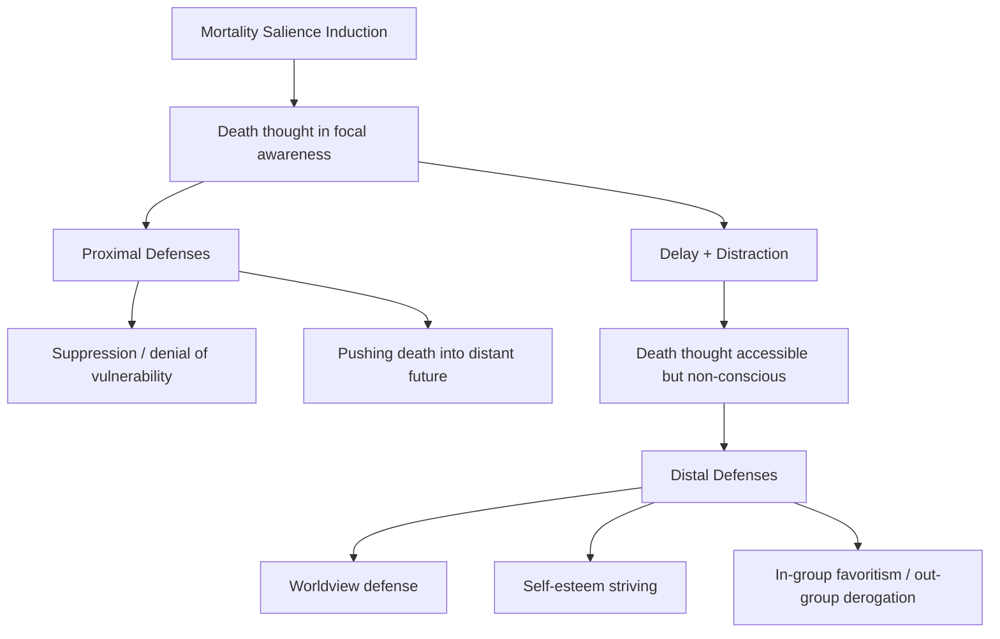

## Terror Management Theory

### Definition and Theoretical Origins

Terror Management Theory (TMT) is a social psychological framework developed by Jeff Greenberg, Sheldon Solomon, and Tom Pyszczynski beginning in the late 1980s, grounded in the work of cultural anthropologist Ernest Becker (particularly his 1973 book *The Denial of Death*). TMT proposes that much of human behavior is motivated, at a largely unconscious level, by the need to manage the potential for existential terror arising from awareness of mortality.

**Core premise:** Humans share with other animals a biological drive toward self-preservation, but uniquely possess the cognitive capacity for self-awareness, abstract thought, and future projection — which makes humans aware that death is inevitable, unpredictable in timing, and final. This awareness creates the potential for paralyzing terror, which humans manage through two interlocking psychological structures.

### The Dual-Component Anxiety Buffer

**1. Cultural worldview**

A humanly constructed, shared symbolic conception of reality that provides meaning, order, permanence, and standards of value. Cultural worldviews offer either literal immortality (religious beliefs in an afterlife, reincarnation, spiritual continuation) or symbolic immortality (living on through one's children, nation, creative works, wealth, or lasting achievements).

**2. Self-esteem**

The sense that one is a valuable participant in a meaningful universe, achieved by living up to the standards of value prescribed by one's cultural worldview. Self-esteem functions as an internal gauge indicating how well an individual is meeting worldview-derived standards.

**[Inference]** These two components are theorized to function jointly as an "anxiety buffer": the worldview supplies the standards, and self-esteem certifies that the individual is meeting them, together tempering the potential terror of mortality awareness.

### Mortality Salience Hypothesis

TMT's central empirically testable derivation is the **mortality salience (MS) hypothesis**: if psychological structures function to buffer death-related anxiety, then reminding people of their mortality (making death salient) should increase reliance on and defense of those structures.

**Standard experimental paradigm:**

1. Participants are randomly assigned to a mortality salience condition (typically answering two open-ended prompts: "Please briefly describe the emotions that the thought of your own death arouses in you" and "Jot down, as specifically as you can, what you think will happen to you physically as you die and once you are physically dead") or a control condition (parallel prompts about a neutral or aversive but non-death topic, e.g., dental pain, exam failure, general anxiety).
2. A delay and distraction task is typically inserted (e.g., a filler questionnaire like the Positive and Negative Affect Schedule, PANAS).
3. Participants then complete a dependent measure assessing worldview defense, self-esteem striving, or related outcomes.

**[Inference]** The delay-and-distraction step is theoretically important: TMT holds that mortality salience effects are strongest when death thoughts have been pushed outside of focal, conscious attention (high accessibility of death-related cognition without conscious awareness of it), consistent with the **dual-process model** of terror management described below.

### Dual-Process Model (Proximal vs. Distal Defenses)

Pyszczynski, Greenberg, and Solomon (1999) elaborated TMT to distinguish two temporally and functionally distinct defense systems:

**Proximal defenses** occur when death-related thought is in current focal attention (immediately after an MS induction, before distraction). These are rational, conscious, and often involve suppression, denial of personal vulnerability, or distancing the threat in time ("I won't die for a long time" or engaging in health-promoting intentions).

**Distal defenses** occur when death-related thought has been suppressed from consciousness but remains highly accessible at an implicit level (typically after a delay/distraction). These are symbolic and not logically related to death — increased worldview defense, self-esteem striving, in-group favoritism, and derogation of worldview-threatening others.

### Key Empirical Findings

**Worldview defense.** Rosenblatt et al. (1989) found that municipal court judges under mortality salience recommended substantially higher bail for an alleged prostitute (a worldview-violating target) compared to control-condition judges, illustrating harsher punishment of moral transgressors.

**In-group/out-group bias.** Greenberg et al. (1990) found that mortality salience increased pro-in-group and anti-out-group evaluations (e.g., Christian participants evaluating Christian vs. Jewish targets more polarized under MS).

**Self-esteem as buffer.** Studies manipulating self-esteem (e.g., via false positive personality feedback) prior to MS induction found that individuals with experimentally boosted or dispositionally high self-esteem showed reduced anxiety and reduced defensive worldview bolstering in response to death reminders or threatening stimuli, supporting the **anxiety-buffer hypothesis**.

**Physiological anxiety.** Studies have found that boosting self-esteem reduces both self-reported anxiety and physiological arousal (skin conductance) in response to graphic death-related stimuli.

**Aggression.** McGregor et al. (1998) found that mortality salience increased aggression (via hot sauce allocation) toward individuals who criticized participants' worldview, relative to control.

**Consumerism and materialism.** Mortality salience has been found to increase desire for money, status possessions, and conspicuous consumption, interpreted as a symbolic-immortality/self-esteem striving mechanism.

**Nationalism and charismatic leadership.** Mortality salience has been found to increase preference for leaders offering strong, unifying national narratives, a line of research applied to political psychology (e.g., studies conducted around the 9/11 attacks and subsequent elections).

### The Terror Management Health Model (TMHM)

An extension (Goldenberg & Arndt, 2008) applying TMT to health behavior, proposing that death-related cognition can produce divergent effects on health behavior depending on whether death thoughts are in focal or peripheral (non-conscious) awareness:

- When death is consciously salient (proximal), people are motivated toward rational health-protective behavior (e.g., increased intention to exercise, quit smoking).
- When death thought is activated but non-conscious (distal), health behavior becomes driven by self-esteem contingencies rather than rational health logic — potentially leading to health-*undermining* behavior if the behavior (e.g., tanning, smoking) is tied to self-esteem or social approval (e.g., appearing attractive).

### Boundary Conditions and Moderators

- **Worldview threat specificity:** defense effects are strongest when the dependent measure is relevant to the specific worldview domain threatened.
- **Individual differences:** attachment security, self-esteem level, and need for structure moderate the strength of MS effects.
- **Cultural variability:** the specific content of worldview defense (what counts as a "transgression" or "hero") is culturally variable even though the buffering process is proposed as human-universal.

**[Inference]** Because worldview *content* is culturally constructed while the *buffering function* is proposed as universal, TMT predicts consistent process-level effects (increased defense of whatever the local worldview values) even when specific behavioral manifestations differ across cultures.

### Methodological Critiques

**Replication concerns.** A large-scale, pre-registered multi-lab replication effort (Klein et al., 2019, in *Cognition & Emotion* via the Psychological Science Accelerator's precursor and other coordinated replication attempts) failed to find robust mortality salience effects on worldview defense (specifically using the classic anti-American essay paradigm) using rigorous, high-powered, pre-registered designs. This has generated substantial debate within social psychology about the robustness of the MS effect base.

**Publication bias.** Critics (e.g., Ron Sun and others) have argued that meta-analytic support for TMT (e.g., Burke, Martens, & Faucher, 2010, reporting hundreds of supportive studies) may be inflated by the file-drawer problem — a bias toward publishing significant, supportive findings over null results.

**[Unverified]** The current overall state of TMT's empirical standing post-replication-crisis is a matter of ongoing debate among researchers; specific meta-analytic effect sizes and the field's consensus should be checked against the most recent literature rather than treated as settled.

**Measurement and manipulation checks.** Questions have been raised about whether standard MS inductions reliably manipulate death-thought accessibility as intended across all studies, and about the adequacy of common control conditions.

### Relationship to Other Theories

- **Uncertainty Management Theory** and **Meaning Maintenance Model** propose overlapping but distinct mechanisms (uncertainty reduction, meaning restoration) that may account for similar behavioral patterns without invoking mortality-specific processes.
- **Attachment theory** intersects with TMT insofar as secure attachment figures/relationships can function as a symbolic buffer against death anxiety independent of cultural worldview.
- **Existentialism** (Kierkegaard, Heidegger, Sartre) and Becker's synthesis of psychoanalytic and existential thought form the philosophical lineage TMT operationalizes into testable hypotheses.

### Applications

- **Political psychology:** understanding shifts toward in-group solidarity and authoritarian-leaning leadership preference following collective trauma or threat (e.g., terrorist attacks, pandemics).
- **Consumer behavior/marketing:** understanding status-driven and materialistic consumption spikes following death-related media exposure.
- **Prejudice and intergroup conflict:** informing interventions aimed at reducing worldview-defense-driven out-group derogation.
- **Clinical and health psychology:** informing terror-management-based approaches to end-of-life anxiety and health-behavior interventions (per TMHM).

**Related Topics**

- Cultural worldview defense and moral transgression punishment
- Self-esteem as an anxiety buffer
- Dual-process models of defense (proximal vs. distal)
- Terror Management Health Model
- Mortality salience and political attitudes
- Existential psychology (Becker, Kierkegaard, Yalom)
- Replication crisis in social psychology
- In-group bias and social identity theory