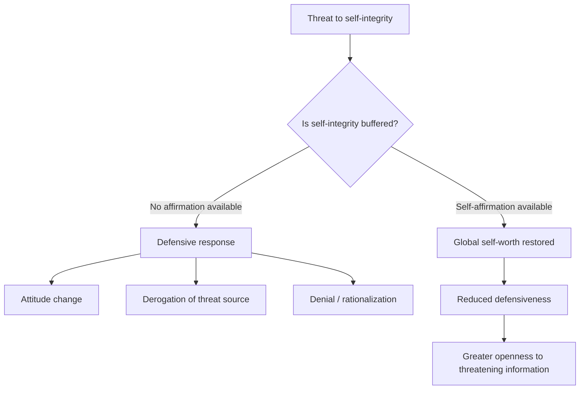

## Self-Affirmation Theory

### Definition and Theoretical Origins

Self-affirmation theory was introduced by Claude Steele (1988) as an extension of and alternative interpretation to cognitive dissonance theory. It proposes that people are fundamentally motivated to maintain a global sense of self-integrity — a perception of themselves as good, competent, moral, and able to control important outcomes. This motivation operates flexibly: threats to self-integrity in one domain can be offset not only by resolving the specific threat directly, but by affirming self-worth in an entirely unrelated domain.

**Core premise:** The self-system is not organized around defending any single specific belief or behavior, but around protecting a global sense of adequacy and integrity. When one aspect of the self is threatened, affirming a different, valued aspect of the self can restore overall self-integrity and reduce the need to defensively rationalize the original threat.

### Distinction from Cognitive Dissonance Theory

Festinger's (1957) dissonance theory holds that inconsistency between cognitions (e.g., beliefs and behavior) creates an aversive arousal state that motivates people to change a specific attitude or belief to restore consistency *within that domain*.

Self-affirmation theory reinterprets many dissonance-reduction findings as instances of a broader self-integrity maintenance process rather than a domain-specific consistency-restoration process. Under this view, attitude change after counter-attitudinal behavior occurs not necessarily because of a need for logical consistency, but because the behavior threatens global self-worth, and changing the attitude is one available (but not the only) route to restoring it.

**Key evidence for this distinction:** Steele and colleagues found that allowing participants to self-affirm in an unrelated domain (e.g., affirming an important personal value) *after* engaging in dissonance-arousing behavior (such as writing a counter-attitudinal essay) eliminated the typical attitude change seen in standard dissonance paradigms — even though the original inconsistency remained logically unresolved. This suggested the underlying motivation was to protect global self-integrity, not to resolve the specific inconsistency, since restoring self-worth through an unrelated affirmation was sufficient to eliminate the dissonance-reduction behavior.

### Core Mechanism

### Standard Experimental Paradigm

**Self-affirmation manipulation (most common: values essay task):**

1. Participants rank a list of personal values (e.g., relationships with friends/family, creativity, business/economics, aesthetics, religion, government/politics, science) in order of personal importance.
2. In the affirmation condition, participants write briefly about why their *highest*-ranked value is important to them and describe a time it mattered.
3. In the control condition, participants write about a lower-ranked value, often from the perspective of why it might matter to someone else.

**Other common affirmation manipulations:**

- Recalling a past instance of exemplifying a valued personal trait (kindness, competence)
- Receiving false positive personality feedback
- Completing a values-related scrambled-sentence or reflection task

Participants are then exposed to a self-threat (persuasive counter-attitudinal message, negative health-risk feedback, stereotype threat manipulation, criticism) and their subsequent defensiveness, attitude change, or performance is measured.

### Key Empirical Domains

**Health message acceptance.** Self-affirmed individuals show greater acceptance of health-risk information (e.g., regarding smoking, alcohol use, caffeine consumption) that they would otherwise resist or discount, and show increased intentions to change health behavior. Sherman, Nelson, and Steele (2000) found self-affirmed coffee drinkers were more receptive to information linking caffeine to breast cancer risk than non-affirmed participants.

**Stereotype threat and academic performance.** Cohen, Garcia, and colleagues (2006, 2009) conducted field experiments in which African American middle-school students who completed brief in-class self-affirmation writing exercises showed improved grades over the following semesters/years relative to non-affirmed peers, with effects sometimes persisting across multiple years — interpreted as reducing the cumulative burden of stereotype threat on academic identity.

**[Inference]** The durability and generalizability of these academic field-intervention effects across different school contexts, student populations, and replication attempts is an area of ongoing empirical scrutiny; effect sizes have varied across follow-up studies.

**Reducing defensive processing of threatening information.** Self-affirmed individuals show reduced biased processing of information that threatens a cherished belief or group identity, and reduced motivated reasoning when evaluating counter-attitudinal evidence.

**Interpersonal and intergroup conflict.** Self-affirmation has been found to reduce defensive responses to criticism from romantic partners and reduce intergroup defensiveness/increase willingness to compromise in politically polarized contexts (e.g., increased openness to opposing political arguments after self-affirmation).

**Stress and physiological responses.** Self-affirmation has been associated with lower cortisol reactivity and reduced physiological stress responses to social-evaluative threat (e.g., Trier Social Stress Test paradigms).

### Boundary Conditions and Moderators

- **Relevance of affirmed domain:** the affirmation must be self-relevant and genuinely important to the individual; affirming a domain the person does not personally value produces weaker or null effects.
- **Timing:** affirmation is generally more effective when administered *before* the threat is encountered, though post-threat affirmation has also shown effects in some paradigms.
- **Threat severity:** extremely severe threats to central identity domains may not be fully offset by affirmation in an unrelated domain.
- **Self-esteem level:** some studies suggest self-affirmation effects can interact with trait self-esteem, though findings are mixed.

**[Unverified]** The precise boundary conditions under which self-affirmation succeeds versus fails to buffer a given threat are still being refined in the literature; specific moderator effects should be checked against current meta-analytic findings rather than assumed uniform across contexts.

### Distinguishing Self-Affirmation from Self-Esteem Boosting

Self-affirmation is theoretically distinct from simple positive mood induction or generic self-esteem boosting. The proposed mechanism operates through re-affirming a coherent narrative of self-integrity and adequacy (often via a specific valued domain) rather than through generalized positive affect alone. **[Inference]** Some researchers have questioned how cleanly this can be empirically dissociated from positive-mood effects, since affirmation tasks typically also elevate mood; studies using mood controls have generally still found affirmation-specific effects beyond mood alone, though this remains a live methodological consideration.

### Critiques and Limitations

**Effect size variability.** Meta-analyses (e.g., Sherman & Cohen review literature) show self-affirmation effects are generally reliable but often modest in magnitude and heterogeneous across study contexts.

**Publication and replication concerns.** As with much of social psychology, some self-affirmation findings — particularly certain field-intervention effects — have faced replication challenges or produced smaller effects in pre-registered replications compared to original studies.

**Mechanism ambiguity.** Debate continues over whether the operative mechanism is genuinely "global self-integrity restoration" as originally theorized, or whether alternative mechanisms (mood repair, cognitive resource availability, construal-level shifts toward abstract/long-term thinking) better account for the pattern of findings.

### Applications

- **Health communication:** incorporating brief self-affirmation exercises before delivering risk information to reduce defensive discounting.
- **Education:** brief in-classroom affirmation writing exercises to reduce stereotype-threat-related achievement gaps.
- **Political communication and conflict resolution:** self-affirmation as a technique to reduce polarized defensive reasoning and increase receptivity to opposing viewpoints.
- **Clinical/therapeutic contexts:** informing interventions that bolster global self-worth to increase receptivity to difficult but necessary feedback (e.g., in therapy or medical contexts).

**Related Topics**

- Cognitive dissonance theory
- Stereotype threat
- Motivated reasoning and biased information processing
- Terror management theory (self-esteem as anxiety buffer)
- Self-esteem: trait vs. state, contingencies of self-worth
- Construal level theory
- Growth mindset interventions (related field-intervention literature)