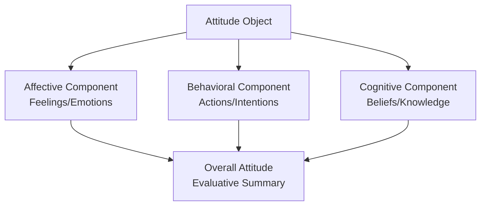

## Defining Attitudes and the ABC Model

### Definition of Attitude

An **attitude** is a psychological tendency expressed by evaluating a particular entity (the "attitude object") with some degree of favor or disfavor. This widely cited definition, formalized by Eagly and Chaiken (1993), highlights three core properties of attitudes:

- **Evaluative in nature:** attitudes are fundamentally about liking/disliking, favoring/disfavoring.
- **Directed at an object:** the "attitude object" can be a person, group, issue, behavior, product, idea, or abstract concept.
- **A psychological tendency:** attitudes are internal states inferred from observable responses (evaluative responses, not the responses themselves).

**[Inference]** Because attitudes are internal and unobservable, all measurement of attitudes is necessarily inferential — researchers infer attitude from patterns in cognitive, affective, and behavioral responses rather than accessing the attitude directly.

### The Tripartite (ABC) Model

The **ABC model** conceptualizes attitudes as composed of three interrelated components:

| Component | Description | Example Manifestation |
| --- | --- | --- |
| **A**ffect | Emotional/feeling responses to the attitude object | Feeling anxious about public speaking |
| **B**ehavior | Actions or behavioral intentions toward the object | Avoiding opportunities to speak publicly |
| **C**ognition | Beliefs, thoughts, and knowledge about the object | Believing public speaking is high-risk for embarrassment |

**Affective component.** Emotional reactions elicited by the attitude object, ranging from simple positive/negative feeling states to discrete emotions (fear, disgust, joy). Affect can arise through direct emotional experience with the object, classical conditioning (an object repeatedly paired with an emotional stimulus), or mere exposure effects.

**Behavioral component.** Past actions toward the object, and behavioral intentions or predispositions to act in particular ways. Includes both actual overt behavior and self-reported behavioral tendencies. Bem's self-perception theory notes that people sometimes infer their own attitudes *from* observing their past behavior, reversing the typically assumed causal direction (behavior informing attitude, rather than only attitude driving behavior).

**Cognitive component.** Beliefs, thoughts, and factual (or perceived factual) knowledge about the attitude object's attributes. Often assessed via belief-strength and belief-evaluation ratings, as formalized in expectancy-value models (see below).

### Not All Attitudes Contain All Three Components Equally

**[Inference]** Research distinguishes attitudes that are primarily **affect-based** (rooted mainly in emotional reactions, e.g., attitudes toward foods, aesthetic preferences) from attitudes that are primarily **cognition-based** (rooted mainly in belief structures, e.g., attitudes toward tax policy). This distinction matters for attitude change: affect-based attitudes tend to be more resistant to purely logical/factual persuasion, while cognition-based attitudes tend to be more responsive to it.

### Expectancy-Value Models

The cognitive component is often formalized using **expectancy-value theory**, most prominently in Fishbein and Ajzen's model (foundational to the Theory of Reasoned Action / Theory of Planned Behavior):

$$A_o = \sum_{i=1}^{n} b_i e_i$$

Where $A_o$ is the overall attitude toward object $o$, $b_i$ is the strength of belief $i$ about the object (subjective probability that the object has attribute $i$), and $e_i$ is the evaluation of attribute $i$ (how positively or negatively that attribute is regarded).

**Example:** For an attitude toward a car, if a person strongly believes ($b$ = high) the car is fuel-efficient, and evaluates fuel efficiency very positively ($e$ = high positive), this belief-evaluation pair contributes strongly positively to the overall summed attitude.

### Attitude Strength and Structure

Attitudes are not uniform in quality; they vary along several dimensions collectively termed **attitude strength**:

- **Accessibility:** how quickly and automatically the attitude comes to mind when the object is encountered.
- **Ambivalence:** the degree to which an attitude contains conflicting positive and negative evaluations simultaneously (high in both affect and cognition, or affect/cognition pulling in opposite directions).
- **Certainty:** subjective confidence that one's attitude is correct/valid.
- **Importance:** personal significance attached to the attitude object.
- **Stability:** resistance of the attitude to change over time and across contexts.

**[Inference]** Stronger attitudes (high accessibility, low ambivalence, high certainty and importance) are generally more predictive of behavior and more resistant to persuasion, though the specific strength of each of these relationships varies by study and context.

### Explicit vs. Implicit Attitudes

The ABC model traditionally concerns **explicit attitudes** — consciously accessible, deliberately reportable evaluations, typically measured via self-report scales (e.g., Likert-type semantic differential scales).

**Implicit attitudes** are evaluative associations that can influence judgment and behavior outside of conscious awareness or control, typically measured via indirect methods such as the **Implicit Association Test (IAT; Greenwald, McGhee, & Schwartz, 1998)**, which assesses the relative speed of associating an attitude object with positive versus negative concepts.

**[Inference]** The relationship between implicit and explicit attitudes is generally modest in strength and varies substantially by topic domain and measurement method; they are best treated as related but distinguishable constructs rather than two windows onto an identical underlying attitude.

### Measurement Approaches

**Direct/explicit measures:**

- **Likert scales:** rating agreement with attitude statements on a numeric scale (e.g., 1 = strongly disagree to 7 = strongly agree).
- **Semantic differential scales** (Osgood, Suci, & Tannenbaum, 1957): rating the object on bipolar adjective pairs (e.g., good–bad, pleasant–unpleasant, wise–foolish).
- **Thurstone and Guttman scaling:** older psychometric approaches constructing cumulative or equal-interval attitude scales from sets of statements.

**Indirect/implicit measures:**

- Implicit Association Test (IAT)
- Affect misattribution procedure (AMP)
- Evaluative priming tasks

### Functions of Attitudes

Katz's (1960) **functional theory of attitudes** proposes attitudes serve distinct psychological functions, which informs why certain persuasive appeals succeed or fail depending on the function an attitude serves for a given individual:

- **Utilitarian/instrumental function:** attitudes that maximize rewards and minimize punishments (approach pleasurable objects, avoid painful ones).
- **Ego-defensive function:** attitudes that protect self-esteem or justify actions/failures (e.g., prejudice serving to protect a fragile self-concept).
- **Value-expressive function:** attitudes that express core personal values and self-concept (e.g., political or religious attitudes signaling identity).
- **Knowledge function:** attitudes that provide a meaningful, structured understanding of the world, reducing ambiguity.

### Attitude Formation Pathways (Brief Overview)

- **Mere exposure effect** (Zajonc, 1968): repeated exposure to a neutral stimulus increases positive affect toward it, even without conscious recognition.
- **Classical conditioning:** pairing an attitude object with an already-liked/disliked stimulus.
- **Operant conditioning:** attitudes reinforced or punished via consequences of associated behavior.
- **Social learning/observational learning:** attitudes acquired by observing others' evaluations and reactions (modeling).
- **Direct experience:** attitudes formed through firsthand interaction with the object tend to be stronger and more predictive of behavior than attitudes formed through secondhand information.

**[Inference]** Attitudes formed through direct experience are generally more accessible, held with greater confidence, and more resistant to counter-persuasion than attitudes formed only through indirect information, though this pattern is not absolute across all domains.

### Relationship Between Attitudes and Behavior

The ABC model implies attitudes should predict behavior, but classic research (notably LaPiere's 1934 field study and subsequent meta-analytic work) found the attitude-behavior link is often weaker than intuitively expected. Moderators strengthening the link include attitude specificity matching behavioral specificity (per the **principle of compatibility**), attitude accessibility, direct experience, and the presence/absence of situational constraints — foundational considerations that motivated later models such as the Theory of Planned Behavior.

### Applications

- **Consumer psychology:** designing marketing appeals matched to whether a product attitude is affect-based (image-driven advertising) or cognition-based (feature/benefit-driven advertising).
- **Health communication:** targeting the cognitive component (belief-based education) vs. affective component (fear appeals, emotional narratives) depending on the target attitude's structure.
- **Political psychology:** understanding why factual correction alone often fails to shift affect-laden political attitudes.
- **Prejudice reduction:** distinguishing explicit prejudice reduction (cognitive/normative appeals) from implicit bias reduction (association-based interventions).

**Related Topics**

- Theory of Reasoned Action and Theory of Planned Behavior
- Cognitive dissonance theory
- Implicit Association Test and implicit social cognition
- Elaboration Likelihood Model / persuasion routes
- Attitude-behavior consistency (LaPiere's study)
- Functional theory of attitudes (Katz)
- Mere exposure effect