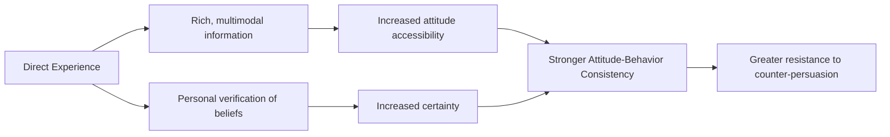

## Attitude Formation Through Direct Experience

### Definition

Attitude formation through direct experience refers to the process by which attitudes develop from an individual's own firsthand interaction with an attitude object, as opposed to formation through indirect means such as verbal/written information, observation of others, or secondhand persuasion. Direct experience is one of the most extensively studied pathways to attitude formation because it consistently produces attitudes with distinctive structural properties compared to indirectly formed attitudes.

### Core Distinguishing Properties

Attitudes formed via direct experience differ systematically from those formed indirectly along several dimensions:

| Property | Direct Experience | Indirect Experience |
| --- | --- | --- |
| Accessibility | High — comes to mind quickly and automatically | Lower — requires more retrieval effort |
| Confidence/certainty | Higher | Lower |
| Attitude-behavior consistency | Stronger predictor of future behavior | Weaker predictor |
| Resistance to counter-persuasion | Greater | Lesser |
| Clarity/definedness | Clearer, less ambiguous | Vaguer, more susceptible to reframing |
| Stability over time | Greater | Lesser |

**[Inference]** These differences are generally attributed to the richer, more multimodal information available through direct experience (sensory, affective, and behavioral information simultaneously) compared to the abstracted, filtered information typical of indirect sources such as verbal description.

### Fazio and Zanna's Foundational Research

Russell Fazio and Mark Zanna conducted a influential program of research (late 1970s–1980s) directly comparing direct- and indirect-experience attitudes. Key methodologies included:

- Having participants either directly interact with puzzles/tasks or merely read/hear descriptions of them, then measuring resulting attitude-behavior correlations.
- Comparing attitudes toward psychology courses formed by students who had actually enrolled and attended (direct) versus students who had only heard about the courses secondhand (indirect).

**Consistent finding:** attitude-behavior correlations were significantly higher for direct-experience attitudes than for indirect-experience attitudes, even when the reported attitude valence (how positive/negative) was similar across groups. This established that the *manner of formation*, not just the *content* of the attitude, affects the attitude's functional properties.

### Mechanisms Underlying the Direct Experience Effect

**1. Attitude accessibility.** Fazio's accessibility model proposes that direct experience strengthens the associative link in memory between the attitude object and its evaluation, so that encountering the object automatically and rapidly activates the associated evaluation. Stronger object-evaluation associations translate into faster attitude-behavior enactment because the attitude is available to guide behavior without deliberate retrieval.

$$\text{Object} \xrightarrow{\text{strong association}} \text{Automatic Evaluation} \xrightarrow{} \text{Behavior}$$

**2. Richness and multimodality of information.** Direct experience provides sensory, affective, and contextual information unavailable through verbal description alone, producing a more complete and vivid mental representation of the attitude object.

**3. Confidence from personal verification.** Direct experience allows the individual to personally test and confirm beliefs about the object, increasing subjective certainty relative to attitudes accepted secondhand on the word of others.

**4. Reduced counter-argument vulnerability.** Because direct-experience attitudes are grounded in personally verified information, they are less easily undermined by subsequent counter-attitudinal information or persuasive messages that merely offer alternative verbal claims.

### Illustrative Study Domains

**Housing/dormitory studies (Regan & Fazio, 1977).** Students who directly experienced a housing crisis (living with the practical consequences) showed stronger attitude-behavior consistency regarding housing-related attitudes and actions than students who only knew about the crisis through indirect information.

**Puzzle/task studies.** Participants given direct hands-on experience with intellectual puzzles showed attitudes toward the puzzles that more strongly predicted subsequent choice behavior (e.g., choosing to engage with the puzzles again) compared to participants who only read a description of the same puzzles.

**Consumer product trial.** Direct product experience (sampling, trial use) generally produces attitudes that are more predictive of purchase behavior than attitudes formed purely from advertising claims — a finding widely applied in marketing (free samples, trial periods, "try before you buy" strategies).

### Relationship to Mere Exposure

Direct experience should be distinguished from the **mere exposure effect** (Zajonc, 1968), in which repeated passive exposure to a stimulus (without necessarily interacting with or evaluating it) increases liking. Mere exposure can occur without genuine interactive "experience"; direct-experience attitude formation typically implies active behavioral engagement (using, testing, or interacting with the object), not just repeated perceptual contact.

**[Inference]** Both processes can operate together and are not mutually exclusive — repeated direct interactions with an object combine exposure-based affective boosts with experience-based belief and accessibility effects, potentially compounding attitude strength.

### Role in the Theory of Planned Behavior Framework

Direct experience is frequently cited as a key moderator within the broader attitude-behavior literature that informed Ajzen and Fishbein's Theory of Reasoned Action and Theory of Planned Behavior. Because direct-experience attitudes show stronger attitude-behavior correspondence, they serve as a clearer test case for these models' central prediction (that attitudes, subjective norms, and perceived behavioral control jointly predict behavioral intention and behavior).

### Boundary Conditions

- **Valence of the experience.** A single negative or highly salient direct experience can disproportionately shape resulting attitudes relative to an equivalent amount of neutral or mixed indirect information (related to negativity bias in impression formation).
- **Repetition and consistency.** Attitudes formed from a single direct experience are generally weaker than those formed from repeated, consistent direct experiences.
- **Domain relevance.** The direct-experience advantage is most robust for attitude objects where firsthand interaction yields diagnostic information (e.g., taste, usability, personal comfort); for abstract or highly technical objects (e.g., macroeconomic policy), direct experience may be impractical or uninformative, leaving indirect information as the primary formation route regardless.

**[Unverified]** The relative magnitude of the direct-versus-indirect experience effect across different attitude domains (consumer products vs. social attitudes vs. political attitudes) has not been uniformly quantified in a single meta-analytic estimate; effect sizes should be checked against domain-specific literature.

### Applications

- **Marketing:** free trials, product sampling, test drives, and demo periods are designed explicitly to leverage the stronger, more behavior-predictive attitudes generated by direct product experience compared to advertising claims alone.
- **Persuasion and attitude change resistance:** persuaders seeking to shift firmly held attitudes must typically work harder against direct-experience attitudes than against attitudes formed from secondhand information.
- **Prejudice reduction (contact hypothesis).** Direct, structured intergroup contact (per Allport's contact hypothesis) is theorized to produce more robust and behavior-consistent attitude change toward outgroups than indirect approaches such as media-based diversity messaging alone.
- **Education and training.** Experiential learning approaches (hands-on labs, simulations, internships) are used partly because they generate stronger, more durable, and more behavior-consistent attitudes toward the subject matter than lecture-only instruction.

**Related Topics**

- Attitude accessibility (Fazio's MODE model)
- Mere exposure effect
- Theory of Planned Behavior
- Attitude-behavior consistency and moderators
- Contact hypothesis (Allport)
- Self-perception theory (Bem)
- Cognitive dissonance theory