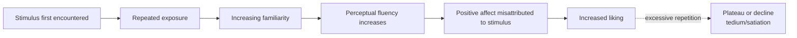

## Mere Exposure Effect

### Definition

The mere exposure effect refers to the psychological phenomenon in which repeated exposure to a stimulus increases an individual's positive evaluation of that stimulus, even in the absence of conscious recognition or reinforcement. The effect was systematically documented and named by Robert Zajonc in his landmark 1968 monograph, *Attitudinal Effects of Mere Exposure*.

**Core claim:** Liking increases as a function of exposure frequency alone — no interaction, reward, or conscious processing of the stimulus's content is required for the effect to occur.

### Zajonc's Foundational Studies

Zajonc's original research programs included:

- **Nonsense words/Chinese-like ideographs:** participants rated invented words or unfamiliar logographic characters as more positive in meaning the more frequently those items had been presented, despite having no actual semantic content.
- **Photographs of unfamiliar faces:** repeated presentation of previously unseen faces increased subsequent likability ratings of those faces relative to less-frequently-presented faces.
- **Turkish-like words:** similarly, invented foreign-sounding words rated more favorably with increasing exposure frequency.

**[Inference]** Because the stimuli used (nonsense syllables, unfamiliar ideographs) carried no pre-existing meaning or associations, these studies were designed to isolate exposure frequency itself as the operative variable, ruling out content-based explanations for increased liking.

### The Exposure-Affect Function

Zajonc proposed and subsequent research broadly supported a **curvilinear (inverted-U) relationship** between exposure frequency and liking: liking increases with exposure up to a point, then plateaus or, with excessive repetition, can decline (boredom or tedium effects).

### Theoretical Mechanisms

**1. Perceptual fluency / processing fluency account** (Bornstein & D'Agostino, 1994; Reber, Winkielman, & Schwarz, 1998)

Repeated exposure makes a stimulus easier and faster to perceptually process. This increased processing ease (fluency) is experienced as a subtle positive feeling, which is then **misattributed** to the stimulus itself rather than correctly attributed to the ease of processing — producing an inference of liking. This is currently the most widely supported explanatory mechanism.

**2. Zajonc's original affective-primacy account.**

Zajonc argued that affective reactions can occur independently of, and even prior to, cognitive/conscious recognition processes ("preferences need no inferences"), proposing a direct affective pathway that does not require conscious stimulus recognition.

**3. Classical conditioning account.**

Some theorists proposed that the absence of any negative consequence following repeated exposure to a neutral stimulus functions similarly to unreinforced conditioning, gradually building a positive association through safety/habituation.

**4. Two-factor theory (Berlyne, 1970).**

Proposes exposure has two opposing effects: an increase in liking via uncertainty/novelty reduction (positive), and an increase in tedium/boredom with continued exposure (negative) — jointly producing the inverted-U function.

**[Inference]** The fluency-misattribution account has accumulated the most consistent supporting evidence across subsequent decades of research, though Zajonc's original affective-primacy framing remains historically influential and the accounts are not entirely mutually exclusive.

### The Role of Subliminal/Unconscious Exposure

A particularly striking line of research found that the mere exposure effect occurs even when stimuli are presented **subliminally** (too briefly for conscious recognition, e.g., exposures of milliseconds followed by a masking stimulus). Bornstein's (1989) meta-analysis found that subliminal exposure produced *stronger* mere exposure effects than supraliminal (consciously perceivable) exposure in several study sets, supporting the claim that conscious recognition is not necessary for the effect and may in some cases interfere with it (e.g., via conscious correction or reactance to noticing repetition).

### Moderators (Bornstein's 1989 Meta-Analysis)

Bornstein's meta-analysis of over 200 mere exposure studies identified several reliable moderators:

- **Stimulus complexity:** the effect is generally stronger for simple stimuli than for highly complex ones.
- **Exposure duration:** very brief exposures tend to produce larger effects than longer exposures (up to a point).
- **Number of exposures:** effects generally increase up to approximately 10–20 exposures, after which additional exposures yield diminishing or reversing returns.
- **Delay between exposure and rating:** effects can persist and sometimes even strengthen after a delay, rather than decaying immediately.
- **Stimulus type:** effects have been documented across a very wide range of stimulus categories — words, images, sounds, faces, geometric shapes, and even foods.

**[Unverified]** Precise numeric thresholds (e.g., "10–20 exposures") represent general patterns identified in Bornstein's meta-analysis; exact optimal exposure counts vary by stimulus type and study, so a single fixed number should not be treated as universally established.

### Boundary Conditions and Limits

- **Initial valence of the stimulus.** If the initial reaction to a stimulus is strongly negative, repeated exposure can *increase* dislike rather than produce the standard positive effect (exposure amplifies the existing evaluative direction in some studies).
- **Awareness of the repetition.** If individuals become consciously aware that they are being repeatedly exposed and infer a persuasive or manipulative intent, the effect can be attenuated or reversed (a form of psychological reactance).
- **Individual differences.** Need for cognition, novelty-seeking, and other personality variables have been found to moderate the strength of the effect in some studies.

### Relationship to Attitude Formation

Mere exposure is one of several recognized **pathways to attitude formation**, alongside classical conditioning, operant conditioning, social learning, and direct experience. It is distinguished from direct-experience-based attitude formation because it does not require active behavioral interaction with the stimulus — passive perceptual exposure alone is sufficient.

**[Inference]** Because mere exposure operates largely outside conscious awareness and without deliberative evaluation, attitudes formed primarily through exposure may be more susceptible to fluency-based manipulation (e.g., advertising repetition) than attitudes formed through direct experience or effortful cognitive elaboration.

### Applications

**Advertising and marketing.** Repetition-based advertising strategies (brand name repetition, jingle repetition, product placement) leverage the mere exposure effect to build positive brand affect even without providing new informational content about the product.

**Political campaigns.** Repeated exposure to a candidate's name, face, or slogan (via yard signs, ads, media coverage) can increase favorability independent of policy content — a widely discussed application in political psychology.

**Interpersonal attraction.** Proximity and repeated incidental contact (e.g., "propinquity effect" in social psychology, classic Festinger, Schachter, & Back 1950 dormitory studies) have been linked to increased liking and friendship formation, consistent with mere exposure mechanisms operating in real-world social contexts.

**Design and aesthetics.** Familiar visual design elements (logos, layouts, interfaces) tend to be rated as more aesthetically pleasing than novel/unfamiliar designs, informing user-interface and branding design conventions.

### Distinguishing Mere Exposure from Related Phenomena

| Phenomenon | Key Distinction from Mere Exposure |
| --- | --- |
| Classical conditioning | Requires pairing with an affectively-laden unconditioned stimulus; mere exposure requires only repetition of a neutral stimulus |
| Availability heuristic | Concerns judged frequency/probability, not affective liking |
| Halo effect | Concerns generalization of one trait judgment to unrelated traits, not repetition-driven affect |
| Familiarity heuristic | Overlapping concept; often treated as a downstream judgment consequence of the same fluency mechanism |

**Related Topics**

- Processing fluency and misattribution of affect
- Attitude formation through direct experience
- Classical and operant conditioning of attitudes
- Propinquity effect and interpersonal attraction
- Availability heuristic
- Subliminal perception research
- Advertising psychology and repetition effects