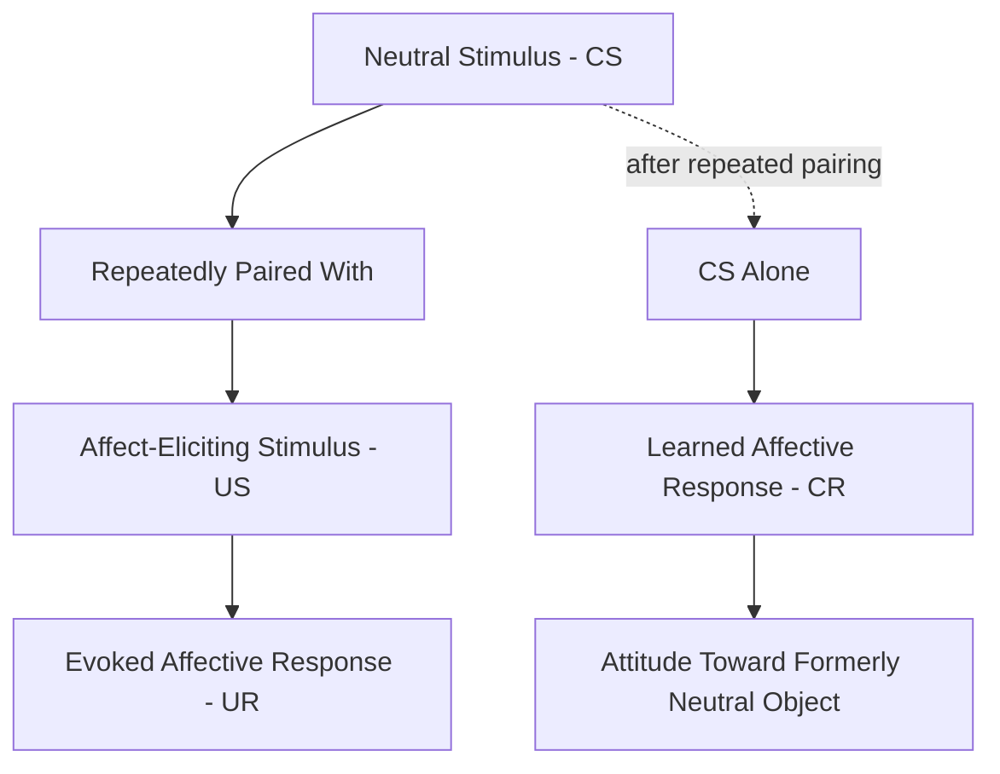
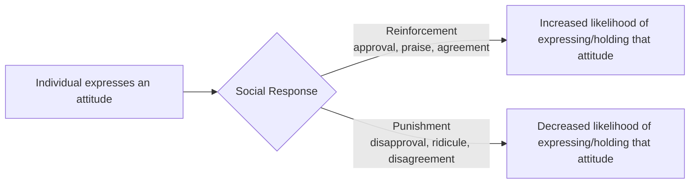

## Classical and Operant Conditioning of Attitudes

### Overview

Conditioning-based accounts of attitude formation propose that attitudes — like other learned responses — can be acquired through basic associative learning processes. Two foundational learning paradigms from behaviorist psychology, classical (Pavlovian) conditioning and operant (instrumental) conditioning, have each been applied to explain how evaluative reactions toward objects, people, and groups develop without necessarily requiring deliberate, conscious reasoning.

### Classical Conditioning of Attitudes

**Basic mechanism.** In classical conditioning, a previously neutral stimulus (conditioned stimulus, CS) is repeatedly paired with a stimulus that already elicits an affective/evaluative response (unconditioned stimulus, US). Over repeated pairings, the neutral stimulus comes to elicit a similar evaluative response on its own (conditioned response, CR) — even though no genuine causal or logical relationship connects the two stimuli.

$$\text{CS (neutral)} + \text{US (affect-eliciting)} \rightarrow \text{UR (affective response)}$$

$$\text{After pairing: CS alone} \rightarrow \text{CR (learned affective response)}$$

**Evaluative conditioning (EC).** The specific application of classical conditioning to attitude formation is often termed **evaluative conditioning**, a term introduced to distinguish it from Pavlovian conditioning of physiological/reflexive responses. Evaluative conditioning research (e.g., Levey & Martin, 1975; De Houwer, Thomas, & Baeyens, 2001) has demonstrated that pairing a neutral stimulus (e.g., an unfamiliar face, brand logo, or nonsense word) with a positively or negatively valenced stimulus (pleasant/unpleasant images, words, or scents) shifts evaluations of the neutral stimulus in the direction of the paired stimulus's valence.

**Distinguishing features of evaluative conditioning from classical physiological conditioning:**

- EC effects have been found to show greater **resistance to extinction** — repeated presentation of the CS alone (without the US) does not always eliminate the learned evaluative shift as reliably as it eliminates classically conditioned physiological responses.
- EC effects have been documented to occur, in some studies, without participants being able to consciously report the CS-US pairings, though the necessity of contingency awareness for EC remains actively debated in the literature.

**[Unverified]** The degree to which evaluative conditioning requires conscious awareness of the CS-US contingency is a genuinely contested empirical question; some studies report EC effects under conditions of minimal awareness while others find awareness moderates or is necessary for the effect, and the field has not reached full consensus.

**Illustrative applications:**

- **Advertising:** pairing a product (CS) repeatedly with attractive models, pleasant music, or enjoyable scenarios (US) to transfer positive affect to the product itself.
- **Attitudes toward social/ethnic groups:** repeated media pairings of a group with negative contexts (crime reporting, negative framing) have been studied as a mechanism contributing to the formation of prejudicial attitudes.
- **Staats and Staats (1958):** an early classic study pairing nationality names (e.g., "Dutch," "Swedish") with either positive or negative trait words, finding that the nationality names subsequently acquired evaluative connotations consistent with the valence of the words they had been paired with.

### Operant Conditioning of Attitudes

**Basic mechanism.** In operant conditioning, the strength of a behavior (including attitude-expressing behavior, such as stating an opinion) is shaped by its consequences — reinforcement increases the likelihood of the behavior recurring, while punishment decreases it. Applied to attitudes, operant conditioning explains how the *expression* and, over time, the internal *holding* of particular attitudes can be shaped by social reinforcement contingencies.

**Insko's (1965) telephone study.** A classic demonstration in which participants received verbal reinforcement ("good") over the telephone when they expressed attitudes consistent with a particular position and no reinforcement (or disagreement) when expressing the opposite position. Reinforced participants showed measurable shifts toward the reinforced attitude position, with some persistence of the shift found in follow-up measurement, illustrating that even minimal social reinforcement can shape reported attitudes.

**Mechanisms of social reinforcement for attitudes:**

- **Direct verbal reinforcement:** praise, agreement, or approval following expression of a particular view.
- **Social reward via group belonging:** expressing attitudes aligned with one's in-group is reinforced through acceptance, while deviation may be met with social punishment (exclusion, disapproval), shaping attitude conformity over time.
- **Parental/caregiver shaping:** children's early attitudes (toward food, activities, social groups) are substantially shaped through operant reinforcement contingencies applied by caregivers (praise for "correct" opinions, correction or punishment for "incorrect" ones).
- **Media and cultural reinforcement:** attitudes aligned with culturally dominant narratives may be implicitly reinforced through positive portrayal and social validation, while deviating attitudes may be socially costly to express.

### Comparison of the Two Conditioning Pathways

| Dimension | Classical Conditioning | Operant Conditioning |
| --- | --- | --- |
| Core process | Association between stimuli (CS-US pairing) | Consequences following behavior (reinforcement/punishment) |
| What gets learned | An evaluative/affective response to a previously neutral object | The likelihood of expressing or acting on a given attitude |
| Role of awareness | Debated; can occur with minimal awareness in some studies | Typically more consciously mediated (social feedback is often noticed) |
| Typical real-world example | Advertising pairing products with pleasant imagery | Peer/social approval shaping expressed political or group opinions |
| Primary target | The attitude object's evaluative valence itself | The behavioral expression/maintenance of the attitude |

### Integration with Broader Attitude Formation Theory

Both conditioning pathways are generally categorized alongside **mere exposure**, **social learning/observational learning**, and **direct experience** as core mechanisms of attitude formation that do not require deliberate, effortful reasoning about the attitude object's merits — distinguishing them from more cognitively elaborated formation routes (e.g., systematic evaluation of arguments, as described in dual-process persuasion models).

**[Inference]** Conditioning-based attitudes, particularly those formed through evaluative conditioning with minimal conscious elaboration, may function similarly to implicit attitudes in showing weaker correspondence with deliberately reasoned, explicit self-reports — though this relationship depends on the specific measurement approach used and is not uniform across studies.

### Critiques and Limitations

**Contingency awareness debate.** As noted above, whether evaluative conditioning genuinely operates independently of conscious awareness of the CS-US relationship remains disputed; some researchers argue apparent "unaware" EC effects reflect methodological limitations in awareness measurement rather than a truly non-conscious learning process.

**Ecological validity of laboratory paradigms.** Classic conditioning studies (e.g., Staats and Staats) have faced methodological critique regarding demand characteristics — participants may have inferred the experimenter's intent and responded accordingly rather than undergoing genuine associative learning.

**Durability outside the lab.** **[Inference]** The persistence of conditioned attitude shifts produced in brief laboratory sessions over long real-world time periods is less well established than the immediate post-conditioning effects typically reported; most studies measure attitudes shortly after conditioning rather than tracking long-term durability.

### Applications

- **Advertising and branding:** systematic pairing of products/brands with positively valenced imagery, music, and endorsers (evaluative conditioning).
- **Political and social messaging:** repeated pairing of political figures, parties, or policies with emotionally charged imagery or language.
- **Prejudice formation and reduction:** understanding how repeated negative media pairings can contribute to group-based prejudice, and conversely how counter-conditioning (pairing out-group members with positive contexts) has been explored as an intervention strategy.
- **Consumer behavior:** loyalty programs and social reinforcement (public recognition, badges, social approval features) shaping consumer brand attitudes and repeat purchase behavior.
- **Parenting and education:** understanding how early attitude formation toward food, exercise, learning, and social groups is shaped by caregiver reinforcement patterns.

**Related Topics**

- Evaluative conditioning and contingency awareness
- Mere exposure effect
- Attitude formation through direct experience
- Social learning theory (Bandura) and observational learning
- Implicit attitudes and the Implicit Association Test
- Dual-process models of persuasion (Elaboration Likelihood Model)
- Prejudice formation and reduction strategies