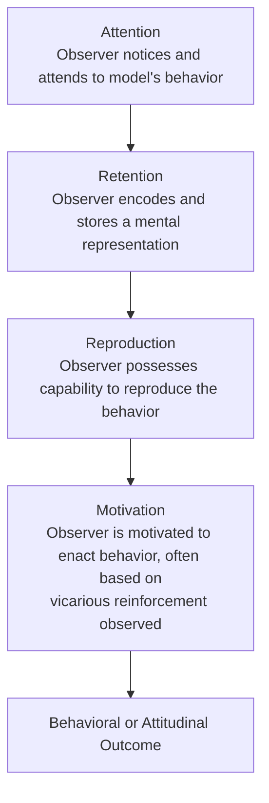

## Social Learning and Attitude Acquisition

### Definition and Theoretical Foundation

Social learning theory, developed primarily by Albert Bandura (1960s–1980s), proposes that attitudes, along with behaviors and beliefs, can be acquired through observation of others rather than solely through direct personal experience, conditioning, or deliberate instruction. This pathway is distinguished from direct classical/operant conditioning of the observer, because the *observer* need not personally experience any reinforcement, punishment, or stimulus pairing — learning occurs vicariously through watching a **model's** behavior and its consequences.

**Core premise:** Humans are capable of acquiring complex evaluative and behavioral repertoires by observing models (parents, peers, media figures, authority figures) and the consequences those models experience, without requiring the observer's own direct trial-and-error learning.

### Bandura's Bobo Doll Studies

Bandura's classic experiments (1961, 1963) provided the foundational empirical demonstration of observational learning:

- Children observed an adult model behaving aggressively toward an inflatable "Bobo doll" (hitting, kicking, using verbally aggressive phrases).
- Children who observed the aggressive model subsequently displayed significantly more imitative aggressive behavior toward the doll than children in control conditions who had not observed the aggressive model.
- Later variations manipulated whether the model was **rewarded, punished, or received no consequence** for the aggressive behavior, finding that children were more likely to imitate aggression when the model had been rewarded or had faced no negative consequence — demonstrating **vicarious reinforcement**.

**[Inference]** The Bobo doll paradigm is most directly a demonstration of behavioral imitation; its extension to *attitude* acquisition (evaluative stance toward aggression, rather than mere behavioral mimicry) is an inference drawn from the broader social learning framework rather than a direct measurement of children's underlying attitudes in the original studies.

### Core Component Processes of Observational Learning

Bandura's model specifies four sub-processes necessary for observational learning to translate into acquired behavior or attitude:

- **Attention:** the observer must notice and attend to the model and the relevant behavior. Attention is influenced by model characteristics (attractiveness, perceived competence, similarity to observer, status).
- **Retention:** the observed information must be encoded into memory, often via symbolic/verbal or imaginal representation, for later retrieval.
- **Reproduction (motor reproduction):** the observer must possess the physical/cognitive capability to reproduce the observed behavior.
- **Motivation:** the observer must be motivated to enact the learned behavior or adopt the associated attitude — heavily influenced by whether the model's behavior was observed to be rewarded (**vicarious reinforcement**) or punished (**vicarious punishment**).

### Vicarious Reinforcement and Attitude Formation

A central mechanism linking observational learning specifically to *attitude* (rather than just behavior) acquisition is **vicarious reinforcement**: observing a model receive positive or negative consequences for expressing or acting on a particular attitude shapes the observer's own evaluative stance toward the attitude object, even without the observer personally experiencing any consequence.

**Example:** A child who observes a parent expressing enthusiasm and receiving social approval for supporting a particular sports team, political party, or cultural practice is more likely to adopt a similarly positive attitude toward that object, even without any direct reinforcement history of their own.

### Model Characteristics That Enhance Attitude Transmission

Research on social learning has identified several factors that increase the likelihood an observer will adopt a model's attitude:

- **Perceived similarity:** observers are more likely to adopt attitudes modeled by others perceived as similar to themselves (in age, group membership, or identity).
- **Model status/prestige:** high-status or admired models (celebrities, respected authority figures, high-status peers) exert disproportionate influence on attitude formation.
- **Model warmth and nurturance:** particularly relevant in parent-child attitude transmission; warmer, more nurturant models are more effective at transmitting attitudes to children.
- **Consistency of the modeled attitude:** attitudes modeled consistently across multiple contexts and multiple observed instances are more readily adopted than inconsistently modeled attitudes.
- **Multiple models:** exposure to the same attitude modeled by multiple different individuals (parents, peers, media) increases the strength and generalization of the resulting attitude.

### Key Domains of Application

**Parent-to-child attitude transmission.** Extensive research on political attitudes, religious attitudes, and prejudice has documented substantial intergenerational transmission through modeling — children's political party identification and broad ideological leanings correlate with parents' at rates notably above chance, an effect widely attributed in part to social learning processes (alongside genetic and shared-environment factors more broadly studied in behavioral genetics).

**Media modeling.** Observational learning is a foundational mechanism underlying research on media effects, including studies of televised violence, advertising, and portrayals of social groups. Repeated media modeling of particular attitudes toward gender roles, ethnic groups, or consumer products is theorized to shape audience attitudes via the same attention-retention-reproduction-motivation process.

**Peer influence and adolescent attitude formation.** Peer modeling is a particularly potent influence during adolescence, contributing to attitude formation regarding substance use, risk behavior, and social/political identity, often mediated by perceived peer norms and vicarious social reinforcement (peer approval/disapproval).

**Prejudice acquisition.** Children's attitudes toward social out-groups have been studied as substantially shaped by observing parents', peers', and media models' expressed attitudes and behaviors toward those groups, even in the absence of direct intergroup contact.

### Relationship to Other Attitude Formation Pathways

| Pathway | Observer's Role | Requires Direct Consequence to Observer? |
| --- | --- | --- |
| Classical conditioning | Personally experiences CS-US pairing | No direct reinforcement required, but direct stimulus exposure required |
| Operant conditioning | Personally experiences reinforcement/punishment | Yes |
| Mere exposure | Personally exposed to stimulus | No reinforcement required, passive exposure sufficient |
| Social learning/observational | Observes another's experience and consequences | No — learning is vicarious |
| Direct experience | Personally interacts with the object | Yes, active interaction |

**[Inference]** Social learning is theoretically distinct from the other pathways primarily in that the reinforcement contingency needed to shape the attitude operates on the *model*, not the *observer* — making it uniquely capable of transmitting attitudes across generations and social networks without requiring every individual to undergo their own direct conditioning history.

### Critiques and Boundary Conditions

**Selective imitation.** Not all observed models or behaviors are imitated equally; observers exercise selective attention and are more influenced by high-relevance, high-status, or high-similarity models, meaning social learning is not a uniform "copy everything observed" process.

**Cognitive mediation.** Later refinements of the theory (Bandura's shift toward "social cognitive theory") emphasized that observers actively and cognitively interpret modeled behavior rather than passively absorbing it, incorporating self-efficacy beliefs and outcome expectancies as mediating variables between observation and adopted attitude/behavior.

**Methodological challenges in real-world attitude transmission research.** **[Inference]** Distinguishing genuine observational-learning-based attitude transmission from shared genetic predispositions or shared environmental/structural factors (e.g., family socioeconomic status, neighborhood context) in real-world parent-child or peer attitude correlations is methodologically difficult; correlational studies of attitude similarity across models and observers cannot alone establish social learning as the causal mechanism without additional experimental or longitudinal design elements.

### Applications

- **Public health messaging:** campaigns using relatable peer or community models to shift attitudes toward health behaviors (vaccination, smoking cessation, exercise).
- **Media literacy and violence prevention:** informing debates and policy around media content regulation based on observational learning's implications for modeled aggression.
- **Diversity and inclusion training:** leveraging positive intergroup modeling (showing respected figures engaging positively with out-group members) as an attitude-change strategy.
- **Marketing and influencer strategy:** brand use of high-status, relatable "influencer" models to shape consumer attitudes via parasocial observational learning.
- **Developmental and educational psychology:** informing classroom and parenting practices around modeling desired attitudes toward learning, effort, and social behavior.

**Related Topics**

- Bandura's Bobo doll experiments and social cognitive theory
- Vicarious reinforcement and punishment
- Classical and operant conditioning of attitudes
- Intergenerational transmission of political/religious attitudes
- Media effects research
- Prejudice formation and intergroup attitudes
- Self-efficacy theory