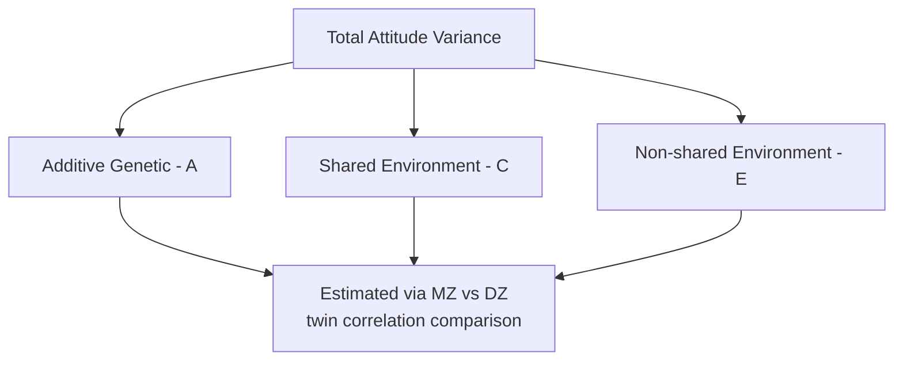
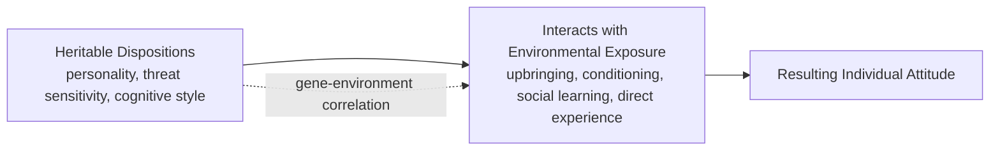

## Genetic and Dispositional Bases of Attitudes

### Definition and Theoretical Context

The genetic and dispositional bases of attitudes refers to the body of research within social and behavioral genetics demonstrating that a portion of the variance in individual attitudes is attributable to heritable, biologically-based dispositional factors rather than solely to environmental, experiential, or social learning processes. This line of research emerged as a corrective/complement to purely environmental models of attitude formation (conditioning, social learning, direct experience), showing that genetics contributes non-trivially to attitude variation across individuals.

**Core premise:** While attitudes are clearly shaped by experience, twin and behavioral genetics studies consistently find that identical (monozygotic) twins show greater attitude similarity than fraternal (dizygotic) twins even when reared in comparably similar environments, implying a genetic contribution to individual differences in attitudes.

### Behavioral Genetics Methodology

**Twin study design (classical twin method).** The primary methodology compares attitude similarity (concordance) between monozygotic (MZ) twins, who share approximately 100% of their segregating genes, and dizygotic (DZ) twins, who share on average 50%, like typical siblings. Both twin types are typically reared in the same household, allowing shared environment to be approximately held constant across the comparison.

$$h^2 \approx 2(r_{MZ} - r_{DZ})$$

Where $h^2$ is the estimated heritability coefficient, $r_{MZ}$ is the correlation of the attitude between MZ twin pairs, and $r_{DZ}$ is the correlation between DZ twin pairs (Falconer's formula, a simplified estimate used in classical twin methodology).

**Variance decomposition (ACE model).** Twin studies typically partition trait variance into three components:

- **A (additive genetic variance):** variance attributable to genetic differences.
- **C (shared/common environment):** variance attributable to environmental influences shared by twins raised together (family, neighborhood, schooling).
- **E (non-shared/unique environment):** variance attributable to environmental influences unique to each twin (individual experiences, measurement error).

### Key Empirical Findings

**Political attitudes.** Alford, Funk, and Hibbing's (2005) influential twin study, analyzing data from large twin registries, found substantial heritability estimates for broad political ideology and specific policy attitudes, with heritability estimates for many political attitude items falling in a moderate range. Subsequent research (e.g., Hatemi et al., 2014, large-scale international twin study) has broadly replicated heritable influences on political ideology across multiple national samples.

**Religiosity.** Twin studies have found genetic contributions to individual differences in religious attitudes and religiosity, though the specific *content* of religious belief (which religion, specific doctrines) shows much stronger shared-environmental influence (reflecting the obvious role of family religious upbringing), while the *intensity* or general disposition toward religiosity shows more evidence of heritable influence.

**Job satisfaction attitudes.** Arvey et al. (1989) found evidence of heritable influence on job satisfaction using a twins-reared-apart design, a finding notable because it demonstrated genetic influence even on an attitude that seems intuitively tied to specific external circumstances (one's actual job).

**Specific attitude objects.** Olson, Vernon, Harris, and Jang (2001) examined heritability across a wide range of specific attitudes (e.g., attitudes toward the death penalty, jazz music, reading, roller coasters) and found meaningful heritability estimates for a substantial subset of attitudes, though heritability varied considerably by specific attitude object.

**[Unverified]** Specific heritability percentages reported across these studies vary by sample, twin registry, country, and statistical model used; precise point estimates (e.g., "heritability of X attitude is Y%") should be checked against the specific source study rather than treated as fixed universal constants.

### Proposed Mechanisms Linking Genes to Attitudes

Genes are not proposed to code directly for specific attitudes (e.g., there is no "supports tax policy X" gene). Instead, several indirect mechanisms have been proposed:

**1. Heritable personality traits.** Attitudes may be partly heritable because they are downstream of heritable personality dispositions. For example, heritable variation in traits such as Openness to Experience and Conscientiousness (from the Five-Factor Model) has been linked to political and social attitude variation, since these personality traits are themselves substantially heritable.

**2. Heritable cognitive and perceptual styles.** Differences in traits such as need for cognition, negativity bias, disgust sensitivity, and threat sensitivity — themselves showing heritable variation — have been linked to attitude domains such as political conservatism (e.g., research linking heightened disgust sensitivity and threat sensitivity to more socially conservative attitudes).

**3. Heritable physiological reactivity.** Some studies have examined links between physiological reactivity (e.g., skin conductance responses to threatening or disgusting images) and political attitudes, proposing that heritable variation in basic physiological threat-response systems may contribute to attitude formation in domains such as security and social-order-related policy attitudes.

**4. Gene-environment correlation (rGE) and gene-environment interaction (GxE).** **[Inference]** Heritable dispositions may shape which environments and experiences an individual selects into or evokes from others (active and evocative gene-environment correlation), meaning genetic influence on attitudes may operate partly *through* shaping an individual's environmental exposures rather than through a direct biological pathway to the attitude itself.

### Boundary Conditions and Critiques

**Twin study assumptions.** The classical twin method rests on the **equal environments assumption (EEA)** — that MZ and DZ twins experience comparably similar environments, such that greater MZ similarity reflects genetic rather than differential environmental treatment. This assumption has been criticized, since MZ twins may in practice be treated more similarly by parents, peers, and society than DZ twins (e.g., more likely to be dressed alike, mistaken for each other, or share more overlapping social environments), potentially inflating heritability estimates if unaccounted for.

**Specificity vs. generality.** Some attitude objects show near-zero heritability while others show more substantial heritable variance; broad generalizations that "attitudes are heritable" without specifying which attitude domain risk overstating a genuinely heterogeneous pattern of findings.

**Molecular genetics limitations.** **[Unverified]** While twin studies estimate aggregate heritability, attempts to identify specific individual genes or genetic variants (candidate gene studies, genome-wide association studies) associated with particular political or social attitudes have generally yielded small, inconsistent, or non-replicated individual gene effects — consistent with the broader pattern in behavioral genetics that complex psychological traits are highly polygenic (influenced by very many genes of small individual effect) rather than attributable to a small number of identifiable "attitude genes."

**Not deterministic.** **[Inference]** Heritability estimates describe the proportion of variance in attitudes *within a specific studied population* attributable to genetic differences; they do not indicate that any individual's specific attitude is biologically fixed or immune to environmental influence, persuasion, or change over the lifespan.

### Relationship to Environmental Pathways

Genetic and dispositional accounts of attitude formation are not proposed as a replacement for environmental mechanisms (conditioning, direct experience, social learning, mere exposure) but as an additional layer operating in interaction with them. **[Inference]** The prevailing contemporary view in behavioral genetics and social psychology treats attitude formation as resulting from the interplay of heritable dispositional tendencies and environmental/experiential shaping, rather than treating "nature" and "nurture" as competing, mutually exclusive explanations.

### Applications

- **Political psychology:** informing debate over the origins of ideological polarization and whether persuasion-based interventions can be expected to shift attitudes with strong heritable/dispositional components as readily as more purely environmentally-formed attitudes.
- **Personality-attitude research:** informing person-based (rather than purely situational) models of attitude and persuasion susceptibility.
- **Public health and policy communication:** understanding why some health or risk-related attitudes may be more resistant to informational campaigns if they are substantially rooted in dispositional traits such as threat sensitivity.
- **Debates on nature-nurture and free will in attitude change:** contributing to broader theoretical discussions about the limits of purely rationalist or purely environmental models of belief and attitude change.

**Related Topics**

- Twin studies and behavioral genetics methodology
- Big Five personality traits and political attitudes
- Disgust sensitivity and political conservatism research
- Gene-environment correlation and interaction
- Attitude strength and resistance to persuasion
- Social learning and attitude acquisition
- Heritability of personality traits