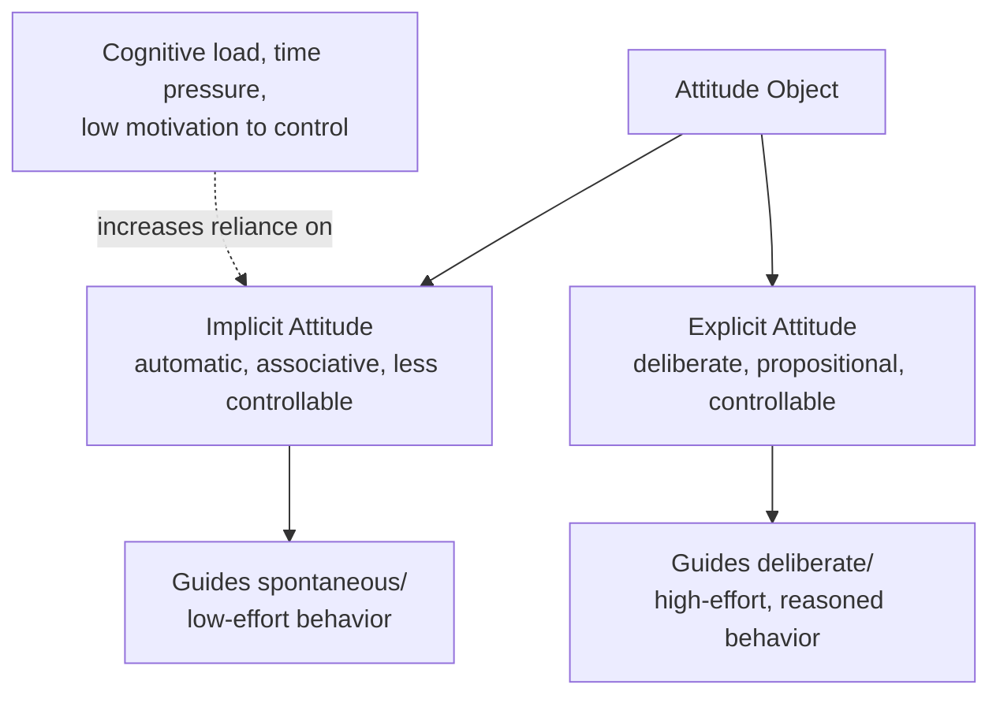

## Implicit Versus Explicit Attitudes

### Definitions

**Explicit attitudes** are consciously accessible evaluations that an individual can deliberately introspect upon, endorse, and report. They are typically assessed via direct self-report methods and are assumed to be under a degree of intentional control, making them susceptible to social desirability concerns, self-presentation motives, and deliberate editing.

**Implicit attitudes** are evaluative associations between an attitude object and positive or negative valence that can influence judgment, perception, and behavior with limited conscious awareness, intention, or control. The concept was formalized within **implicit social cognition** research, notably by Greenwald and Banaji (1995), who defined implicit attitudes as introspectively unidentified (or inaccurately identified) traces of past experience that mediate favorable or unfavorable feeling toward a social object.

### The Dual-Attitudes Model

Wilson, Lindsey, and Schooler (2000) proposed the **dual-attitudes model**, suggesting that a single individual can simultaneously hold two different attitudes toward the same object — an implicit attitude and an explicit attitude — which can diverge in valence or strength. According to this model:

- The implicit attitude is typically older, more slowly formed, and rooted in early or repeated learning experiences.
- The explicit attitude can be more recently formed or revised (e.g., through deliberate reasoning, new information, or motivated updating) but coexists with, rather than fully overwriting, the implicit attitude.
- Which attitude guides behavior in a given moment depends on the availability of cognitive resources and motivation: explicit attitudes tend to guide deliberate, controlled behavior when the individual has time and motivation to reflect, while implicit attitudes tend to guide spontaneous, less controlled behavior, especially under cognitive load or time pressure.

### Measurement of Explicit Attitudes

Standard direct self-report methods include:

- **Likert-type rating scales** (agreement/disagreement with attitude statements).
- **Semantic differential scales** (bipolar adjective ratings, e.g., good–bad, favorable–unfavorable).
- **Feeling thermometers** (commonly used in political attitude research, rating warmth toward a group/figure on a 0–100 scale).

**Limitations:** explicit measures are vulnerable to social desirability bias, self-presentation concerns, limited introspective access to one's own true evaluative reactions, and deliberate impression management — particularly problematic for socially sensitive topics such as prejudice.

### Measurement of Implicit Attitudes

**Implicit Association Test (IAT; Greenwald, McGhee, & Schwartz, 1998).** The most widely used implicit measure. Participants rapidly sort stimuli into paired categories (e.g., "Black/White" combined with "Good/Bad") using two response keys. The core logic: if an association between a category and a valence is strong, sorting is faster when the category and valence share a response key (congruent pairing) than when they do not (incongruent pairing). The **IAT effect** (D-score) is calculated from the difference in average response latency between congruent and incongruent blocks.

**Affect Misattribution Procedure (AMP; Payne et al., 2005).** Participants are briefly shown a prime stimulus (the attitude object) followed by an ambiguous target (e.g., a Chinese ideograph), which they must rate as more or less pleasant than average. Because the prime is presented too briefly for deliberate evaluation, participants' pleasantness ratings of the ambiguous target are influenced by (and thus reveal) their automatic evaluative reaction to the prime.

**Evaluative priming task.** Measures the speed with which participants classify clearly positive or negative target words following brief exposure to an attitude-object prime; faster classification of congruent valence targets indicates an implicit association.

**Physiological/neuroscience measures.** Facial electromyography (EMG), event-related potentials (ERPs, e.g., the P2/N400 components), and amygdala activation (fMRI) have also been used as convergent implicit indicators, particularly in research on implicit prejudice.

### The Implicit-Explicit Correspondence Problem

A central and heavily studied empirical question is the degree of correlation between implicit and explicit measures of the same attitude object. Meta-analytic work (e.g., Hofmann et al., 2005; Greenwald et al., 2009) has generally found:

- **Correspondence is modest overall**, with correlations varying substantially by topic domain.
- **Correspondence tends to be higher** for less socially sensitive attitude domains (e.g., consumer preferences, some political attitudes) where explicit reporting is less subject to social desirability pressure.
- **Correspondence tends to be lower** for socially sensitive domains, particularly intergroup attitudes and prejudice, where explicit measures are more heavily filtered by self-presentation concerns.

**[Inference]** The pattern of lower correspondence specifically in socially sensitive domains is generally interpreted as evidence that implicit measures can reveal evaluative associations that individuals are unwilling or unable to report explicitly — though this interpretation itself remains a topic of ongoing methodological debate (see critiques below).

### Predictive Validity

Research has examined whether implicit and explicit measures differentially predict different categories of outcome behavior:

- **Explicit measures** tend to better predict deliberate, controllable behaviors where individuals have time, motivation, and opportunity to align behavior with their stated views (e.g., explicit policy positions, deliberate consumer choices).
- **Implicit measures** have been found in some studies to better predict spontaneous, less controllable nonverbal behaviors (e.g., microexpressions, seating distance, nonverbal friendliness in interracial interactions) — a pattern documented in some studies of interracial interaction behavior, where implicit prejudice measures predicted nonverbal discomfort/avoidance behaviors better than explicit self-reported prejudice measures did.

**[Unverified]** The overall predictive validity of the IAT specifically for real-world discriminatory *behavior* (as opposed to laboratory nonverbal measures) has been a subject of significant debate and critique in more recent meta-analytic reassessments; effect sizes reported for IAT-behavior correlations have varied considerably across reviews, and researchers differ in their conclusions about the practical predictive utility of the measure. Consult recent meta-analyses directly for current effect-size estimates rather than treating early findings as settled.

### Critiques and Methodological Debates

**Reliability concerns.** The IAT has been criticized for relatively modest test-retest reliability compared to many explicit self-report measures, raising concerns about its suitability for assessing a single individual's implicit attitude with precision (as opposed to aggregate group-level research use).

**Construct validity debate.** Some researchers have questioned whether the IAT purely measures individual-level implicit *attitudes*, or whether it partly reflects cultural knowledge/familiarity with stereotypical associations that an individual may personally reject at a genuine attitudinal level (i.e., "knowing" a stereotype exists in the culture is not equivalent to personally endorsing it).

**Practical/applied use controversy.** The use of IAT results for individual diagnostic feedback (e.g., in diversity training contexts, telling individuals they harbor "implicit bias") has drawn methodological criticism given the measure's psychometric limitations at the individual level, distinct from its utility in aggregate research settings.

**Single-attitude vs. dual-attitude debate.** Some theorists (e.g., propositional/associative models such as the APE model — Associative-Propositional Evaluation model, Gawronski & Bodenhausen, 2006) reject the idea of two literally separate "attitudes," instead proposing a single underlying associative memory structure from which both implicit and explicit evaluative *responses* are generated via different processing routes (automatic associative activation vs. deliberate propositional reasoning), rather than positing two independently stored attitude representations.

### The APE Model as a Refinement

The **Associative-Propositional Evaluation (APE) model** proposes:

- **Associative processes** generate automatic affective reactions based on pattern activation in memory (producing implicit measure results).
- **Propositional processes** involve deliberate validation of these automatic reactions against other beliefs and logical consistency considerations, producing explicit judgments — which can diverge from the automatic associative reaction if it is deemed invalid, socially unacceptable, or inconsistent with other held beliefs.

This model accounts for both correspondence and divergence between implicit and explicit measures within a single underlying cognitive architecture, rather than requiring two entirely separate stored attitudes.

### Applications

- **Prejudice and stereotyping research:** widely used to study automatic intergroup bias distinct from consciously endorsed prejudice, informing debates about "modern" or "aversive" forms of prejudice that coexist with genuine explicit egalitarian beliefs.
- **Consumer psychology:** assessing brand attitudes that may not be fully captured by explicit surveys alone.
- **Health psychology:** assessing implicit attitudes toward health behaviors (e.g., implicit attitudes toward smoking, exercise) as predictors of behavior alongside explicit intentions.
- **Organizational behavior:** informing (with significant caveats regarding individual-level reliability) discussions of bias in hiring, evaluation, and workplace interactions.
- **Clinical psychology:** implicit measures of self-esteem and implicit attitudes toward self-harm-related stimuli have been explored as adjunct assessment tools in some research contexts.

**Related Topics**

- Implicit Association Test: methodology and critiques
- Dual-process models of social cognition
- Associative-Propositional Evaluation (APE) model
- Aversive and modern racism theories
- Evaluative conditioning and implicit attitude formation
- Attitude-behavior consistency
- Social desirability bias in self-report measurement