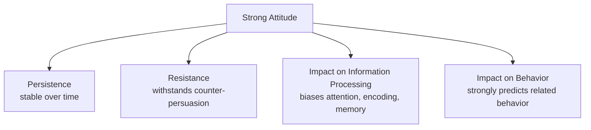
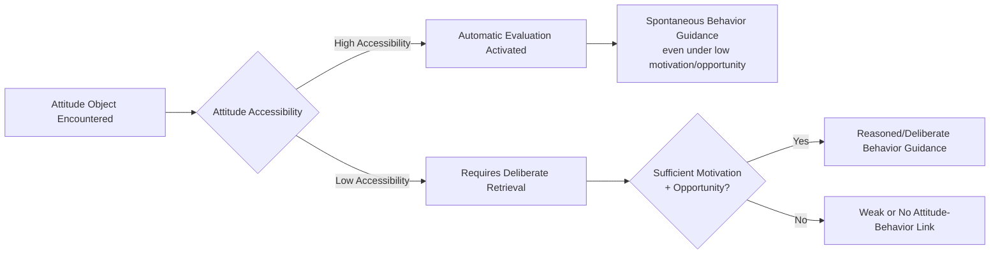

## Attitude Strength and Accessibility

### Definition of Attitude Strength

Attitude strength is a meta-attitudinal construct referring to the degree to which an attitude is durable (resistant to change and stable over time) and impactful (influential on cognition and behavior). Rather than treating attitudes as uniform, the attitude strength literature recognizes that attitudes vary substantially in their underlying quality — two individuals can report identical attitude valence and extremity (e.g., both "strongly favor" a policy) while differing dramatically in how firmly held, resistant, and behaviorally consequential that attitude actually is.

**Core distinction:** attitude strength is conceptually separate from attitude **valence** (positive/negative direction) and **extremity** (how far from neutral). A moderately-valenced attitude can be strong, and an extreme attitude can be weak, depending on the underlying strength-related properties.

### Consequences of Strong Attitudes

Strong attitudes are theorized and empirically shown to produce four key downstream consequences (Krosnick & Petty, 1995):

- **Persistence over time:** strong attitudes remain stable across long time intervals rather than drifting or being forgotten.
- **Resistance to persuasion:** strong attitudes are harder to change via counter-attitudinal messages, even strong or well-reasoned ones.
- **Influence on information processing:** strong attitudes bias attention toward attitude-consistent information, selective exposure, and biased interpretation/recall of ambiguous information.
- **Influence on judgment and behavior:** strong attitudes more reliably guide related judgments and predict corresponding behavior.

### Core Dimensions of Attitude Strength

The attitude strength literature has proposed numerous specific sub-dimensions; the most consistently studied include:

| Dimension | Description |
| --- | --- |
| **Accessibility** | Speed/ease with which the attitude is automatically activated from memory upon encountering the object |
| **Certainty** | Subjective confidence that the attitude is correct or valid |
| **Importance** | Personal significance attached to the attitude object |
| **Ambivalence** | Degree to which the attitude contains conflicting positive and negative evaluative components |
| **Elaboration** | Amount of effortful cognitive processing/thought that went into forming the attitude |
| **Knowledge** | Amount of attitude-relevant information the person possesses |
| **Direct experience** | Whether the attitude was formed via firsthand interaction with the object |
| **Affective-cognitive consistency** | Degree of alignment between the affective and cognitive components of the attitude (relates to the ABC model) |

**[Inference]** These dimensions are moderately intercorrelated but empirically separable — an attitude can be high on one dimension (e.g., importance) while relatively low on another (e.g., accessibility), meaning attitude strength is best treated as a multidimensional rather than unidimensional construct.

### Attitude Accessibility in Depth

**Definition.** Accessibility refers specifically to the strength of the associative link between the attitude object and its evaluation in memory — operationalized empirically as the speed (response latency) with which an individual can report their evaluation upon encountering the attitude object.

**Fazio's MODE Model.** Russell Fazio's **MODE model** (Motivation and Opportunity as DEterminants of attitude-behavior processes) formalizes accessibility's functional role: highly accessible attitudes are spontaneously and automatically activated upon mere encounter with the attitude object, requiring no motivation or deliberative effort, and can therefore guide behavior even under low-motivation or low-opportunity conditions (time pressure, cognitive load, distraction).

$$\text{Object encountered} \xrightarrow{\text{strong O-E association}} \text{Automatic attitude activation} \xrightarrow{} \text{Behavior guidance (spontaneous)}$$

Where less accessible attitudes require deliberate, motivated retrieval and reasoning to guide behavior — meaning their behavioral influence depends more heavily on the individual having sufficient motivation and cognitive opportunity to engage in that deliberate process.

**Measurement of accessibility.** Typically operationalized via **response latency** — how quickly a participant can respond to an attitude-object prompt (e.g., "press the key indicating your evaluation as fast as possible upon seeing this word"). Faster response times indicate higher accessibility, reflecting a stronger automatic object-evaluation association.

### Origins of High Accessibility

Several factors increase attitude accessibility:

- **Direct experience:** attitudes formed through firsthand interaction tend to be more accessible than those formed indirectly (see prior chapter item on direct experience).
- **Repeated expression:** repeatedly stating or rehearsing an attitude strengthens the object-evaluation link, increasing accessibility (a well-documented finding — repeated attitude expression alone, even without new information, increases accessibility).
- **Frequency of activation:** every instance of activating the attitude (thinking about, discussing, or acting on it) further strengthens the associative link, creating a positive-feedback cycle.

### Accessibility's Relationship to the Attitude-Behavior Link

Accessibility is one of the most robust and well-established moderators of the classic **attitude-behavior consistency** problem identified by early researchers such as LaPiere. Fazio and colleagues demonstrated across numerous studies that attitudes measured with shorter response latencies (indicating higher accessibility) more strongly predicted subsequent related behavior than lower-accessibility attitudes of the same reported valence.

### Attitude Ambivalence

**Definition.** Ambivalence refers to the simultaneous presence of both positive and negative evaluative reactions toward the same attitude object, producing an internally conflicted evaluative state.

**Objective vs. subjective ambivalence:**

- **Objective (potential) ambivalence** is calculated from separately-measured positive and negative reactions using a formula such as Thompson, Zanna, and Griffin's (1995) ambivalence index, where high scores on *both* positive and negative components (rather than a moderate score on a single bipolar scale) indicate high ambivalence.
- **Subjective (felt) ambivalence** is the individual's own self-reported experience of feeling conflicted, torn, or uncertain about the attitude object — which does not always align perfectly with objectively calculated ambivalence scores.

**Consequences of ambivalence:** highly ambivalent attitudes tend to be less stable over time, more susceptible to situational context effects, more responsive to persuasive messages (since some competing evaluative basis is already present to build upon), and more likely to produce indecisive or context-dependent behavior.

### Attitude Certainty

Certainty reflects the individual's confidence that their attitude is the "correct" one to hold. Petrocelli, Tormala, and Rucker (2007) further distinguished:

- **Attitude clarity:** confidence about knowing what one's attitude actually is.
- **Attitude correctness:** confidence that the held attitude is the valid/right one to have.

Both sub-facets have been found to independently contribute to overall attitude strength-related outcomes such as resistance to persuasion and attitude-behavior consistency.

### Importance

Attitude importance reflects the subjective significance an individual attaches to an attitude object, often rooted in self-interest, social identification (linking the attitude to valued in-group identity), or value-relevance (linking the attitude to core personal values). Important attitudes are more resistant to persuasion, more accessible, and show greater attitude-behavior consistency, though importance is theoretically and empirically distinguishable from accessibility (an attitude can be personally important yet not automatically/rapidly accessible if it has not been frequently rehearsed or activated).

### Integration: Strength Dimensions Are Correlated but Distinct

**[Inference]** While the various strength-related dimensions (accessibility, certainty, importance, low ambivalence, elaboration) tend to positively intercorrelate and jointly predict resistance to change and behavioral consistency, factor-analytic work has generally found they do not collapse into a single unidimensional "strength" factor, supporting continued treatment of attitude strength as a multidimensional construct in research design and measurement.

### Applications

- **Persuasion and marketing:** understanding that low-accessibility, low-importance, ambivalent attitudes are the most viable targets for successful persuasive campaigns, while highly accessible, important, univalent attitudes require substantially more effort to shift.
- **Political psychology:** using attitude strength measures (certainty, importance, accessibility) to predict voting behavior, political participation, and resistance to campaign persuasion efforts.
- **Survey research design:** informing methodological practices such as using response-latency measures alongside standard Likert items to capture accessibility as an additional data dimension beyond self-reported valence.
- **Health behavior change:** identifying which health-related attitudes are weakly held (low accessibility/importance, high ambivalence) and therefore more tractable targets for behavior-change interventions.

**Related Topics**

- Fazio's MODE model of attitude-behavior processes
- Attitude accessibility and response latency measurement
- Attitude ambivalence: objective vs. subjective
- Resistance to persuasion
- Attitude formation through direct experience
- Elaboration Likelihood Model
- Attitude-behavior consistency (LaPiere's study)