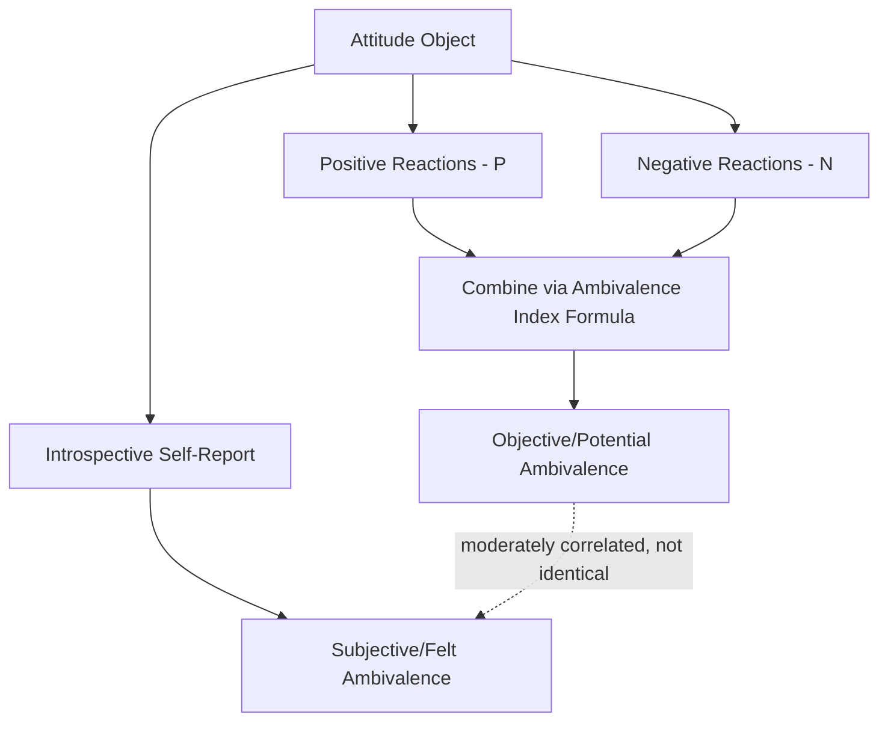

## Attitudinal Ambivalence

### Definition

Attitudinal ambivalence refers to the simultaneous holding of both positive and negative evaluations toward the same attitude object. Rather than representing a simple neutral or moderate attitude, ambivalence describes a psychologically distinct state in which strong (or at least non-trivial) positive and negative reactions coexist, creating internal evaluative conflict rather than a genuinely lukewarm or indifferent stance.

**Core distinction from neutrality:** A person who feels no particular positive or negative reaction toward an object (genuine indifference/neutrality) is evaluatively different from a person who feels strongly both positive and negative reactions simultaneously (ambivalence), even though both individuals might report an identical "neutral" or midpoint score on a standard bipolar attitude scale. This distinction was a key motivation for developing separate measurement approaches for ambivalence (below).

### Objective (Potential) vs. Subjective (Felt) Ambivalence

**Objective/potential ambivalence** is calculated by separately measuring the intensity of positive and negative reactions toward an object (rather than relying on a single bipolar scale) and combining them mathematically. The most widely used formula is the **Thompson, Zanna, and Griffin (1995) Ambivalence Index**:

$$\text{Ambivalence} = \frac{(P + N)}{2} - |P - N|$$

Where $P$ is the intensity of positive reactions and $N$ is the intensity of negative reactions. This formula yields maximal ambivalence scores when $P$ and $N$ are both high and roughly equal, and minimal scores when one component dominates or both are low.

**Subjective/felt ambivalence** is the individual's own introspective, self-reported sense of feeling conflicted, torn, indecisive, or of "mixed feelings" about the attitude object — typically measured with direct items (e.g., "How much do you feel torn or conflicted about X?").

**[Inference]** Objective and subjective ambivalence, while conceptually related, are empirically only moderately correlated; individuals holding objectively high positive-and-negative evaluations do not always consciously experience that conflict as felt ambivalence, and the two measurement approaches can yield different predictive results in research, making the distinction methodologically important rather than merely semantic.

### Sources of Ambivalence

**Within-component ambivalence:**

- **Affective-cognitive inconsistency:** conflict between the feeling-based (affective) and belief-based (cognitive) components of an attitude — e.g., cognitively believing smoking is harmful while affectively finding it pleasurable and relaxing.
- **Intra-cognitive conflict:** holding conflicting beliefs about the same attribute of an object (e.g., believing a medication is both effective and risky).
- **Intra-affective conflict:** experiencing genuinely mixed emotions toward the object itself (e.g., simultaneous excitement and anxiety about a major life change).

**Structural/social sources:**

- **Value conflict:** an attitude object implicates two or more personally held values that point in opposing evaluative directions (e.g., supporting a policy that promotes economic growth but conflicts with environmental values).
- **Conflicting social influence:** receiving inconsistent attitude-relevant information or normative pressure from different reference groups (e.g., family holding one view, peer group holding the opposite).
- **Role conflict:** occupying multiple social roles that carry different evaluative expectations regarding the same object.

### Consequences of High Ambivalence

**Reduced attitude-behavior consistency.** Ambivalent attitudes are less reliable predictors of corresponding behavior than univalent (non-conflicted) attitudes of equivalent overall valence, since competing evaluative pulls can be resolved differently depending on situational context at the moment of behavior.

**Increased susceptibility to situational/contextual influence.** Because ambivalent attitudes contain latent competing evaluative content, contextual cues (which aspect of the object is made salient in a given moment) can shift which evaluative component dominates expressed attitude or behavior at that time — producing greater response instability across contexts and measurement occasions.

**Greater persuasibility.** Ambivalent individuals tend to be more responsive to persuasive messages than univalent individuals holding an attitude of the same overall direction, plausibly because some evaluative basis consistent with the persuasive message's direction is already cognitively available to be reinforced or activated.

**Increased information processing and elaboration.** Ambivalence has been associated with increased systematic, effortful processing of attitude-relevant information — consistent with the idea that unresolved evaluative conflict motivates additional cognitive effort to seek resolution (related to cognitive dissonance-reduction motivations).

**Slower response times.** Ambivalent attitudes tend to show slower response latencies when individuals are asked to report their evaluation, reflecting the competing activation of both positive and negative associations (related to, but conceptually distinct from, low accessibility).

**Affective discomfort.** Subjectively felt ambivalence has been linked to negative affective experience (feeling "torn" or uncomfortable), which some research links to increased effortful attempts at attitude resolution or avoidance of the topic altogether.

### Ambivalence in Specific Domains

**Political attitudes.** Ambivalence is a well-studied phenomenon in political attitude research, where individuals often hold genuinely conflicting values relevant to a single policy issue (e.g., valuing both individual liberty and collective welfare regarding a given policy), producing measurable political ambivalence that predicts weaker attitude stability and greater susceptibility to framing effects in political communication research.

**Intergroup attitudes.** Ambivalence has been studied extensively in prejudice research — for example, the concept of **ambivalent sexism** (Glick & Fiske, 1996) proposes that attitudes toward gender groups can combine simultaneously hostile and benevolent (subjectively positive but still patronizing) components, producing a structurally ambivalent overall prejudice construct rather than a simple unidimensional hostility scale.

**Consumer attitudes.** Ambivalence toward products that combine desirable and undesirable attributes (e.g., a food that is tasty but unhealthy) is a well-studied phenomenon in consumer psychology, relevant to marketing strategies that attempt to resolve or leverage such conflicts.

**Interpersonal/close relationship attitudes.** Ambivalent attitudes toward close others (family members, romantic partners) — holding both strong affection and strong frustration/resentment — have been studied in relationship psychology as predictive of distinctive relational and even physiological stress outcomes.

### Ambivalence and Physiological/Health Outcomes

**[Inference]** Some research programs (e.g., studies on ambivalent relationships and cardiovascular reactivity) have linked holding highly ambivalent attitudes toward significant others to elevated physiological stress reactivity compared to either univalently positive or univalently negative relationship attitudes, suggesting ambivalence may carry distinct physiological correlates beyond its cognitive and behavioral consequences — though the specific mechanisms and generalizability of these findings warrant checking against current primary literature given the more specialized nature of this research area.

### Distinguishing Ambivalence from Related Constructs

| Construct | Key Distinction from Ambivalence |
| --- | --- |
| Neutrality/indifference | Low intensity on both positive and negative components, vs. ambivalence's high intensity on both |
| Uncertainty (attitude certainty) | Uncertainty concerns confidence in the attitude's correctness; ambivalence concerns the coexistence of conflicting valenced content |
| Cognitive dissonance | Dissonance concerns inconsistency between cognition and behavior specifically; ambivalence concerns coexisting positive/negative evaluative content toward an object, which can exist independent of any behavioral inconsistency |
| Attitude change/instability | Instability is a possible downstream consequence of ambivalence, not the construct itself |

### Applications

- **Political communication:** designing persuasive messaging that leverages latent ambivalence in swing voters, or conversely designing messaging aimed at resolving ambivalence for a preferred position.
- **Health communication:** identifying and addressing genuinely conflicting beliefs (e.g., a smoker who values both immediate enjoyment and long-term health) as a target for motivational-interviewing-style interventions that work explicitly with ambivalence rather than assuming univalent resistance.
- **Marketing:** managing consumer ambivalence toward products with mixed desirable/undesirable attributes through message framing that resolves or reduces perceived conflict.
- **Prejudice reduction:** informing intervention approaches that address ambivalent (rather than purely hostile) forms of prejudice, such as benevolent sexism, which may not respond to interventions designed for straightforwardly hostile attitudes.
- **Survey methodology:** informing best practices in attitude measurement, encouraging use of separate positive/negative rating scales rather than single bipolar scales when ambivalence is theoretically relevant to the research question.

**Related Topics**

- Attitude strength and its sub-dimensions
- Ambivalent sexism theory (Glick & Fiske)
- Cognitive dissonance theory
- Attitude-behavior consistency
- Motivational interviewing (health behavior change)
- Framing effects in political communication
- ABC model of attitudes (affective-cognitive consistency)