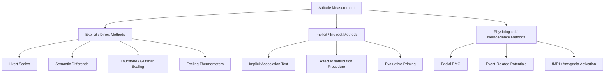

## Measuring Attitudes: Explicit and Implicit Approaches

### Overview

Attitude measurement encompasses the full range of methodological approaches used to assess an individual's evaluative stance toward an attitude object. Because attitudes are internal, unobservable psychological states, all measurement necessarily involves inference from observable indicators — verbal self-report, response latencies, physiological responses, or behavioral indices. Measurement approaches are broadly divided into **explicit (direct)** methods, which rely on deliberate self-report, and **implicit (indirect)** methods, which infer attitudes from automatic, less controllable responses.

### Explicit Measurement Approaches

**Likert Scales (Likert, 1932).** Respondents rate agreement/disagreement with a series of attitude statements on an ordinal scale (typically 5- or 7-point, e.g., strongly disagree to strongly agree). Items are usually summed or averaged into a composite attitude score. Likert scaling assumes approximately equal psychological intervals between response options, though this is an approximation rather than a strictly verified metric property.

**Semantic Differential Scale (Osgood, Suci, & Tannenbaum, 1957).** Respondents rate the attitude object along a series of bipolar adjective pairs (e.g., good–bad, pleasant–unpleasant, wise–foolish), typically on 7-point scales. Osgood's factor-analytic work identified three recurring underlying dimensions across many rated concepts: **evaluation** (good-bad), **potency** (strong-weak), and **activity** (active-passive) — with the evaluation dimension corresponding most directly to attitude valence.

**Thurstone Scaling (Thurstone & Chave, 1929).** An early equal-interval scaling method in which a large pool of attitude statements is rated by judges for how favorable/unfavorable each statement is, statements with the least judge disagreement are retained, and respondents' attitudes are inferred from which specific statements they endorse. Labor-intensive and largely superseded by Likert scaling in contemporary research due to the extensive judge-rating process required for scale construction.

**Guttman Scaling (cumulative/scalogram analysis; Guttman, 1944).** Constructs a hierarchically ordered set of items such that endorsing a more extreme item implies endorsement of all less extreme items (a cumulative structure), allowing a respondent's exact position to be inferred from the single most extreme item endorsed.

**Feeling Thermometers.** Commonly used in political attitude and survey research; respondents rate warmth/favorability toward a target (person, group, policy) on a 0–100 degree scale, offering a simple, intuitively interpretable, continuous measure.

**Behavioral intention measures.** Rather than (or in addition to) evaluative ratings, some approaches directly assess stated intentions to act (e.g., "How likely are you to purchase this product?"), which is central to models such as the Theory of Planned Behavior that link attitudes to behavior via intention.

### Limitations of Explicit Measures

- **Social desirability bias:** respondents may misreport attitudes, particularly on sensitive topics (prejudice, controversial political positions, taboo behaviors), to present themselves favorably.
- **Limited introspective access:** individuals may not have full conscious access to the true basis or strength of their own evaluative reactions (per the broader literature on introspection limits, e.g., Nisbett & Wilson, 1977).
- **Response biases:** acquiescence bias (tendency to agree regardless of content), extreme responding, and central tendency bias can distort self-report scores independent of the true underlying attitude.
- **Demand characteristics:** respondents may infer the purpose of the study and adjust responses accordingly.

### Implicit Measurement Approaches

**Implicit Association Test (IAT; Greenwald, McGhee, & Schwartz, 1998).** Assesses the relative strength of association between two target concepts (e.g., a social group) and two evaluative attribute categories (e.g., good/bad) by measuring classification speed when concepts and attributes share versus do not share a response key. Widely used, particularly in prejudice and stereotyping research, though subject to notable debate regarding reliability and predictive validity for individual-level diagnosis (see below).

**Affect Misattribution Procedure (AMP; Payne, Cheng, Govorun, & Stewart, 2005).** Participants are briefly exposed to a prime (the attitude object) followed by an ambiguous neutral target (e.g., a Chinese ideograph), which they rate as more or less pleasant than average. Because the exposure is too brief for deliberate evaluation, the automatic affective reaction to the prime is misattributed to the ambiguous target, revealing the underlying implicit evaluation.

**Evaluative priming task (Fazio et al., 1986).** Measures response latency to classify clearly valenced target words (good/bad) following brief presentation of an attitude-object prime; faster responses to valence-congruent targets indicate a stronger implicit association between the prime and that valence.

**Go/No-Go Association Task (GNAT; Nosek & Banaji, 2001).** A variant requiring participants to respond ("go") to items belonging to a target category paired with one valence, and withhold response ("no-go") to items of the opposite valence, within a constrained time window, yielding a signal-detection-based implicit measure.

**Single-Category IAT and Brief IAT.** Methodological variants developed to allow assessment of implicit attitudes toward a single target concept (rather than requiring paired comparison categories as in the standard IAT), addressing certain interpretive limitations of the original two-category design.

### Physiological and Neuroscience-Based Measures

**Facial electromyography (EMG).** Measures subtle activity in facial muscles (e.g., corrugator supercilii for negative affect, zygomaticus major for positive affect) below the threshold of visible expression, used as an indicator of automatic affective/attitudinal response to stimuli.

**Event-related potentials (ERPs).** EEG-based measures of brain electrical activity time-locked to stimulus presentation; components such as the **late positive potential (LPP)** have been used as indices of evaluative/motivational significance assigned to attitude-relevant stimuli.

**Startle eyeblink modulation.** The magnitude of the involuntary eyeblink startle reflex is modulated by ongoing affective state (potentiated during negative affect, attenuated during positive affect), used as a physiological index of implicit evaluative reactions to attitude objects.

**fMRI-based measures.** Neuroimaging studies have examined amygdala and other neural activation patterns in response to attitude-relevant stimuli (particularly in prejudice and intergroup attitude research), though these approaches are primarily used in specialized research contexts rather than as general-purpose applied measurement tools.

### Comparing Explicit and Implicit Measurement Properties

| Property | Explicit Measures | Implicit Measures |
| --- | --- | --- |
| Control | High — deliberate, intentional responding | Low — automatic, less controllable responding |
| Vulnerability to social desirability | High, particularly for sensitive topics | Lower, though not fully immune |
| Reliability (typical) | Generally higher test-retest reliability | Generally more modest test-retest reliability (particularly IAT) |
| Best predicts | Deliberate, controlled behavior | Spontaneous, less controlled behavior |
| Ease/cost of administration | Simple, low-cost, easily scaled | Requires specialized software/equipment, more complex administration |
| Face validity to respondents | High — transparent purpose | Often low — purpose less apparent to respondent |

### Choosing a Measurement Approach

**[Inference]** Methodological guidance in the field generally recommends selecting measurement approach based on the specific research question: explicit measures are typically preferred when the research question concerns deliberate, reasoned judgment or when the topic is not strongly subject to social desirability distortion; implicit measures are typically favored when studying automatic evaluative processes, socially sensitive topics where self-presentation concerns are a serious threat to validity, or when predicting spontaneous rather than deliberate behavior. Many contemporary studies employ **both** approaches jointly to capture the fuller, potentially dissociable picture of an individual's attitude (consistent with dual-attitudes and APE-model theorizing).

### Psychometric Considerations

**Reliability.** Internal consistency (Cronbach's alpha) and test-retest reliability are standard psychometric benchmarks; explicit Likert-type scales generally show favorable reliability profiles, while several implicit measures (notably the IAT) have drawn methodological scrutiny for comparatively more modest test-retest reliability, complicating individual-level (as opposed to aggregate/group-level) interpretation.

**Validity.** Construct validity (does the measure assess the intended attitude construct), convergent validity (correlation with other measures of the same construct), and predictive validity (ability to forecast relevant behavior) are all actively debated and researched properties for both explicit and implicit measurement approaches, with predictive validity of implicit measures for real-world discriminatory behavior specifically being an area of substantial ongoing methodological debate in the literature.

**[Unverified]** Precise reliability coefficients and predictive validity effect sizes vary considerably across specific studies, populations, and topic domains; general claims about "the reliability of the IAT" or similar should be checked against current meta-analytic sources rather than treated as a single fixed value.

### Applications

- **Prejudice and stereotyping research:** combining explicit and implicit measures to distinguish consciously endorsed from automatic intergroup attitudes.
- **Consumer and marketing research:** using implicit measures (e.g., IAT, AMP) to assess brand attitudes less subject to social desirability distortion than direct surveys.
- **Political polling and survey research:** using feeling thermometers and Likert-type items as standard explicit tools, sometimes supplemented with implicit measures in specialized political psychology research.
- **Clinical and health psychology:** using implicit measures of self-esteem, self-concept, or attitudes toward health behaviors as adjuncts to explicit self-report assessment.
- **Applied diversity/organizational contexts:** using implicit measures for aggregate research purposes, while methodological caveats generally recommend caution regarding individual-level diagnostic feedback applications given reliability limitations.

**Related Topics**

- Implicit Association Test: methodology and critiques
- Affect Misattribution Procedure
- Semantic differential and Likert scaling methods
- Social desirability bias in self-report
- Dual-attitudes model and the APE model
- Attitude accessibility and response latency
- Predictive validity of implicit measures for behavior