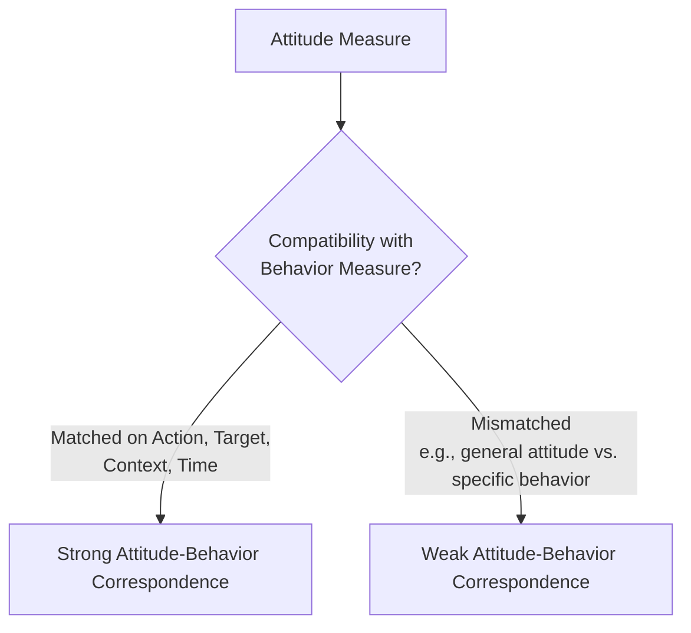
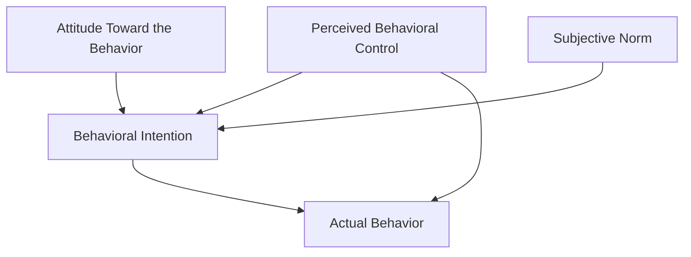

## The Attitude-Behavior Relationship

### Overview and Foundational Problem

The attitude-behavior relationship concerns the degree to which measured attitudes actually predict corresponding behavior — a question that seems intuitively obvious (attitudes should predict behavior) but which early empirical research found to be surprisingly weak and inconsistent, prompting decades of subsequent theoretical refinement to identify the conditions under which attitudes *do* reliably predict behavior.

### LaPiere's Foundational Study

Richard LaPiere's (1934) classic field study is the most frequently cited early demonstration of attitude-behavior inconsistency. LaPiere traveled across the United States with a Chinese couple, visiting hundreds of hotels and restaurants; they were refused service at only one establishment. Sometime later, LaPiere sent written surveys to those same establishments asking whether they would serve Chinese guests — the large majority of respondents indicated they would *not*, directly contradicting the actual behavior observed during the travels.

**[Inference]** LaPiere's study, while historically foundational and highly influential in raising the attitude-behavior consistency question, has notable methodological limitations by contemporary standards (uncontrolled conditions, the surveyed respondent not necessarily being the same staff member who provided service, substantial time lag between behavior and survey, and the general vs. specific mismatch between the survey question and the actual encountered situation) — meaning it is best treated as an influential early illustration and catalyst for the field's subsequent research program, rather than as methodologically rigorous evidence establishing a precise attitude-behavior correlation.

### Wicker's Pessimistic Review

Allan Wicker's (1969) extensive review of the attitude-behavior literature found generally weak and inconsistent correlations between measured attitudes and corresponding behaviors across the studies reviewed, concluding that attitudes might be poor predictors of behavior overall. This review was highly influential in prompting the field to move away from asking simply "do attitudes predict behavior?" toward asking **"under what conditions do attitudes predict behavior?"** — shifting the research agenda toward identifying moderating variables.

### Moderators of Attitude-Behavior Consistency

**1. Attitude specificity and the principle of compatibility (Ajzen & Fishbein, 1977).** Attitude-behavior correspondence is strongest when the attitude measure and the behavioral measure are matched in specificity across four elements: **action, target, context, and time**. A general attitude (e.g., "attitude toward environmentalism") poorly predicts a single specific behavior (e.g., recycling a particular bottle on a particular day); a specific attitude (e.g., "attitude toward recycling glass bottles at home this week") predicts the corresponding specific behavior far better.

**2. Attitude strength.** As established in the attitude strength literature, highly accessible, important, certain, and univalent (low-ambivalence) attitudes show substantially stronger correspondence with behavior than weak attitudes of equivalent reported valence.

**3. Direct experience.** Attitudes formed through direct, firsthand experience with the attitude object show stronger behavioral prediction than attitudes formed through indirect information (see Fazio & Zanna's research program).

**4. Situational constraints.** Behavior is influenced by factors beyond attitude — social norms, perceived behavioral control, resource availability, and competing situational pressures can all override attitude-consistent behavioral tendencies, particularly when situational constraints are strong (a key consideration formalized in the Theory of Planned Behavior's inclusion of perceived behavioral control).

**5. Self-monitoring.** Individual differences in self-monitoring (Snyder, 1974) moderate attitude-behavior consistency: low self-monitors (who regulate behavior based on internal states, including attitudes) show stronger attitude-behavior correspondence than high self-monitors (who regulate behavior more strongly based on situational and social cues, sometimes at the expense of internal attitude consistency).

**6. Presence of accountability and self-awareness.** Conditions that increase conscious attention to one's own attitudes (e.g., mirror-induced self-awareness in classic social psychology manipulations) have been found in some studies to increase attitude-behavior correspondence, consistent with objective self-awareness theory.

### The Theory of Reasoned Action (Fishbein & Ajzen, 1975)

Building directly on the attitude-behavior consistency problem, Fishbein and Ajzen proposed that attitude does not directly cause behavior, but instead operates through an intervening **behavioral intention**, itself jointly determined by attitude toward the behavior and **subjective norms** (perceived social pressure to perform or not perform the behavior).

$$BI = w_1(A_B) + w_2(SN)$$

Where $BI$ is behavioral intention, $A_B$ is attitude toward the specific behavior, $SN$ is subjective norm, and $w_1, w_2$ are empirically-derived weights reflecting the relative importance of each component for a given behavior/population.

### The Theory of Planned Behavior (Ajzen, 1991)

Ajzen extended the Theory of Reasoned Action by adding a third predictor, **perceived behavioral control (PBC)** — the individual's perceived ease or difficulty of performing the behavior, incorporating both internal (skill, willpower) and external (resources, opportunity) factors — to account for behaviors not under complete volitional control.

$$BI = w_1(A_B) + w_2(SN) + w_3(PBC)$$

**PBC's dual role:** perceived behavioral control influences behavior both indirectly (through its effect on intention) and, when it approximates actual behavioral control accurately, directly (bypassing intention entirely when the behavior is heavily constrained by objective ability/opportunity).

### Fazio's MODE Model as an Alternative Framework

Rather than positing a single deliberative reasoning pathway (as in the Theory of Planned Behavior), Fazio's **MODE model** (Motivation and Opportunity as DEterminants) proposes two distinct routes by which attitudes guide behavior:

- **Deliberative processing route:** operates when motivation and opportunity for careful reasoning are both sufficiently high, closely resembling the reasoned-action/planned-behavior process of weighing attitudes, norms, and beliefs.
- **Spontaneous processing route:** operates under low motivation or opportunity (time pressure, cognitive load, distraction), in which highly accessible attitudes are automatically activated upon encountering the attitude object and directly guide behavior without deliberate reasoning.

**[Inference]** The MODE model and the Theory of Planned Behavior are generally treated as complementary rather than strictly competing frameworks: the Theory of Planned Behavior most directly models the deliberative route, while the MODE model additionally specifies conditions (low motivation/opportunity) under which a more automatic, accessibility-driven process operates instead.

### Additional Refinements and Related Models

**Theory of Trying (Bagozzi & Warshaw, 1990).** Extends the framework to behaviors involving effortful pursuit of a goal that may or may not be achieved (e.g., "trying to lose weight"), incorporating attitudes toward the process of trying, toward success, and toward failure.

**Prototype/Willingness Model (Gibbons & Gerrard, 1995).** Particularly applied to adolescent risk behavior, proposes that some behaviors (especially social/risk behaviors) are better predicted by behavioral *willingness* in response to opportunity, and by comparison to a social *prototype* image, than by a fully reasoned intention process.

**Implementation intentions (Gollwitzer, 1999).** Research demonstrating that forming specific "if-then" plans linking situational cues to intended actions substantially strengthens the translation of behavioral intention into actual enacted behavior, addressing the well-documented **intention-behavior gap** (the finding that even strong, well-formed intentions often fail to translate into actual behavior).

### The Intention-Behavior Gap

**[Inference]** Even after accounting for attitude, subjective norms, and perceived behavioral control, meta-analytic work has consistently found that behavioral intentions themselves are imperfect predictors of actual behavior, with a substantial proportion of variance in the intention-behavior relationship remaining unexplained — motivating continued research (e.g., implementation intentions, habit formation research) into additional volitional and self-regulatory factors that bridge the gap between forming an intention and actually enacting the corresponding behavior.

### Applications

- **Public health campaign design:** informing message design that targets not just attitudes but also subjective norms and perceived behavioral control, consistent with the Theory of Planned Behavior's multi-component structure.
- **Marketing and consumer behavior prediction:** using compatibility-principle-informed measurement (specific product attitudes predicting specific purchase behaviors) rather than broad brand attitude measures alone.
- **Political behavior research:** predicting voting behavior and political participation using intention-based models incorporating social norm and efficacy (a construct related to perceived behavioral control) components.
- **Behavior change interventions:** applying implementation intention techniques to close the intention-behavior gap in domains such as exercise adherence, medication compliance, and preventive health screening uptake.

**Related Topics**

- Theory of Reasoned Action and Theory of Planned Behavior
- Fazio's MODE model
- Attitude strength and accessibility
- Principle of compatibility (Ajzen & Fishbein)
- Implementation intentions and the intention-behavior gap
- Self-monitoring (Snyder)
- Attitude formation through direct experience