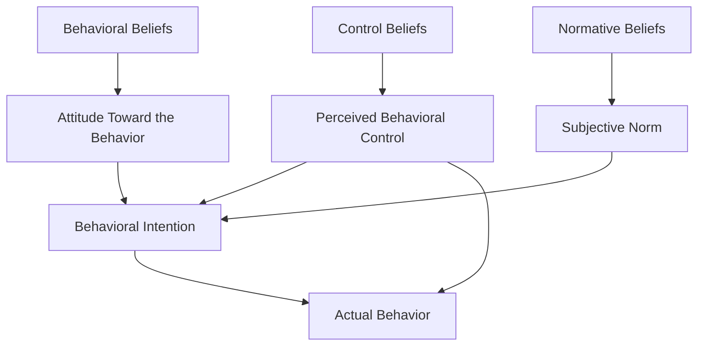

## Theory of Planned Behavior

### Definition and Theoretical Origins

The Theory of Planned Behavior (TPB) is a widely used social-cognitive model of behavior prediction developed by Icek Ajzen (1985, 1991) as a direct extension of the earlier **Theory of Reasoned Action** (Fishbein & Ajzen, 1975). The TPB was developed specifically to address a limitation of the Theory of Reasoned Action: its assumption that behavior is under complete volitional (willful) control, which does not hold for many real-world behaviors constrained by skill, resources, opportunity, or external obstacles.

**Core premise:** Behavior is best predicted by **behavioral intention**, which is itself jointly determined by three conceptually independent predictors: attitude toward the behavior, subjective norms, and perceived behavioral control.

### Model Structure

**Attitude toward the behavior (AB).** The individual's overall positive or negative evaluation of personally performing the specific behavior in question (not a general attitude toward the object, but specifically toward *performing the behavior*). Rooted in **behavioral beliefs** — beliefs about the likely consequences of the behavior, weighted by the evaluation of those consequences (consistent with the expectancy-value formalization used in earlier attitude theory).

$$A_B = \sum_{i=1}^{n} b_i e_i$$

Where $b_i$ is the belief that performing the behavior leads to outcome $i$, and $e_i$ is the evaluation of outcome $i$.

**Subjective norm (SN).** The individual's perception of social pressure from important others (referents) regarding whether to perform the behavior. Rooted in **normative beliefs** — beliefs about what specific referent individuals or groups think the person should do, weighted by the individual's motivation to comply with each referent.

$$SN = \sum_{i=1}^{n} n_i m_i$$

Where $n_i$ is the normative belief regarding referent $i$'s expectation, and $m_i$ is motivation to comply with referent $i$.

**Perceived behavioral control (PBC).** The individual's perceived ease or difficulty of performing the behavior, reflecting both anticipated internal factors (skills, willpower, knowledge) and external factors (resources, opportunities, obstacles). Rooted in **control beliefs** — beliefs about the presence or absence of facilitating/inhibiting factors, weighted by the perceived power of each factor to facilitate or impede the behavior.

$$PBC = \sum_{i=1}^{n} c_i p_i$$

Where $c_i$ is the belief about the presence of control factor $i$, and $p_i$ is the perceived power of that factor to facilitate or inhibit the behavior.

### Behavioral Intention and the Prediction Equation

$$BI = w_1(A_B) + w_2(SN) + w_3(PBC)$$

Behavioral intention ($BI$) is modeled as a weighted combination of the three predictors, where the relative weights ($w_1, w_2, w_3$) are empirically derived and can vary substantially across different behaviors and populations — some behaviors are primarily attitude-driven, others more norm-driven, and others more control-driven.

### The Dual Role of Perceived Behavioral Control

A defining feature distinguishing the TPB from the Theory of Reasoned Action is that PBC influences behavior through **two pathways**:

1. **Indirect pathway (via intention):** PBC contributes to forming behavioral intention alongside attitude and subjective norm, following the same logic as the other two predictors.
2. **Direct pathway (bypassing intention):** when PBC accurately reflects actual behavioral control over the behavior, it can directly predict behavior independent of intention — because for behaviors genuinely constrained by external factors, even a strong intention may fail to produce the behavior if actual control is low, and conversely high actual control can facilitate behavior enactment beyond what intention alone would predict.

**[Inference]** This direct PBC-to-behavior pathway is theoretically most relevant when perceived behavioral control closely approximates *actual* behavioral control; when perceived control is inaccurate (overestimated or underestimated relative to true ability/opportunity), the direct pathway's predictive value is correspondingly weakened, since it is genuine (not merely perceived) control that constrains actual behavioral enactment.

### The Principle of Compatibility

Consistent with earlier attitude-behavior research (Ajzen & Fishbein, 1977), the TPB assumes that predictors are maximally effective when measured with **compatibility** to the target behavior across four elements: **action, target, context, and time**. All TPB constructs (attitude, subjective norm, PBC, intention) should be measured at a matching level of specificity to the behavior being predicted for the model to perform well.

### Empirical Support and Meta-Analytic Findings

The TPB has been applied across an unusually broad range of behavioral domains, including health behaviors (exercise, dietary choices, smoking cessation, condom use, medical screening uptake), environmental behaviors (recycling, energy conservation), consumer behaviors (purchase intentions), and organizational behaviors (entrepreneurial intentions, workplace safety compliance).

Meta-analytic reviews (e.g., Armitage & Conner, 2001) have generally found the TPB accounts for a meaningful proportion of variance in both behavioral intention and actual behavior across diverse domains, with intention typically explaining a moderate-to-substantial proportion of behavioral variance, and the full model (attitude, subjective norm, PBC) explaining a substantial proportion of variance in intention itself.

**[Unverified]** Specific variance-explained percentages reported across meta-analyses vary by behavioral domain, study population, and methodological approach (e.g., prospective vs. cross-sectional designs); precise figures should be checked against the specific meta-analysis and domain in question rather than treated as fixed values generalizable across all behaviors.

### The Intention-Behavior Gap

Despite the TPB's general success in predicting intention, a persistent finding across the behavior-prediction literature is that intentions themselves are imperfect predictors of actual behavior — a substantial proportion of individuals who form a strong intention to perform a behavior nonetheless fail to enact it (the **intention-behavior gap**). This gap has motivated substantial follow-on research, including:

- **Implementation intentions** (Gollwitzer, 1999): specific "if-then" plans linking situational cues to intended actions, shown to meaningfully improve intention-to-behavior translation.
- **Habit strength research:** proposing that for frequently repeated behaviors, habitual automaticity (rather than continued deliberate intention-driven processing) becomes the more proximal behavioral determinant.

### Extensions and Related Models

**Reasoned Action Approach (Fishbein & Ajzen, 2010).** A later integrative reformulation by the original theorists, further subdividing attitudes into experiential and instrumental components, and subjective norms into injunctive (perceived approval/disapproval) and descriptive (perceived prevalence of the behavior among others) norm components, while retaining the overall structural logic of the TPB.

**Health Belief Model.** A parallel health-behavior prediction framework (perceived susceptibility, severity, benefits, barriers, cues to action, self-efficacy) developed somewhat independently within health psychology, sharing conceptual overlap with TPB constructs (particularly perceived barriers/self-efficacy and PBC) but with distinct historical origins and construct definitions.

**Self-efficacy (Bandura) and PBC.** PBC is conceptually related to, but formally distinguished from, Bandura's **self-efficacy** construct — self-efficacy concerns confidence in one's own capability to execute a behavior, while PBC as formulated by Ajzen also incorporates external/environmental control factors beyond personal capability, though the two constructs show substantial conceptual and empirical overlap and are sometimes operationalized similarly in applied research.

### Critiques and Limitations

**Rational/deliberative assumption.** The TPB models behavior as resulting from a reasoned, deliberative weighing of beliefs — a criticism raised (e.g., by dual-process theorists such as Fazio) is that this may not adequately capture spontaneous, habitual, or automatically-triggered behaviors that bypass deliberate intention formation (addressed by complementary frameworks such as the MODE model and habit-strength research).

**Sufficiency of the model.** Some researchers have argued the model omits potentially important predictors such as moral norms/personal obligation, anticipated regret, and past behavior/habit strength, prompting various proposed model extensions incorporating these additional constructs.

**Self-report reliance.** As with much attitude research, TPB constructs are typically measured via self-report, raising standard concerns regarding social desirability bias and limited introspective access, particularly for sensitive behavioral domains.

**Correlational vs. causal evidence.** **[Inference]** Much TPB research relies on correlational, prospective survey designs (measuring beliefs/intentions, then measuring subsequent behavior) rather than experimental manipulation of the model's component constructs; while this design supports predictive validity claims, establishing the specific causal contribution of each individual predictor (as opposed to their combined predictive association) requires additional experimental or intervention-based evidence, which has been pursued in some but not all applied domains.

### Applications

- **Public health intervention design:** informing multi-component health campaigns that target attitude change, normative messaging (correcting misperceived norms), and self-efficacy/control-enhancing strategies (skills training, resource provision) simultaneously.
- **Environmental behavior campaigns:** designing recycling, conservation, and sustainable consumption interventions informed by TPB-based formative research identifying the dominant predictor (attitude, norm, or control) for a specific target behavior and population.
- **Organizational and workplace behavior:** predicting and promoting safety compliance, entrepreneurial intention, and other workplace behaviors.
- **Marketing:** predicting purchase intention and consumer behavior using TPB-informed survey instruments.

**Related Topics**

- Theory of Reasoned Action
- The attitude-behavior relationship
- Implementation intentions (Gollwitzer)
- Self-efficacy theory (Bandura)
- Health Belief Model
- Fazio's MODE model
- Habit formation and automaticity in behavior