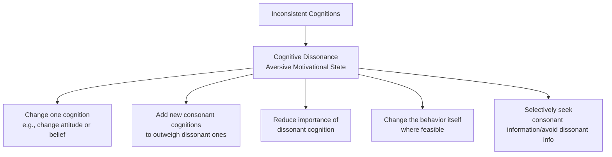

## Cognitive Dissonance Theory

### Definition and Theoretical Origins

Cognitive dissonance theory was developed by Leon Festinger (1957) and remains one of the most influential and extensively researched theories in social psychology. It proposes that individuals hold numerous cognitions (beliefs, attitudes, knowledge about their own behavior) and that when two or more cognitions are psychologically inconsistent, this creates an aversive motivational state — **cognitive dissonance** — which individuals are driven to reduce, much as hunger or thirst drive physiological need-reduction behavior.

**Core premise:** Dissonance arises specifically when cognitions are inconsistent in the sense that the obverse of one cognition follows from the other (e.g., "I smoke" and "smoking causes cancer" are dissonant because believing smoking is dangerous implies one *should not* smoke). The magnitude of dissonance experienced is proportional to the number and importance of the dissonant cognitions relative to the number and importance of consonant (consistent) cognitions.

$$\text{Magnitude of Dissonance} \propto \frac{\text{Importance-weighted dissonant cognitions}}{\text{Importance-weighted dissonant + consonant cognitions}}$$

### Dissonance Reduction Strategies

When dissonance is aroused, individuals are motivated to reduce it through one or more of the following strategies:

- **Changing a cognition:** revising an attitude or belief to become consistent with behavior (e.g., a smoker downplaying the certainty or severity of smoking-related health risks).
- **Adding consonant cognitions:** introducing new supportive beliefs that outweigh the dissonant ones (e.g., "smoking helps me manage stress, which is also important for health").
- **Reducing the importance of the dissonant cognition:** minimizing the perceived significance of the inconsistency (e.g., "the cancer risk from smoking isn't that much higher than everyday risks").
- **Changing the behavior:** the most direct resolution when feasible (e.g., quitting smoking), though often the most difficult, especially for established or addictive behaviors.
- **Selective exposure:** proactively seeking information consistent with existing beliefs/behavior and avoiding dissonance-arousing information.

### Foundational Paradigms and Studies

**Induced (forced) compliance paradigm — Festinger and Carlsmith (1959).** Participants performed an extremely boring task, then were paid either $1 or $20 to tell a waiting participant the task was interesting and enjoyable. Those paid only $1 (insufficient external justification for lying) subsequently rated the task as significantly more enjoyable than those paid $20 (who had ample external justification and experienced less dissonance). This counterintuitive finding — *less* incentive producing *greater* attitude change — became a landmark demonstration that dissonance, not simple reinforcement, drove the attitude shift.

**Effort justification.** Aronson and Mills (1959) found that individuals who underwent a more severe/embarrassing initiation process to join a group subsequently rated the group as more attractive than those who underwent a mild initiation, interpreted as dissonance reduction: having invested significant effort for a group, cognitive consistency motivates viewing that group more favorably to justify the effort.

**Post-decisional dissonance (Brehm, 1956).** After making a difficult choice between two similarly attractive options, individuals tend to subsequently increase their evaluation of the chosen option and decrease their evaluation of the rejected option (**spreading of alternatives**), reducing the dissonance created by having given up the positive features of the unchosen option while accepting the negative features of the chosen one.

**Free-choice and justification of effort in child studies.** Aronson and Carlsmith (1963) examined children's attitudes toward forbidden toys under mild versus severe threat conditions, finding that children threatened with only mild punishment for playing with an attractive toy subsequently devalued the toy more than children under severe threat — interpreted as insufficient external justification (mild threat) requiring internal attitude change to justify compliance, whereas severe threat provided sufficient external justification on its own.

### Boundary Conditions Identified by Later Research

Subsequent research substantially refined the conditions necessary for dissonance-driven attitude change to occur, moving beyond Festinger's original formulation:

**Free choice.** Cooper and Fazin's later New Look model and related research established that dissonance-driven attitude change requires the individual to perceive they freely chose to engage in the counter-attitudinal behavior; behavior perceived as coerced or lacking meaningful choice does not reliably produce dissonance-based attitude change.

**Foreseeable negative consequences.** Attitude change is stronger when the counter-attitudinal behavior produces foreseeable negative consequences (e.g., the lie in Festinger and Carlsmith's study misled another person) rather than when consequences are negligible or absent.

**Personal responsibility.** The individual must feel personally responsible for the behavior and its consequences (rather than attributing the behavior to external circumstances) for dissonance to be aroused.

**Aversive consequences model (Cooper & Fazio, 1984).** Proposed that dissonance specifically requires the behavior to produce an aversive, unwanted outcome for which the individual feels personally responsible — reframing dissonance arousal around aversive consequences rather than inconsistency per se.

### Major Competing/Alternative Interpretations

**Self-perception theory (Bem, 1967).** Daryl Bem proposed an alternative, non-motivational explanation for the same empirical findings: rather than experiencing aversive dissonance arousal and being motivated to reduce it, individuals may simply infer their own attitudes by observing their own behavior, in much the same way an outside observer would ("I said the task was interesting, and I wasn't paid much to say so, so I must actually find it somewhat interesting"). This account requires no internal aversive arousal state at all.

**Resolution of the Bem-Festinger debate.** Zanna and Cooper (1974) and subsequent research using misattribution paradigms (allowing participants to misattribute arousal to an external source such as a pill) found that when arousal could be externally attributed, the typical dissonance-based attitude change effect was eliminated — supporting the existence of a genuine aversive arousal state (consistent with dissonance theory) for high-choice, high-consequence conditions, while self-perception processes appear to better account for attitude formation/change in lower-involvement conditions where no strong initial attitude existed. **[Inference]** The prevailing contemporary view treats dissonance and self-perception as applying to different conditions rather than one theory being uniformly correct: dissonance-based arousal appears most relevant when behavior clearly contradicts a pre-existing, well-defined attitude, while self-perception processes appear more applicable when prior attitudes are weak, ambiguous, or absent.

**Self-affirmation theory (Steele, 1988).** As covered separately, reframes dissonance-reduction behavior as one specific manifestation of a broader motivation to protect global self-integrity, rather than a domain-specific drive toward logical consistency — supported by findings that self-affirmation in an unrelated domain can eliminate typical dissonance-reduction effects even when the original inconsistency remains unresolved.

**Action-based model (Harmon-Jones, 1999).** Proposes that dissonance evolved to protect effective and unconflicted action, framing the psychological discomfort as serving to prevent inconsistent cognitions from disrupting a coherent, unified behavioral plan.

### Physiological Evidence

Research using skin conductance and cortical arousal measures has found that induced-compliance dissonance paradigms produce measurable physiological arousal, and that this arousal is reduced following successful dissonance-reduction attitude change — supporting Festinger's original characterization of dissonance as a genuine aversive arousal state rather than purely a cognitive/computational description.

### Cultural Variation in Dissonance Processes

**[Inference]** Cross-cultural research (e.g., studies comparing North American and East Asian samples) has found that the specific triggers and expression of dissonance-reduction behavior can vary by cultural self-construal — for example, some studies have found dissonance-related attitude change is more reliably triggered by choices made for oneself among individuals with more independent self-construals, and by choices made on behalf of important others among individuals with more interdependent self-construals — suggesting the underlying discomfort-reduction motivation may be broadly cross-culturally present while its specific behavioral triggers are culturally shaped.

### Applications

- **Health behavior change:** leveraging induced-compliance and effort-justification principles in interventions (e.g., inducing individuals to publicly advocate for a healthy behavior, which then produces dissonance-reduction pressure to align personal behavior with the public advocacy).
- **Marketing and consumer psychology:** understanding post-purchase rationalization (a form of post-decisional dissonance reduction, where consumers increase their evaluation of a purchased product after buying it).
- **Organizational behavior:** understanding effort-justification effects in onboarding, training, and organizational commitment (e.g., costly/effortful initiation or training processes increasing subsequent commitment to an organization).
- **Persuasion and attitude change:** informing counter-attitudinal advocacy techniques (inducing individuals to argue for a position with minimal external justification) as an attitude-change strategy.
- **Clinical psychology:** understanding rationalization processes in maladaptive behavior maintenance (e.g., dissonance-reduction processes potentially contributing to continued engagement in behaviors known to be harmful).

**Related Topics**

- Self-perception theory (Bem)
- Self-affirmation theory
- Induced compliance and insufficient justification
- Post-decisional dissonance and spreading of alternatives
- Effort justification
- Action-based model of dissonance (Harmon-Jones)
- Cultural self-construals and dissonance processes