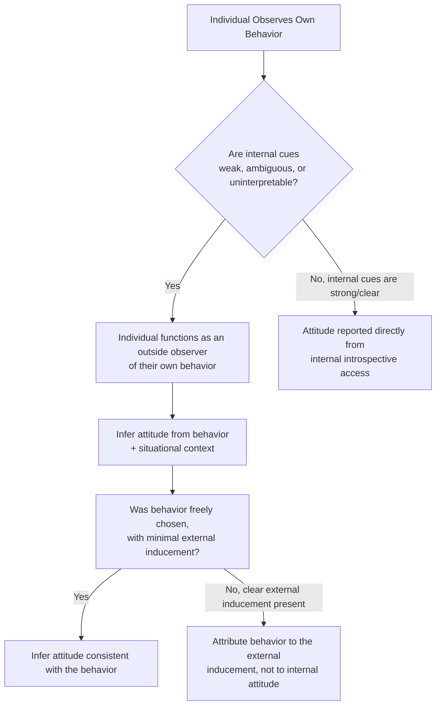
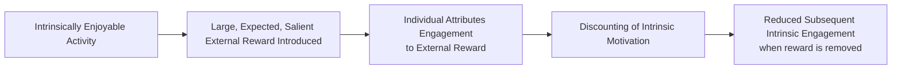

## Self-Perception Theory

### Definition and Theoretical Origins

Self-perception theory was developed by Daryl Bem (1967, 1972) as an alternative, non-motivational explanation for attitude phenomena that had previously been attributed to cognitive dissonance. The theory proposes that individuals often come to know their own attitudes, emotions, and internal states partly by inferring them from observing their own behavior and the circumstances in which that behavior occurs — in essentially the same manner an outside observer would infer another person's attitude from watching their behavior.

**Core premise:** "Individuals come to know their own attitudes, emotions, and other internal states partially by inferring them from observations of their own overt behavior and/or the circumstances in which this behavior occurs" (Bem, 1972). Critically, this process requires no internal, aversive motivational arousal state (unlike dissonance theory) — it is proposed as a relatively cool, inferential, attributional process.

### The Core Attributional Mechanism

**Key boundary condition — weak or ambiguous internal cues.** Bem specifically proposed that self-perception processes are most likely to operate when internal attitudinal or emotional cues are weak, ambiguous, or difficult to interpret. When an individual already holds a strong, well-defined, unambiguous internal attitude, they are assumed to report that attitude directly via introspection rather than needing to infer it from their own behavior.

**The discounting principle.** Central to self-perception theory is Kelley's (1967) **discounting principle**: the role of a given causal factor in producing behavior is discounted (given less causal weight) to the extent that other plausible causal factors are also present. Applied to attitude inference: if a clear external inducement (large payment, strong coercion) is present to explain a behavior, the individual will discount the idea that the behavior reflects their own genuine internal attitude, since the external factor provides a sufficient alternative explanation. Conversely, if a behavior is performed with minimal external justification, the individual is more likely to infer that the behavior reflects a genuine internal attitude, since no other sufficient explanation for the behavior is available.

### Relationship to Cognitive Dissonance Findings

Self-perception theory was proposed specifically to offer a non-motivational reinterpretation of classic dissonance findings, most notably the Festinger and Carlsmith (1959) $1/$20 induced-compliance study. Under a self-perception account:

- Participants paid only $1 to say a boring task was interesting had insufficient external justification available to explain their statement.
- Lacking a clear external cause for their behavior, and observing themselves having made the positive statement, these participants inferred — as an outside observer would — that they must have found the task at least somewhat enjoyable.
- Participants paid $20 had ample external justification (the payment) readily available to explain their statement, and therefore did not need to infer a genuine positive internal attitude to account for their own behavior.

**[Inference]** Under this reinterpretation, the same empirical pattern (less payment producing more positive subsequent attitude ratings) is explained through a cool, attributional inference process rather than through an aversive dissonance-arousal-reduction process — illustrating how two theoretically distinct mechanisms can generate identical behavioral predictions for certain paradigms, which became the central point of empirical contention between the two theories.

### The Bem-Festinger Debate and Its Resolution

Because both theories predicted the same outcome pattern in the classic induced-compliance paradigm, a substantial research program was directed at empirically distinguishing them — primarily through **misattribution paradigms**.

**Zanna and Cooper (1974).** Participants who engaged in counter-attitudinal advocacy were given a placebo pill and told (falsely) that it would produce either arousal, relaxation, or no side effects. Participants who could attribute any felt arousal to the pill (an external source) showed no typical dissonance-based attitude change, supporting the idea that a genuine internal arousal state exists and normally drives the effect — when that arousal can be externally misattributed, the motivation to change one's attitude to explain the arousal disappears. This finding was interpreted as more consistent with dissonance theory's assumption of genuine internal arousal than with a purely cool, non-arousal-based self-perception account for this type of paradigm.

**Prevailing integrative view.** **[Inference]** Subsequent research and theoretical reviews have generally converged on treating dissonance theory and self-perception theory as applicable under different conditions rather than one theory being simply correct and the other incorrect:

| Condition | Dissonance Theory Applies | Self-Perception Theory Applies |
| --- | --- | --- |
| Pre-existing attitude | Clear, well-defined prior attitude that the behavior contradicts | Weak, ambiguous, or absent prior attitude |
| Behavior relative to attitude | Substantially discrepant from existing attitude | Not strongly discrepant, or no clear existing attitude to be discrepant from |
| Internal arousal state | Aversive arousal genuinely present and motivating | Minimal or no genuine arousal; cool inferential process |

### Overjustification Effect

One of the most influential and widely applied extensions of self-perception theory is the **overjustification effect**: providing excessive extrinsic reward for an already intrinsically enjoyable activity can undermine subsequent intrinsic motivation for that activity, because the individual comes to (mis)attribute their engagement to the external reward rather than to genuine internal interest.

**Lepper, Greene, and Nisbett (1973) — the "Draw-a-Picture" study.** Children who initially enjoyed drawing were split into groups: some were promised and received a reward for drawing, some received an unexpected reward, and some received no reward. Children in the *expected reward* condition subsequently showed significantly reduced spontaneous drawing activity during a later free-play observation period compared to the other two groups — interpreted through self-perception logic: children in the expected-reward condition attributed their drawing behavior to the external reward rather than to genuine intrinsic interest, undermining their self-perceived intrinsic motivation.

**Boundary conditions of overjustification.** Subsequent research identified that the effect is strongest when rewards are salient, expected in advance, and tangible, and weaker or absent when rewards are unexpected, verbal/informational (praise conveying competence information rather than simple payment), or contingent on quality/performance rather than mere engagement.

### Applications of Self-Perception Theory Beyond Dissonance Reinterpretation

**Emotion attribution research (Schachter & Singer, 1962; related work).** Self-perception logic extends to emotional experience broadly: ambiguous physiological arousal can be attributed to different emotional labels depending on available situational cues, consistent with the broader principle that internal states are partly inferred rather than directly and automatically known (see two-factor theory of emotion).

**Foot-in-the-door technique.** The classic compliance technique in which agreeing to a small initial request increases subsequent compliance with a larger related request has been partly explained via self-perception processes: after complying with the small request, individuals infer ("I must be the kind of person who helps with this cause") a self-concept that then increases willingness to comply with the larger subsequent request.

**Self-labeling and behavior change interventions.** Applied interventions have used self-perception principles to encourage sustained behavior change by inducing individuals to attribute past instances of a target behavior to an internal disposition ("You're the kind of person who cares about the environment") rather than to external circumstance, theorized to increase subsequent behavioral consistency with that self-inferred trait/attitude.

### Critiques and Limitations

**Scope restriction.** Self-perception theory's own proposed boundary condition (weak/ambiguous prior attitudes) means it is not intended as a universal replacement for motivational accounts of attitude change; strong dissonance-arousal effects under high-choice, high-consequence conditions with clear pre-existing attitudes are generally better accounted for by dissonance theory per the misattribution research described above.

**Overjustification effect generalizability.** **[Unverified]** The magnitude and consistency of overjustification effects across different reward types, task types, and populations has been debated in subsequent meta-analytic literature, with some reviews finding effects are more circumscribed (dependent on reward salience/expectedness/type) than early demonstrations might suggest; specific effect-size conclusions should be checked against current meta-analytic sources.

### Applications

- **Education and motivation:** informing reward-structure design in educational settings to minimize undermining of intrinsic academic motivation (e.g., favoring informational/competence-conveying feedback over purely contingent tangible rewards).
- **Workplace motivation and incentive design:** informing debates in organizational behavior about when performance-based extrinsic incentives may undermine, versus support, genuine engagement and intrinsic job motivation.
- **Persuasion and compliance techniques:** informing foot-in-the-door and self-labeling-based compliance and behavior-change strategies.
- **Clinical and health behavior interventions:** informing self-attribution-based approaches encouraging individuals to internalize desired behaviors as reflective of stable personal identity/values rather than externally imposed requirements.

**Related Topics**

- Cognitive dissonance theory
- Overjustification effect
- Discounting principle (Kelley)
- Two-factor theory of emotion (Schachter & Singer)
- Foot-in-the-door technique
- Intrinsic vs. extrinsic motivation
- Attitude formation through direct experience