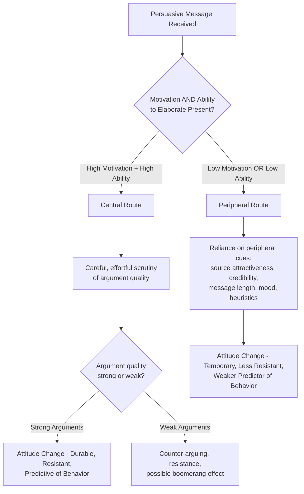

## Elaboration Likelihood Model

### Definition and Theoretical Origins

The Elaboration Likelihood Model (ELM) is a dual-process theory of persuasion developed by Richard Petty and John Cacioppo (1981, 1986). It proposes that persuasive messages can produce attitude change through two qualitatively distinct cognitive routes, differing in the amount of effortful, issue-relevant thinking (**elaboration**) the message recipient engages in.

**Core premise:** The likelihood that a person will engage in effortful elaboration of a persuasive message depends jointly on their **motivation** and **ability** to process the message content, and the route taken has important consequences for the durability, resistance, and behavioral predictiveness of any resulting attitude change.

### The Two Routes to Persuasion

**Central route processing.** Occurs when the recipient has both sufficient motivation (personal relevance, need for cognition, accountability) and sufficient ability (cognitive capacity, relevant knowledge, absence of distraction or time pressure) to engage in careful, effortful scrutiny of the message's actual arguments. Attitude change resulting from central-route processing is based on genuine cognitive engagement with argument quality, and therefore tends to be:

- More persistent over time
- More resistant to counter-persuasion
- More predictive of subsequent behavior

**Peripheral route processing.** Occurs when motivation or ability to elaborate is low. Rather than scrutinizing argument content, the recipient relies on peripheral cues unrelated to the substantive merits of the argument — such as source attractiveness, source credibility/expertise, message length (more arguments perceived as stronger regardless of quality), audience reactions, or simple affective/mood associations. Attitude change via the peripheral route tends to be:

- Less persistent over time
- Less resistant to counter-persuasion
- Weaker predictor of subsequent behavior

**[Inference]** The ELM does not propose a strict binary categorization but rather an **elaboration likelihood continuum**, ranging from minimal to extensive elaboration, with central and peripheral route processing representing conceptual endpoints of this continuum rather than two entirely discrete, mutually exclusive processing modes; in practice, both argument-based and cue-based processing can co-occur to varying degrees within a single persuasive episode.

### Determinants of Elaboration Likelihood

**Motivation to elaborate** is influenced by:

- **Personal relevance:** issues with direct personal consequences for the recipient increase motivation to think carefully.
- **Need for cognition:** a stable individual-difference trait reflecting the degree to which a person enjoys and engages in effortful cognitive activity (Cacioppo & Petty, 1982).
- **Personal responsibility/accountability:** being held accountable for one's judgment or expecting to discuss it with others increases elaboration motivation.
- **Multiple sources of the same argument:** hearing an argument from multiple independent sources can increase perceived need to evaluate it carefully.

**Ability to elaborate** is influenced by:

- **Distraction:** competing demands on attention reduce processing capacity.
- **Repetition:** moderate message repetition can increase ability to process arguments fully (up to a point, beyond which tedium sets in).
- **Prior knowledge:** greater relevant knowledge about the topic increases capacity for genuine argument evaluation.
- **Time pressure:** limited time to process a message reduces the ability to engage in careful elaboration.
- **Message comprehensibility:** complexity of message presentation (jargon, structure, pacing) affects the recipient's practical ability to process it.

### The Argument Quality Interaction

A central and well-replicated finding of ELM research is an **interaction** between processing route and argument quality: under high elaboration conditions, **strong arguments produce significantly more attitude change than weak arguments**, whereas under low elaboration (peripheral route) conditions, argument quality has comparatively little effect on attitude change, since the arguments themselves are not being carefully scrutinized.

$$\text{Attitude Change} = f(\text{Argument Quality} \times \text{Elaboration Likelihood})$$

This interaction is one of the ELM's signature empirical predictions and has been demonstrated across numerous studies manipulating personal relevance (motivation) or distraction (ability) alongside argument quality (strong vs. weak arguments).

### The Multiple Roles Postulate

A key theoretical refinement of the ELM is the **multiple roles postulate**: a given variable (e.g., source expertise, message length, mood) can play different roles in the persuasion process depending on the overall elaboration likelihood present:

- **Under low elaboration:** the variable may function as a simple peripheral cue (e.g., "the source is an expert, so I'll agree" — a heuristic shortcut).
- **Under moderate elaboration:** the variable may bias the direction of processing (e.g., expert source credibility biasing the interpretation of otherwise ambiguous arguments in a positive direction).
- **Under high elaboration:** the variable may itself become an argument or a piece of evidence to be weighed (e.g., source expertise treated as one relevant data point among the arguments being carefully evaluated).
- **The variable may also affect the extent of elaboration itself** — for example, an attractive or credible source may increase motivation to process the message carefully in some contexts.

**[Inference]** This postulate is theoretically important because it explains why the same variable (e.g., source attractiveness) can sometimes produce very different-sized or even different-direction effects across studies — the effect depends critically on the elaboration context in which the variable operates, rather than the variable having one single, fixed persuasive function.

### Related Dual-Process Model: The Heuristic-Systematic Model (HSM)

The ELM is often discussed alongside Shelly Chaiken's (1980) **Heuristic-Systematic Model**, a conceptually similar dual-process framework distinguishing **systematic processing** (effortful, comprehensive scrutiny of message content, analogous to the central route) from **heuristic processing** (reliance on simple decision rules/cognitive shortcuts, analogous to the peripheral route). A key distinguishing feature of the HSM is its explicit **co-occurrence assumption**: systematic and heuristic processing are proposed to occur simultaneously (rather than as alternative, mutually exclusive routes), with heuristic cues potentially biasing the interpretation of systematically processed information even under high-elaboration conditions.

**[Inference]** While the ELM and HSM share substantial conceptual overlap and are frequently grouped together as the field's dominant dual-process persuasion theories, they differ in some specific theoretical assumptions (e.g., the HSM's more explicit co-occurrence framing versus the ELM's continuum framing), and researchers should consult the primary sources for precise distinctions when the specific theoretical nuances matter for a given application.

### Consequences of Route for Attitude Strength

Central-route-derived attitudes align closely with the broader **attitude strength** literature: because central-route processing typically produces more elaborated, better-integrated cognitive structures supporting the attitude, resulting attitudes tend to show the classic strength-related properties — greater persistence, greater resistance to counter-persuasion, and stronger prediction of subsequent behavior — compared to peripheral-route-derived attitudes of equivalent initial valence and extremity.

### Applications

**Advertising and marketing.** Product categories involving high personal relevance and financial stakes (e.g., major purchases like cars or homes) are generally more effectively marketed through detailed, argument-based (central-route) advertising content, whereas low-involvement, habitual purchase categories (e.g., minor household goods) are often more effectively marketed through peripheral-route appeals (attractive imagery, celebrity endorsement, emotional association, repetition).

**Health communication.** Effective health campaigns are often designed with route-appropriate strategies in mind — for populations or topics with generally low personal relevance/motivation, peripheral cues (credible spokesperson, appealing message design) may be needed simply to gain initial attention and processing, while campaigns targeting sustained behavior change generally benefit from also promoting central-route elaboration of the substantive health arguments to produce more durable attitude and behavior change.

**Political communication.** Political messaging directed at highly engaged, politically knowledgeable audiences (high motivation/ability) is generally more effectively delivered via substantive policy argumentation, while messaging directed at low-engagement audiences often relies more heavily on peripheral cues such as candidate likability, endorsements, and emotional appeals.

**Public education and misinformation correction.** Understanding which route produced an initial (potentially mistaken) belief informs correction strategy — beliefs formed via peripheral-route processing may be more amenable to simple credible-source correction, while beliefs formed via genuine central-route elaboration typically require substantive counter-argumentation to shift.

### Critiques and Limitations

**Operationalization of "elaboration."** Some critics have noted that elaboration itself is a somewhat abstract construct that can be challenging to directly and independently measure (as opposed to inferring it from manipulated motivation/ability conditions and observed argument-quality interaction effects), raising measurement and falsifiability considerations that have been debated in the methodological literature.

**Overlap with the Heuristic-Systematic Model.** Some researchers have questioned whether the ELM and HSM represent genuinely theoretically distinct models or largely overlapping frameworks using different terminology, given their substantial conceptual convergence.

**[Unverified]** The relative empirical support and predictive precision of the ELM compared to the HSM in direct comparative studies is not fully settled in the literature; researchers seeking a definitive comparative evaluation should consult current reviews directly rather than assuming one model has been established as clearly superior.

**Related Topics**

- Heuristic-Systematic Model (Chaiken)
- Need for cognition (Cacioppo & Petty)
- Attitude strength and accessibility
- Source credibility and peripheral cues in persuasion
- Dual-process theories in social cognition
- Attitude-behavior consistency
- Resistance to persuasion