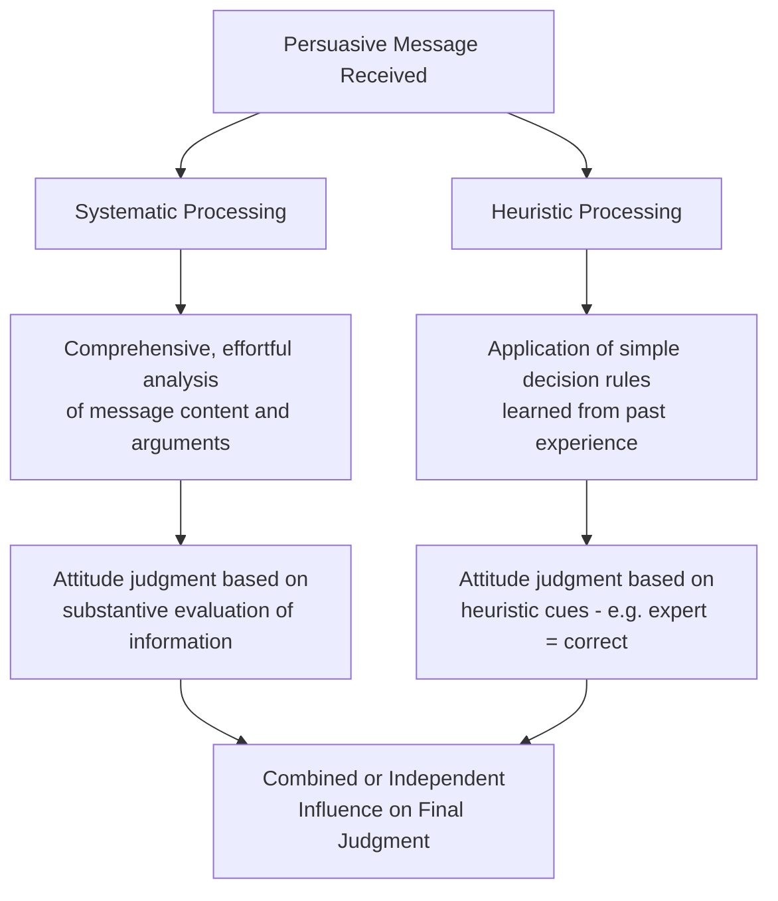
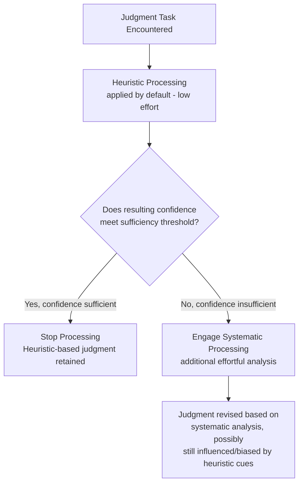

## Heuristic-Systematic Model

### Definition and Theoretical Origins

The Heuristic-Systematic Model (HSM) is a dual-process theory of persuasion and social judgment developed by Shelly Chaiken (1980, and elaborated with Alice Eagly and others through the 1980s–1990s). Like the Elaboration Likelihood Model, it proposes that persuasive messages can be processed through two qualitatively distinct modes, but the HSM is distinguished by its explicit theoretical assumptions regarding the joint, simultaneous operation of both modes and its grounding in a broader **dual-motive framework** describing the goals that drive information processing.

**Core premise:** Individuals process persuasive information via two modes — **systematic processing** (effortful, comprehensive analysis of message content) and **heuristic processing** (reliance on simple cognitive shortcuts or "heuristics") — which can operate independently, simultaneously, or interactively, rather than as strictly alternative, mutually exclusive routes.

### The Two Processing Modes

**Systematic processing.** Involves comprehensive, analytic scrutiny of all available message-relevant information — evaluating argument quality, logical coherence, and the relationship between evidence and conclusions. This mode is effortful, capacity-limited, and requires sufficient motivation and cognitive resources, conceptually analogous to the ELM's central route.

**Heuristic processing.** Involves the application of simple, learned decision rules or "judgmental heuristics" (e.g., "experts' statements can be trusted," "consensus implies correctness," "longer messages contain stronger arguments") that allow individuals to form a judgment with minimal cognitive effort. This mode is less effortful and less capacity-limited than systematic processing, conceptually analogous to the ELM's peripheral route.

### The Co-Occurrence Assumption

A defining and theoretically distinguishing feature of the HSM (relative to the ELM's continuum framing) is the explicit **co-occurrence assumption**: heuristic and systematic processing are proposed to be capable of operating **simultaneously**, rather than functioning as alternative routes where only one is active at a given elaboration level. Under this assumption, heuristic cues can continue to influence judgment even under conditions of high systematic processing, through two proposed mechanisms:

- **Additivity:** heuristic and systematic processing outcomes combine independently to jointly determine the final judgment.
- **Biasing:** heuristic cues can bias the interpretation and evaluation of systematically processed message content itself (e.g., a credible source cue may lead a systematic processor to interpret ambiguous evidence more favorably), rather than simply adding an independent judgmental input.

**[Inference]** This biasing mechanism is considered one of the HSM's more theoretically distinctive contributions relative to the ELM, since it proposes that peripheral/heuristic-type cues do not necessarily become causally irrelevant once systematic processing is engaged, but can instead continue to shape how the systematically processed content itself is interpreted.

### The Dual-Motive (Later Multiple-Motive) Framework

The HSM situates processing mode choice within a broader motivational framework describing the underlying goals driving social information processing:

**Sufficiency principle.** Individuals are motivated to achieve a level of judgmental confidence sufficient to meet their current processing goal, balanced against the effort required to achieve that confidence. Processing (whether heuristic or systematic) continues until the individual's **actual confidence** meets or exceeds their **desired level of confidence** (the "sufficiency threshold"). When heuristic processing alone is insufficient to reach the desired confidence level, individuals are motivated to invest the additional effort required for systematic processing.

$$\text{Processing Continues Until: } \text{Actual Confidence} \geq \text{Sufficiency Threshold}$$

**Accuracy motivation.** The goal of forming a judgment that accurately reflects reality — associated with more balanced, comprehensive information processing (both heuristic and, when needed, systematic).

**Defense motivation.** The goal of forming or maintaining a judgment consistent with a desired conclusion (e.g., protecting a valued identity, existing attitude, or self-concept) — associated with biased, motivated processing that favors conclusion-consistent information and interpretations, potentially engaging effortful systematic processing but directed toward defending a pre-determined conclusion rather than toward objective accuracy.

**Impression motivation.** The goal of forming a judgment that will satisfy the social requirements of a particular relationship or context (e.g., forming a judgment likely to be socially acceptable to a specific audience) — associated with processing oriented toward socially adaptable conclusions.

**[Inference]** These three processing goals (accuracy, defense, impression) are theorized to differentially shape both which processing mode is engaged and how that processing unfolds — for example, defense-motivated systematic processing may still be effortful and comprehensive, but selectively biased toward supporting a desired conclusion, distinguishing it from accuracy-motivated systematic processing aimed at unbiased evaluation.

### Sufficiency Principle in Practice

The sufficiency principle explains variability in processing depth: when the perceived costs of an incorrect judgment are low, or when initial heuristic-based confidence already meets the (correspondingly low) sufficiency threshold, individuals may rely entirely on heuristic processing. When perceived stakes are higher, or when heuristic processing fails to produce sufficient confidence (e.g., due to conflicting heuristic cues, or an unusually important decision), the gap between actual and desired confidence motivates the additional investment of systematic processing effort.

### Comparison with the Elaboration Likelihood Model

| Feature | Heuristic-Systematic Model | Elaboration Likelihood Model |
| --- | --- | --- |
| Relationship between modes | Explicit co-occurrence; can operate simultaneously | Framed as a continuum from low to high elaboration |
| Mechanism for cue influence under high effort | Explicit "biasing" mechanism proposed | Multiple roles postulate (cue can become an argument, bias processing, or affect elaboration extent) |
| Underlying motivational framework | Explicit sufficiency principle and accuracy/defense/impression motives | Primarily motivation and ability as general elaboration determinants |
| Processing goal specification | More elaborated taxonomy of processing goals (accuracy, defense, impression) | Less explicitly subdivided motivational taxonomy in the original formulation |

**[Unverified]** Despite these stated theoretical distinctions, researchers have long debated the degree to which the HSM and ELM make genuinely different empirical predictions versus largely overlapping ones using different terminology; a definitive resolution of this theoretical convergence/divergence question should be sought in current comparative reviews rather than assumed settled.

### Empirical Applications and Findings

**Persuasion under defense motivation.** Research applying the HSM to politically or personally threatening messages has found that defense-motivated systematic processing can produce biased counter-arguing and selective scrutiny (processing effortfully, but in a manner oriented toward rejecting rather than fairly evaluating threatening information) — illustrating that systematic processing is not synonymous with unbiased processing.

**Consumer judgment and product evaluation.** HSM-informed research has examined how heuristic cues (brand reputation, price-as-quality heuristic, star ratings) continue to influence consumer judgments even when systematic evaluation of product information is also occurring, consistent with the biasing mechanism.

**Rumor and misinformation processing.** The sufficiency principle has been applied to understand when individuals are motivated to fact-check or scrutinize questionable information (when perceived stakes are high or initial confidence is low) versus when they rely on simple heuristic acceptance (source familiarity, repetition, social consensus).

### Applications

- **Political communication:** understanding how partisan identity can function as both a heuristic cue (low-effort default judgment) and a driver of defense-motivated systematic processing (effortful but biased counter-arguing against opposing-party messages).
- **Health communication:** designing messages that account for the sufficiency principle, ensuring sufficient perceived stakes/relevance to motivate systematic processing of important health information beyond superficial heuristic acceptance or rejection.
- **Consumer research:** informing marketing strategies that leverage heuristic cues (source credibility, social proof) that can continue to bias even careful, systematic product evaluation.
- **Misinformation and fact-checking interventions:** informing strategies to raise the sufficiency threshold (motivating more systematic processing) for potentially false claims, rather than relying solely on providing corrective heuristic cues (e.g., "fact-checked" labels) that may themselves simply be processed heuristically.

**Related Topics**

- Elaboration Likelihood Model
- Sufficiency principle in social judgment
- Accuracy, defense, and impression motivation
- Dual-process theories in social cognition
- Motivated reasoning
- Judgmental heuristics (availability, representativeness, anchoring)
- Source credibility in persuasion