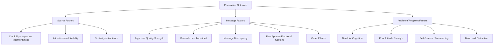
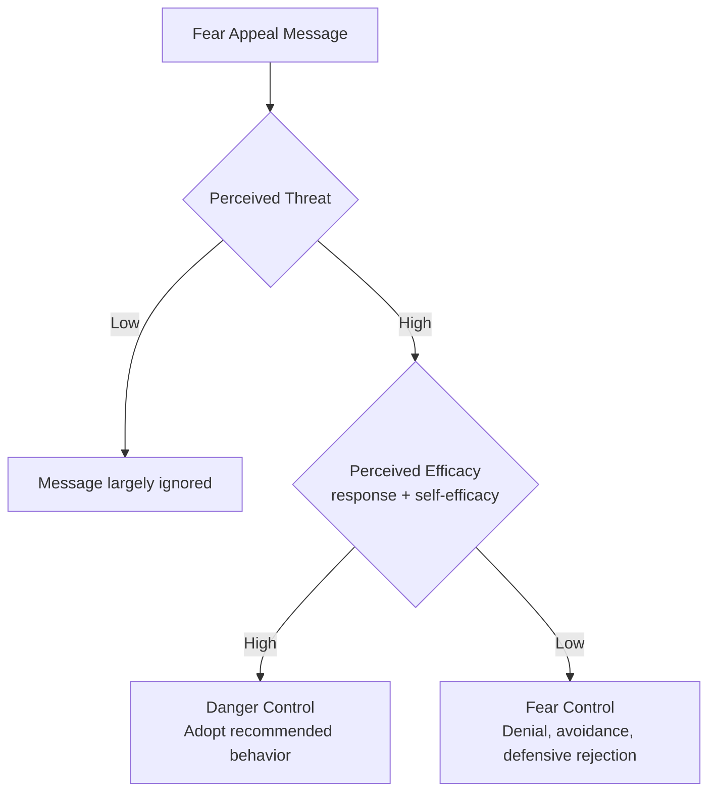

## Source, Message, and Audience Factors

### Overview

Persuasion research has traditionally organized the study of influence variables around the classic **communication/persuasion matrix** originating in the Yale Attitude Change program led by Carl Hovland and colleagues in the 1940s–1950s. This framework decomposes the persuasion process into distinct categories of variables — characteristics of the **source** (who delivers the message), the **message** (what is communicated and how), the **channel** (through what medium), and the **audience/recipient** (who receives it) — each of which independently and interactively influences persuasive outcomes. Contemporary dual-process theories (ELM, HSM) provide the mechanism explaining *how* these variables exert their effects, depending on whether they function as central/systematic-route content or peripheral/heuristic-route cues.

### Source Factors

**Credibility.** Comprises two empirically distinguishable components:

- **Expertise:** the perceived knowledge, competence, and qualification of the source regarding the topic.
- **Trustworthiness:** the perceived honesty and lack of ulterior motive in the source's communication.

Hovland and Weiss's (1951) classic study found that a message attributed to a high-credibility source (e.g., a respected scientific journal) produced greater immediate attitude change than the identical message attributed to a low-credibility source (e.g., a tabloid), though this credibility-based advantage often diminishes over time.

**Sleeper effect.** A notable and extensively studied finding from the Yale program: the persuasive advantage of a high-credibility source over a low-credibility source can *decrease* over time, and in some studies the attitude change produced by a low-credibility source message can actually *increase* over a delay — a pattern termed the sleeper effect. The leading explanation is **discounting cue decay**: over time, recipients tend to forget or dissociate the source (the "discounting cue") from the message content itself, while the message content's persuasive impact persists, causing the initially discounted low-credibility message to exert more influence once the source-based discount has faded from memory.

**[Unverified]** The sleeper effect has been a historically contested finding in the persuasion literature, with methodological critiques (e.g., regarding the specific conditions and forewarning procedures required to reliably produce it) leading some researchers to question its robustness and generality; specific boundary conditions should be checked against the current empirical literature rather than treated as a universally reliable effect.

**Attractiveness and likability.** Physically attractive or likable sources tend to produce greater attitude change, particularly for topics with low personal relevance to the audience (functioning as a peripheral/heuristic cue) — a finding widely applied in celebrity endorsement advertising.

**Similarity.** Sources perceived as similar to the audience (in demographics, values, or experience) can enhance persuasion, particularly for matters of subjective preference or lifestyle-related judgments, while dissimilar/expert sources may be more persuasive for matters of objective fact — an interaction sometimes termed the **similarity-expertise trade-off**.

**Speed and confidence of delivery.** Sources who speak quickly, fluently, and with apparent confidence have been found in some studies to be perceived as more credible/knowledgeable, functioning as an additional peripheral cue independent of actual argument content.

### Message Factors

**Argument quality/strength.** As established in dual-process theory, strong (logically compelling, well-supported) arguments produce substantially more attitude change than weak arguments specifically under high-elaboration/systematic-processing conditions; this differential effect diminishes under low-elaboration conditions.

**One-sided vs. two-sided messages.** Presenting only supportive arguments (one-sided) is generally more effective for audiences already favorable to the position or with low topic-relevant knowledge, whereas presenting both supportive arguments and counter-arguments (two-sided, typically followed by refutation of the counter-arguments) tends to be more effective for more knowledgeable, skeptical, or initially opposed audiences, and additionally confers greater resistance to subsequent counter-persuasion (**inoculation-like** effects — see below).

**Message discrepancy.** The degree to which a persuasive message's advocated position differs from the recipient's initial position. Research (e.g., Sherif and Hovland's social judgment theory, and later refinements) has generally found a **curvilinear relationship**: moderate discrepancy tends to produce more attitude change than either very low discrepancy (insufficient inducement to change) or very high discrepancy (which can trigger rejection/counter-arguing, particularly when the discrepant position falls within an individual's "latitude of rejection").

**Fear appeals.** Messages emphasizing threatening consequences of failing to adopt a recommended behavior. The **Extended Parallel Process Model** (Witte, 1992) proposes that fear appeal effectiveness depends jointly on perceived threat (susceptibility and severity) and perceived efficacy (response efficacy and self-efficacy for the recommended action): when perceived threat is high but perceived efficacy is low, individuals tend to engage in maladaptive **fear control** responses (denial, avoidance, message rejection) rather than the intended **danger control** response (adopting the recommended protective behavior).

**Message order effects.** In multi-argument or multi-speaker persuasive contexts, **primacy effects** (earlier information exerting greater influence) and **recency effects** (later information exerting greater influence) have both been documented, with the relative strength depending on factors such as delay between message segments and the recipient's overall judgment timing.

**Repetition.** Moderate message repetition tends to increase persuasion (partly through increased processing opportunity and partly through mere-exposure-related affective mechanisms), though excessive repetition can produce **tedium/wear-out effects**, reducing or reversing the positive effect.

### Audience/Recipient Factors

**Need for cognition.** Individuals high in need for cognition are more likely to engage central/systematic route processing regardless of situational manipulations, making them more responsive to argument quality and less swayed by peripheral cues alone, relative to low-need-for-cognition individuals.

**Prior attitude strength.** As established in the attitude strength literature, audiences holding highly accessible, important, certain, or low-ambivalence prior attitudes are generally more resistant to persuasion attempts than audiences with weaker prior attitudes.

**Forewarning.** Being forewarned that one is about to receive a persuasive message (particularly a counter-attitudinal one) tends to increase resistance to that message, generally attributed to the additional time and motivation forewarning provides for generating counter-arguments (**attitude inoculation**, discussed further below).

**Mood.** Positive mood has generally been found to increase peripheral/heuristic-route reliance (reducing effortful systematic scrutiny of arguments) in much of the classic literature, though some research has identified boundary conditions and more nuanced mood-congruent processing effects depending on message type and context.

**Distraction.** Moderate distraction can reduce counter-arguing capacity, sometimes increasing persuasion for messages with weak arguments (since the audience has reduced capacity to generate the counter-arguments that would otherwise resist a weak message) while decreasing persuasion for messages with strong arguments (since distraction also impairs the audience's ability to fully process and be persuaded by genuinely compelling content).

**Self-esteem.** Some classic research proposed a curvilinear relationship between self-esteem and persuasibility (individuals of moderate self-esteem being more persuasible than those at either extreme), though **[Unverified]** the robustness and consistency of this specific curvilinear self-esteem finding across the broader contemporary literature has been questioned, and precise conclusions should be checked against current reviews rather than treated as a well-established universal pattern.

### Inoculation Theory

McGuire's (1961) **inoculation theory**, itself an extension of the source/message/audience persuasion framework, proposes that exposing individuals to a weakened form of a counter-attitudinal argument (along with refutation), analogous to a medical inoculation, builds resistance to subsequent, stronger persuasive attacks on the same attitude — a specific application combining message-factor (two-sided/refutational) and audience-factor (forewarning/resistance-building) principles into a unified resistance-building framework.

### Integration with Dual-Process Theory

**[Inference]** The classic source/message/audience taxonomy and the more contemporary dual-process frameworks (ELM, HSM) are best understood as complementary rather than competing: the taxonomy catalogs *which* variables matter for persuasion, while the dual-process models explain *how* and *under what conditions* each variable exerts its influence (as a peripheral/heuristic cue, as central/systematic-route argument content, or via the multiple-roles/biasing mechanisms specified in each dual-process theory).

### Applications

- **Advertising and marketing:** informing source selection (celebrity/expert endorsers), message framing (one-sided vs. two-sided appeals depending on target audience skepticism), and repetition strategy.
- **Public health campaigns:** informing fear appeal design using the Extended Parallel Process Model to ensure adequate efficacy messaging accompanies threat messaging, avoiding counterproductive fear-control responses.
- **Political communication:** informing candidate messaging strategy regarding source credibility management, message discrepancy calibration for different audience segments, and inoculation-based strategies to build resistance to opposition attacks.
- **Misinformation resistance/prebunking:** applying inoculation theory principles to build public resistance to anticipated misinformation campaigns.
- **Organizational communication:** informing internal communication strategy regarding source credibility, message framing, and audience-tailored persuasive approaches for change management initiatives.

**Related Topics**

- Elaboration Likelihood Model
- Heuristic-Systematic Model
- Sleeper effect and discounting cue decay
- Inoculation theory (McGuire)
- Extended Parallel Process Model and fear appeals
- Social judgment theory (Sherif & Hovland)
- Attitude strength and resistance to persuasion