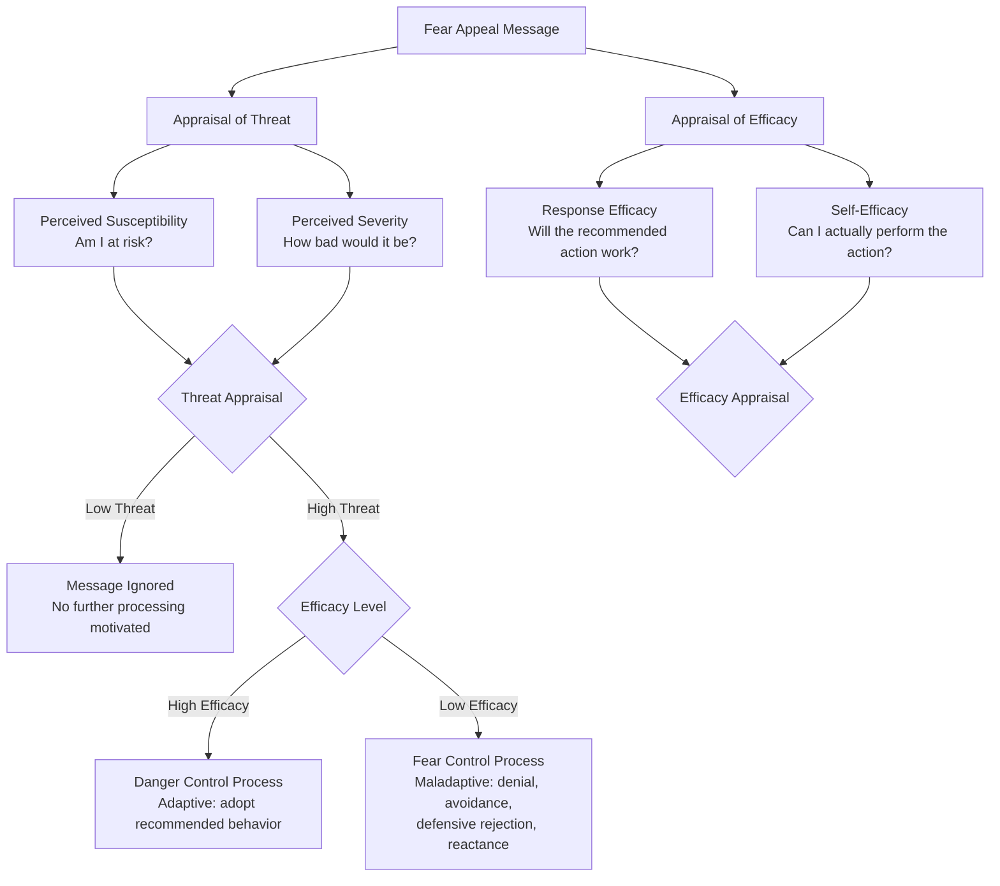

## Fear Appeals in Persuasion

### Definition

Fear appeals are persuasive messages that attempt to elicit fear by emphasizing the potential negative consequences (physical, social, financial, or psychological) of failing to adopt a recommended attitude or behavior, typically paired with a recommendation for how to avoid or reduce that threat. Fear appeal research constitutes one of the most extensively studied subdomains of persuasion research, driven substantially by its widespread application in health communication.

### Early Theoretical Models

**Drive-reduction model (Hovland, Janis, & Kelley, 1953; Janis, 1967).** Early theorizing proposed a simple linear or curvilinear relationship in which fear functions as an aversive drive state that motivates message acceptance as a means of drive reduction, with some early work proposing an inverted-U relationship (moderate fear producing maximal persuasion, with very high fear producing defensive avoidance that undermines persuasion).

**Parallel Process Model (Leventhal, 1970).** Proposed that fear appeals trigger two conceptually distinct and potentially independent parallel responses: **danger control** (cognitive processes aimed at controlling the actual threat, e.g., adopting the recommended protective behavior) and **fear control** (emotional processes aimed at controlling the unpleasant feeling of fear itself, e.g., denial, avoidance, or defensive minimization) — establishing the conceptual foundation for later, more elaborated models.

### The Extended Parallel Process Model (EPPM)

Kim Witte's (1992) **Extended Parallel Process Model** is the most widely used contemporary framework for understanding fear appeal effectiveness, integrating and extending Leventhal's parallel process framework with **protection motivation theory** concepts (Rogers, 1975, 1983).

**Core premise:** the effectiveness of a fear appeal depends on the interaction between two appraisal dimensions:

**Threat appraisal components:**

- **Perceived susceptibility:** the individual's belief about their personal likelihood of experiencing the threatened negative outcome.
- **Perceived severity:** the individual's belief about how serious or significant the threatened outcome would be.

**Efficacy appraisal components:**

- **Response efficacy:** the individual's belief that the recommended action, if performed, would actually be effective at averting the threat.
- **Self-efficacy:** the individual's belief in their own personal capability to successfully perform the recommended action.

**The EPPM's central prediction:** perceived threat functions as a *precondition* for engagement with the message at all (low threat → message largely ignored), while efficacy determines *which type of response* occurs given sufficient threat: high efficacy relative to threat promotes adaptive danger control (message acceptance and behavior change), while low efficacy relative to threat promotes maladaptive fear control (defensive avoidance, denial, message derogation, or reactance) — meaning that a highly threatening message paired with inadequate efficacy information can backfire, producing worse persuasive outcomes than a more moderate appeal.

### Boomerang and Defensive Avoidance Effects

A key applied implication of the EPPM is that fear appeals with high perceived threat but insufficient perceived efficacy risk producing **counterproductive outcomes**, including:

- **Defensive avoidance:** actively avoiding further exposure to the threatening information or topic.
- **Denial:** minimizing or rejecting the validity of the threat itself.
- **Message derogation:** dismissing the credibility or relevance of the message/source.
- **Reactance:** experiencing the message as an unwelcome restriction on freedom, producing motivated resistance and, in some cases, attitude change in the opposite direction of that intended (**boomerang effect**).

**[Inference]** This pattern explains why simply maximizing fear/threat content in a persuasive message does not reliably maximize persuasive effectiveness, and why effective fear appeal design requires careful, simultaneous attention to efficacy messaging alongside threat messaging.

### Meta-Analytic Findings

Meta-analyses of the fear appeal literature (e.g., Witte & Allen, 2000; Tannenbaum et al., 2015) have generally found:

- Fear appeals can produce meaningful attitude, intention, and behavior change, particularly when paired with strong efficacy messaging.
- Stronger fear appeals tend to produce greater persuasion when accompanied by strong efficacy messages, somewhat revising the earlier assumption (from the drive-reduction era) that very high fear reliably backfires — contemporary meta-analytic evidence suggests that with adequate efficacy support, higher threat can enhance rather than undermine persuasion.
- The presence and strength of efficacy messaging is a critical moderator: fear appeals with weak or absent efficacy components show substantially weaker (or counterproductive) effects compared to those with robust efficacy messaging.

**[Unverified]** Precise meta-analytic effect sizes and the exact functional form of the threat-efficacy interaction (e.g., whether it is best characterized as strictly multiplicative, as originally proposed by the EPPM, versus other interactive forms) have been subjects of ongoing empirical refinement; current primary meta-analyses should be consulted for the most precise, up-to-date quantitative conclusions.

### Protection Motivation Theory

Rogers' (1975, 1983) **Protection Motivation Theory (PMT)**, a related and historically prior framework that substantially informed the EPPM's efficacy-related constructs, proposes that protective health behavior intention (**protection motivation**) results from a cognitive appraisal process combining threat appraisal (severity, vulnerability) and coping appraisal (response efficacy, self-efficacy, and the perceived costs of the recommended response).

$$\text{Protection Motivation} = f(\text{Threat Appraisal}, \text{Coping Appraisal})$$

**[Inference]** PMT and the EPPM share substantial conceptual overlap in their efficacy-related constructs, with the EPPM's distinctive contribution being its explicit specification of the fear-control (maladaptive) pathway alongside the danger-control (adaptive) pathway, providing a more complete account of *both* successful and unsuccessful fear appeal outcomes within a single integrated model.

### Design Principles for Effective Fear Appeals

Based on the accumulated fear appeal literature, several practical design principles are commonly derived:

- **Pair threat with clear, specific, actionable efficacy information:** the recommended protective action should be presented as both effective (response efficacy) and feasible for the target audience to perform (self-efficacy).
- **Avoid threat without a clear behavioral solution:** messages emphasizing severe, personally relevant threat without an accompanying feasible response risk triggering fear-control/defensive responses rather than the intended behavior change.
- **Calibrate personal relevance:** perceived susceptibility (personal risk) is often a more critical threat component than perceived severity alone; audiences who do not perceive themselves as personally at risk may disengage regardless of how severe the depicted consequences are.
- **Consider audience-specific efficacy baselines:** audiences with low pre-existing self-efficacy for a recommended behavior may require efficacy-building message components (specific, concrete action steps; modeling of successful behavior performance) rather than threat alone.

### Applications

**Anti-smoking campaigns.** Extensively studied fear appeal domain; graphic warning labels and severe-consequence advertising campaigns have been evaluated using EPPM-informed research, generally finding stronger effects when paired with concrete cessation resources and efficacy-building messaging (quitlines, specific cessation techniques) rather than threat imagery alone.

**Road safety campaigns.** Fear-based driving safety campaigns (e.g., depicting crash consequences) have been studied using EPPM principles, with efficacy messaging regarding specific protective behaviors (seatbelt use, speed reduction) identified as a critical component of effective campaign design.

**Disease prevention and vaccination campaigns.** Public health messaging regarding infectious disease risk and vaccination has drawn on fear appeal and EPPM research, particularly regarding the importance of pairing risk information with clear, accessible guidance on protective action (vaccination availability, specific preventive steps) to avoid triggering defensive avoidance rather than uptake.

**Environmental and climate communication.** Climate change communication research has applied fear appeal and EPPM principles to examine when threat-focused messaging about climate consequences promotes engagement versus disengagement/avoidance, with efficacy messaging (concrete, actionable steps) identified as an important moderating factor.

### Critiques and Limitations

**Ethical considerations.** The use of fear appeals raises ethical questions regarding the appropriate use of emotional manipulation in persuasive communication, particularly in public health contexts targeting vulnerable populations, an active area of applied ethics discussion in health communication research.

**Individual differences.** **[Inference]** Responses to fear appeals likely vary based on individual differences in trait anxiety, prior experience with the threatened outcome, and cultural context, though the precise moderating role of these individual difference variables is less thoroughly and consistently established across the fear appeal literature compared to the core threat-efficacy interaction itself.

**Related Topics**

- Protection Motivation Theory (Rogers)
- Source, message, and audience factors in persuasion
- Reactance theory
- Health Belief Model
- Elaboration Likelihood Model
- Inoculation theory
- Defensive avoidance and motivated reasoning